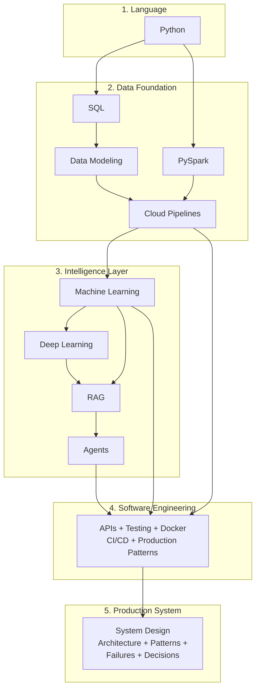

# Systems in Production

**How to build intelligent systems that work in the real world — across Cloud, Data, and AI.**

101 playbook chapters. 33 executable notebooks. Architecture patterns, failure analyses, and decision frameworks extracted from production systems.

---

## Start Here

**New to this repo?** Pick your starting point:

| You Are | Start With | First Click |
|---|---|---|
| **"I want to build AI systems"** | [Python Playbook](playbooks/python/) then [ML Playbook](playbooks/ai/ml/) |  |
| **"I want to build data pipelines"** | [SQL Playbook](playbooks/data/sql/) then [Cloud Pipelines](playbooks/data/cloud-pipeline/) |  |
| **"I want to see how production systems are designed"** | [Architecture](systems/production-diagnostics/architecture.md) then [Patterns](patterns/) | [Start reading](systems/production-diagnostics/architecture.md) |
| **"I want to see what breaks in production"** | [Failures](failures/) then [Decisions](decisions/) | [Start reading](failures/why-flat-tables-break.md) |
| **"I know Python, show me AI"** | [ML Playbook](playbooks/ai/ml/) chapter 03 |  |
| **"I know Java/C#, need Python fast"** | [Python Java Bridge](implementation/notebooks/Python_Java_Bridge.ipynb) |  |

Every playbook chapter: read on GitHub (diagrams render here). Every notebook: one click to open on Google Colab (no setup needed).

---

## The Builder's Path

The full sequence for building intelligent production systems.

### Playbooks

Each playbook has 10 chapters: Why, Concepts, Hello World, How It Works, Building It, Production Patterns, System Design, Quality/Security, Observability, Decision Guide.

| Step | Playbook | Notebooks | Level |
|---|---|---|---|
| **Python** | [10 chapters](playbooks/python/) | [7 notebooks](playbooks/python/README.md) (Basics through Advanced) | Start here |
| **SQL** | [10 chapters](playbooks/data/sql/) | [Advanced SQL](implementation/notebooks/Advanced_SQL.ipynb) | Start here |
| **Data Modeling** | [10 chapters](playbooks/data/data-modeling/) + [Star Schema](playbooks/data/star-schema-design/) | [Data Modeling](implementation/notebooks/Data_Modeling.ipynb) | Intermediate |
| **Cloud Pipelines** | [6 chapters](playbooks/data/cloud-pipeline/) | [GCP Pipeline](implementation/notebooks/GCP_Full_Pipeline.ipynb) + [Automation](implementation/notebooks/GCP_Pipeline_Automation.ipynb) | Intermediate |
| **PySpark** | [10 chapters](playbooks/data/pyspark/) | [PySpark](implementation/notebooks/PySpark.ipynb) | Intermediate |
| **Machine Learning** | [10 chapters](playbooks/ai/ml/) (21 algorithms) | [ML Fundamentals](implementation/notebooks/ML_Fundamentals.ipynb) + [Linear Regression](implementation/notebooks/Linear_Regression.ipynb) + [Logistic Regression](implementation/notebooks/Logistic_Regression.ipynb) | Intermediate |
| **Deep Learning** | [10 chapters](playbooks/ai/deep-learning/) | [PyTorch](implementation/notebooks/Deep_Learning_PyTorch.ipynb) + [CNN](implementation/notebooks/Deep_Learning_CNN.ipynb) | Advanced |
| **RAG** | [10 chapters](playbooks/ai/rag/) | [RAG from Scratch](implementation/notebooks/RAG_from_Scratch.ipynb) | Advanced |
| **Agents** | [10 chapters](playbooks/ai/agents/) | [Agents](implementation/notebooks/Agents.ipynb) | Advanced |
| **Software Engineering** | [10 chapters](playbooks/engineering/) | [CI/CD](implementation/notebooks/CICD_for_DE.ipynb) | Intermediate |

---

## How Real Systems Are Built

### [See a real system](systems/production-diagnostics/architecture.md)
A production diagnostic system that collects data from databases, logs, documents, and APIs, then diagnoses issues and recommends actions. Full architecture with Mermaid diagrams.

### [Understand the patterns](patterns/)
Reusable architecture patterns: [Bronze-Silver-Gold](patterns/bronze-silver-gold.md), [multi-system reconciliation](patterns/multi-system-reconciliation.md), [AI-derived features](patterns/ai-derived-features.md), [feedback loops](patterns/feedback-loops.md), [event-driven diagnostics](patterns/event-driven-diagnostics.md).

### [Learn where systems break](failures/)
Real production failures: [flat tables at scale](failures/why-flat-tables-break.md), [ML with bad features](failures/why-ml-fails-with-bad-features.md), [cross-system joins](failures/why-cross-system-joins-fail.md).

### [Explore how decisions are made](decisions/)
Architecture decisions: [batch vs streaming](decisions/batch-vs-streaming.md), [star schema vs query source](decisions/star-schema-vs-query-source.md), [SQL vs Spark vs BigQuery](decisions/sql-vs-spark-vs-bigquery.md).

---

## Notebooks

Click any Colab badge to open and run. No setup needed.

### Python (start here)

| Notebook | Open in Colab |
|---|---|
| [Python Basics](implementation/notebooks/Python_Basics.ipynb) |  |
| [Data Structures](implementation/notebooks/Python_Data_Structures.ipynb) |  |
| [Functions and Classes](implementation/notebooks/Python_Functions_Classes.ipynb) |  |
| [File I/O](implementation/notebooks/Python_File_IO.ipynb) |  |
| [NumPy and Pandas](implementation/notebooks/Python_NumPy_Pandas.ipynb) |  |
| [Advanced Patterns](implementation/notebooks/Python_Advanced.ipynb) |  |
| [Java/C# Developer Bridge](implementation/notebooks/Python_Java_Bridge.ipynb) |  |

### Data

| Notebook | Open in Colab |
|---|---|
| [Advanced SQL](implementation/notebooks/Advanced_SQL.ipynb) — Window functions, CTEs, optimization |  |
| [Data Modeling](implementation/notebooks/Data_Modeling.ipynb) — Star schema, fact/dimension tables |  |
| [GCP Full Pipeline](implementation/notebooks/GCP_Full_Pipeline.ipynb) — Bronze, Silver, Gold on BigQuery |  |
| [GCP Pipeline Automation](implementation/notebooks/GCP_Pipeline_Automation.ipynb) — Pub/Sub, Cloud Functions, Dataproc |  |
| [PySpark](implementation/notebooks/PySpark.ipynb) — Distributed data processing |  |

### Machine Learning and AI

| Notebook | Open in Colab |
|---|---|
| [ML Fundamentals](implementation/notebooks/ML_Fundamentals.ipynb) — Full pipeline, SHAP, MLflow |  |
| [Linear Regression](implementation/notebooks/Linear_Regression.ipynb) — Where all of ML begins |  |
| [Deep Learning / PyTorch](implementation/notebooks/Deep_Learning_PyTorch.ipynb) — Neural networks, training diagnostics |  |
| [RAG from Scratch](implementation/notebooks/RAG_from_Scratch.ipynb) — Retrieval-augmented generation |  |
| [Agents](implementation/notebooks/Agents.ipynb) — ReAct, tool use, multi-step reasoning |  |

---

## Datasets

**Call center analytics** — synthetic data with intentional quality issues (duplicates, timezone bugs, missing values). Powers both the data pipeline and ML pipeline.

**Production support** — 7 microservices, 15 incidents, 28K log entries, deployment records, infrastructure metrics, service runbooks. 10 hidden diagnostic patterns to discover.

---

## Community and Support

**[DeliveryMomentum on Skool](https://www.skool.com/deliverymomentum)** — ask questions, share what you're building, discuss real systems.

**[Book a 1:1 with Sunil](https://calendly.com/sunil-mogadati/connect)** — 20 minutes, focused on your specific situation.

---

## Author

**Sunil Mogadati** — 25+ years building and operating complex systems end-to-end across software, cloud, data, and AI.

I fix systems that don't respond to more tools or more people. Ground truth leadership — from the codebase to the boardroom.

[LinkedIn](https://linkedin.com/in/sunilmogadati) · [GitHub](https://github.com/sunilmogadati)
