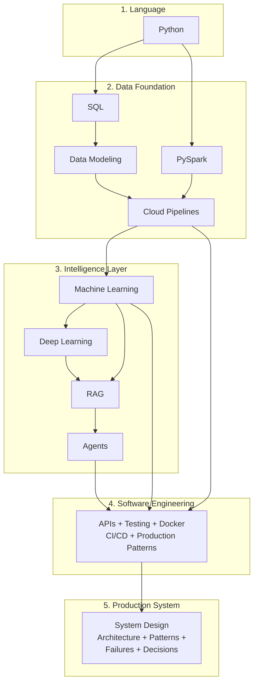

# Systems in Production

**How to build, operate, and continuously improve intelligent systems — across Cloud, Data, and AI.**

Start with one notebook. Get your first win in 30 minutes.

---

## Start Here

This repo is a library. You are not meant to read it front to back. Pick one path, follow it, and build something.

**Your first 30 minutes:** Click a Colab badge below. The notebook opens in your browser. Run each cell top to bottom (Shift+Enter). You'll see results immediately.

Most notebooks run directly on Colab (no setup). A few advanced topics (RAG, Agents) require local setup (Ollama for running AI models locally) — those chapters explain what you need.

| You Are | Start With | Your First Win |
|---|---|---|
| **Brand new to programming** | [Python Basics](playbooks/python/01_Why.md) |  Write your first Python code, see it run |
| **Want the guided path to AI** | [Python for AI Workshop](implementation/notebooks/Python_for_AI_Workshop.ipynb) |  Zero to ML model in 2 hours |
| **Know Python, new to AI** | [ML Playbook ch 01](playbooks/ai/ml/01_Why.md) then [ch 03](playbooks/ai/ml/03_Hello_World.md) |  Train your first ML model in 5 lines |
| **Know Python, want to build AI apps** | [RAG Playbook ch 01](playbooks/ai/rag/01_Why.md) |  Build AI that answers from your documents |
| **Want to build data pipelines** | [SQL Playbook ch 01](playbooks/data/sql/01_Why.md) |  Query real data in minutes |
| **Want to see production architecture** | [CSI Architecture](systems/continuous-system-intelligence/architecture.md) | [Start reading](systems/continuous-system-intelligence/architecture.md) See how a real system is continuously observed, diagnosed, and improved |
| **Want to see what breaks in production** | [Failures](failures/) | [Start reading](failures/why-flat-tables-break.md) Learn from real production failures |
| **Know Java/C#, need Python fast** | [Java Bridge](implementation/notebooks/Python_Java_Bridge.ipynb) |  Translate what you know to Python |

### Your First Week (if you're starting from scratch)

| Day | What to Do | Time |
|---|---|---|
| 1 | [Python Basics notebook](https://colab.research.google.com/github/sunilmogadati/systems-in-production/blob/main/implementation/notebooks/Python_Basics.ipynb) — variables, types, strings | 1-2 hours |
| 2 | [Data Structures notebook](https://colab.research.google.com/github/sunilmogadati/systems-in-production/blob/main/implementation/notebooks/Python_Data_Structures.ipynb) — lists, dicts, comprehensions | 1-2 hours |
| 3 | [Functions and Classes notebook](https://colab.research.google.com/github/sunilmogadati/systems-in-production/blob/main/implementation/notebooks/Python_Functions_Classes.ipynb) — functions, lambdas, classes | 1-2 hours |
| 4 | [ML Hello World](playbooks/ai/ml/03_Hello_World.md) then [Linear Regression notebook](https://colab.research.google.com/github/sunilmogadati/systems-in-production/blob/main/implementation/notebooks/Linear_Regression.ipynb) | 1-2 hours |
| 5 | [NumPy and Pandas notebook](https://colab.research.google.com/github/sunilmogadati/systems-in-production/blob/main/implementation/notebooks/Python_NumPy_Pandas.ipynb) — data manipulation | 1-2 hours |
| 6 | [RAG Hello World](playbooks/ai/rag/03_Hello_World.md) — build AI that answers from documents | 1 hour |
| 7 | Pick one thing you learned and build something small with it | Your pace |

Every playbook chapter: read on GitHub (diagrams render here). Every notebook: one click to run on Google Colab.

---

## The Builder's Path

The full sequence for building intelligent production systems.

### Playbooks

Each playbook has 10 chapters: Why, Concepts, Hello World, How It Works, Building It, Production Patterns, System Design, Quality/Security, Observability, Decision Guide.

| Step | Playbook | Notebooks | Level |
|---|---|---|---|
| **Python** | [10 chapters](playbooks/python/) | [7 notebooks](playbooks/python/README.md) (Basics through Advanced) | No background needed |
| **Data Design** | [SQL](playbooks/data/data-design/sql/) + [Modeling](playbooks/data/data-design/modeling/) + [Star Schema](playbooks/data/data-design/star-schema/) | [Advanced SQL](implementation/notebooks/Advanced_SQL.ipynb) + [Data Modeling](implementation/notebooks/Data_Modeling.ipynb) | No background needed |
| **Pipelines** | [Cloud](playbooks/data/pipelines/cloud/) + [ETL/ELT](playbooks/data/pipelines/etl-elt/) + [Lakehouse](playbooks/data/pipelines/lakehouse/) | [GCP Pipeline](implementation/notebooks/GCP_Full_Pipeline.ipynb) + [ETL/ELT](implementation/notebooks/ETL_ELT_Patterns.ipynb) + [Delta Lake](implementation/notebooks/Delta_Lake_Hello_World.ipynb) | Good if you know basic SQL |
| **PySpark** | [10 chapters](playbooks/data/pyspark/) | [PySpark](implementation/notebooks/PySpark.ipynb) | Good if you know basic Python |
| **Machine Learning** | [10 chapters](playbooks/ai/ml/) (21 algorithms) | [ML Fundamentals](implementation/notebooks/ML_Fundamentals.ipynb) + [Linear Regression](implementation/notebooks/Linear_Regression.ipynb) + [Logistic Regression](implementation/notebooks/Logistic_Regression.ipynb) | Good if you know basic Python |
| **Deep Learning** | [10 chapters](playbooks/ai/deep-learning/) | [PyTorch](implementation/notebooks/Deep_Learning_PyTorch.ipynb) + [CNN](implementation/notebooks/Deep_Learning_CNN.ipynb) | Come here after ML |
| **RAG** | [10 chapters](playbooks/ai/rag/) | [RAG from Scratch](implementation/notebooks/RAG_from_Scratch.ipynb) | Come here after ML |
| **Agents** | [10 chapters](playbooks/ai/agents/) | [Agents](implementation/notebooks/Agents.ipynb) | Come here after RAG |
| **Software Engineering** | [10 chapters](playbooks/engineering/) | [CI/CD](implementation/notebooks/CICD_for_DE.ipynb) | Good if you know basic Python |

---

## How Real Systems Are Built

### [See a real system](systems/continuous-system-intelligence/architecture.md)
Continuous System Intelligence (CSI) — continuously observe, diagnose, and improve production systems across code, data, product, and business. Full architecture with Mermaid diagrams.

### [Understand the patterns](patterns/)
Reusable architecture patterns: [Bronze-Silver-Gold](patterns/bronze-silver-gold.md), [multi-system reconciliation](patterns/multi-system-reconciliation.md), [AI-derived features](patterns/ai-derived-features.md), [feedback loops](patterns/feedback-loops.md), [event-driven diagnostics](patterns/event-driven-diagnostics.md).

### [Learn where systems break](failures/)
Real production failures: [flat tables at scale](failures/why-flat-tables-break.md), [ML with bad features](failures/why-ml-fails-with-bad-features.md), [cross-system joins](failures/why-cross-system-joins-fail.md).

### [Explore how decisions are made](decisions/)
Architecture decisions: [batch vs streaming](decisions/batch-vs-streaming.md), [star schema vs query source](decisions/star-schema-vs-query-source.md), [SQL vs Spark vs BigQuery](decisions/sql-vs-spark-vs-bigquery.md).

---

## Notebooks

Click any Colab badge to open and run. No setup needed.

### Python (start here)

| Notebook | Open in Colab |
|---|---|
| [**Python for AI Workshop**](implementation/notebooks/Python_for_AI_Workshop.ipynb) — zero to ML in 2 hours |  |
| [Python Basics](implementation/notebooks/Python_Basics.ipynb) |  |
| [Data Structures](implementation/notebooks/Python_Data_Structures.ipynb) |  |
| [Functions and Classes](implementation/notebooks/Python_Functions_Classes.ipynb) |  |
| [File I/O](implementation/notebooks/Python_File_IO.ipynb) |  |
| [NumPy and Pandas](implementation/notebooks/Python_NumPy_Pandas.ipynb) |  |
| [Advanced Patterns](implementation/notebooks/Python_Advanced.ipynb) |  |
| [Java/C# Developer Bridge](implementation/notebooks/Python_Java_Bridge.ipynb) |  |

### Data

| Notebook | Open in Colab |
|---|---|
| [Advanced SQL](implementation/notebooks/Advanced_SQL.ipynb) — Window functions, CTEs, optimization |  |
| [Data Modeling](implementation/notebooks/Data_Modeling.ipynb) — Star schema, fact/dimension tables |  |
| [GCP Full Pipeline](implementation/notebooks/GCP_Full_Pipeline.ipynb) — Bronze, Silver, Gold on BigQuery |  |
| [GCP Pipeline Automation](implementation/notebooks/GCP_Pipeline_Automation.ipynb) — Pub/Sub, Cloud Functions, Dataproc |  |
| [PySpark](implementation/notebooks/PySpark.ipynb) — Distributed data processing |  |

### Machine Learning and AI

| Notebook | Open in Colab |
|---|---|
| [ML Fundamentals](implementation/notebooks/ML_Fundamentals.ipynb) — Full pipeline, SHAP, MLflow |  |
| [Linear Regression](implementation/notebooks/Linear_Regression.ipynb) — Where all of ML begins |  |
| [Deep Learning / PyTorch](implementation/notebooks/Deep_Learning_PyTorch.ipynb) — Neural networks, training diagnostics |  |
| [RAG from Scratch](implementation/notebooks/RAG_from_Scratch.ipynb) — Retrieval-augmented generation |  |
| [Agents](implementation/notebooks/Agents.ipynb) — ReAct, tool use, multi-step reasoning |  |

---

## Datasets

**Call center analytics** — synthetic data with intentional quality issues (duplicates, timezone bugs, missing values). Powers both the data pipeline and ML pipeline.

**Production support** — 7 microservices, 15 incidents, 28K log entries, deployment records, infrastructure metrics, service runbooks. 10 hidden diagnostic patterns to discover.

---

## Community and Support

**[DeliveryMomentum on Skool](https://www.skool.com/deliverymomentum)** — ask questions, share what you're building, discuss real systems.

**[Book a 1:1 with Sunil](https://calendly.com/sunil-mogadati/connect)** — 20 minutes, focused on your specific situation.

---

## Author

**Sunil Mogadati** — 25+ years building and operating complex systems end-to-end across software, cloud, data, and AI.

I fix systems that don't respond to more tools or more people. Ground truth leadership — from the codebase to the boardroom.

[LinkedIn](https://linkedin.com/in/sunilmogadati) · [GitHub](https://github.com/sunilmogadati)
