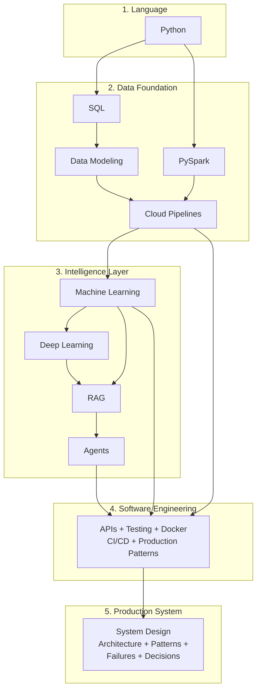

# Systems in Production

**Reference architectures, diagnostics, and operating frameworks for Cloud, Data, and AI systems.**

This is not a tutorial collection. This is documentation of how production systems actually work — where they fail, what patterns hold up, and how decisions are made under real constraints.

---

## The Builder's Path

How to build intelligent production systems — from the language to the architecture.

| Step | Playbook | Notebooks | What You Build |
|---|---|---|---|
| **Python** | [10 chapters](playbooks/python/) | [7 notebooks](implementation/notebooks/) (Basics through Advanced) | The language everything runs in |
| **SQL** | Coming soon | [Advanced SQL](implementation/notebooks/Advanced_SQL.ipynb) | How to query and transform data |
| **Data Modeling** | [3 chapters](playbooks/data/data-modeling/) + [Star Schema](playbooks/data/star-schema-design/) | [Data Modeling](implementation/notebooks/Data_Modeling.ipynb) | How to structure data for querying and ML |
| **Cloud Pipelines** | [6 chapters](playbooks/data/cloud-pipeline/) | [GCP Pipeline](implementation/notebooks/GCP_Full_Pipeline.ipynb) + [Automation](implementation/notebooks/GCP_Pipeline_Automation.ipynb) | How data moves from source to warehouse (Bronze, Silver, Gold) |
| **PySpark** | [10 chapters](playbooks/data/pyspark/) | [PySpark](implementation/notebooks/PySpark.ipynb) | Distributed data processing at scale |
| **Machine Learning** | [10 chapters](playbooks/ai/ml/) (21 algorithms) | [ML Fundamentals](implementation/notebooks/ML_Fundamentals.ipynb) + [Linear Regression](implementation/notebooks/Linear_Regression.ipynb) + [Logistic Regression](implementation/notebooks/Logistic_Regression.ipynb) | Prediction, classification, anomaly detection |
| **Deep Learning** | [10 chapters](playbooks/ai/deep-learning/) | [PyTorch](implementation/notebooks/Deep_Learning_PyTorch.ipynb) + [CNN](implementation/notebooks/Deep_Learning_CNN.ipynb) | Neural networks, image recognition, pattern detection |
| **RAG** | [10 chapters](playbooks/ai/rag/) | [RAG from Scratch](implementation/notebooks/RAG_from_Scratch.ipynb) | AI that answers from your organization's data |
| **Agents** | [10 chapters](playbooks/ai/agents/) | [Agents](implementation/notebooks/Agents.ipynb) | AI that takes actions, not just answers |
| **Software Engineering** | [10 chapters](playbooks/engineering/) | [CICD for DE](implementation/notebooks/CICD_for_DE.ipynb) | APIs, testing, Docker, CI/CD, production patterns |

Each playbook follows the same framework: Why, Concepts, Hello World, How It Works, Building It, Production Patterns, System Design, Quality/Security/Governance, Observability/Troubleshooting, Decision Guide.

---

## How Real Systems Are Built

### [See a real system](systems/production-diagnostics/)
A production diagnostic system that collects data from databases, logs, documents, and APIs, then diagnoses issues and recommends actions. Architecture with Mermaid diagrams.

### [Understand the patterns](patterns/)
Reusable architecture patterns: Bronze-Silver-Gold pipelines, multi-system reconciliation, AI-derived feature engineering, feedback loops, event-driven diagnostics.

### [Learn where systems break](failures/)
Real production failures: flat table architectures that create duplicate data, ML models that fail because features don't carry signal, cross-system joins that silently drop records.

### [Explore how decisions are made](decisions/)
The decisions behind the architecture: batch vs streaming, star schema vs querying source tables, SQL vs Spark vs BigQuery. Not what to choose — how to think about choosing.

---

## Notebooks

Click any Colab badge to open and run. No setup needed.

### Data

| Notebook | Open in Colab |
|---|---|
| [GCP Full Pipeline](implementation/notebooks/GCP_Full_Pipeline.ipynb) — Bronze, Silver, Gold on BigQuery |  |
| [GCP Pipeline Automation](implementation/notebooks/GCP_Pipeline_Automation.ipynb) — Pub/Sub, Cloud Functions, Dataproc, Composer |  |
| [Data Modeling](implementation/notebooks/Data_Modeling.ipynb) — Star schema, fact/dimension tables, SCD |  |
| [Advanced SQL](implementation/notebooks/Advanced_SQL.ipynb) — Window functions, CTEs, optimization |  |
| [PySpark](implementation/notebooks/PySpark.ipynb) — Distributed data processing |  |

### Machine Learning and AI

| Notebook | Open in Colab |
|---|---|
| [ML Fundamentals](implementation/notebooks/ML_Fundamentals.ipynb) — Full pipeline, SHAP, MLflow |  |
| [Deep Learning / PyTorch](implementation/notebooks/Deep_Learning_PyTorch.ipynb) — Neural networks, training diagnostics |  |
| [RAG from Scratch](implementation/notebooks/RAG_from_Scratch.ipynb) — Retrieval-augmented generation |  |
| [Agents](implementation/notebooks/Agents.ipynb) — ReAct, tool use, multi-step reasoning |  |

### Python

| Notebook | Open in Colab |
|---|---|
| [Python Basics](implementation/notebooks/Python_Basics.ipynb) |  |
| [Data Structures](implementation/notebooks/Python_Data_Structures.ipynb) |  |
| [Functions and Classes](implementation/notebooks/Python_Functions_Classes.ipynb) |  |
| [File I/O](implementation/notebooks/Python_File_IO.ipynb) |  |
| [NumPy and Pandas](implementation/notebooks/Python_NumPy_Pandas.ipynb) |  |
| [Advanced Patterns](implementation/notebooks/Python_Advanced.ipynb) |  |

---

## Datasets

**Call center analytics** — synthetic data with intentional quality issues (duplicates, timezone bugs, missing values). Powers both the data pipeline and ML pipeline.

**Production support** — 7 microservices, 15 incidents, 28K log entries, deployment records, infrastructure metrics, service runbooks. 10 hidden diagnostic patterns.

---

## Community

[DeliveryMomentum on Skool](https://www.skool.com/deliverymomentum) — where real systems are examined, built, and discussed.

---

## Author

**Sunil Mogadati** — 25+ years building and operating complex systems end-to-end. I fix systems that don't respond to more tools or more people.

Ground truth leadership — from the codebase to the boardroom.

[LinkedIn](https://linkedin.com/in/sunilmogadati) · [GitHub](https://github.com/sunilmogadati)
