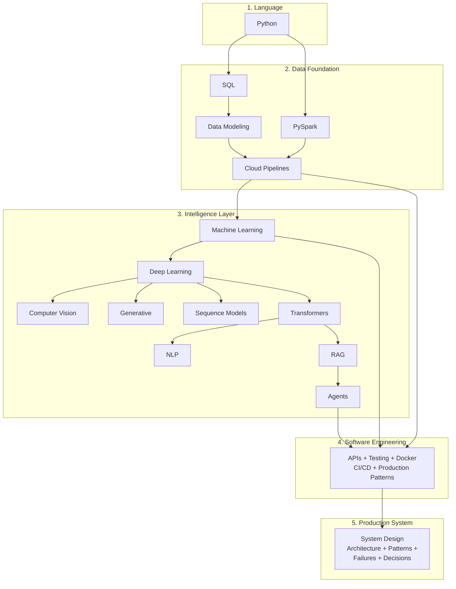

# Systems in Production

**A reference library for building, operating, and continuously improving intelligent systems — across Cloud, Data, and AI.**

Production-grade playbooks, runnable notebooks, real architectures, real failure modes, and the decision-making behind them.

---

## What's in This Repo

| Section | Coverage |
|---|---|
| **[playbooks/](playbooks/)** | 10-chapter playbooks per domain (Why → Concepts → Hello World → How It Works → Building It → Production Patterns → System Design → Quality/Security → Observability → Decision Guide). |
| **[implementation/notebooks/](implementation/notebooks/)** | Runnable Colab notebooks. Pure-NumPy from-scratch walkthroughs and full PyTorch / scikit-learn implementations. |
| **[systems/](systems/)** | Real production system architectures with diagrams. CSI (Continuous System Intelligence) is the centerpiece. |
| **[patterns/](patterns/)** | Reusable architectural patterns: Bronze-Silver-Gold, multi-system reconciliation, AI-derived features, feedback loops. |
| **[decisions/](decisions/)** | Architecture decision records: batch vs streaming, star schema vs query source, SQL vs Spark vs BigQuery. |
| **[failures/](failures/)** | What breaks at production scale and why. |
| **[resources/](resources/)** | One-page reference cards. |

---

## The Builder's Path

The full sequence for building intelligent production systems.

---

## AI Playbooks

Each AI playbook follows the same 10-chapter structure (Why through Decision Guide) with a companion from-scratch notebook.

### Foundations

| Playbook | Focus | Companion Notebook |
|---|---|---|
| [Machine Learning](playbooks/ai/ml/) | Prediction, classification, anomaly detection (21 algorithms) | [ML Fundamentals](implementation/notebooks/ML_Fundamentals.ipynb), [Linear Regression](implementation/notebooks/Linear_Regression.ipynb), [Logistic Regression](implementation/notebooks/Logistic_Regression.ipynb) |
| [Deep Learning](playbooks/ai/deep-learning/) | Neural network foundations, training mechanics, diagnostics | [Deep_Learning_From_Scratch](implementation/notebooks/Deep_Learning_From_Scratch.ipynb) (NumPy MLP + autograd verification), [Deep_Learning_PyTorch](implementation/notebooks/Deep_Learning_PyTorch.ipynb), [Deep_Learning_Regularization](implementation/notebooks/Deep_Learning_Regularization.ipynb) |

### Task-Domain and Architecture

| Playbook | Focus | Companion Notebook |
|---|---|---|
| [Computer Vision](playbooks/ai/computer-vision/) | Vision tasks (CNN, ViT, detection, segmentation). Architecture deep dives for ResNet and U-Net. | [Computer_Vision_From_Scratch](implementation/notebooks/Computer_Vision_From_Scratch.ipynb) (manual convolution + BPTT-style training), [Computer_Vision_CNN](implementation/notebooks/Computer_Vision_CNN.ipynb) |
| [Generative](playbooks/ai/generative/) | GAN, VAE, Diffusion. Architecture deep dive for GAN. | [Generative_Autoencoder_From_Scratch](implementation/notebooks/Generative_Autoencoder_From_Scratch.ipynb), [Deep_Learning_Autoencoders_GANs](implementation/notebooks/Deep_Learning_Autoencoders_GANs.ipynb) |
| [Sequence Models](playbooks/ai/sequence-models/) | RNN, LSTM, GRU. Architecture deep dive for RNN/LSTM. | [Sequence_Models_From_Scratch](implementation/notebooks/Sequence_Models_From_Scratch.ipynb) (full BPTT by hand) |
| [Transformers](playbooks/ai/transformers/) | Self-attention, encoder/decoder, GPT/BERT. Architecture deep dive for the Transformer. | [Transformer_From_Scratch](implementation/notebooks/Transformer_From_Scratch.ipynb) (Q/K/V, multi-head, causal masking) |
| [NLP](playbooks/ai/nlp/) | Task-domain entry point: classification, NER, generation, translation, embeddings. | [NLP_From_Scratch](implementation/notebooks/NLP_From_Scratch.ipynb) (BPE, TF-IDF, naive Bayes) |

### System Patterns

| Playbook | Focus | Companion Notebook |
|---|---|---|
| [RAG](playbooks/ai/rag/) | Retrieval-augmented generation — AI grounded in your organization's data | [RAG from Scratch](implementation/notebooks/RAG_from_Scratch.ipynb) |
| [Agents](playbooks/ai/agents/) | Autonomous AI: ReAct, tool use, multi-step reasoning | [Agents](implementation/notebooks/Agents.ipynb) |

### Shared References

| Doc | Purpose |
|---|---|
| [Math for AI](playbooks/ai/math-for-ai.md) | Conceptual math primer — derivatives, chain rule, gradient descent, dot products |
| [Architecture Glossary](playbooks/ai/architecture-glossary.md) | Cross-architecture terminology (GAN, RNN/LSTM, U-Net, ResNet, Transformer) |
| [Architecture Math](playbooks/ai/architecture-math.md) | Worked numerical examples — parameter counting, shape arithmetic, BPTT, attention |
| [Architecture Reference Card](resources/architecture-reference.md) | One-page printable reference covering foundations + per-architecture quick lookup |
| [DL_Architecture_Examples](implementation/notebooks/DL_Architecture_Examples.ipynb) | Runnable companion to Architecture Math — parameter counts and shape arithmetic across architectures |

---

## Data and Pipelines

| Playbook | Focus | Notebooks |
|---|---|---|
| [SQL](playbooks/data/data-design/sql/) | Querying, window functions, optimization | [Advanced SQL](implementation/notebooks/Advanced_SQL.ipynb) |
| [Data Modeling](playbooks/data/data-design/modeling/) + [Star Schema](playbooks/data/data-design/star-schema/) | Fact/dimension tables, modeling tradeoffs | [Data Modeling](implementation/notebooks/Data_Modeling.ipynb) |
| [Cloud Pipelines](playbooks/data/pipelines/cloud/) + [ETL/ELT](playbooks/data/pipelines/etl-elt/) + [Lakehouse](playbooks/data/pipelines/lakehouse/) | Bronze-Silver-Gold, GCP, Delta Lake | [GCP Full Pipeline](implementation/notebooks/GCP_Full_Pipeline.ipynb), [GCP Pipeline Automation](implementation/notebooks/GCP_Pipeline_Automation.ipynb), [ETL/ELT Patterns](implementation/notebooks/ETL_ELT_Patterns.ipynb), [Delta Lake Hello World](implementation/notebooks/Delta_Lake_Hello_World.ipynb) |
| [PySpark](playbooks/data/pyspark/) | Distributed data processing | [PySpark](implementation/notebooks/PySpark.ipynb) |

---

## Python and Engineering

| Playbook | Focus | Notebooks |
|---|---|---|
| [Python](playbooks/python/) | Foundations through advanced patterns | [Python Basics](implementation/notebooks/Python_Basics.ipynb), [Data Structures](implementation/notebooks/Python_Data_Structures.ipynb), [Functions and Classes](implementation/notebooks/Python_Functions_Classes.ipynb), [File I/O](implementation/notebooks/Python_File_IO.ipynb), [NumPy and Pandas](implementation/notebooks/Python_NumPy_Pandas.ipynb), [Advanced Patterns](implementation/notebooks/Python_Advanced.ipynb), [Java/C# Bridge](implementation/notebooks/Python_Java_Bridge.ipynb) |
| [Software Engineering](playbooks/engineering/) | APIs, testing, Docker, CI/CD, production patterns | [CI/CD for DE](implementation/notebooks/CICD_for_DE.ipynb) |

---

## How Real Systems Are Built

### [CSI — A Real Production System](systems/continuous-system-intelligence/architecture.md)

**Continuous System Intelligence**: a system that continuously observes, diagnoses, and improves production environments across code, data, product, and business signals. Full architecture documented with Mermaid diagrams.

### [Architectural Patterns](patterns/)

Reusable patterns that show up across systems:
- [Bronze-Silver-Gold](patterns/bronze-silver-gold.md) — the tiered data refinement pattern
- [Multi-system reconciliation](patterns/multi-system-reconciliation.md) — when truth lives in multiple databases
- [AI-derived features](patterns/ai-derived-features.md) — feeding ML output back as features
- [Feedback loops](patterns/feedback-loops.md) — closing the loop in production AI
- [Event-driven diagnostics](patterns/event-driven-diagnostics.md) — emitting events for downstream observability

### [Production Failures](failures/)

What breaks at scale, and why:
- [Why flat tables break](failures/why-flat-tables-break.md)
- [Why ML fails with bad features](failures/why-ml-fails-with-bad-features.md)
- [Why cross-system joins fail](failures/why-cross-system-joins-fail.md)

### [Architecture Decisions](decisions/)

Documented decision records:
- [Batch vs streaming](decisions/batch-vs-streaming.md)
- [Star schema vs query source](decisions/star-schema-vs-query-source.md)
- [SQL vs Spark vs BigQuery](decisions/sql-vs-spark-vs-bigquery.md)

---

## Notebooks Index

All notebooks open in Colab. Most run without setup; a few (RAG, Agents) require Ollama or other local services — those notebooks document the setup.

### From-Scratch (Math by Hand + PyTorch / sklearn Verification)

| Notebook | What It Does |
|---|---|
| [Deep_Learning_From_Scratch](implementation/notebooks/Deep_Learning_From_Scratch.ipynb) | Pure NumPy MLP. Two hidden neurons, three houses, every gradient by hand. PyTorch autograd verification. |
| [Computer_Vision_From_Scratch](implementation/notebooks/Computer_Vision_From_Scratch.ipynb) | Manual convolution by NumPy. Single slide, full feature map, pooling, multi-filter, parameter counting. PyTorch `F.conv2d` verification. |
| [Generative_Autoencoder_From_Scratch](implementation/notebooks/Generative_Autoencoder_From_Scratch.ipynb) | Autoencoder by hand. Encode/decode, full backward through two networks, latent visualization. PyTorch verification. |
| [Sequence_Models_From_Scratch](implementation/notebooks/Sequence_Models_From_Scratch.ipynb) | Vanilla RNN by hand. Forward through time, full BPTT backward, weight-sharing accumulation, vanishing-gradient demonstration. PyTorch verification. |
| [Transformer_From_Scratch](implementation/notebooks/Transformer_From_Scratch.ipynb) | Self-attention by hand. Q/K/V projection, scaled dot-product, multi-head decomposition, causal masking, positional encoding. PyTorch verification. |
| [NLP_From_Scratch](implementation/notebooks/NLP_From_Scratch.ipynb) | Classical NLP by hand. BPE tokenization, TF-IDF, naive Bayes, Word2Vec via PCA. sklearn verification. |
| [DL_Architecture_Examples](implementation/notebooks/DL_Architecture_Examples.ipynb) | Runnable parameter-count and shape-arithmetic examples for GAN, RNN, LSTM, U-Net, ResNet, Transformer. |

### Full Implementation in PyTorch / Frameworks

| Notebook | What It Does |
|---|---|
| [Deep_Learning_PyTorch](implementation/notebooks/Deep_Learning_PyTorch.ipynb) | Full MLP and CNN in PyTorch. Training loop, diagnostics, evaluation. |
| [Deep_Learning_Regularization](implementation/notebooks/Deep_Learning_Regularization.ipynb) | Dropout, L2, batch norm, augmentation — runnable comparisons with loss curves. |
| [Computer_Vision_CNN](implementation/notebooks/Computer_Vision_CNN.ipynb) | Full CNN in PyTorch on MNIST. Convolution, pooling, full pipeline, training, evaluation. |
| [Deep_Learning_Autoencoders_GANs](implementation/notebooks/Deep_Learning_Autoencoders_GANs.ipynb) | PyTorch autoencoder, SimpleGAN, and DCGAN on MNIST. |
| [RAG_from_Scratch](implementation/notebooks/RAG_from_Scratch.ipynb) | RAG end-to-end with Ollama. Local, no API keys. |
| [Agents](implementation/notebooks/Agents.ipynb) | ReAct, tool use, multi-step reasoning. |
| [Multimodal_AI](implementation/notebooks/Multimodal_AI.ipynb) | Vision-language pipelines. |

### Foundations and Data

| Notebook | What It Does |
|---|---|
| [Python_Basics](implementation/notebooks/Python_Basics.ipynb), [Python_Data_Structures](implementation/notebooks/Python_Data_Structures.ipynb), [Python_Functions_Classes](implementation/notebooks/Python_Functions_Classes.ipynb), [Python_File_IO](implementation/notebooks/Python_File_IO.ipynb), [Python_NumPy_Pandas](implementation/notebooks/Python_NumPy_Pandas.ipynb), [Python_Advanced](implementation/notebooks/Python_Advanced.ipynb) | Python from foundations through advanced patterns |
| [Python_Java_Bridge](implementation/notebooks/Python_Java_Bridge.ipynb) | Python for Java/C# developers — type and pattern translation |
| [Math_for_AI](implementation/notebooks/Math_for_AI.ipynb) | Math primer with worked examples |
| [Advanced_SQL](implementation/notebooks/Advanced_SQL.ipynb), [Data_Modeling](implementation/notebooks/Data_Modeling.ipynb), [Database_Essentials](implementation/notebooks/Database_Essentials.ipynb) | Data foundations |
| [GCP_Full_Pipeline](implementation/notebooks/GCP_Full_Pipeline.ipynb), [GCP_Pipeline_Automation](implementation/notebooks/GCP_Pipeline_Automation.ipynb), [Cloud_Pipeline_Reference](implementation/notebooks/Cloud_Pipeline_Reference.ipynb), [Cloud_Pipeline_Orchestration](implementation/notebooks/Cloud_Pipeline_Orchestration.ipynb) | Cloud data pipelines on GCP |
| [PySpark](implementation/notebooks/PySpark.ipynb), [Distributed_Systems](implementation/notebooks/Distributed_Systems.ipynb), [Delta_Lake_Hello_World](implementation/notebooks/Delta_Lake_Hello_World.ipynb), [ETL_ELT_Patterns](implementation/notebooks/ETL_ELT_Patterns.ipynb) | Distributed data processing |
| [Data_Quality_Tools](implementation/notebooks/Data_Quality_Tools.ipynb), [Data_Engineering_Overview](implementation/notebooks/Data_Engineering_Overview.ipynb), [Analytics_Pipeline](implementation/notebooks/Analytics_Pipeline.ipynb), [ML_Pipeline](implementation/notebooks/ML_Pipeline.ipynb), [CICD_for_DE](implementation/notebooks/CICD_for_DE.ipynb) | Data engineering operations |
| [Git_Linux_SQL](implementation/notebooks/Git_Linux_SQL.ipynb) | Foundational tooling |
| [Interview_Prep](implementation/notebooks/Interview_Prep.ipynb), [Python_for_AI_Workshop](implementation/notebooks/Python_for_AI_Workshop.ipynb) | Consolidated reviews |

---

## Datasets

**Call Center Analytics** — synthetic data with intentional quality issues (duplicates, timezone bugs, missing values). Drives both the data-pipeline and ML-pipeline content.

**Production Support** — 7 microservices, 15 incidents, 28K log entries, deployment records, infrastructure metrics, service runbooks. 10 hidden diagnostic patterns.

---

## Community and Engagement

**[Skool: Delivery Momentum](https://www.skool.com/deliverymomentum)** — discussion, real-system question threads, periodic deep dives.

**[Book a 1:1 with Sunil](https://calendly.com/sunil-mogadati/connect)** — for delivery recovery engagements and technical leadership conversations.

---

## Author

**Sunil Mogadati** — 25+ years building and operating complex systems end-to-end across software, cloud, data, and AI.

I fix delivery problems that don't respond to more tools or more people. Embedded technical leadership — from the codebase to the boardroom.

[LinkedIn](https://linkedin.com/in/sunilmogadati) · [GitHub](https://github.com/sunilmogadati)
