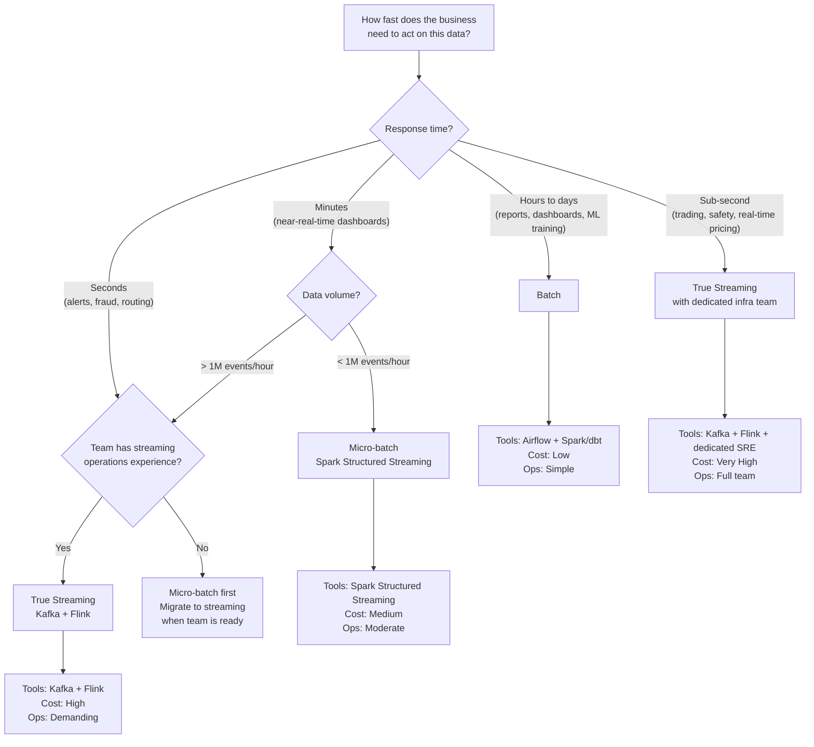

# Batch vs Streaming: How to Choose

## The Decision

Should you process data in batches (hourly, daily) or process each event as it arrives?

This decision gets over-complicated. Teams spend weeks evaluating Kafka vs Flink vs Spark Streaming. The technology choice is the last decision, not the first.

The first question is: **how fast does the business need to act on this data?**

## Options

| Approach | Tools | Latency | Complexity | Cost |
|----------|-------|---------|------------|------|
| **Batch** | Spark, Airflow, dbt, cron | Minutes to hours | Low | Low |
| **Micro-batch** | Spark Structured Streaming | 30s - 5 min | Medium | Medium |
| **True streaming** | Kafka + Flink, Kafka Streams | Sub-second to seconds | High | High |
| **Hybrid** | Batch for analytics, stream for alerts | Varies by use case | Medium-High | Medium-High |

## Tradeoffs

| Factor | Batch | Streaming |
|--------|-------|-----------|
| **Latency** | Minutes to hours | Sub-second to seconds |
| **Complexity** | Simple. Run, check, done. | State management, exactly-once, ordering, checkpoints |
| **Debuggability** | Rerun the batch, inspect the output | Replay the stream, reconstruct state, hope the offsets are right |
| **Cost at rest** | Zero. Nothing runs between batches. | Infrastructure runs 24/7 whether data arrives or not |
| **Cost at scale** | Scales with batch size | Scales with event rate AND state size |
| **Failure recovery** | Rerun from the beginning | Checkpoint recovery, offset management, dead letter queues |
| **Schema evolution** | Apply to next batch | Apply to running stream without downtime |
| **Team skill required** | SQL + orchestration | Distributed systems + state management + operations |
| **Testing** | Run against a file, check the output | Simulate event sequences, test watermarks, test late arrivals |

## Decision Framework

## The Hidden Cost of Streaming

Streaming introduces problems that don't exist in batch:

**Exactly-once semantics.** In batch, you process a file once. In streaming, an event might be delivered twice (producer retry), processed twice (consumer restart), or written twice (sink failure + replay). Guaranteeing exactly-once across the full pipeline requires idempotent writes, transactional consumers, and careful offset management.

**Out-of-order events.** Events arrive late. A click event from a mobile device on a subway arrives 45 seconds after the page view event. Your stream processor has already moved past that window. Do you drop it? Reprocess the window? Buffer indefinitely?

**State management.** Aggregations (count, sum, average over a window) require state. That state lives in memory. When the processor restarts, that state needs to be recovered from a checkpoint. Checkpoint corruption means reprocessing from the last known good state -- which might be hours ago.

**Operational burden.** A batch job that fails at 3 AM waits for you at 9 AM. A streaming job that fails at 3 AM starts losing data at 3 AM. Streaming requires 24/7 monitoring, alerting, and on-call rotation.

## When Companies Regret Choosing Streaming

"We built a real-time pipeline for a report that's read once a day."

The executive dashboard updates every 24 hours. The data team built a Kafka + Flink pipeline to ingest events in real time, maintain running aggregations, and write to a real-time materialized view. The pipeline has 4 services, requires Kafka cluster management, costs $3,200/month in infrastructure, and has caused 6 pages in the last quarter.

A daily Airflow job processing the same data takes 8 minutes, costs $40/month, and has failed once in 6 months (recovered automatically on retry).

## When Companies Regret Choosing Batch

"We process fraud alerts every 6 hours. By then, the money is gone."

A payment processor ran fraud detection as a batch job every 6 hours. A fraudulent transaction at 10:01 AM wasn't flagged until the 4:00 PM batch ran. By then, the attacker had made 47 additional transactions totaling $180K. Real-time fraud scoring would have caught the pattern within seconds of the second transaction.

## The Real Answer

Start with batch. It is simpler to build, simpler to debug, simpler to operate, and cheaper to run.

Add streaming when the business cost of latency exceeds the engineering cost of streaming infrastructure. That threshold is specific to your business:

| Use case | Right choice | Why |
|----------|-------------|-----|
| Daily reports | Batch | Nobody reads it until morning |
| ML model training | Batch | Models retrain daily or weekly |
| Near-real-time dashboard | Micro-batch (30s-5min) | Close enough to real-time, fraction of the complexity |
| Fraud detection | Streaming | Seconds matter, dollars are at risk |
| IoT sensor monitoring | Streaming | Equipment damage happens in real time |
| Log aggregation for alerting | Streaming | Outage detection can't wait for a batch window |
| Log aggregation for analysis | Batch | Historical analysis doesn't need sub-second freshness |
| Feature store for ML serving | Hybrid | Batch features for training, streaming features for inference |

The question is never "which is better?" The question is: "what does the business lose by waiting?"

If the answer is "nothing" -- batch. If the answer has a dollar sign -- do the math.
