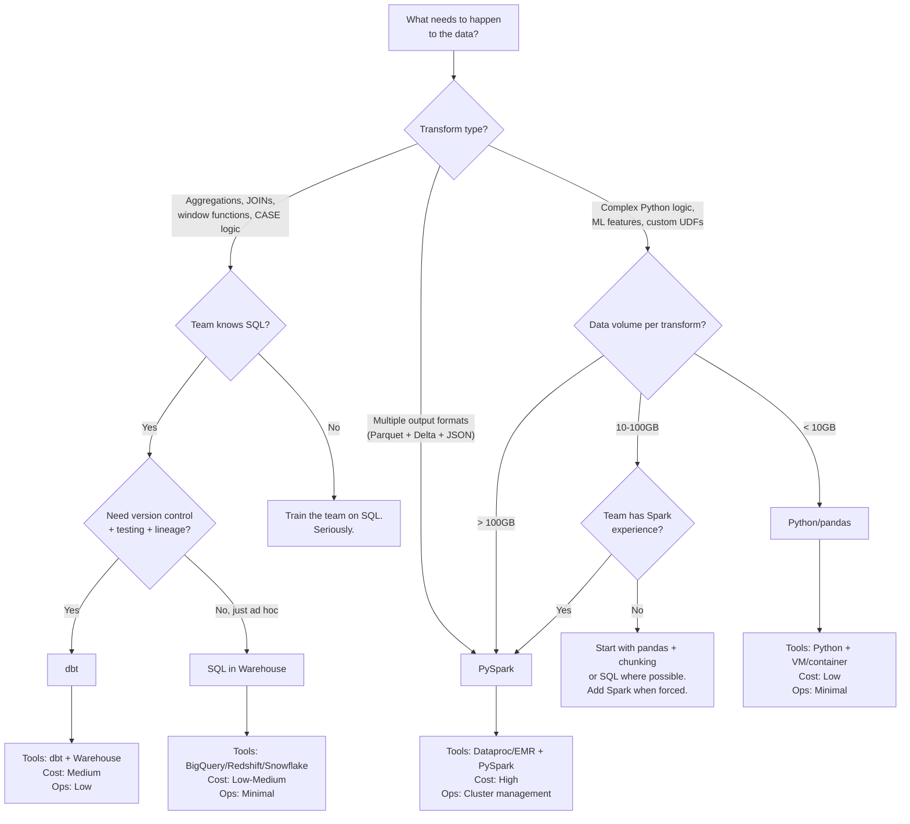

# SQL vs Spark vs BigQuery: Choosing Your Transform Engine

## The Decision

You have raw data. It needs to become clean, modeled, queryable data. Where do you run the transformations?

This is one of the most over-debated decisions in data engineering. Teams spend weeks evaluating tools when the answer is usually straightforward.

## Options

| Engine | Language | Scale Limit | Cost Model | Best For |
|--------|----------|-------------|------------|----------|
| **SQL in warehouse** (BigQuery, Redshift, Snowflake) | SQL | Petabytes (warehouse handles it) | Per-query (BQ) or per-compute (Redshift/Snowflake) | Standard transforms, aggregations, window functions |
| **dbt** | SQL + Jinja | Same as warehouse (runs SQL on warehouse) | Warehouse compute cost + dbt Cloud subscription | SQL transforms with version control, testing, lineage |
| **PySpark on Dataproc/EMR** | Python + SQL | Petabytes (distributed compute) | Per-cluster-hour | Complex logic, ML features, multi-format output |
| **Python/pandas on a VM** | Python | ~10-50GB (single machine memory) | Per-VM-hour | Prototyping, small data, complex Python logic |
| **Stored procedures** | SQL (vendor-specific) | Varies | Warehouse compute | Legacy systems, teams that won't change |

## Comparison

| Factor | SQL in Warehouse | dbt | PySpark | Python/pandas |
|--------|-----------------|-----|---------|---------------|
| **Learning curve** | Low (SQL is universal) | Low-Medium (SQL + Jinja + dbt concepts) | High (distributed computing, lazy eval, partitioning) | Medium (Python, but single-machine mental model) |
| **Debuggability** | High (run query, see result) | High (run model, see compiled SQL + result) | Medium (distributed logs, executor failures, serialization errors) | High (print statements work) |
| **Version control** | Poor (SQL files or stored procs, no built-in lineage) | Excellent (git-native, built-in lineage, docs, tests) | Good (Python files in git) | Good (Python files in git) |
| **Testing** | Manual (run and check) | Built-in (schema tests, data tests, freshness) | Manual (write pytest, mock data) | Manual (write pytest) |
| **Team skill required** | SQL | SQL + light templating | Python + distributed systems | Python |
| **Handles unstructured data** | No | No | Yes (JSON, Parquet, Avro, images, text) | Partially (JSON, CSV -- memory-limited) |
| **ML feature engineering** | Basic (aggregations, window functions) | Basic (same SQL) | Full (arbitrary Python, sklearn, custom logic) | Full (but memory-limited) |
| **Multi-output format** | No (output is a table) | No (output is a table) | Yes (Parquet, Delta, Iceberg, JSON, CSV) | Yes (but small scale) |
| **Operational complexity** | Low (warehouse manages compute) | Low (dbt manages orchestration, warehouse manages compute) | High (cluster sizing, autoscaling, shuffle tuning) | Low (one VM) |

## Decision Framework

## When SQL Isn't Enough

SQL handles 80% of data transformations. The other 20% is where teams reach for Spark. Know the boundary:

| SQL can do this | SQL struggles with this |
|-----------------|----------------------|
| Aggregations (SUM, COUNT, AVG) | Custom ML feature engineering (rolling z-scores, embeddings) |
| Window functions (RANK, LAG, LEAD) | Complex string parsing beyond regex |
| CASE statements and conditional logic | Iterative algorithms (graph traversal, custom clustering) |
| JOINs across tables | Processing multiple file formats in one pipeline |
| Date math and timezone conversion | Writing output to multiple formats simultaneously |
| CTEs for multi-step transforms | Calling external APIs during transformation |
| Pivoting and unpivoting | Processing unstructured data (images, audio, free text) |

If your transform fits the left column, use SQL. If it requires the right column, use Spark or Python.

## When Spark Isn't Worth It

Spark has legitimate power. It also has legitimate cost:

- **Cluster startup time.** 2-8 minutes before your first line of code runs.
- **Shuffle operations.** A bad JOIN can cause a 45-minute shuffle that moves 200GB across the network.
- **Serialization errors.** Python objects that work fine locally fail when Spark tries to serialize them across executors.
- **Small file problem.** Write 10,000 small Parquet files, then spend a week learning about coalesce and repartition.
- **Debugging.** "Task failed on executor 3" -- good luck finding out why without digging through YARN logs.

Don't choose Spark because the data might get big someday. Choose Spark because the data is big today and SQL can't handle what you need to do with it.

| Situation | Wrong choice | Right choice |
|-----------|-------------|--------------|
| 500MB CSV, need aggregations | Spark cluster | SQL in warehouse or pandas |
| 5GB, pure SQL transforms | Spark cluster | dbt or SQL in warehouse |
| 50GB, complex Python ML features | pandas (OOM) | PySpark |
| 500GB, multi-format output | Anything else | PySpark on autoscaling cluster |
| Team of SQL analysts, standard reporting | PySpark (they won't use it) | dbt |

## The dbt Option

dbt deserves its own section because it occupies a specific and growing niche: SQL transforms with software engineering practices.

What dbt adds over raw SQL:
- **Version control.** Transforms are SQL files in git, not stored procedures in a database.
- **Testing.** Assert that a column is never null, that values are unique, that referential integrity holds. Tests run on every build.
- **Documentation.** Every model has a YAML file describing columns, tests, and upstream dependencies. Auto-generated lineage graphs.
- **Incremental models.** Process only new rows instead of rebuilding the entire table.
- **Environment management.** Dev, staging, prod -- same code, different targets.

What dbt does NOT do:
- It does not replace Spark for large-scale Python transforms.
- It does not process unstructured data.
- It does not handle complex ML feature engineering.
- It runs SQL on your warehouse. If your warehouse can't handle it, dbt can't either.

dbt is the right choice when your transforms are SQL and your team needs the discipline of version control, testing, and documentation around those transforms.

## The Real Answer

Start with SQL. It is the most widely known data language on the planet. Your warehouse handles the compute. Your team already knows it. Your transforms are debuggable by running them and looking at the output.

Add dbt when you need version control, testing, and lineage around your SQL transforms. This usually happens when you have 10+ models, 3+ people writing transforms, or a compliance requirement for data lineage.

Add Spark when SQL isn't enough: complex Python logic, ML feature engineering, multiple output formats, or data volumes that exceed what your warehouse handles efficiently per transform.

Don't start with Spark. Starting with Spark when SQL would suffice is like starting a project with Kubernetes when a single VM would work. You'll spend more time managing infrastructure than building transforms.

| Your situation | Start here | Move to this when |
|---------------|------------|-------------------|
| Small team, ad hoc analysis | SQL in warehouse | Transforms become repeatable -- add dbt |
| Growing team, standard reporting | dbt | Never, unless you need Python transforms |
| ML pipeline, feature engineering | SQL for simple features, Spark for complex | You probably need both from the start |
| Multi-format data lake | PySpark | You won't move away from this |
| Legacy system with stored procs | SQL views that wrap the procs | Migrate to dbt incrementally |
