# Star Schema vs Querying Source Tables Directly

## The Decision

Should you build a dimensional model (star schema) or just query the application database?

Every data team faces this. The application database already has the data. Why not just write SELECT statements against it?

The answer depends on how many people need to query the data and how often the questions change.

## Options

| Approach | What it looks like | Build time | Query complexity | Maintenance |
|----------|--------------------|------------|-----------------|-------------|
| **Query source directly** | SELECT from app tables with JOINs | Zero | High (you learn the app schema) | Zero (until the app schema changes) |
| **Views on source** | CREATE VIEW that wraps complex JOINs | Low | Medium (views hide complexity) | Low (views break when source changes) |
| **Star schema** | Fact tables + dimension tables, loaded by ETL | High | Low (business-friendly, self-service) | Medium (ETL pipeline to maintain) |
| **Wide denormalized table** | One big table with everything flattened | Medium | Low (one table, no JOINs) | High (315 columns, here we go again) |

## Tradeoffs

| Factor | Query Source | Views | Star Schema | Wide Table |
|--------|-------------|-------|-------------|------------|
| **Time to first query** | Minutes | Hours | Days to weeks | Hours to days |
| **Query performance** | Slow (app schema not optimized for analytics) | Slow (views don't change execution) | Fast (designed for aggregation) | Fast initially, degrades |
| **Self-service** | No. Requires knowledge of app internals. | Partial. Views help but naming is still app-centric. | Yes. Business terms, clear relationships. | Partial. One table, but 200 columns. |
| **Handles schema changes** | Breaks when app team ships | Breaks when app team ships | Absorbs changes in ETL layer | Breaks when source changes |
| **Supports ML pipelines** | Poorly (features inconsistent across queries) | Poorly (same problem) | Well (consistent fact grain = consistent features) | Moderately (one table, but feature drift risk) |
| **Handles multiple sources** | No. Each source is a separate query. | Weakly. Cross-database views are fragile. | Yes. ETL normalizes sources into shared model. | Yes, but column explosion. |

## The Query Path

```mermaid
graph TD
    subgraph Direct["Query Source Directly"]
        A1[Analyst] --> A2["Writes 80-line SQL<br/>against 6 app tables"]
        A2 --> A3["Learns which JOINs are safe<br/>which columns lie"]
        A3 --> A4["Query takes 4 minutes<br/>runs against production DB"]
        A4 --> A5["App team changes a column<br/>Query breaks silently"]
    end

    subgraph Star["Through Star Schema"]
        B1[Analyst] --> B2["Writes 8-line SQL<br/>against fact + 2 dimensions"]
        B2 --> B3["Column names are<br/>business terms"]
        B3 --> B4["Query takes 3 seconds<br/>runs against analytics DB"]
        B4 --> B5["App team changes a column<br/>ETL absorbs it<br/>Schema unchanged"]
    end
```

## When to Choose Each

### Query source directly

- 1-2 people query the data
- Questions are ad hoc and won't repeat
- You need answers today, not next week
- The application schema is simple and stable
- You control the application and can add indexes

### Views on source

- 2-5 people query the data
- The same complex JOINs keep appearing
- You want to hide complexity without building infrastructure
- You accept that views break when the source changes

### Star schema

- 5+ consumers (analysts, dashboards, ML pipelines, reports)
- Questions are complex and recurring
- Multiple source systems need to be combined
- Self-service matters (business users query without engineering help)
- Data consistency matters (everyone should get the same number)
- ML features need to be stable and reproducible

### Wide denormalized table

- You need the simplicity of one table
- Consumers can't write JOINs
- The data is small enough that 200 columns don't cause performance issues
- You accept the maintenance cost and the risk of becoming the 315-column table from the last failure post

## The Failure Mode of "Just Query the Source"

It starts simple. One analyst writes a query against the application database. It works. They share it with a colleague. The colleague modifies it. Now there are two versions.

A dashboard is built on one version. A monthly report uses the other. They produce different numbers for the same metric. Finance asks which is right. Nobody knows.

The analyst who wrote the original query adds a CASE statement to handle a new edge case. The stored procedure grows. A year later, it's 891 lines. Nobody understands it. Everybody depends on it.

This is not hypothetical. This is the most common pattern in data engineering. The flat table failure and the "query the source" failure are the same failure, separated by time.

| Stage | What it looks like |
|-------|--------------------|
| Month 1 | "Just query the table, it's simple" |
| Month 6 | "Add a CASE for the new status codes" |
| Month 12 | "The query is 200 lines but it works" |
| Month 18 | "Don't touch that query, it took 3 weeks to get right" |
| Month 24 | "We need a data model" |

## The Real Answer

If you have one analyst and simple questions, query the source. Don't over-engineer.

If you have a team, recurring questions, multiple data sources, or an ML pipeline downstream, build the star schema now. The cost of building it is weeks. The cost of not building it is the 891-line stored procedure, the conflicting numbers, the midnight pages, and the eventual rewrite that takes months instead of weeks because now everything depends on the mess.

The star schema is not about database theory. It's about making data queryable by people who shouldn't need to understand the application's internal schema to ask a business question.

| If you're here... | Do this |
|-------------------|---------|
| Solo analyst, ad hoc questions | Query source. Add views when patterns emerge. |
| Small team, recurring reports | Views first. Star schema when views get fragile. |
| Multiple consumers, multiple sources | Star schema. Build the ETL. Invest the weeks. |
| ML pipeline consuming features | Star schema. Feature consistency is non-negotiable. |
| "We already have the 891-line stored procedure" | Star schema. Run both in parallel. Migrate consumers. |
