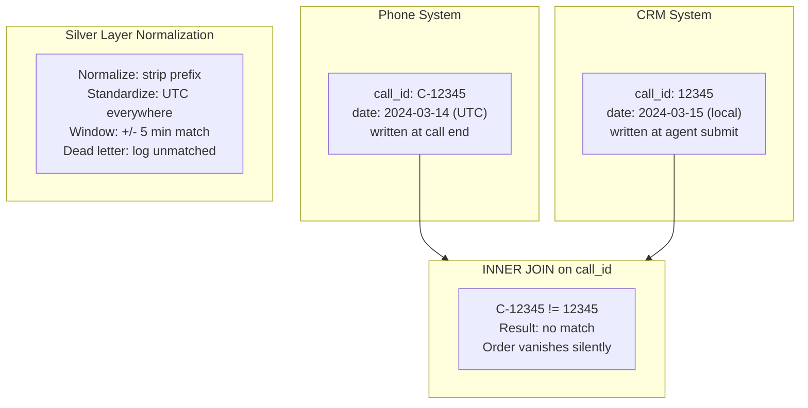

# Why Cross-System Joins Silently Drop Records

## What Happened

Two systems. The phone system tracks calls. The CRM tracks orders. The business question: "How many calls resulted in an order?"

The data:
- Phone system: 510 calls
- CRM: 78 orders
- Expected matched: ~78 (every order should trace back to a call)
- Actual matched with INNER JOIN: 61

Seventeen orders vanished. No error. No warning. The query ran, returned 61 rows, and everyone moved on.

Nobody noticed for three weeks. When a finance analyst reconciled monthly revenue against call-attributed revenue, the numbers didn't match. $43K in orders had no associated call. The orders existed. The calls existed. The JOIN couldn't find each other.

## Why It Happened

Three independent causes, all silent.

### 1. Identifier format mismatch

The phone system stores call IDs as `C-12345`. The CRM stores the same call as `12345`. No prefix.

```sql
-- This returns 61 rows, not 78
SELECT *
FROM calls c
INNER JOIN orders o ON c.call_id = o.call_id
```

The JOIN is syntactically correct. It runs without error. It silently drops every record where the format doesn't match. No warning, no log entry, no dead letter queue. Just missing rows.

### 2. Timezone boundary misalignment

A customer calls at 11:58 PM UTC on March 14. The call ends at 12:03 AM UTC on March 15. The agent submits the order at 12:01 AM UTC.

The phone system records the call date as March 14 (call start). The CRM records the order date as March 15 (submission time). A date-based JOIN looking for same-day matches misses it.

This affected 6 of the 17 missing records. All were calls that crossed midnight UTC.

### 3. Eventual consistency gap

The phone system writes the call record when the call ends. The CRM writes the order when the agent clicks submit. There's a 15-45 second gap.

The nightly ETL runs at 11:59 PM. A call that ended at 11:58 PM has a record. The order submitted at 12:00:15 AM doesn't exist yet in the CRM snapshot. Tomorrow's ETL picks up the order, but now the call is in yesterday's batch and the order is in today's batch.

This affected 4 of the 17 missing records.



### The root cause

Each system was designed independently. The phone system team chose one ID format. The CRM team chose another. Neither knew the other existed. There was no shared identifier standard, no data contract, no integration design.

The JOIN was written by a third person who assumed both systems spoke the same language. They didn't.

## What We Did

### 1. Built a normalization layer (Silver)

Before any cross-system JOIN, both datasets pass through a Silver layer that standardizes:

| Field | Phone System (Raw) | CRM (Raw) | Silver (Normalized) |
|-------|-------------------|-----------|-------------------|
| call_id | `C-12345` | `12345` | `12345` |
| timestamp | UTC | US Eastern | UTC |
| date grain | Call start | Order submit | Both preserved, JOIN on call start |

### 2. Replaced exact match with window match

Instead of `ON calls.call_id = orders.call_id`, we match on normalized ID within a time window:

```sql
SELECT *
FROM silver_calls c
LEFT JOIN silver_orders o
  ON c.call_id_normalized = o.call_id_normalized
  AND o.order_ts_utc BETWEEN c.call_end_utc
                         AND c.call_end_utc + INTERVAL '5 minutes'
```

This caught the eventual consistency cases.

### 3. Added a dead letter queue

Any record that doesn't match after normalization and windowing goes into an `unmatched_records` table with a reason code:

| reason_code | meaning |
|-------------|---------|
| `ID_NOT_FOUND` | Normalized ID exists in one system but not the other |
| `WINDOW_MISS` | ID matches but timestamps are outside the 5-minute window |
| `DUPLICATE_MATCH` | One call matched multiple orders (needs manual review) |

### 4. Built a reconciliation report

A daily report shows:
- Total records per source system
- Total matched
- Total unmatched (with reason breakdown)
- Delta from previous day

The first time we ran it, we found 23 historically unmatched records that had been silently missing from every report for months.

## What We Learned

Cross-system joins are not a SQL problem. They are a data governance problem.

The SQL was fine. The syntax was correct. The query plan was efficient. But the query was asking two systems a question that neither was designed to answer: "are you talking about the same event?"

Without shared identifier standards, timezone conventions, and sync guarantees, the answer is always "maybe."

**The pattern:**

| What teams assume | What actually happens |
|-------------------|----------------------|
| IDs are consistent across systems | Each system formats IDs differently |
| Timestamps mean the same thing | One is UTC, one is local, one is "whenever" |
| Records exist simultaneously | Eventual consistency creates temporal gaps |
| JOIN = integration | JOIN = prayer |
| Missing rows cause errors | Missing rows cause silence |

The most dangerous property of a bad cross-system JOIN is that it succeeds. It runs, returns rows, and looks correct. The missing records don't raise exceptions. They just aren't there.

The fix is not better SQL. The fix is:

1. **Identifier standards** -- one canonical format, enforced at ingestion
2. **Timezone normalization** -- one timezone (UTC), no exceptions
3. **Window matching** -- account for sync delays, don't assume simultaneity
4. **Dead letter tracking** -- if a record doesn't match, capture it and explain why
5. **Reconciliation** -- count what went in, count what came out, explain every gap
