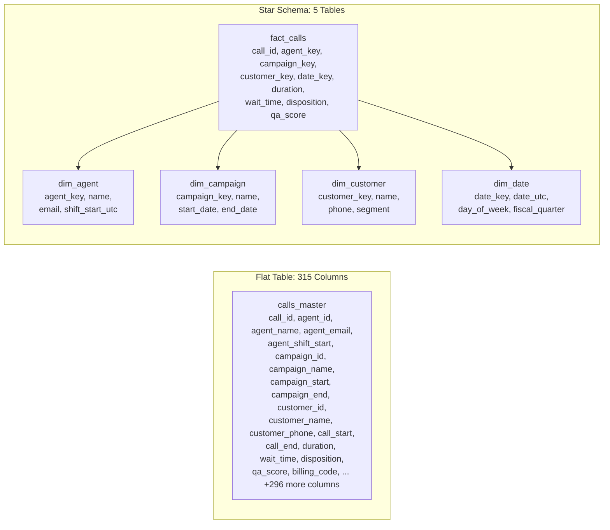

# Why Flat Tables Break at Scale

## What Happened

A production call center system stored everything in a single table: 315 columns. Call metadata, agent info, campaign data, customer details, disposition codes, timestamps, billing fields, QA scores -- all in one row.

Every analytical query joined the table to itself. The central stored procedure was 891 lines long. Three people had touched it over four years. Nobody could explain what half the CASE statements were compensating for.

Then the problems started compounding:

- **Duplicate data.** The same call appeared 3 times with different values. One row had the original disposition, one had the QA override, one had a billing correction. No version column. No way to know which was "current."
- **Timezone bugs.** `call_start_time` was UTC. `agent_shift_start` was US Eastern. `campaign_effective_date` was whatever the person who created the campaign thought "today" meant. All three lived in the same table with no indication of timezone.
- **Orphaned records.** Orders referenced calls that had been soft-deleted. The soft delete set a flag on the call but nobody updated the order. Reports showed revenue attached to calls that "didn't exist."
- **Performance degradation.** At 500K rows, queries ran in seconds. At 5M rows, the same queries took 4 minutes. At 20M rows, the nightly report didn't finish before the morning shift started.

## Why It Happened

The table was designed for the application to WRITE fast, not for humans to QUERY.

The original developer needed to capture a phone call event in one INSERT statement. One table, one row, one write. That's a perfectly valid application design choice. It optimizes for write throughput and simplicity at the application layer.

The problem is that nobody ever designed a data model. When the business needed reports, they queried the application table directly. When new features were added, new columns were added. When edge cases appeared, CASE statements were added to the stored procedure.

Over four years, the table grew from 40 columns to 315. The stored procedure grew from 80 lines to 891. The system became a machine that nobody understood but everyone depended on.

## What We Did

1. **Mapped the 315 columns** to logical groups: call facts, agent attributes, campaign attributes, customer attributes, temporal fields, QA fields, billing fields. Found 89 columns that were duplicates or derivatives of other columns.

2. **Designed a star schema.** One fact table (the call event) with foreign keys to dimension tables (agent, campaign, customer, date). The fact table had 18 columns. Total across all tables: 62 columns. Down from 315.

3. **Standardized timezones.** Every timestamp stored as UTC. Every dimension table that needed local time got a computed column. One rule, no exceptions.

4. **Built a migration pipeline.** Bronze layer ingested the raw flat table as-is. Silver layer deduplicated and normalized. Gold layer was the star schema. Ran both the old stored procedure and the new pipeline in parallel for two weeks.

5. **Validated counts.** Total calls, total revenue, calls per agent, calls per campaign -- compared old vs new. Discrepancies led us to 4 bugs in the original stored procedure that had been silently producing wrong numbers for months.

## What We Learned

The flat table wasn't the problem. The problem was that nobody understood why it existed, what it was compensating for, or what would break if you touched it.

The 891-line stored procedure wasn't incompetence. It was the accumulated scar tissue of four years of business requirements being bolted onto an application table that was never designed for analytics.

**The pattern:** This happens in every growing system. The application team builds what they need to ship. The data team inherits what was built. The gap between "what the app writes" and "what the business queries" grows until someone writes an 891-line stored procedure to bridge it.

The fix is not "normalize the database." The fix is: understand what the system is actually doing, then design a model that makes it queryable.

| Signal | What It Tells You |
|--------|-------------------|
| Table has >50 columns | Application table being used for analytics |
| Self-joins in queries | Missing dimensions -- the table is playing multiple roles |
| CASE statements >20 lines | Compensating for missing data model |
| "Nobody touch that proc" | Tribal knowledge is the only documentation |
| Duplicate rows with different values | No versioning strategy, no SCD |
| Mixed timezones in one table | No data contract, no standards |

The star schema isn't the only answer. But the question -- "what is this system actually doing, and what model makes it queryable?" -- always is.
