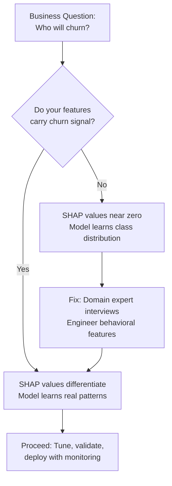

# Why ML Models Fail When Features Don't Carry Signal

## What Happened

A team built a churn prediction model for a call center. The goal: identify customers likely to cancel within 30 days so the retention team could intervene.

They pulled every field they had: call duration, wait time, number of calls, campaign source, agent handle time, time of day. They trained a gradient boosted classifier. Accuracy: 85%.

Leadership saw 85% and approved deployment. The model went into production. The retention team started calling the flagged customers.

Nothing happened. Churn rate didn't move.

When we audited the model, the numbers told the real story:

| Metric | Value |
|--------|-------|
| Accuracy | 85% |
| Precision (churn class) | 0.31 |
| Recall (churn class) | 0.08 |
| F1 (churn class) | 0.12 |
| Class distribution | 88% non-churn / 12% churn |

The model had learned to predict "not churn" for almost everyone. That gets you 88% accuracy on an 88/12 split. It's a coin flip dressed up as a model.

## Why It Happened

The features didn't carry churn signal. They carried call characteristics.

The model learned things like:
- Long calls are not churn (true, but useless -- long calls mean the customer is engaged)
- Calls during business hours are not churn (true, but that's just when everyone calls)
- Customers from Campaign A have lower churn (true, but that's because Campaign A targets enterprise accounts with multi-year contracts)

Every feature described what happened during a call. None described the behavioral pattern that precedes churn.

The SHAP analysis made this visible:

```
Feature                  | Mean |SHAP| for churn class
-------------------------|---------------------------
call_duration            | 0.003
wait_time                | 0.002
campaign_id              | 0.008
agent_handle_time        | 0.001
time_of_day              | 0.001
num_calls_last_30_days   | 0.011
```

Near-zero SHAP values across the board. The model had nothing to work with.

The team made the mistake that most ML teams make: they started with available data instead of domain understanding. They never asked "what actually causes a customer to leave?"

## What We Did

We went back to the domain experts -- the retention team leads who had been doing this manually for years.

They told us what they watch for:

1. **Frequency decline.** A customer who called weekly is now calling monthly. The gap is widening.
2. **Sentiment shift.** The last 3 calls had escalation requests. Tone changed.
3. **Resolution failure.** Customer called about the same issue 3 times. Still unresolved.
4. **Contract timing.** 60 days before renewal. This is when competitors make offers.
5. **Payment behavior.** Late payments after a history of on-time payments.

None of these signals existed as columns in the raw data. Every one of them required feature engineering:

| Raw Data | Engineered Feature | Why It Matters |
|----------|-------------------|----------------|
| Call timestamps | `days_since_last_call` | Frequency decline |
| Call timestamps | `call_frequency_trend_30d` | Acceleration/deceleration |
| Disposition codes | `unresolved_issue_count` | Resolution failure |
| Disposition codes | `escalation_rate_90d` | Sentiment proxy |
| Contract dates | `days_to_renewal` | Competitive vulnerability window |
| Payment records | `payment_delay_trend` | Financial disengagement signal |

We rebuilt the model with these engineered features. Same algorithm (gradient boosted classifier). Same data volume.

| Metric | Before | After |
|--------|--------|-------|
| Accuracy | 85% | 79% |
| Precision (churn) | 0.31 | 0.64 |
| Recall (churn) | 0.08 | 0.52 |
| F1 (churn) | 0.12 | 0.57 |

Accuracy went down. Every metric that mattered went up. The model was now catching more than half of actual churners with reasonable precision. The retention team had actionable leads.

## What We Learned

Better features beat better algorithms. A random forest on good features outperforms a neural network on bad features. Feature engineering is a domain problem, not an ML problem.



**The pattern:** Most ML failures are feature failures, not model failures.

The team had good data engineering skills. They could build pipelines, train models, tune hyperparameters. What they couldn't do was answer the question: "what signal in this data predicts the outcome I care about?"

That question is not answered by GridSearchCV. It's answered by sitting with the people who understand the domain and asking: "what do you look for?"

| Symptom | Likely Cause |
|---------|-------------|
| High accuracy, low F1 on minority class | Model learned class distribution, not signal |
| SHAP values near zero across features | Features don't carry signal for the target |
| Model performs well on test set, fails in production | Leakage or proxy features that don't generalize |
| Team tuning hyperparameters for weeks | The problem is features, not the model |
| No domain expert involved in feature selection | Features describe data shape, not business behavior |

The fix is never "try a different algorithm." The fix is: understand the domain, identify what signals predict the outcome, engineer features that capture those signals, then train any reasonable model.

The algorithm is the least important part of the system.
