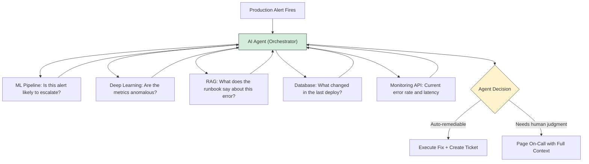
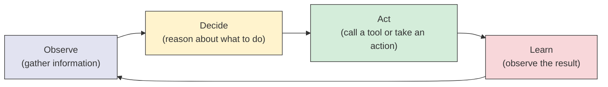

# AI Agents - Why They Matter

**The difference between AI that ANSWERS and AI that ACTS.**

---

## The 2 AM Production Alert

It is 2:17 AM. A production alert fires. The order-service is returning 500 errors. Customer orders are failing.

**Without an agent (today's reality):**

1. PagerDuty wakes up an on-call engineer
2. The engineer opens a laptop, logs into the monitoring dashboard
3. Checks error rates, finds the failing service
4. Opens the logs, searches for the error message
5. Queries the database to check connection pool status
6. Opens Confluence, searches for the runbook
7. Follows the runbook steps (restart the service, increase the pool size)
8. Creates a Jira ticket documenting what happened
9. Goes back to sleep at 3:45 AM

Total time: 90 minutes. Total human effort: 90 minutes.

**With an agent:**

1. The alert triggers the agent
2. The agent checks the monitoring dashboard (API call)
3. The agent queries the logs (tool call)
4. The agent searches the runbook via RAG (Retrieval-Augmented Generation) (tool call)
5. The agent finds the relevant fix, executes the remediation steps
6. The agent creates a ticket with full diagnostics
7. The agent pages the human ONLY if the fix requires approval or fails

Total time: 4 minutes. Total human effort: 0 minutes (or 2 minutes if approval is needed).

The AI did not just ANSWER a question. It ACTED on the answer. That is the difference.

---

## AI That Answers vs. AI That Acts

| Capability | AI That Answers | AI That Acts (Agent) |
|---|---|---|
| Input | A question | A goal |
| Output | Text | Actions + results |
| Example | "What is the fix for connection pool exhaustion?" | Detect the issue, find the fix, apply the fix, verify it worked, document it |
| Interaction | Single turn: you ask, it answers | Multi-step: it reasons, decides, acts, observes, repeats |
| Tools | None -- uses only its training data | Calculator, database, search, API calls, file system, RAG retrieval |
| Autonomy | Zero -- waits for your next question | Operates independently within defined boundaries |

A chatbot answers. An agent acts. That is the frontier.

---

## Why Agents Are the Frontier of AI

The history of AI capability:

```
2020: AI can generate text (GPT-3)
2022: AI can follow instructions (ChatGPT)
2023: AI can use tools (function calling)
2024: AI can reason through multi-step problems (ReAct, chain-of-thought)
2025: AI can orchestrate multiple specialized agents (multi-agent systems)
```

Each step added a new capability. Agents are the step where AI stops being a sophisticated search engine and starts being a collaborator that can DO things.

This is not science fiction. Every major platform is shipping agents:

| Company | Agent Product | What It Does |
|---|---|---|
| GitHub | Copilot Workspace | Reads an issue, plans the code changes, writes PRs |
| Google | Gemini in Workspace | Reads your emails, drafts responses, schedules meetings |
| Anthropic | Claude with tool use | Searches the web, writes code, executes it, analyzes results |
| Microsoft | Copilot Studio | Builds custom agents that connect to enterprise systems |
| Salesforce | Einstein Copilot | Queries CRM data, creates records, generates reports |

These are not demos. These are production systems used by millions of people.

---

## What Agents Enable for Humanity

The deeper question is not "what can agents do?" but "what do agents free humans to do?"

**Repetitive diagnostic work is a tax on expertise.** A senior SRE (Site Reliability Engineer, pronounced "S-R-E") spends 60% of their time on tasks that follow a pattern: check this, query that, compare against the runbook, escalate if X. The remaining 40% is judgment: "This looks like the incident from March, but the traffic pattern is different. We should NOT follow the standard runbook here."

Agents handle the 60%. Humans focus on the 40%.

| Domain | What the Agent Does | What the Human Does |
|---|---|---|
| Production operations | Detects anomalies, gathers diagnostics, follows runbooks | Decides whether the runbook applies to this specific situation |
| Customer support | Retrieves order history, drafts responses, routes tickets | Handles the angry customer whose situation is genuinely unique |
| Code review | Checks style, runs tests, identifies common bugs | Reviews the architecture decision that no linter can evaluate |
| Medical triage | Reviews symptoms, checks drug interactions, prepares briefing | Makes the diagnosis and treatment decision |
| Legal research | Searches case law, extracts relevant precedents, summarizes | Builds the legal argument that synthesizes the precedents |

In every case, the agent removes the repetitive work. The human does the work that requires judgment, creativity, and accountability.

---

## Where Agents Fit in Production Systems

Agents are not standalone. They are the **orchestration layer** that ties other AI components together.

In the Production Diagnostic Intelligence System:



The ML (Machine Learning) model predicts. The DL (Deep Learning) model detects. RAG retrieves. The database provides facts. The agent **decides what to do with all of it.**

Without the agent, each component is useful but isolated. The ML model flags "this alert will likely escalate" -- but nobody sees it until they manually check the dashboard. RAG finds the runbook section -- but only when someone asks the right question. The agent connects these components into a coherent workflow: detect, diagnose, decide, act.

See the full architecture: [Production Diagnostics Architecture](../../systems/production-diagnostics/architecture.md)

---

## The Pattern: Observe, Decide, Act, Learn

Every agent, from the simplest to the most complex, follows the same pattern:



1. **Observe:** The agent gathers information (reads the alert, queries the logs, searches the runbook)
2. **Decide:** The agent reasons about what to do next (the LLM generates a thought and chooses an action)
3. **Act:** The agent calls a tool (runs a query, makes an API call, executes a command)
4. **Learn:** The agent observes the result of its action and feeds it back into the next reasoning step

This loop repeats until the agent has enough information to give a final answer or complete the task. It might loop 2 times (simple question) or 15 times (complex investigation).

This is not new. This is how human experts work. The agent just does it faster, at 2 AM, without getting tired.

---

## What You Will Learn in This Material

| Chapter | What You Learn |
|---|---|
| [01 - Why](01_Why.md) | This page. Why agents matter. |
| [02 - Concepts](02_Concepts.md) | Agent architecture, ReAct pattern, tools, memory. In plain English. |
| [03 - Hello World](03_Hello_World.md) | Build a working agent in ~30 lines of Python. |
| [04 - How It Works](04_How_It_Works.md) | The ReAct loop in detail. How tool calling works under the hood. |
| [05 - Decisions](05_Decisions.md) | LLM choice, framework choice, single vs multi-agent. Every tradeoff. |
| [06 - Real World](06_Real_World.md) | How GitHub Copilot, Devin, and enterprise systems use agents in production. |
| [07 - System Design](07_System_Design.md) | Scaling agents: state management, fault tolerance, human-in-the-loop. |
| [08 - Security](08_Security.md) | Prompt injection, tool misuse, permission boundaries, sandboxing. |
| [09 - Observability](09_Observability.md) | Tracing agent reasoning, measuring tool call success, cost monitoring. |
| [10 - Checklist](10_Checklist.md) | "Should I use an agent?" decision table. Production readiness checklist. |

**Hands-on notebook:** [Agents on Colab](https://colab.research.google.com/github/sunilmogadati/systems-in-production/blob/main/implementation/notebooks/AI_Engineer_Accelerator_Agents.ipynb) -- builds ReAct agents from scratch, then with LangChain, then multi-agent with LangGraph. All running locally with Ollama, no API keys needed.

**Production architecture:** [Production Diagnostics Architecture](../../systems/production-diagnostics/architecture.md)
