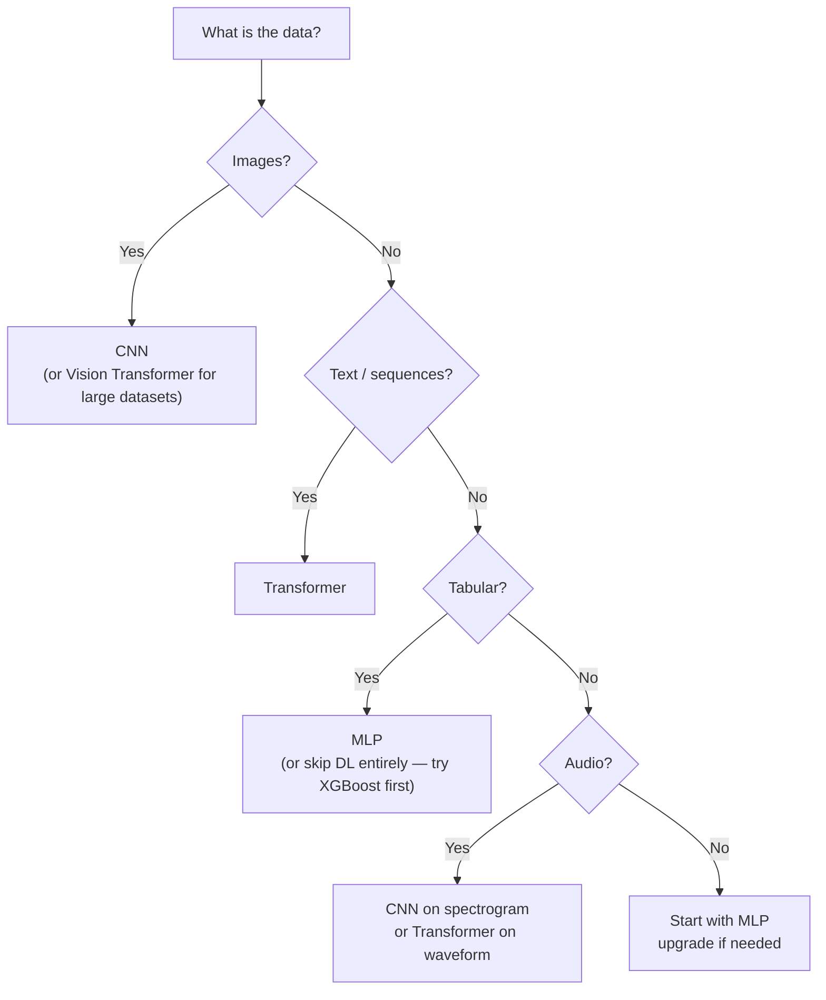
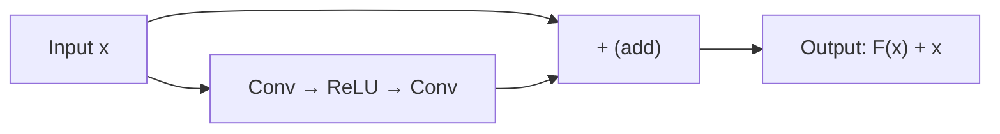

# Deep Learning — Decisions

**Every architectural choice in a deep learning project, with tradeoffs.**

---

## The Principle

Deep learning has no "best" configuration. Every choice — architecture, activation function, optimizer, batch size, regularization — is a tradeoff. The right choice depends on the data, the problem, and the constraints (latency budget, compute budget, explainability requirements).

This chapter is a decision reference. Each section presents a choice, the options, the tradeoffs, and a default recommendation. Start with the default. Deviate when the diagnostics (the previous chapter) tell a specific story.

---

## Decision 1: Do I Need Deep Learning at All?

This is the most important decision — and the one most often skipped.

| Data Type | Recommended Approach | Why |
|:---|:---|:---|
| **Tabular** (spreadsheet — rows, columns, structured features) | scikit-learn: Random Forest, XGBoost, LightGBM | Tree-based models consistently match or beat DL on tabular data. Faster to train, easier to explain, cheaper to serve. |
| **Images** (photos, X-rays, satellite, video frames) | Deep learning: CNN or Vision Transformer | Spatial patterns (edges, textures, shapes) that tabular models cannot represent. |
| **Text** (sentences, documents, code, conversations) | Deep learning: Transformer | Language has context, word order, long-range dependencies. Transformers (covered in the Transformer concepts material) handle this. |
| **Audio** (speech, music, environmental sounds) | Deep learning: CNN on spectrograms or Transformer | Sound is sequential and layered — similar structure to images (spectrograms) or text (waveforms). |
| **Already solved** by a pre-trained model (GPT, Claude, Whisper, CLIP) | Use the pre-trained model via API (Application Programming Interface) | Training from scratch when a foundation model already solves the problem is wasted engineering. Fine-tuning (the Fine-Tuning concepts material) is the middle ground. |
| **Small dataset** (fewer than 1,000 labeled examples per class) | Start with simpler ML. Consider transfer learning if DL is required. | DL with insufficient data overfits immediately. Transfer learning (using a pre-trained model's learned features) mitigates this. |

> **The rule:** The simplest model that meets the performance requirement wins. Complexity has costs — training time, serving cost, debugging difficulty, explainability gaps. Only add complexity when simpler approaches have been tried and measured.

---

## Decision 2: Which Architecture?

| Architecture | Pronounced | Best For | Key Idea | Parameter Efficiency |
|:---|:---|:---|:---|:---|
| **MLP** (Multi-Layer Perceptron) | "M-L-P" | Tabular data, small structured inputs | Every input connects to every neuron. No spatial or sequential structure assumed. | Low — many redundant connections |
| **CNN** (Convolutional Neural Network) | "C-N-N" | Images, spatial data | Small filters slide across the input detecting local patterns. Same filter works everywhere — **weight sharing.** | High — filters are shared across positions |
| **Transformer** | "trans-FORM-er" | Text, sequences, increasingly images (Vision Transformer) | **Attention mechanism** — every element can attend to every other element, regardless of distance. Covered in the Transformer concepts material. | Moderate to low (attention is O(n²) in sequence length) |
| **RNN/LSTM** (Recurrent Neural Network / Long Short-Term Memory) | "R-N-N" / "L-S-T-M" | Sequential data (time series, older NLP) | Processes elements one at a time, maintaining a hidden state. Largely replaced by Transformers for most tasks. | High, but struggles with long sequences |

### How to Choose

---

## Decision 3: Which Activation Function?

| Location in Network | Default Choice | Alternatives | When to Deviate |
|:---|:---|:---|:---|
| **Hidden layers** | **ReLU** ("REE-loo") | Leaky ReLU, ELU ("EE-loo"), GELU ("GEE-loo") | If many neurons are "dying" (always outputting zero) → switch to Leaky ReLU. If building a Transformer → use GELU (standard in GPT, BERT, Claude). |
| **Output layer — multi-class** (which of N classes?) | **Softmax** ("SOFT-max") | — | Almost never deviate. Note: `nn.CrossEntropyLoss` applies softmax internally — do NOT add softmax explicitly before it. |
| **Output layer — binary** (yes or no?) | **Sigmoid** ("SIG-moyd") | — | Almost never deviate. |
| **Output layer — regression** (predict a number) | **None** (raw linear output) | ReLU if output must be non-negative | Only constrain the output if the problem demands it (e.g., predicting a price — cannot be negative). |

### The Vanishing Gradient Problem (Why Sigmoid/Tanh Fail in Deep Networks)

Sigmoid and tanh squash their inputs into narrow ranges (0-1 and -1 to +1). In deep networks (10+ layers), backpropagation multiplies gradients through every layer. If each layer's gradient is small (as sigmoid/tanh produce for extreme inputs), the product shrinks exponentially. By the time the correction signal reaches Layer 1, it is effectively zero. The early layers stop learning.

ReLU's gradient is either 0 or 1 — no shrinkage. That is why it became the default for hidden layers and why deep networks (50, 100, 1000+ layers) became possible.

---

## Decision 4: Which Loss Function?

| Problem | Loss Function | Pronounced | Why This One |
|:---|:---|:---|:---|
| **Multi-class classification** | `nn.CrossEntropyLoss()` | "cross EN-truh-pee" | Penalizes confident wrong predictions heavily. The standard for classification. |
| **Binary classification** | `nn.BCEWithLogitsLoss()` | "B-C-E with logits" | Binary cross-entropy with numerical stability built in. |
| **Regression** | `nn.MSELoss()` | "M-S-E" | Squared error penalizes large mistakes. Good default. |
| **Regression (with outliers)** | `nn.L1Loss()` | "L-1" | Absolute error. Less sensitive to outliers than MSE. |
| **Regression (balanced)** | `nn.SmoothL1Loss()` | "smooth L-1" | Combines MSE (for small errors) and L1 (for large errors). Used in object detection. |

**Mismatching loss to problem** is a silent bug. Using MSE for classification technically runs — but the gradients point in unhelpful directions and training is slow and poor. Using cross-entropy for regression produces errors immediately. Always match the loss to the problem type.

---

## Decision 5: Which Optimizer?

| Situation | Optimizer | Learning Rate | Why |
|:---|:---|:---|:---|
| **Default for everything** | **Adam** | 0.001 | Adapts per-weight. Works well out of the box for 90% of problems. |
| **Fine-tuning a pre-trained model** | **AdamW** | 0.0001 - 0.00001 | Proper weight decay prevents catastrophic forgetting. Lower LR because the model is already close to a good solution. |
| **Squeezing last % of performance** | **SGD + Momentum** | 0.01 - 0.1 + scheduler | SGD with a learning rate schedule often finds a slightly better final solution than Adam, but requires more tuning. |
| **Very large model / Transformer training** | **AdamW** | Warmup + cosine decay | Standard for Transformer pre-training. Warmup avoids instability in early steps. |

> **Start with Adam at 0.001.** Change only when the diagnostics give a specific reason to.

---

## Decision 6: How to Prevent Overfitting?

Regularization techniques, ordered by ease of implementation and typical impact:

| Technique | Effort | Impact | When to Use |
|:---|:---|:---|:---|
| **Data augmentation** (flip, rotate, crop, color jitter) | Low — add 2 lines to the data transform | High — most effective single technique for image tasks | Always, for images. No reason not to. |
| **Dropout** (randomly zero neurons during training) | Low — add `nn.Dropout(0.25)` between layers | Medium to high | When the train-test gap is growing. Start with 0.25 for conv layers, 0.5 for fully connected. |
| **Early stopping** (stop when test loss stops improving) | Low — track test loss, save best weights | Medium | Always. There is no reason to train past the point of diminishing returns. |
| **Batch normalization** | Low — add `nn.BatchNorm2d()` after conv layers | Medium (also speeds up training) | Almost always for CNNs. |
| **Weight decay** (L2 penalty on weights) | Low — set `weight_decay=0.01` in the optimizer | Low to medium | Standard for fine-tuning. Built into AdamW. |
| **Reduce model size** | Medium — change architecture | Variable | Last resort. Try regularization first — a larger regularized model usually beats a smaller unregularized one. |
| **Get more data** | High — often the hardest and most expensive option | Highest — more data is always the best regularizer | When budget allows. Synthetic data generation (covered in the Fine-Tuning concepts material) is an alternative. |

### The Order of Operations for Overfitting

1. Add data augmentation (if images)
2. Add dropout
3. Add early stopping
4. If still overfitting → add batch normalization
5. If still overfitting → reduce model size OR get more data

Do not reduce model size before trying regularization. A large model with dropout and augmentation almost always outperforms a small model without them.

---

## Decision 7: CNN Architecture Depth

| Network Depth | When Appropriate | Accuracy Range (CIFAR-10) | Training Time |
|:---|:---|:---|:---|
| **2-4 conv layers** (simple CNN) | First attempt. Small datasets (<10K). Prototyping. | 70-78% | Minutes |
| **10-20 layers** (VGG-style) | Medium datasets. Good baseline. | 80-90% | 10-30 min on GPU |
| **50-150 layers** (ResNet) | Large datasets. State-of-the-art pursuit. Requires **residual connections** (skip connections that let gradients flow past layers). | 93-96% | Hours on GPU |
| **Pre-trained model** (transfer learning) | Almost always the right choice if a pre-trained model exists for the domain | 95%+ with minimal training | Minutes (only fine-tune last layers) |

**The principle:** Do not start deep. Start simple (2-4 conv layers). Measure. If underfitting, go deeper. If already good enough, stop. The goal is the simplest architecture that meets the requirement — not the most impressive one.

### Residual Connections (Skip Connections) — Why Very Deep Networks Work

Networks deeper than ~20 layers have a problem: the gradient signal degrades as it passes through dozens of layers, even with ReLU. Training stalls.

**ResNet (Residual Network)** solved this with a simple trick: add a shortcut that lets the input skip past a block of layers and add directly to the output.

Instead of the layer learning the full transformation, it only learns the **residual** — the difference between the input and the desired output. If the layer has nothing useful to add, the shortcut lets the input pass through unchanged. This makes training 100+ layer networks practical.

This same idea — residual connections — appears in Transformers, and is one of the reasons Transformers can be trained with billions of parameters.

---

## Decision 8: Transfer Learning vs Training from Scratch

| Approach | When to Use | Effort | Data Required |
|:---|:---|:---|:---|
| **Train from scratch** | Unique domain (satellite imagery, medical scans with unusual modalities). No pre-trained model exists. Large dataset available. | High | 10,000+ examples |
| **Fine-tune a pre-trained model** | Pre-trained model exists for a related domain (ImageNet for photos, BERT for text). Smaller dataset. | Medium | 100-5,000 examples |
| **Use a pre-trained model as-is (via API)** | The pre-trained model already solves the exact problem. | Low | 0 (just call the API) |

**Default:** Fine-tune. Unless the domain is truly unique, a pre-trained model's learned features (edges, shapes, textures for images; grammar, meaning for text) transfer to the new task. This is covered in depth in the Fine-Tuning concepts material.

---

## Decision Summary — One Table

| Decision | Default | Deviate When |
|:---|:---|:---|
| DL vs simpler ML? | Simpler first | Data is images, text, audio at scale |
| Architecture? | CNN for images, Transformer for text | MLP for tabular, pre-trained if available |
| Activation (hidden)? | ReLU | Dead neurons → Leaky ReLU. Transformer → GELU. |
| Activation (output)? | Softmax (multi-class), Sigmoid (binary), None (regression) | Almost never deviate |
| Loss? | CrossEntropy (classification), MSE (regression) | Outliers → L1. Binary → BCEWithLogitsLoss. |
| Optimizer? | Adam, lr=0.001 | Fine-tuning → AdamW, lower lr. Competition → SGD + scheduler. |
| Regularization? | Augmentation + Dropout + Early stopping | Severe overfitting → add BatchNorm, weight decay. |
| Depth? | Start simple (2-4 layers). Deepen only if underfitting. | Complex data + large dataset → ResNet / pre-trained. |
| Train from scratch? | Fine-tune a pre-trained model | Unique domain + large dataset → train from scratch. |

---

**Next:** [06 — Real World](06_Production_Patterns.md) — How companies deploy deep learning in production. Tesla, Google Health, Midjourney — the architectures behind real products.
