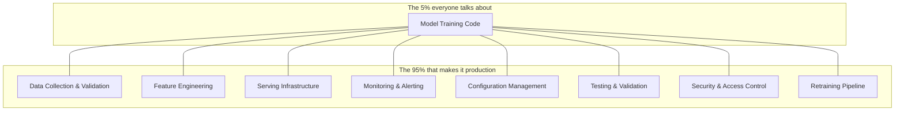

# Deep Learning — Real World

**How deep learning works in production systems that serve millions of users.**

---

## The Gap Between a Notebook and a Product

A model in a Jupyter notebook answers one question at a time, on a laptop, with no users. A production system answers thousands of questions per second, across multiple data centers, with SLAs (Service Level Agreements — contractual promises of uptime, latency, and accuracy), monitoring, fallback, security, and compliance.

The model architecture is usually the smallest part of the production system. Google estimates that ML code accounts for roughly 5% of a real-world ML system. The other 95% is data collection, data verification, feature engineering, configuration, serving infrastructure, monitoring, and testing.

---

## Case Study 1: Medical Imaging — Google Health Retinal Screening

**What it does:** Detects diabetic retinopathy from retinal photographs. Deployed in clinics across Thailand and India.

**Architecture:**
- **Model:** Inception-v3 CNN, trained on 128,000 retinal images labeled by ophthalmologists
- **Serving:** The model runs on a mobile device or edge server at the clinic — not in the cloud. Latency budget: under 30 seconds including image capture.
- **Data pipeline:** Images captured by specialized retinal cameras, preprocessed (cropped, normalized, quality-checked) before inference
- **Evaluation:** Validated against a panel of 7 ophthalmologists per image. The model's sensitivity and specificity had to match or exceed the panel before deployment approval.
- **Governance:** Regulatory approval (FDA equivalent in each country). Model versioning — every deployed model is traceable to its training data and hyperparameters. Bias auditing across demographics (age, sex, ethnicity).

**The engineering lesson:** The CNN is a standard architecture. The delivery system around it — data capture, edge serving, regulatory compliance, bias auditing, clinical workflow integration — is where the engineering effort lives.

---

## Case Study 2: Autonomous Driving — Tesla Autopilot

**What it does:** Processes camera feeds in real time to detect lanes, vehicles, pedestrians, traffic signs, and make driving decisions.

**Architecture:**
- **Model:** Multiple CNNs processing 8 cameras simultaneously. HydraNet architecture — shared backbone (feature extraction), separate heads per task (lane detection, object detection, depth estimation).
- **Serving:** Runs on a custom chip (Tesla FSD Computer) inside the vehicle. No cloud dependency — the car must work without internet.
- **Latency:** Under 50ms per frame. At 60 mph, the car travels 4.4 feet in 50ms. Late inference is dangerous.
- **Data pipeline:** Fleet learning — millions of Tesla vehicles upload driving data. Edge cases (unusual scenarios) are flagged and sent to the training pipeline. The model improves from real-world experience across the entire fleet.
- **Monitoring:** Shadow mode — the model runs alongside human driving and its decisions are compared to the human's. Disagreements are logged and analyzed. The model is only deployed autonomously when shadow-mode metrics meet thresholds.
- **Redundancy:** Multiple models with different architectures process the same input. Disagreements trigger conservative behavior (slow down, alert the driver).

**The engineering lesson:** The model is one component in a system that includes real-time hardware, fleet data collection, shadow-mode validation, and multi-model redundancy. The architecture decision (HydraNet with shared backbone) was driven by latency constraints on embedded hardware — not by accuracy alone.

---

## Case Study 3: Image Generation — Midjourney / Stable Diffusion

**What it does:** Generates images from text descriptions. "A medieval castle on a cliff at sunset, oil painting style" → a photorealistic or artistic image.

**Architecture:**
- **Model:** Diffusion model (covered in the generative models survey in the Concepts chapter). Trained on billions of image-text pairs.
- **Serving:** GPU-intensive inference. A single image generation takes 5-60 seconds on a high-end GPU. Serving at scale requires GPU clusters (hundreds to thousands of GPUs).
- **Cost:** Generating one image costs $0.01-0.10 in GPU compute. At millions of images per day, infrastructure costs are substantial.
- **Prompt engineering:** The quality of the output depends heavily on the prompt. Production systems add prompt preprocessing — expanding vague prompts, adding style hints, applying safety filters before generation.
- **Safety:** Content moderation before AND after generation. Input filters block requests for harmful content. Output filters scan generated images using a separate classifier trained on harmful content categories.
- **IP and Governance:** Training data sourcing (which images were used? were they licensed?), copyright claims on generated content, watermarking to identify AI-generated images.

**The engineering lesson:** The diffusion model is the core, but the production system includes prompt preprocessing, GPU orchestration, cost management, content safety (both input and output), and governance around training data provenance. None of this is in the model code.

---

## Case Study 4: Industrial Quality Control — Manufacturing

**What it does:** Inspects products on an assembly line using cameras. Detects defects (scratches, cracks, misalignments, missing components) at production speed.

**Architecture:**
- **Model:** Lightweight CNN (MobileNet or EfficientNet) optimized for edge deployment on industrial cameras
- **Serving:** Edge inference on the factory floor. No cloud — latency must be under 100ms per part, and the factory cannot depend on internet connectivity.
- **Data challenge:** Defective parts are rare (0.1-2% of production). Severe class imbalance. Solutions: synthetic defect generation, oversampling, focal loss (a loss function that focuses learning on the rare defect cases).
- **Monitoring:** Continuous accuracy tracking. If the model's defect detection rate drops below threshold, it triggers an alert and the human inspector takes over until the model is retrained.
- **Retraining:** When a new product line starts or the manufacturing process changes, the model must be retrained on new data. Automated retraining pipelines trigger on data distribution drift.

**The engineering lesson:** The model is small and fast (edge deployment). The system complexity is in handling class imbalance, continuous monitoring, automated retraining, and seamless fallback to human inspection.

---

## Common Production Patterns

Across all four case studies, the same patterns appear:

| Pattern | What It Means | Why It Matters |
|:---|:---|:---|
| **Edge vs Cloud serving** | Some models run on-device (Tesla, factory cameras), others in the cloud (Midjourney). The decision depends on latency, connectivity, and data privacy. | Medical images in a rural clinic cannot depend on cloud connectivity. Image generation requires GPU clusters only available in the cloud. |
| **Shadow mode / A/B testing** | The new model runs alongside the old one. Both produce predictions, but only the old one is used for decisions. The new model is compared silently. | Deploying a new model without shadow testing risks regressions. Shadow mode catches problems before they reach users. |
| **Monitoring + automated fallback** | Continuous tracking of accuracy, latency, and input distribution. If metrics degrade, the system falls back to a previous model version or a human. | Models degrade silently. Without monitoring, a broken model serves bad predictions for weeks before anyone notices. |
| **Retraining pipeline** | Automated system that detects data drift, triggers retraining on fresh data, validates the new model, and deploys it — without human intervention. | Real-world data changes. A model trained on 2024 data slowly becomes wrong in 2025 as user behavior, products, and language shift. |
| **Content safety / guardrails** | Input validation (block harmful requests) + output validation (check generated content) + audit trail | Regulatory requirement for medical and financial AI. Ethical requirement for generative AI. Legal requirement in the EU (AI Act) and increasingly in the US. |
| **Model versioning** | Every deployed model is traceable to its training data, hyperparameters, training code, and evaluation results. | When something goes wrong in production, the first question is "which model version is serving?" and the second is "what was it trained on?" Without versioning, debugging is impossible. |

---

## The Cost Question

| Component | Notebook (Free) | Production (Real Money) |
|:---|:---|:---|
| **Training** | Your laptop, free Colab GPU | Cloud GPU instances: $1-30/hour. Training a large model: $100-$100,000+. |
| **Serving** | `model(input)` in a cell | GPU instances for inference: $0.50-10/hour. Or CPU inference (slower, cheaper). |
| **Storage** | A `.pth` file on your laptop | Model registry, data lake, vector databases: $50-500/month |
| **Monitoring** | Print statements | Observability platform (Datadog, Grafana, custom): $100-1,000/month |
| **Total for a small deployment** | $0 | $500-5,000/month depending on traffic |

Cost optimization is an engineering skill. Techniques covered in the LLMOps and System Design chapters: model quantization (reducing weight precision from 32-bit to 8-bit — 4x less memory, minimal accuracy loss), batching inference (process multiple requests together — better GPU utilization), caching (return stored results for repeated queries), and auto-scaling (spin up GPUs only when traffic demands it).

---

## The Architecture Questions an Interviewer Asks

These are the questions that separate "I trained a model" from "I can build a system":

1. "How would you deploy this model to serve 10,000 requests per second?"
2. "The model's accuracy dropped 5% over the last month. No code changed. What happened?"
3. "How do you decide between running inference on the edge versus in the cloud?"
4. "How would you handle a case where the model makes a dangerous prediction?" (Medical, autonomous driving)
5. "Walk me through your retraining pipeline. How do you know when to retrain?"
6. "How do you validate a new model version before deploying it to production?"

The answers to all of these are in this chapter and the System Design chapter that follows.

---

**Next:** [07 — System Design](07_System_Design.md) — Scalability, distributed training, cloud deployment, CI/CD for ML, and the infrastructure patterns behind production deep learning.
