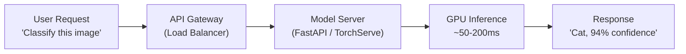
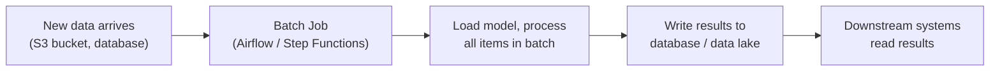
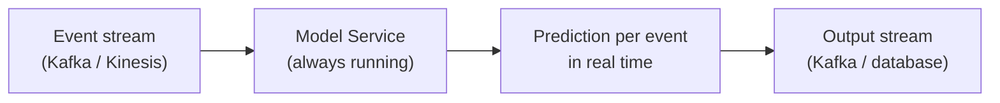
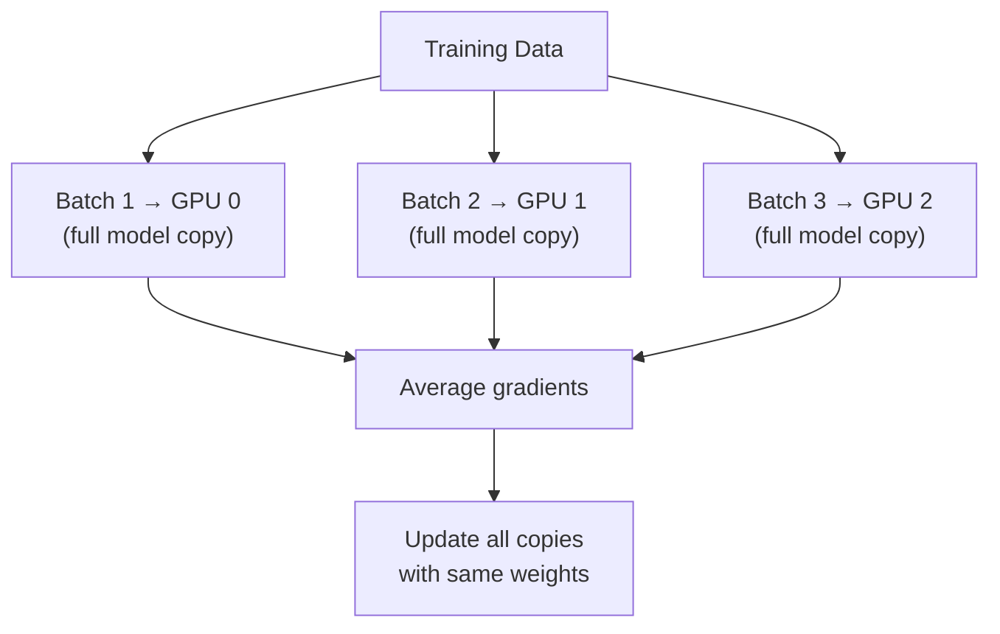
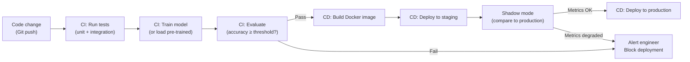

# Deep Learning — System Design

**Scalability, distributed training, cloud deployment, and the infrastructure behind production deep learning.**

---

## The System, Not Just the Model

A trained model is a file. Serving that model to users requires a system: APIs, load balancers, GPU management, auto-scaling, CI/CD (Continuous Integration / Continuous Delivery — automated pipelines that test and deploy code), monitoring, storage, and orchestration.

This chapter covers the infrastructure patterns. These same patterns apply whether serving a CNN image classifier, a RAG pipeline, or an LLM (Large Language Model) agent. The model changes; the infrastructure does not.

---

## Serving Architectures

How does a prediction get from the model to the user?

### Pattern 1: Real-Time Serving (Synchronous)



- **Use when:** User is waiting for the response. Chatbots, search, image classification, real-time recommendations.
- **Latency target:** <200ms for web apps, <50ms for safety-critical (autonomous driving).
- **Stack:** FastAPI + TorchServe or NVIDIA Triton, behind an API gateway (AWS API Gateway, Kong, or Nginx).

### Pattern 2: Batch Inference (Asynchronous)



- **Use when:** No user is waiting. Nightly reports, bulk classification, recommendation pre-computation, fraud scoring.
- **Latency target:** Minutes to hours. Throughput matters more than latency.
- **Stack:** Airflow or AWS Step Functions triggering a batch job on a GPU instance. Results written to S3 / BigQuery / PostgreSQL.

### Pattern 3: Streaming Inference



- **Use when:** Data arrives continuously and decisions must be made per-event. Fraud detection on transactions, anomaly detection on sensor data, real-time content moderation.
- **Latency target:** <100ms per event.
- **Stack:** Kafka + a model service consuming from the stream. Model stays loaded in memory (no cold-start penalty).

### Choosing the Pattern

| Requirement | Pattern |
|:---|:---|
| User is waiting for a response | Real-time |
| Processing a backlog of data | Batch |
| Data arrives continuously, decisions needed per-event | Streaming |
| Budget is tight, traffic is low | Start with real-time (simpler). Batch for heavy lifting. |

---

## Distributed Training

When a model is too large to fit on one GPU (Graphics Processing Unit), or training takes too long on one GPU, the work is split across multiple GPUs.

### Data Parallelism (Most Common)

The model is copied to every GPU. Each GPU processes a different batch of data. Gradients are averaged across GPUs, then every copy updates its weights identically.



- **When:** Model fits on one GPU, but training is slow. Adding GPUs gives near-linear speedup.
- **PyTorch:** `torch.nn.DataParallel` (simple) or `torch.nn.parallel.DistributedDataParallel` (DDP — production standard, more efficient).

### Model Parallelism (For Very Large Models)

The model is split across GPUs — different layers on different GPUs. Data flows from GPU 0 (first layers) to GPU 1 (next layers) to GPU 2 (final layers).

- **When:** The model does not fit on one GPU. GPT-4-scale models (trillions of parameters) require this.
- **Complexity:** High. Managing communication between GPUs, balancing the load, handling pipeline stalls.
- **In practice:** Libraries like DeepSpeed (by Microsoft) and FSDP (Fully Sharded Data Parallel, in PyTorch) handle this. Engineers configure, they do not implement from scratch.

### What Practitioners Need to Know

For most work: **data parallelism with DDP is sufficient.** Model parallelism is for the frontier labs training foundation models. Understanding that it exists and why is enough — implementation is handled by specialized libraries.

---

## Cloud Deployment — Where to Run

| Platform | Service | What It Does | When to Use |
|:---|:---|:---|:---|
| **AWS** | SageMaker | Managed ML: training, hosting, monitoring, A/B testing | Enterprise standard. Broadest ecosystem. |
| **AWS** | EC2 + GPU instances (p4d, g5) | Raw GPU compute | Full control. For teams with DevOps expertise. |
| **GCP** | Vertex AI | Managed ML platform (Google's equivalent of SageMaker) | Strong integration with BigQuery, TensorFlow, TPU (Tensor Processing Unit — Google's custom ML hardware). |
| **Azure** | Azure ML | Managed ML platform (Microsoft's equivalent) | Enterprise shops already on Microsoft stack. |
| **Any cloud** | Docker + Kubernetes | Containerized model serving with auto-scaling | Maximum portability and control. Higher ops overhead. |

### The Deployment Pipeline



**CI/CD for ML differs from CI/CD for software.** In software, the artifact is code. In ML, the artifact is code + data + model weights. All three must be versioned and tested together. A code change that does not retrain the model may still change predictions (if preprocessing changed). A data change that does not touch code may change the model entirely.

### Infrastructure as Code

Production infrastructure is defined in code, not clicked together in a console:

| Tool | What It Does |
|:---|:---|
| **Terraform** | Defines cloud infrastructure (VPCs, GPU instances, S3 buckets, IAM roles) as code. Version-controlled. Repeatable. |
| **Docker** | Packages the model + dependencies + serving code into a container that runs identically everywhere. |
| **Kubernetes (K8s)** | Orchestrates containers. Auto-scales model servers based on traffic. Handles health checks and restarts. |
| **Helm** | Templated Kubernetes configurations. Deploys complex services with one command. |

---

## Model Optimization for Production

Training uses 32-bit floating point (FP32) for precision. Serving does not need that precision. Optimization techniques reduce cost and latency without meaningful accuracy loss.

| Technique | What It Does | Typical Impact |
|:---|:---|:---|
| **Quantization** | Reduce weight precision from FP32 → FP16 or INT8 | 2-4x less memory, 2-3x faster inference, <1% accuracy loss |
| **Pruning** | Remove weights that are near zero (they contribute almost nothing) | 50-90% fewer parameters, variable accuracy impact |
| **Knowledge Distillation** | Train a small "student" model to mimic a large "teacher" model | 5-20x smaller model, 1-3% accuracy loss |
| **TorchScript / ONNX** | Compile the model into an optimized format that does not need Python at runtime | 10-30% faster inference, removes Python dependency in production |
| **Batching** | Process multiple requests together in one GPU pass | 3-10x better GPU utilization (GPU is not idle between requests) |

### The Optimization Decision

| Constraint | Technique |
|:---|:---|
| Model too large for deployment hardware | Quantization → Pruning → Distillation |
| Latency too high | Quantization → TorchScript → Batching |
| Cost too high (GPU bill) | Batching → Quantization → Move to CPU if latency budget allows |
| Need to deploy on mobile/edge | Quantization + Pruning + Distillation (all three) |

---

## Auto-Scaling — Matching Capacity to Demand

Traffic is not constant. A model serving 10 requests/second at 3am may serve 10,000/second at noon.

| Strategy | How It Works | When to Use |
|:---|:---|:---|
| **Horizontal scaling** | Spin up more model server instances when traffic increases, shut them down when traffic drops | Default for web-serving models |
| **GPU auto-scaling** | Scale GPU instances based on queue depth or latency (more expensive than CPU scaling) | When inference requires GPU and traffic varies |
| **Serverless** (AWS Lambda, GCP Cloud Functions) | No servers to manage. Pay per invocation. Cold start penalty. | Small models (< 500MB), infrequent traffic, CPU inference |
| **Pre-warming** | Keep a minimum number of instances always running to avoid cold-start latency | When latency SLA is strict and cold starts are unacceptable |

---

## The System Design Interview Template

When asked "design a system that does X with deep learning," structure the answer like this:

```
1. Requirements     → What are the latency, throughput, accuracy, and cost constraints?
2. Data pipeline    → Where does data come from? How is it preprocessed? How is it stored?
3. Model selection  → Pre-trained vs fine-tuned vs trained from scratch. Which architecture and why.
4. Training         → How often? On what hardware? How is it triggered? How are experiments tracked?
5. Serving          → Real-time vs batch vs streaming. API design. GPU vs CPU.
6. Monitoring       → What metrics? What thresholds trigger alerts? What is the fallback?
7. Scaling          → How does it handle 10x traffic? 100x? What is the cost model?
8. Security         → Adversarial inputs? Data privacy? Access control? Audit trail?
9. Governance       → Model versioning. Bias auditing. Regulatory compliance. Explainability.
10. Iteration       → Retraining pipeline. A/B testing. Continuous improvement loop.
```

This is the same 10-step framework used in the Interview Prep notebook and the AI System Design concepts material.

---

**Next:** [08 — Security & Governance](08_Security_Governance.md) — Adversarial attacks, data privacy, bias auditing, regulatory compliance, and building AI systems that are safe to deploy.
