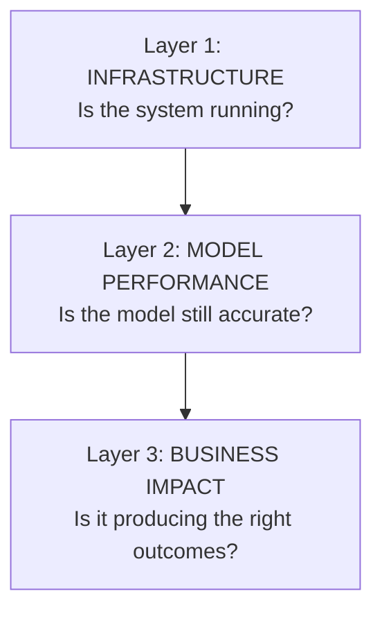
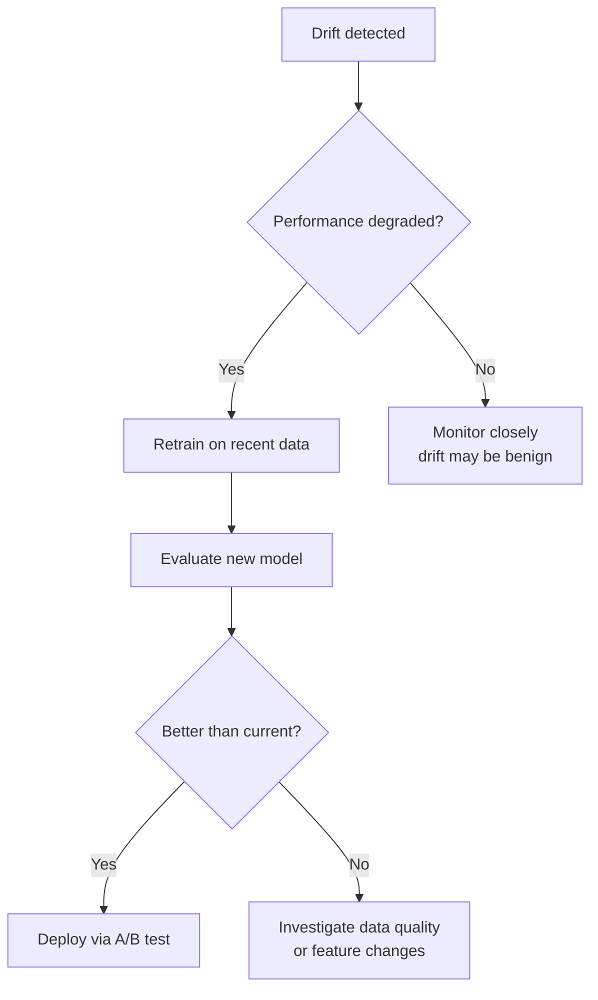

# Deep Learning — Observability

**Monitoring deployed models, detecting drift, and the drill-down debugging method for production ML.**

---

## The Silent Failure Problem

Software fails loudly. A crashed server returns a 500 error. A broken database throws an exception. A null pointer crashes the process. Engineers get paged. The failure is visible.

ML models fail silently. The model keeps returning predictions. The API returns 200 OK. The latency is fine. But the predictions are slowly getting worse — because the real world changed and the model did not. A customer churn model trained on 2024 behavior patterns becomes increasingly wrong in 2025 as the product changes and customer demographics shift. No error. No crash. Just quietly wrong predictions, for weeks or months, until someone notices the business metrics are off.

Observability for ML means: **knowing that the model is still correct, not just that it is still running.**

---

## What to Monitor

### The Three Layers



Most teams monitor Layer 1 (the system is up) and ignore Layers 2 and 3 (the model is correct and the business outcome is improving). Layer 1 is necessary. Layers 2 and 3 are where ML-specific value lives.

### Layer 1: Infrastructure Metrics

| Metric | What It Tells | Alert When |
|:---|:---|:---|
| **Request latency** (p50, p95, p99) | How fast is the model responding? p95 = "95% of requests are faster than this" | p95 > 200ms (or whatever the SLA requires) |
| **Error rate** | What percentage of requests fail? | > 1% |
| **GPU utilization** | Is the hardware being used efficiently? | < 20% (wasting money) or > 95% (risk of OOM — Out of Memory) |
| **Queue depth** | How many requests are waiting? | Growing steadily (capacity is insufficient) |
| **Uptime** | Is the service available? | Below 99.9% SLA |

These are standard infrastructure metrics — the same as monitoring any web service. Tools: Datadog, Grafana + Prometheus, AWS CloudWatch, GCP Cloud Monitoring.

### Layer 2: Model Performance Metrics

| Metric | What It Tells | Alert When |
|:---|:---|:---|
| **Prediction accuracy** (on labeled samples) | Is the model still correct? Requires human labels on a sample of live predictions. | Drops > 5% from baseline |
| **Prediction confidence distribution** | How confident is the model? A shift toward lower confidence means the model is seeing unfamiliar inputs. | Mean confidence drops below threshold |
| **Input data distribution** | Has the input data changed since training? (Feature means, ranges, categories) | Statistical test (KS test, KL divergence) detects drift |
| **Output distribution** | Has the distribution of predictions changed? (e.g., model predicting "churn" 5x more than during training) | Output distribution diverges from training-time distribution |
| **Fairness metrics per subgroup** | Is accuracy consistent across demographics? | Subgroup accuracy gap exceeds threshold |

**The hard part:** Getting labels. In production, the ground truth often arrives delayed (did the customer actually churn? Confirmed 90 days later) or never (did the patient actually have the disease? Only confirmed with follow-up). Design the monitoring pipeline with label availability in mind.

### Layer 3: Business Impact Metrics

| Metric | What It Tells | Alert When |
|:---|:---|:---|
| **Conversion rate** (if the model drives recommendations) | Are users clicking/buying what the model recommends? | Drops below previous A/B test baseline |
| **Churn rate** (if the model flags at-risk customers) | Are flagged customers actually being retained? | Retention rate on flagged customers does not improve |
| **Cost per prediction** | Is the model getting more expensive to run? (Token costs, GPU hours) | Exceeds budget per query |
| **Human override rate** | How often do humans reject the model's recommendation? | Rising steadily (the model's judgment is diverging from human judgment) |

---

## Data Drift — The #1 Cause of Silent Model Failure

### What Is Drift?

The model was trained on data from a specific time period. The real world changes. The data arriving in production starts looking different from the training data. The model's predictions degrade — not because the model changed, but because the world did.

**Types of drift:**

| Type | What Changed | Example |
|:---|:---|:---|
| **Covariate drift** | The input features changed distribution | A fraud model trained on in-store transactions. After COVID-19, most transactions shifted online — different patterns, same model. |
| **Concept drift** | The relationship between input and output changed | "Free shipping" used to signal a legitimate order. After a competitor offered universal free shipping, "free shipping" became meaningless as a fraud signal. |
| **Label drift** | The meaning of the target label changed | What counts as "spam" evolved as spammers adopted new tactics that the original labeling did not cover. |

### Detecting Drift

| Method | What It Measures | How It Works |
|:---|:---|:---|
| **KS test** (Kolmogorov-Smirnov, pronounced "kol-MOH-gor-off SMEER-noff") | Whether two distributions are different | Compares the CDF (Cumulative Distribution Function) of training data vs production data for each feature. P-value below threshold = drift detected. |
| **Population Stability Index (PSI)** | How much a feature's distribution shifted | Divides feature values into bins, compares bin proportions between training and production. PSI > 0.2 = significant drift. |
| **Prediction monitoring** | Whether the model's output distribution changed | Track the distribution of predicted probabilities (or classes) over time. A sudden shift means something changed in the inputs. |
| **Performance monitoring** | Whether accuracy degraded | Requires labels. Compare rolling accuracy to baseline. Simplest and most reliable — but often delayed. |

### Responding to Drift



Not all drift requires action. Covariate drift without performance degradation may be benign. Concept drift almost always requires retraining — the model's learned rules no longer apply.

---

## The Drill-Down Debugging Method for Production ML

When something is wrong — accuracy dropped, latency spiked, predictions look off — the debugging process follows the same pattern as debugging any complex system:

### Step 1: Identify the Layer

Is the problem in infrastructure, model performance, or business metrics?

- **Latency spike + predictions correct** → infrastructure issue (GPU, network, load balancer)
- **Latency fine + predictions wrong** → model issue (drift, data quality, model version)
- **Both fine + business metrics declining** → the model is correct but the business context changed

### Step 2: Narrow the Vicinity

Within the identified layer, which component?

**Infrastructure debugging:**
```
Is the API responding?        → Check health endpoint
Is latency high?              → Check GPU utilization, queue depth
Is one instance slow?         → Check per-instance metrics (not just averages)
Is it a specific endpoint?    → Check per-route latency
```

**Model debugging:**
```
Are predictions wrong globally?    → Possible model version issue (did a bad deploy happen?)
Are predictions wrong for specific inputs?  → Check those inputs. Are they out-of-distribution?
Did accuracy drop suddenly or gradually?    → Sudden = deployment issue. Gradual = data drift.
Which classes are affected?                 → Check per-class accuracy. One class degrading = targeted drift.
```

### Step 3: Drill Down

Once the general area is identified, go deeper:

```
Accuracy dropped on class "fraud"
  → Check inputs classified as "fraud" — do they look different than training data?
    → Yes: feature X has shifted distribution
      → Check data source for feature X — did the upstream system change?
        → Found: upstream team changed the transaction format last Tuesday
          → Fix: update preprocessing to handle the new format, retrain
```

This is the same print-statement drill-down method that applies to any system: start broad, identify the area, narrow down, narrow again. The issue surfaces naturally when the vicinity is correctly identified.

### Step 4: Verify the Fix

After applying the fix, confirm:
- The specific metric that triggered the investigation has recovered
- Other metrics have not degraded (the fix did not break something else)
- The root cause is documented (incident report) with prevention steps

---

## Monitoring Stack

| Component | Open Source | Managed |
|:---|:---|:---|
| **Metrics collection** | Prometheus | Datadog, AWS CloudWatch |
| **Dashboards** | Grafana | Datadog, Grafana Cloud |
| **Alerting** | Prometheus Alertmanager, PagerDuty | Datadog, OpsGenie |
| **ML-specific monitoring** | Evidently AI, WhyLabs | Arize AI, Fiddler AI |
| **Experiment tracking** | MLflow | Weights & Biases (W&B) |
| **Logging** | ELK stack (Elasticsearch, Logstash, Kibana) | Datadog Logs, Splunk |

### The Minimum Viable Monitoring Setup

For a first deployment, at minimum track:

1. **Request latency** (p50, p95) — is it fast enough?
2. **Error rate** — is it crashing?
3. **Prediction distribution** — is it predicting the same class mix as during evaluation?
4. **A sample of predictions with labels** — is it still accurate?

Add more monitoring as the system matures and the failure modes become clearer.

---

## Incident Response Template

When something breaks, document:

| Section | What to Write |
|:---|:---|
| **What happened** | "Model accuracy on class X dropped from 92% to 74% over 3 days" |
| **When it was detected** | "Detected March 25 via automated drift alert" |
| **Root cause** | "Upstream data source changed format for feature Y on March 22" |
| **Impact** | "~5,000 predictions affected. 12% of those were customer-facing." |
| **Fix** | "Updated preprocessing pipeline to handle new format. Retrained model on corrected data." |
| **Prevention** | "Added schema validation on the data ingestion pipeline. Added upstream change detection alert." |

This is the same incident report format used in any production system — SRE (Site Reliability Engineering, pronounced "S-R-E") standard practice.

---

**Next:** [10 — Checklist](10_Checklist.md) — The one-page decision reference for deep learning projects. Print it, keep it on the desk.
