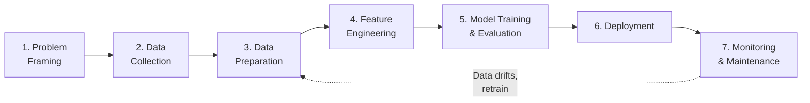
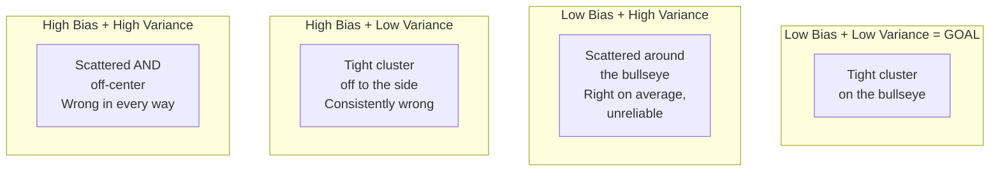
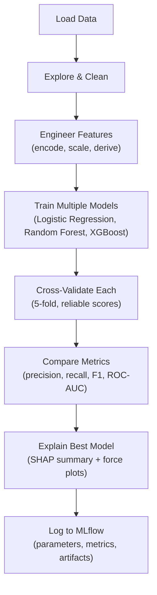

# Machine Learning Fundamentals — Concepts and Mental Models

**The frameworks that govern every ML decision — before touching any code.**

---

> **Glossary note:** Every term is explained in context when it first appears. A full reference glossary is at the end of this chapter.

---

## The ML Lifecycle — Seven Steps, Always the Same

Every ML project — whether predicting loan defaults, detecting cancer, or recommending movies — follows the same lifecycle. The specific algorithm changes. The lifecycle does not.



| Step | What Happens | The Question It Answers | What Goes Wrong If Skipped |
|:---|:---|:---|:---|
| **1. Problem Framing** | Define what the model predicts and why the business cares | "Is this actually an ML problem? Could a 10-line if/else solve it?" | Building an ML system for a problem that does not need ML — wasted months |
| **2. Data Collection** | Gather data from databases, APIs (Application Programming Interfaces), files, streams | "What data is available? What permissions do we need?" | Discovering 3 months in that the critical feature is not collected |
| **3. Data Preparation** | Clean: remove duplicates, fix nulls, standardize formats, validate types | "Is the data trustworthy?" | Garbage in, garbage out — the #1 cause of bad models |
| **4. Feature Engineering** | Transform raw data into model inputs: encode categoricals, create derived features, scale numerics | "What representation of the data gives the model the best chance?" | Feeding raw, unprocessed data to the model — poor performance regardless of algorithm |
| **5. Model Training & Evaluation** | Train multiple models, cross-validate, evaluate with the right metrics, explain with SHAP | "Which model, and how do we know it is good enough?" | Reporting accuracy on an imbalanced dataset — 94% accurate but systematically wrong for one group |
| **6. Deployment** | Serve the model via API, Docker container, or cloud service (SageMaker, Vertex AI) | "How do predictions reach the user?" | A model that works in a notebook but cannot serve 100 requests per second |
| **7. Monitoring & Maintenance** | Track accuracy over time, detect data drift, retrain when performance degrades | "Is the model still working?" | Silent model degradation — the model gets worse for months before anyone notices |

> **The lifecycle is iterative, not linear.** Evaluation results in Step 5 often send the engineer back to Step 3 (data quality issue) or Step 4 (need better features). Monitoring in Step 7 triggers retraining (back to Step 3). The arrows go both ways.

### Supervised vs Unsupervised vs Self-Supervised

| Type | What the Model Learns From | Example | Analogy |
|:---|:---|:---|:---|
| **Supervised** | Labeled data — input + correct answer | "This call resulted in churn (yes/no)" — the model learns the relationship between features and outcome | A teacher grading homework — the practitioner sees the correct answer and adjusts |
| **Unsupervised** | Unlabeled data — input only, no correct answer | "Group these customers into segments" — the model finds patterns without being told what to look for | Sorting a pile of photos without being told the categories — the groupings emerge from similarity |
| **Self-Supervised** | Creates its own labels from the data | "Predict the next word in this sentence" — the label is the actual next word, already in the text | A student who covers a word, tries to guess it, then checks — no teacher needed. This is how GPT and BERT are trained. |

---

## Bias-Variance Tradeoff — THE Central Tension

This is the most important concept in all of machine learning. Every decision — which model, how complex, how many features, when to stop training — navigates this tradeoff.

### What Is Bias? What Is Variance?

**Bias** = the model is consistently wrong in the same direction. It makes assumptions that are too simple. It misses the real pattern.

**Variance** = the model is inconsistent. It changes drastically depending on which data it sees. It captures noise instead of the real signal.

### Why Is It a Tradeoff?

Because the fix for one causes the other:

- **Make the model more complex** (add features, more layers, higher degree) → bias decreases, variance increases
- **Make the model simpler** (fewer features, stronger regularization) → variance decreases, bias increases

There is no model that minimizes both simultaneously. The goal is to find the sweet spot — the simplest model that captures the real pattern without memorizing noise.

### The Face Drawing Analogy

Drawing someone's face from memory:

- **Too simple (high bias):** "It's an oval with two dots and a line." Could be anyone. The description misses what matters. That is **underfitting.**
- **Just right:** "Oval face, big nose, bushy eyebrows, thin lips, scar on the left cheek." People recognize the person immediately. Captured what matters, ignored what does not.
- **Too complex (high variance):** "There was a pimple at exactly 2.3cm from the left ear, the left eyebrow had exactly 147 hairs." Memorized one specific photo. The person shaves or gets a tan — the description no longer matches. That is **overfitting.**

### The Dartboard Analogy

Four dart throwers aiming at the bullseye:



### How to See It in Results

Bias and variance are not measured directly. They are diagnosed from the **gap between training and test scores:**

| Train Score | Test Score | Gap | Diagnosis | Fix |
|:---|:---|:---|:---|:---|
| 55% | 52% | Small | **High bias (underfitting)** — both low, model too simple | Add complexity: more features, more powerful model |
| 99% | 65% | **Large** | **High variance (overfitting)** — memorized training data | Add regularization, more data, reduce complexity |
| 88% | 85% | Small | **Sweet spot** — learned the real pattern | Ship it. |

> **The first diagnostic every time:** Compare train score to test score. Both low = bias problem (add complexity). Big gap = variance problem (add regularization). Getting this backwards wastes time — adding regularization to an underfitting model makes it worse.

### The U-Shaped Error Curve

As model complexity increases (more features, higher polynomial degree, deeper network):

- **Training error** always decreases — the model memorizes more
- **Test error** decreases at first, then **rises** — the model starts memorizing noise

The sweet spot is the bottom of the test error curve — minimum generalization error. Everything after that is overfitting.

**"Degree" in this context** means how many bends the model is allowed to have. Degree 1 = straight line. Degree 3 = a few curves. Degree 15 = a wild snake that passes through every training point but makes insane predictions between them. The number 15 is arbitrary — it is just "high enough to clearly show overfitting."

---

## Overfitting vs Underfitting — Named and Diagnosed

| | Underfitting | Just Right | Overfitting |
|:---|:---|:---|:---|
| **Bias** | High | Low-moderate | Low |
| **Variance** | Low | Moderate | High |
| **Train score** | Low | Good | Suspiciously high (99%+) |
| **Test score** | Low (similar to train) | Good (slightly below train) | Much lower than train |
| **The model is** | Too simple for the data | Capturing the real pattern | Memorizing the training data |
| **Analogy** | Studying only chapter titles — misses all detail | Understanding concepts — handles new questions | Memorizing the practice test — fails the real exam |

### Diagnostic Checklist

1. Train score AND test score both low → **underfitting** → increase model complexity
2. Train score high, test score much lower → **overfitting** → add regularization
3. Both scores good, small gap → **good fit** → done
4. Both scores improving with more data → keep collecting data
5. Train score perfect (100%) → almost certainly overfitting unless the problem is trivially easy

---

## Regularization — A Tax on Complexity

Regularization penalizes the model for being too complex — it adds a "tax" on large weights. The model can still learn complex patterns, but it pays a price for doing so. This discourages memorizing noise.

### The Analogy

Imagine a student writing an essay. Without a word limit (no regularization), they write 50 pages — mostly filler, repeating themselves, memorizing the textbook word for word. With a 5-page limit (regularization), they must choose carefully. Only the most important points survive. The 5-page essay is more focused, more generalizable, and more useful.

Regularization does the same thing to model weights. It forces the model to use only the weights that truly matter, pushing the rest toward zero.

### L1 vs L2 vs ElasticNet

| Type | What It Penalizes | Effect | When to Use | Analogy |
|:---|:---|:---|:---|:---|
| **L1 (Lasso)** | Sum of absolute values of weights | Drives some weights to exactly zero — **automatic feature selection** | When many features are irrelevant and should be removed | A harsh editor who cuts entire paragraphs — "this section adds nothing, delete it" |
| **L2 (Ridge)** | Sum of squared weights | Shrinks all weights toward zero but never exactly zero — every feature contributes a little | When all features are somewhat useful | A gentle editor who shortens every paragraph — "say less, but keep everything" |
| **ElasticNet** | Mix of L1 and L2 | Some features zeroed out, others shrunk | When you want both feature selection and weight shrinkage | An editor who cuts the weakest sections AND shortens the rest |

### Dropout — Regularization for Neural Networks

**Dropout (covered in detail in the Deep Learning material)** randomly turns off a percentage of neurons during training. Forces the network to learn redundant paths — no single neuron can memorize a pattern alone. The analogy: studying for an exam by randomly covering parts of your notes — forces understanding the whole picture, not just one path through it.

---

## Feature Engineering — Better Features Beat Complex Models

The most impactful thing an ML engineer does is not choosing the algorithm. It is transforming raw data into features that make the pattern obvious to any algorithm.

### The Principle

A logistic regression with well-engineered features often outperforms a deep neural network on raw data. The features do the thinking. The model just draws the line.

### Common Techniques

| Technique | What It Does | Example |
|:---|:---|:---|
| **Encoding categoricals** | Converts text categories into numbers the model can use | "France" / "Germany" / "Spain" → one-hot: `[1,0,0]` / `[0,1,0]` / `[0,0,1]` |
| **Handling missing values** | Fill (impute) or flag missing data | Fill missing `wait_time` with median. Add a boolean column `wait_time_was_missing`. |
| **Scaling / normalization** | Put all features on the same range (0-1 or mean=0, std=1) | Income ($30K-$200K) and age (18-80) — without scaling, income dominates the model |
| **Derived features** | Create new features from existing ones | `rooms_per_person = total_rooms / population` — more useful than either feature alone |
| **Binning** | Convert continuous values into buckets | `wait_time_bucket`: 0-30s, 30-60s, 60-120s, 120s+ — captures non-linear relationships |
| **Time extraction** | Extract components from timestamps | `hour_of_day`, `day_of_week`, `is_weekend` — temporal patterns the model cannot see from a raw datetime |

### Dealing with Imbalanced Classes

If 80% of customers do NOT churn (leave the service), a model that predicts "no churn" every single time gets 80% accuracy. Completely useless — it catches zero actual churners.

| Strategy | What It Does |
|:---|:---|
| **Class weights** | Tell the model to penalize minority class errors more: "getting a churner wrong costs 4x more than getting a non-churner wrong" |
| **Oversampling (SMOTE — Synthetic Minority Oversampling Technique, pronounced "SMOH-tee")** | Create synthetic examples of the minority class to balance the training data |
| **Undersampling** | Remove majority class examples to balance — simpler but loses data |
| **Better metrics** | Use precision, recall, F1 instead of accuracy — these expose the imbalance problem (covered in the Decisions chapter) |

---

## Hyperparameter Tuning — The Last 5%

**Parameters** are learned by the model during training (weights, biases). **Hyperparameters** are set by the engineer before training (learning rate, number of trees, regularization strength). Tuning hyperparameters is the process of finding the best settings.

### Cross-Validation (K-Fold)

Instead of splitting data once (80% train / 20% test), **k-fold splits it k ways and trains k times.** Each time, a different chunk is the test set.

```
Fold 1: [TEST] [Train] [Train] [Train] [Train]  → Score: 84%
Fold 2: [Train] [TEST] [Train] [Train] [Train]  → Score: 81%
Fold 3: [Train] [Train] [TEST] [Train] [Train]  → Score: 86%
Fold 4: [Train] [Train] [Train] [TEST] [Train]  → Score: 83%
Fold 5: [Train] [Train] [Train] [Train] [TEST]  → Score: 85%

Average: 83.8% ± 1.8%  (reliable)
```

One split is like testing a student with one exam question — lucky or unlucky. K-fold tests with k different questions. The average is reliable. The spread (±1.8%) tells consistency. A wide spread (60%, 90%, 55%) means the model is unstable — a red flag even if the average looks fine.

### Grid Search vs Random Search

| Method | How It Works | When to Use |
|:---|:---|:---|
| **Grid Search** | Try every combination of hyperparameters in a predefined grid | Small search space (2-3 hyperparameters, few values each) |
| **Random Search** | Randomly sample combinations from the search space | Large search space — finds good solutions faster than grid search in high dimensions |

> **In practice:** Start with the algorithm's default hyperparameters. If performance is not good enough, use random search with 50-100 trials. Grid search is only worthwhile for final fine-tuning on a small, already-narrowed space.

---

## SHAP — Show Stakeholders WHY

A model predicts "this customer will churn." The VP asks: **"Why?"**

Without SHAP: "The model says so." Not helpful. Not trustworthy. Not actionable.

With **SHAP (SHapley Additive exPlanations, pronounced "shap")**: the prediction is decomposed into per-feature contributions.

```
Base prediction (average churn rate):         20%
+ Age = 52:                                  +12%  (older customers churn more)
+ Geography = Germany:                       +15%  (Germany has 2x the churn rate)
+ NumOfProducts = 1:                          +8%  (single-product customers leave)
- Balance = $125,000:                         -3%  (high balance = slightly loyal)
- IsActiveMember = 1:                         -4%  (active members stay)
= Final prediction:                           48%  churn probability
```

Now the VP knows: this is a 52-year-old German customer with only one product. The retention strategy: **offer them a second product** — the biggest controllable driver.

### Two SHAP Plots

- **Summary plot** — which features matter most across ALL predictions. The #1 output for stakeholders.
- **Force plot** — why ONE specific prediction went the way it did. The output for individual case review.

### Why SHAP Works (Game Theory)

SHAP uses **Shapley values** from cooperative game theory (1953 Nobel Prize in Economics). The idea: compute the average contribution of each feature across all possible orderings. This makes the attribution **fair** — no feature gets credit for another feature's work, even when features are correlated. Regulators trust it because it is mathematically grounded, not a heuristic.

---

## Experiment Tracking — Git for ML Experiments

In software, version control (Git) tracks every code change. In ML, experiment tracking does the same thing for model training runs: which data, which parameters, which metrics, which model artifact.

**MLflow (pronounced "M-L-flow")** is the most common open-source tool. Each run logs:

| What Is Tracked | Why |
|:---|:---|
| **Parameters** | Learning rate, regularization strength, number of trees — what settings were used |
| **Metrics** | Accuracy, precision, recall, F1, ROC-AUC — how well did it perform |
| **Artifacts** | The trained model file, feature importance plots, confusion matrix — what was produced |
| **Code version** | Git commit hash — exactly which code was used |
| **Data version** | Dataset hash or path — exactly which data was used |

> **Without experiment tracking:** "The model worked last week but I changed something and I cannot remember what." With experiment tracking: every run is a row in a table, fully reproducible. The engineer compares run 47 (F1=0.82) to run 51 (F1=0.87) and sees exactly what changed.

---

## The Full Pipeline — Putting It All Together



This is the pipeline that the notebook implements in code (Section 9). Every step here maps to a section of code. The concepts in this chapter are the WHY behind each step. The notebook is the HOW.

---

## Glossary — Quick Reference

| Term | Full Form | Pronounced | What It Means |
|:---|:---|:---|:---|
| **ML** | Machine Learning | "M-L" | Teaching computers to make predictions or decisions from data |
| **Bias (model)** | — | "bias" | Consistently wrong in the same direction — model too simple |
| **Variance (model)** | — | "VAIR-ee-ence" | Inconsistent — model changes wildly with different data — model too complex |
| **Overfitting** | — | "OH-ver-fit-ing" | Model memorized training data, fails on new data. Train score high, test score low. |
| **Underfitting** | — | "UN-der-fit-ing" | Model too simple, misses the pattern. Both train and test scores low. |
| **Regularization** | — | "REG-yoo-lar-ih-ZAY-shun" | Penalty on model complexity that prevents overfitting |
| **L1 (Lasso)** | Least Absolute Shrinkage and Selection Operator | "L-one" or "LASS-oh" | Regularization that drives some weights to zero (feature selection) |
| **L2 (Ridge)** | — | "L-two" or "ridge" | Regularization that shrinks all weights toward zero |
| **ElasticNet** | — | "ee-LASS-tick-net" | Mix of L1 and L2 regularization |
| **Feature** | — | "FEE-chur" | An input variable to the model (age, income, wait_time) |
| **Feature engineering** | — | "FEE-chur EN-jin-EER-ing" | Transforming raw data into inputs that make the model's job easier |
| **Cross-validation** | — | "cross val-ih-DAY-shun" | Training k times on k different splits for a reliable score |
| **K-fold** | — | "kay-fold" | Splitting data into k parts, rotating which part is the test set |
| **Hyperparameter** | — | "HY-per-puh-RAM-uh-ter" | A setting the engineer chooses before training (learning rate, # of trees) |
| **Parameter** | — | "puh-RAM-uh-ter" | A value the model learns during training (weights, biases) |
| **SHAP** | SHapley Additive exPlanations | "shap" (rhymes with "cap") | Explains which features drove a prediction. Based on game theory. |
| **SMOTE** | Synthetic Minority Oversampling Technique | "SMOH-tee" | Creates synthetic examples of the rare class to balance training data |
| **MLflow** | — | "M-L-flow" | Open-source experiment tracking tool |
| **Precision** | — | "preh-SIH-zhun" | Of those flagged positive, how many are actually positive? |
| **Recall** | — | "REE-call" | Of all actual positives, how many did the model catch? |
| **F1** | F1 Score | "F-one" | Harmonic mean of precision and recall — balances both |
| **ROC-AUC** | Receiver Operating Characteristic — Area Under Curve | "rock awk" | How well the model separates two classes across all thresholds. 1.0 = perfect. 0.5 = random. |
| **Churn** | — | "churn" | When a customer leaves / stops using a service |
| **EDA** | Exploratory Data Analysis | "E-D-A" | Looking at the data before modeling — distributions, nulls, patterns, outliers |
| **Confusion matrix** | — | "con-FEW-zhun MAY-tricks" | A table showing correct vs incorrect predictions for each class |

---

**Next:** [03 — Hello World](03_Hello_World.md) — Train a model, evaluate it, explain it — in 20 lines of code. See the full lifecycle in action before going deeper.
