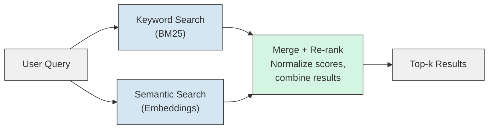

# RAG - Real World

**How five production systems use RAG to serve millions of users. What they retrieve, how they chunk, and what makes each one effective.**

---

## Why Study Real Systems?

Tutorials teach you how RAG works. Production systems teach you what actually matters at scale. Every system below has solved problems you will encounter: latency, cost, stale data, multi-format documents, and user expectations.

**Analogy: Learning to Cook vs. Running a Restaurant.**
The Hello World (Chapter 03) taught you to cook. This chapter shows you how restaurants run kitchens -- prep stations, ticket systems, timing, and the hundred decisions that don't show up in a recipe.

---

## 1. GitHub Copilot

**What it does:** Suggests code completions and answers questions about your codebase.

**What it retrieves:**
- Open files in your editor (immediate context)
- Related files in the repository (imports, test files, type definitions)
- Recently edited files (recency signal)
- Repository-level metadata (language, framework, file structure)

**How it chunks:**
Copilot does not chunk documents the way a traditional RAG system does. It uses the code's own structure: functions, classes, imports, and file boundaries. A Python function is one "chunk." A class definition is another. This respects the natural boundaries of code, where splitting mid-function would destroy meaning.

**What makes it effective:**
- **Context prioritization.** The file you are actively editing gets the most weight. Files you imported get secondary weight. The rest of the repo is background context.
- **Streaming.** Suggestions appear as you type, not after you submit a query. The retrieval runs continuously in the background.
- **Multi-signal retrieval.** It does not rely on embeddings alone. File proximity (files in the same directory), import graphs (files that reference each other), and recency (files edited in this session) all contribute to relevance scoring.

**Key lesson:** In code-aware RAG, the document structure IS the chunking strategy. Do not apply generic text chunking to code.

---

## 2. Perplexity

**What it does:** A search engine that retrieves web pages and generates cited answers.

**What it retrieves:**
- Live web pages via search (not a pre-built index)
- Multiple sources per query (typically 5-15 web pages)
- Snippets from each page, not full pages

**How it chunks:**
Perplexity first fetches full web pages, then extracts the relevant sections. This is a two-phase process: coarse retrieval (find the right pages via web search), then fine retrieval (find the right paragraphs within those pages). The fine retrieval step is where traditional RAG chunking applies.

**What makes it effective:**
- **Freshness.** Because it searches the live web, it always has current information. No stale index. This is the opposite of most enterprise RAG systems, which index documents once and re-index periodically.
- **Citation-first design.** Every sentence in the answer includes a numbered citation linking back to the source. Users can verify any claim. This builds trust and reduces the impact of hallucination.
- **Query reformulation.** Before searching, Perplexity rewrites the user's question into a better search query. "Why is my Docker container using too much memory" becomes "Docker container memory limit OOM killer cgroup settings." This bridges the gap between how users ask questions and how information is written.

**Key lesson:** RAG does not require a pre-built vector database. Live retrieval (search + extract + generate) is a valid architecture when freshness matters more than latency.

---

## 3. Glean

**What it does:** Enterprise search across all company tools -- Slack, Confluence, Google Drive, Jira, GitHub, email, and more.

**What it retrieves:**
- Documents and messages from 40+ SaaS (Software as a Service) integrations
- Content scoped by the user's permissions (you only see what you have access to in the source system)
- Results ranked by organizational signals (who authored it, which team, how recently, how many people viewed it)

**How it chunks:**
Glean indexes documents from dozens of different formats. A Slack message is one chunk. A Confluence page is split into sections by header. A Google Doc is split into paragraphs. Each integration has its own chunking strategy tailored to the format.

**What makes it effective:**
- **Permission-aware retrieval.** This is the hardest problem in enterprise RAG. Glean checks each user's access permissions in the source system (Google Drive ACLs, Confluence space permissions, Slack channel membership) and filters results accordingly. A VP and an intern searching the same query see different results.
- **Organizational graph.** Glean understands team structures, reporting lines, and collaboration patterns. If you search "deployment process," it prioritizes documents authored by people in YOUR team or adjacent teams over random wiki pages.
- **Incremental indexing.** With 40+ integrations and millions of documents, re-indexing everything on every change is impossible. Glean uses incremental updates: when a Confluence page is edited, only that page's chunks are re-embedded and updated.

**Key lesson:** In enterprise RAG, access control is not optional -- it is the first design constraint. Build permission filtering before building relevance ranking.

---

## 4. Notion AI

**What it does:** An AI assistant scoped to your Notion workspace. Answers questions from your pages, databases, and documents.

**What it retrieves:**
- Pages and databases within the user's Notion workspace
- Scoped to pages the user has access to
- Searches across all content types: text, tables, databases, embedded files

**How it chunks:**
Notion has a structured block model -- every heading, paragraph, table, and toggle is a "block." This gives Notion a natural chunking advantage: each block is a semantically meaningful unit. A heading + its child content forms a natural chunk. Notion does not need to infer boundaries from raw text because the structure is already explicit.

**What makes it effective:**
- **Workspace scoping.** The search space is small (one workspace, hundreds to low thousands of pages) which means retrieval can be extremely fast and accurate. Small corpus = high precision.
- **Structure-aware search.** Notion knows that a database row, a toggle block, and a heading section are different things. It can search "all database rows where status = 'In Progress'" and combine that with semantic search for richer results.
- **Low-latency UX (User Experience).** Because the corpus is small and pre-indexed, Notion AI answers in under 2 seconds. The user experience feels instant because the retrieval step is nearly free at this scale.

**Key lesson:** When your document corpus is small and well-structured, simple RAG with good chunking outperforms complex systems. Do not over-engineer for scale you do not have.

---

## 5. Cursor

**What it does:** An AI-powered code editor that understands your entire codebase and answers questions about it, generates code, and refactors.

**What it retrieves:**
- Files in the current project (indexed locally)
- The file you are editing + surrounding context
- Imported/referenced files (dependency graph)
- Documentation and comments within the codebase

**How it chunks:**
Like Copilot, Cursor uses code-aware chunking: functions, classes, and file-level scopes. But Cursor goes further with full-codebase indexing. When you open a project, Cursor builds a local embedding index of every file. This index is updated incrementally as you edit.

**What makes it effective:**
- **Full codebase RAG.** Unlike Copilot which focuses on open files and nearby imports, Cursor indexes the entire project. You can ask "where is the database connection configured?" and it will find the file even if you have never opened it.
- **Multi-file context.** When generating code, Cursor retrieves relevant code from multiple files and includes them in the LLM prompt. This means the generated code respects your project's patterns, naming conventions, and architecture.
- **Indexing at editor start.** The embedding index is built when you open the project, not when you query. This front-loads the cost so queries are fast.
- **Codebase-aware re-ranking.** Cursor re-ranks retrieved chunks using code-specific signals: does this file import the file being edited? Is this a test file for the current module? Is this a configuration file that affects the current code path?

**Key lesson:** Pre-computing the index at project open (not at query time) is a pattern that applies broadly. Any time you can front-load embedding computation, your query latency improves.

---

## Comparison Table

| System | Corpus Size | Freshness | Chunking Strategy | Key Differentiator |
|---|---|---|---|---|
| **GitHub Copilot** | Single repository | Real-time (open files) | Code-structural (functions, classes) | Multi-signal retrieval (recency, imports, proximity) |
| **Perplexity** | Entire web | Live (searches on each query) | Web page sections | No pre-built index; live search + extract |
| **Glean** | Enterprise (40+ tools) | Incremental updates | Format-specific per integration | Permission-aware retrieval at scale |
| **Notion AI** | Single workspace | Near-real-time | Notion block structure | Small corpus = fast, precise retrieval |
| **Cursor** | Single codebase | Indexed at open, incremental | Code-structural + full-codebase | Full project index, not just open files |

---

## Production Patterns Across All Five Systems

These patterns appear in every production RAG system, regardless of domain.

### Pattern 1: Caching

Every system caches aggressively to reduce latency and cost.

| Cache Type | What It Stores | Benefit |
|---|---|---|
| **Query cache** | Recent question-answer pairs. If the same question is asked again, return the cached answer. | Eliminates LLM generation cost for repeated questions |
| **Embedding cache** | Recently computed embedding vectors. Same text = same vector, no need to re-embed. | Eliminates embedding model calls for repeated texts |
| **Result cache** | Retrieved chunk sets for recent queries. Same query = same chunks, skip vector search. | Eliminates vector database queries for repeated searches |

**Perplexity** caches aggressively for popular queries. If a thousand people ask "Who won the Super Bowl?" in the same hour, only the first query hits the web search + LLM pipeline.

### Pattern 2: Pre-computation

Anything that can be computed before query time, should be.

| Pre-computation | Who Does It | Benefit |
|---|---|---|
| Embed all documents at ingestion | All systems | Query-time embedding is only for the question (fast) |
| Build ANN index at ingestion | Glean, Cursor, Notion | Vector search is milliseconds, not seconds |
| Compute document metadata | Glean | Metadata filters reduce search space before vector search |
| Build dependency graphs | Copilot, Cursor | Code relationships are known before the user asks |

### Pattern 3: Hybrid Search (Keyword + Semantic)

Pure semantic search misses exact term matches. Pure keyword search misses meaning. Production systems combine both.

**Why hybrid matters:** If a user searches for "JIRA-4521" (a ticket number), semantic search will fail -- the embedding for "JIRA-4521" does not meaningfully capture intent. Keyword search finds it instantly. Conversely, "Why did the deployment fail last Tuesday?" requires semantic search because the answer might use words like "rollback," "version mismatch," or "config drift" without ever saying "deployment fail."

**Glean and Weaviate** use hybrid search as a core feature. Most production systems evolve toward hybrid once they encounter queries that pure semantic search handles poorly.

### Pattern 4: Query Reformulation

Users ask questions poorly. Production systems rewrite queries before searching.

| Original Query | Reformulated Query | Why |
|---|---|---|
| "it's broken" | "error, failure, bug, crash, issue" | Expands vague language |
| "How do I do the thing Alex showed me?" | "tutorial, walkthrough, demo" + recent docs by Alex | Resolves references |
| "connection pool" | "connection pool exhaustion, pool size, max connections, connection limit" | Adds related terms |

Perplexity and Glean both reformulate queries before retrieval. This is sometimes called "query expansion" or "query rewriting."

---

## What This Means for Your System

If you are building RAG for a production diagnostics system (see [Production Diagnostics Architecture](../../systems/production-diagnostics/architecture.md)), the lessons map directly:

| Production Pattern | How It Applies to Diagnostics |
|---|---|
| Code-aware chunking (Copilot, Cursor) | Chunk runbooks by section headers, not by character count |
| Permission-aware retrieval (Glean) | Different teams see different runbooks and incident reports |
| Incremental indexing (Glean, Cursor) | When a runbook is updated, re-embed only that document |
| Hybrid search (all systems) | "JIRA-4521" needs keyword match; "why did it fail?" needs semantic |
| Caching (all systems) | Same alert at 2 AM triggers the same runbook -- cache the result |
| Pre-computation (all systems) | Embed all runbooks at ingestion, not at query time |

---

## Key Takeaways

1. **No production system uses vanilla RAG.** Every system adds caching, pre-computation, hybrid search, or query reformulation on top of the basic retrieve-and-generate pipeline.
2. **Chunking strategy depends on document format.** Code uses structural boundaries (functions, classes). Wiki pages use headers. Slack uses message boundaries. Do not use one-size-fits-all character splitting.
3. **Permission-aware retrieval is the hardest enterprise problem.** Start designing for it early, not as an afterthought.
4. **Freshness vs. cost is the core tradeoff.** Perplexity searches live (fresh, expensive). Notion pre-indexes (fast, cheap, slightly stale). Choose based on your domain.
5. **The best systems combine multiple retrieval signals.** Semantic similarity alone is not enough. Recency, authorship, code dependencies, and metadata all improve relevance.

---

## Quick Links

| Chapter | Topic |
|---|---|
| [01 - Why](01_Why.md) | Why RAG matters |
| [02 - Concepts](02_Concepts.md) | Embeddings, vectors, chunking |
| [03 - Hello World](03_Hello_World.md) | Build a RAG system in 20 lines |
| [04 - How It Works](04_How_It_Works.md) | Deep dive into each step |
| [05 - Building It](05_Building_It.md) | Every tradeoff and choice |
| [06 - Production Patterns](06_Production_Patterns.md) | This page |
| [07 - System Design](07_System_Design.md) | Scaling, caching, hybrid search |
| [08 - Quality, Security, Governance](08_Quality_Security_Governance.md) | Prompt injection, data leakage |
| [09 - Observability & Troubleshooting](09_Observability_Troubleshooting.md) | Measuring quality and cost |
| [10 - Decision Guide](10_Decision_Guide.md) | Decision table and production readiness |

**Hands-on notebook:** [RAG from Scratch on Colab](https://colab.research.google.com/github/sunilmogadati/systems-in-production/blob/main/implementation/notebooks/AI_Engineer_Accelerator_RAG_from_Scratch.ipynb)

**Production architecture:** [Production Diagnostics Architecture](../../systems/production-diagnostics/architecture.md)
