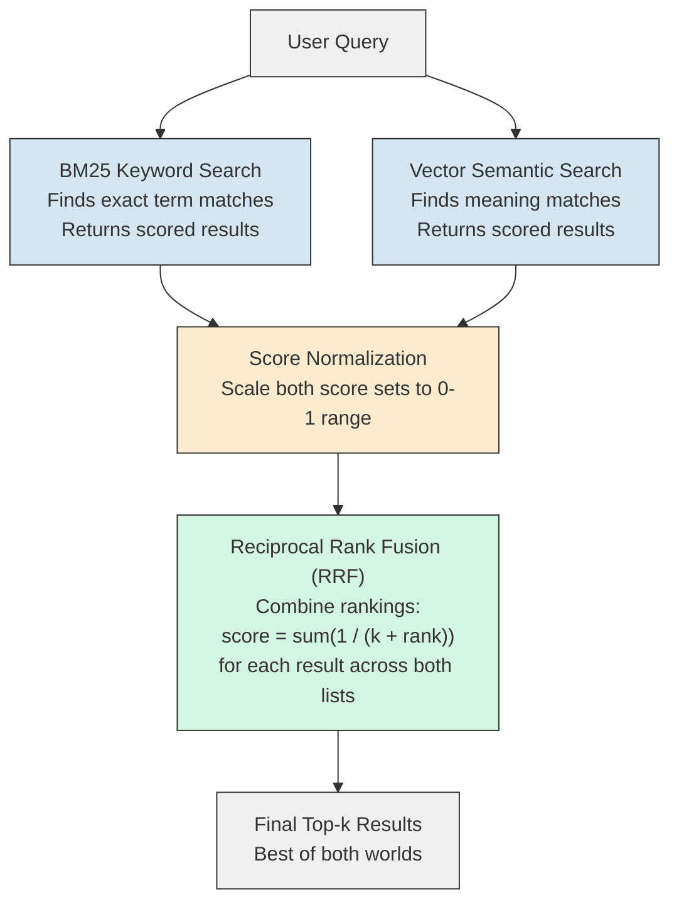
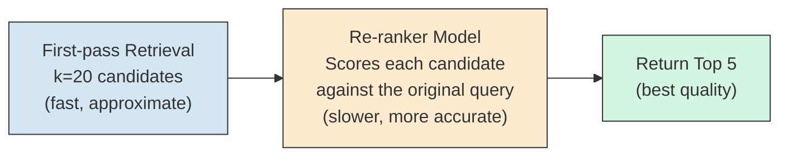
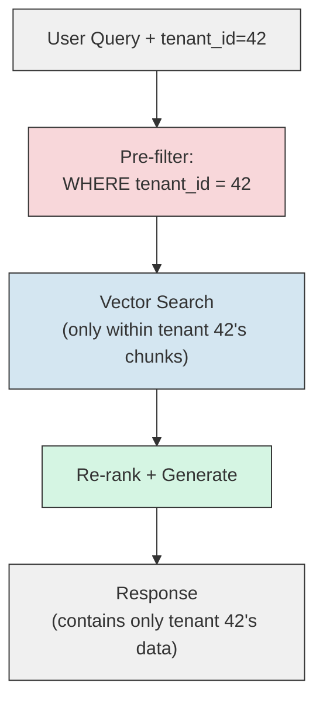
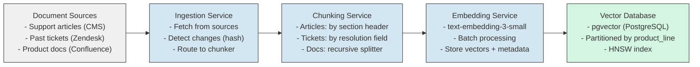
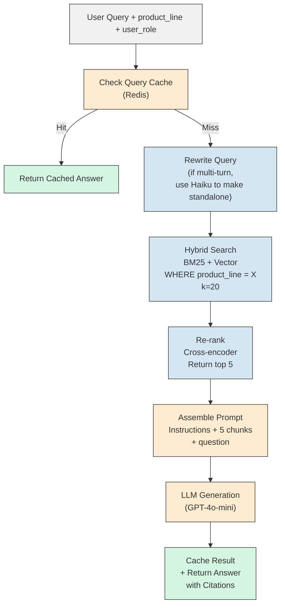
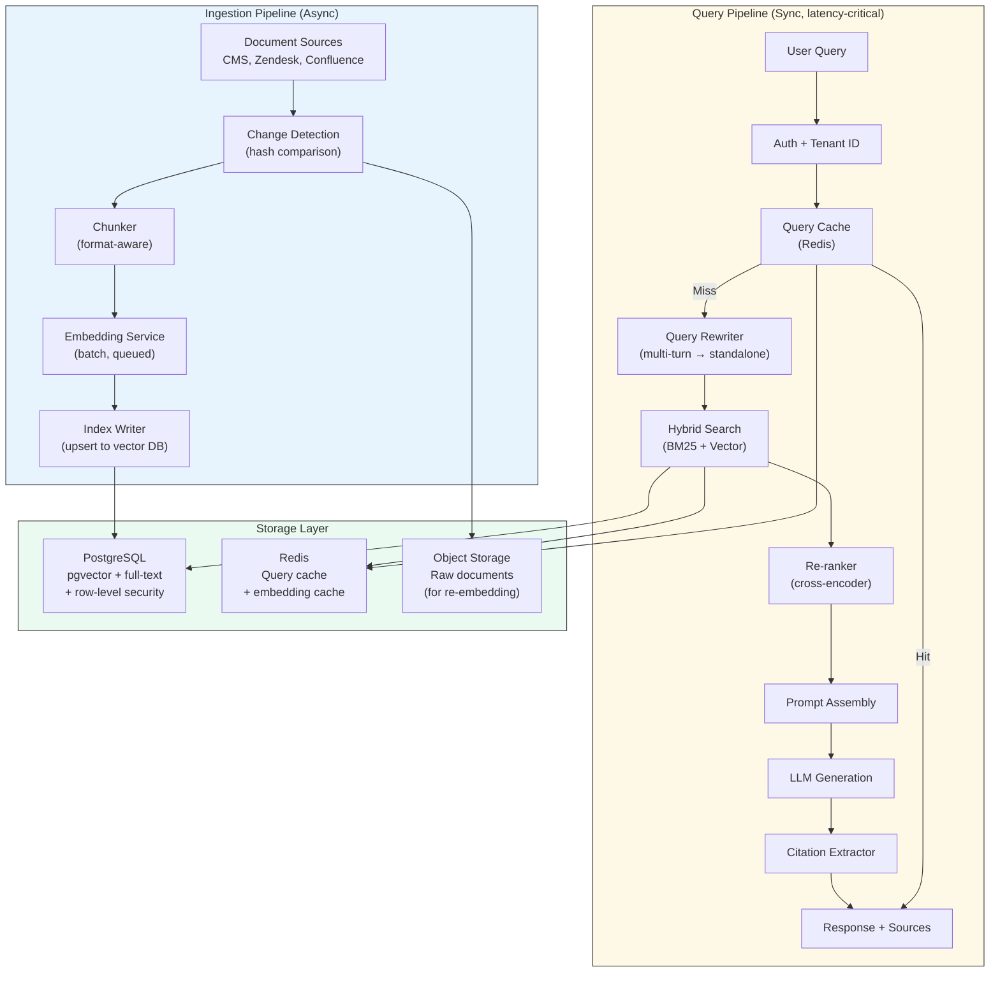

# RAG - System Design

**Scaling from prototype to production. Hybrid search, re-ranking, multi-tenant architecture, caching, cost modeling, and a complete system design walkthrough.**

---

## The Gap Between Prototype and Production

The Hello World from Chapter 03 works on your laptop with one document. Production means:

- 10 million documents, not 10
- 1,000 concurrent users, not 1
- 99.9% uptime, not "restart if it breaks"
- Sub-2-second responses, not "it'll finish eventually"
- Multi-tenant isolation (user A never sees user B's documents)
- Cost under control at scale

This chapter covers every system design pattern that bridges that gap.

---

## Hybrid Search: Keyword + Semantic

Pure semantic search fails on exact terms. Pure keyword search fails on meaning. Production systems combine both.

**Analogy: A Librarian with Two Search Systems.**
The librarian has a card catalog (keyword search -- finds books by title and subject headings) and a "books similar to this one" recommendation engine (semantic search -- finds books by meaning). A smart librarian uses both. If you ask for "JIRA-4521," the card catalog finds it instantly. If you ask "Why do deployments keep failing?", the recommendation engine finds the relevant post-mortems.

### How Hybrid Search Works



### BM25 (Best Match 25)

BM25 (pronounced "B-M-25") is the standard keyword ranking algorithm used by Elasticsearch and most search engines. It scores documents based on:

1. **Term frequency:** How many times the search term appears in the document
2. **Inverse document frequency:** How rare the term is across all documents (rare terms are more informative)
3. **Document length normalization:** Longer documents are penalized slightly to prevent them from dominating just by having more words

BM25 is fast, well-understood, and excellent at finding exact matches. It just cannot understand that "OOM error" and "out of memory crash" mean the same thing.

### Reciprocal Rank Fusion (RRF)

RRF (pronounced "R-R-F") combines two ranked lists into one. The formula is simple:

```
RRF_score(document) = sum( 1 / (k + rank_in_list) )  for each list
```

Where k is a constant (typically 60). A document ranked #1 in both lists gets a high combined score. A document ranked #1 in one list and absent from the other still gets a moderate score.

**Why RRF instead of averaging scores?** Keyword search scores and semantic search scores are on different scales. BM25 might return scores like 12.7, 8.3, 5.1 while cosine similarity returns 0.94, 0.87, 0.81. Averaging these raw numbers is meaningless. RRF uses ranks (1st, 2nd, 3rd) which are always comparable.

| Database | Hybrid Search Support |
|---|---|
| Weaviate | Built-in (alpha parameter to weight keyword vs. semantic) |
| Pinecone | Sparse-dense vectors (keyword + semantic in one query) |
| pgvector + PostgreSQL full-text | Combine via SQL (tsvector for keyword, pgvector for semantic) |
| Elasticsearch + vector plugin | BM25 native + vector search via plugin |
| ChromaDB | No built-in hybrid (semantic only) |

---

## Re-ranking: Retrieve Many, Return the Best

The first retrieval pass (vector search or hybrid search) is fast but approximate. Re-ranking is a second, more expensive pass that reorders the results by true relevance.

**Analogy: Job Hiring.**
Resume screening (first pass) narrows 500 applicants to 20 based on keywords and qualifications. Interviews (re-ranking) evaluate those 20 in depth to find the best 3. You would never interview all 500, and you would never hire based on resume screening alone.

### How Re-ranking Works



**First-pass retrieval** uses bi-encoder embeddings: the query and documents are embedded independently, then compared. This is fast (milliseconds for millions of documents) but misses nuances.

**Re-ranking** uses a cross-encoder: the query and each candidate document are processed TOGETHER, allowing the model to see how they interact. This is much more accurate but slow (50-200ms per document). That is why you re-rank 20 candidates, not 10 million.

| Re-ranker | Type | Speed | Quality |
|---|---|---|---|
| `cross-encoder/ms-marco-MiniLM` | Open source, local | ~10ms/pair | Good |
| Cohere Rerank API | Cloud API | ~50ms/batch | Excellent |
| `bge-reranker-v2-m3` | Open source, local | ~15ms/pair | Very good |
| Jina Reranker | Cloud API | ~40ms/batch | Very good |

**When to re-rank:**
- Always in production when quality matters more than latency
- When your top-k results from first-pass retrieval contain irrelevant results
- When questions are complex or ambiguous

**When to skip re-ranking:**
- Prototypes and learning
- Latency-critical systems where every millisecond counts
- Simple, well-scoped questions with a small corpus

---

## Multi-Tenant RAG

Different users must see different documents. This is the hardest architectural problem in enterprise RAG.

**Analogy: An Apartment Building.**
Every tenant has their own unit. The mailroom sorts letters by apartment number. A tenant should never see another tenant's mail, even if they walk through the same lobby.

### Three Approaches

| Approach | How It Works | Pros | Cons |
|---|---|---|---|
| **Separate databases** | Each tenant gets their own vector database instance | Complete isolation, simple to reason about | Expensive, does not scale past ~50 tenants |
| **Shared database, namespace filtering** | One database, each chunk tagged with `tenant_id`, filter on every query | Efficient, scales to thousands of tenants | Must NEVER forget the filter (one bug = data leak) |
| **Shared database, row-level security** | Database enforces access at the storage layer | Strongest guarantee, no application-level bugs can leak data | Requires database support (pgvector with PostgreSQL RLS) |

**The production choice** for most systems: shared database with namespace filtering, backed by row-level security as a defense-in-depth layer.



**Critical rule:** The tenant filter must be applied BEFORE vector search, not after. If you search all tenants and then filter, the top-k results might all belong to other tenants, leaving tenant 42 with zero results.

---

## Caching Strategies

RAG queries are expensive: embedding computation, vector search, and LLM generation all cost time and money. Caching eliminates redundant work.

| Cache Layer | What It Stores | Hit Rate | Latency Savings |
|---|---|---|---|
| **Query result cache** | Full question-answer pairs | High for popular questions (e.g., "How do I reset my password?") | Eliminates the entire pipeline (~2 seconds) |
| **Embedding cache** | Question text to embedding vector mapping | High for repeated or similar questions | Saves 10-50ms per query |
| **Retrieval cache** | Query embedding to chunk set mapping | Medium (same embedding = same chunks) | Saves 5-50ms per query |
| **LLM response cache** | Prompt hash to LLM output mapping | Medium-high for identical prompts | Saves 500-3000ms per query |

### Semantic Caching

Standard caching uses exact match: the same question string hits the cache. Semantic caching uses embedding similarity: "What's the return policy?" and "How do I return an item?" are similar enough to return the same cached answer.

| Cache Type | Match Method | Hit Rate | Risk |
|---|---|---|---|
| Exact match | String equality | Low (users phrase questions differently) | None (exact match = correct answer) |
| Semantic match | Embedding similarity above threshold | High | May return wrong cached answer if threshold is too low |

**Threshold recommendation:** Similarity >= 0.95 for semantic cache hits. Below 0.95, the questions might be different enough to warrant fresh retrieval.

---

## Conversation Memory: Multi-Turn RAG

Most tutorials show single-turn RAG: one question, one answer. Real users have conversations.

```
User: "What caused the March 8 outage?"
AI:   "Connection pool exhaustion in order-service due to missing max_lifetime setting."
User: "How was it fixed?"       ← "it" refers to the outage. Without memory, RAG doesn't know.
User: "Was there a prior warning?"  ← "prior" to what? Requires context from turn 1.
```

### Approaches to Multi-Turn RAG

| Approach | How It Works | Pros | Cons |
|---|---|---|---|
| **Append history to prompt** | Include the last N turns of conversation in the LLM prompt | Simple, no extra infrastructure | Consumes context window, increases cost per turn |
| **Standalone question rewriting** | Use the LLM to rewrite the follow-up into a self-contained question: "How was the March 8 outage fixed?" | Clean retrieval, each query is independent | Extra LLM call per turn, adds latency |
| **Conversation-aware retrieval** | Store conversation context as an embedding, combine with current question embedding for search | Rich context for retrieval | Complex to implement, hard to tune |

**The production pattern:** Standalone question rewriting. Before retrieval, send the conversation history and the latest question to a fast, cheap LLM (Haiku, GPT-4o-mini) with the instruction: "Rewrite this follow-up question as a standalone question that includes all necessary context." Then use the rewritten question for retrieval.

```
Conversation history:
  User: "What caused the March 8 outage?"
  AI: "Connection pool exhaustion in order-service."

Current question: "How was it fixed?"

Rewritten: "How was the connection pool exhaustion in order-service fixed during the March 8 outage?"
```

This rewritten question retrieves the right chunks without any ambiguity.

---

## Index Management

Your documents change. Indexes must stay current.

| Strategy | When to Use | How It Works |
|---|---|---|
| **Full re-index** | Small corpus (<10K documents), infrequent changes | Delete all embeddings, re-embed everything. Simple but slow. |
| **Incremental update** | Large corpus, frequent changes | Track document hashes. When a document changes, re-embed only its chunks. |
| **Append-only** | New documents added, old ones never change | Embed new documents and add to the index. Never re-embed existing ones. |
| **TTL (Time to Live)-based expiration** | Time-sensitive content (news, alerts) | Chunks expire after a set period and are removed from the index. |

### Incremental Update Implementation

```
1. Hash each document at ingestion time (SHA-256 of content)
2. Store the hash alongside the chunks in metadata
3. On re-index:
   a. For each document, compute new hash
   b. If hash matches stored hash → skip (no change)
   c. If hash differs → delete old chunks, embed new chunks
   d. If document is new → embed and add
   e. If document is deleted → remove its chunks
```

**The critical detail:** When a document changes, you must delete ALL its old chunks before adding new ones. If you only add new chunks, the database will contain both old and new versions, and retrieval will return contradictory information.

---

## Cost Modeling

RAG has three cost centers: embeddings, LLM generation, and storage. Here is how they scale.

### Embedding Costs

| Corpus Size | Tokens (est.) | OpenAI small ($0.02/1M) | OpenAI large ($0.13/1M) | Local (Ollama) |
|---|---|---|---|---|
| 1,000 docs (50K chunks) | ~5M tokens | $0.10 | $0.65 | Free (compute only) |
| 10,000 docs (500K chunks) | ~50M tokens | $1.00 | $6.50 | Free |
| 100,000 docs (5M chunks) | ~500M tokens | $10.00 | $65.00 | Free |
| 1M docs (50M chunks) | ~5B tokens | $100.00 | $650.00 | Free |

Embedding is a one-time cost per document (plus re-embedding on updates). It is usually the smallest cost center.

### LLM Generation Costs

This is the dominant cost. It recurs on every query.

| Model | Cost per Query (est. 2K input + 500 output tokens) | 1,000 Queries/Day | 100,000 Queries/Day |
|---|---|---|---|
| GPT-4o-mini | ~$0.001 | $1/day | $100/day |
| GPT-4o | ~$0.01 | $10/day | $1,000/day |
| Claude Haiku | ~$0.001 | $1/day | $100/day |
| Claude Sonnet | ~$0.01 | $10/day | $1,000/day |
| Mistral 7B (local) | ~$0 (compute cost) | Compute only | Compute only |

### Storage Costs

| Chunks | Dimensions | Raw Vector Size | With Metadata | Managed DB (Pinecone) |
|---|---|---|---|---|
| 500K | 768 | ~1.5 GB | ~3 GB | ~$70/month |
| 5M | 768 | ~15 GB | ~30 GB | ~$700/month |
| 50M | 768 | ~150 GB | ~300 GB | ~$7,000/month |
| 500K | 3072 | ~6 GB | ~12 GB | ~$280/month |

### Total Cost Example

A customer support RAG system with 50,000 documents, 5,000 queries/day, using GPT-4o-mini:

| Component | Monthly Cost |
|---|---|
| Embedding (one-time, amortized) | ~$1 |
| LLM generation (5K queries x 30 days) | ~$150 |
| Vector storage (Pinecone) | ~$70 |
| Infrastructure (API server, Redis cache) | ~$50-200 |
| **Total** | **~$270-420/month** |

With caching (50% hit rate), the LLM cost drops to ~$75/month. With a local LLM, it drops to infrastructure cost only.

---

## The 10-Step System Design Framework

Applied to: **"Design a RAG-based customer support system."**

This is the kind of question you would get in a system design interview or a production planning session. Walk through it step by step.

### Step 1: Clarify Requirements

- **Users:** Customer support agents and end customers (self-service)
- **Documents:** 50,000 support articles, 500,000 past tickets, product documentation
- **Query volume:** 5,000 queries/day, peak 500/hour
- **Latency:** Under 3 seconds for answer
- **Multi-tenant:** Yes (different product lines see different documentation)
- **Freshness:** Support articles updated weekly, tickets ingested daily

### Step 2: Define the Data Pipeline



### Step 3: Define the Query Pipeline



### Step 4: Choose the Technology Stack

| Component | Choice | Rationale |
|---|---|---|
| Vector database | pgvector (PostgreSQL) | Team already uses PostgreSQL. No new infrastructure. |
| Keyword search | PostgreSQL full-text (tsvector) | Same database, hybrid search via SQL |
| Embedding model | text-embedding-3-small | Good quality, low cost at scale |
| LLM | GPT-4o-mini (primary), GPT-4o (escalation) | Cost-effective for high volume, escalate complex queries |
| Cache | Redis | Sub-millisecond reads, TTL support |
| Re-ranker | Cohere Rerank API | Best quality, simple integration |
| Orchestration | FastAPI (Python) | Team expertise, async support |

### Step 5: Design Multi-Tenant Isolation

```
Every chunk stored with metadata:
  - product_line: "enterprise" | "consumer" | "developer"
  - access_level: "public" | "internal" | "restricted"
  - source: "zendesk" | "confluence" | "cms"

Every query filtered:
  WHERE product_line = user.product_line
  AND access_level <= user.access_level
```

PostgreSQL Row-Level Security (RLS) as defense-in-depth: even if the application filter has a bug, the database enforces isolation.

### Step 6: Design the Caching Layer

| Cache Key | TTL (Time to Live) | Invalidation |
|---|---|---|
| Exact query string + product_line | 1 hour | On document update |
| Semantic query embedding (similarity > 0.95) | 30 minutes | On document update |
| Embedding vectors for common queries | 24 hours | Never (deterministic) |

### Step 7: Plan Index Management

- **Support articles:** Weekly full re-index (small corpus, tolerable)
- **Past tickets:** Daily incremental (new tickets only, hash-based dedup)
- **Product docs:** Event-driven (Confluence webhook triggers re-embed of changed page)

### Step 8: Define SLOs (Service Level Objectives)

| Metric | Target |
|---|---|
| End-to-end latency (p50) | Under 2 seconds |
| End-to-end latency (p99) | Under 5 seconds |
| Retrieval relevance (manual spot-check) | 85%+ of top-3 chunks are relevant |
| Answer accuracy (human evaluation, weekly) | 90%+ answers rated "correct" or "mostly correct" |
| Availability | 99.9% (less than 8.7 hours downtime/year) |
| Cache hit rate | 40%+ |

### Step 9: Estimate Costs

| Component | Monthly Cost |
|---|---|
| Embedding (incremental, ~10K new tickets/month) | ~$2 |
| LLM generation (5K queries/day, 50% cache hit) | ~$75 |
| Cohere re-rank (2,500 queries/day x 20 docs each) | ~$50 |
| pgvector (managed PostgreSQL, 30 GB) | ~$150 |
| Redis (managed, 1 GB) | ~$30 |
| FastAPI server (2 instances) | ~$100 |
| **Total** | **~$400/month** |

### Step 10: Identify Risks and Mitigations

| Risk | Impact | Mitigation |
|---|---|---|
| LLM hallucination | Customer gets wrong answer, escalates | Guarded prompt + "I don't know" fallback + confidence scoring |
| Tenant data leakage | Security breach, compliance violation | Row-level security + pre-filter + audit logging |
| Stale documents | Answers based on outdated information | Freshness metadata + TTL-based cache invalidation |
| Cost spike from viral query | Budget overrun | Rate limiting + semantic caching + circuit breaker on LLM calls |
| Embedding model deprecation | Must re-embed entire corpus | Store raw text alongside embeddings for re-embedding |

---

## Production RAG Architecture (Complete)



---

## Key Takeaways

1. **Hybrid search** (keyword + semantic) is not optional in production. Pure semantic search fails on exact terms; pure keyword search fails on meaning.
2. **Re-ranking** is the highest-leverage improvement you can make. Retrieve 20, re-rank to 5. The quality improvement is dramatic.
3. **Multi-tenant isolation** requires pre-filtering (before vector search), not post-filtering. Defense-in-depth with row-level security.
4. **Caching** reduces both latency and cost. Semantic caching (similarity-based) has much higher hit rates than exact-match caching.
5. **Index management** is ongoing work, not a one-time setup. Plan for incremental updates from day one.
6. **LLM generation dominates cost** at scale. Caching and model tier selection (Haiku/mini for simple queries, Sonnet/GPT-4o for complex) are your main cost levers.
7. **The system design framework** (10 steps) applies to any RAG system. Practice it on different domains: legal research, medical Q&A, code search, product support.

---

## Quick Links

| Chapter | Topic |
|---|---|
| [01 - Why](01_Why.md) | Why RAG matters |
| [02 - Concepts](02_Concepts.md) | Embeddings, vectors, chunking |
| [03 - Hello World](03_Hello_World.md) | Build a RAG system in 20 lines |
| [04 - How It Works](04_How_It_Works.md) | Deep dive into each step |
| [05 - Decisions](05_Decisions.md) | Every tradeoff and choice |
| [06 - Real World](06_Real_World.md) | How production RAG systems work |
| [07 - System Design](07_System_Design.md) | This page |
| [08 - Security](08_Security.md) | Prompt injection, data leakage |
| [09 - Observability](09_Observability.md) | Measuring quality and cost |
| [10 - Checklist](10_Checklist.md) | Decision table and production readiness |

**Hands-on notebook:** [RAG from Scratch on Colab](https://colab.research.google.com/github/sunilmogadati/systems-in-production/blob/main/implementation/notebooks/AI_Engineer_Accelerator_RAG_from_Scratch.ipynb)

**Production architecture:** [Production Diagnostics Architecture](../../systems/production-diagnostics/architecture.md)
