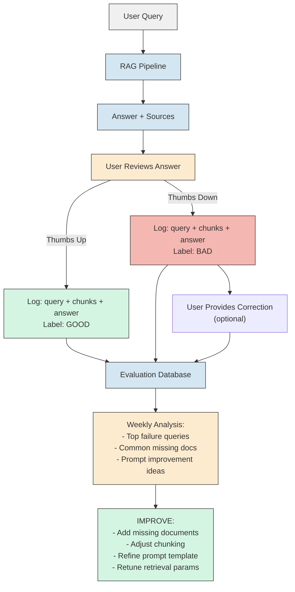
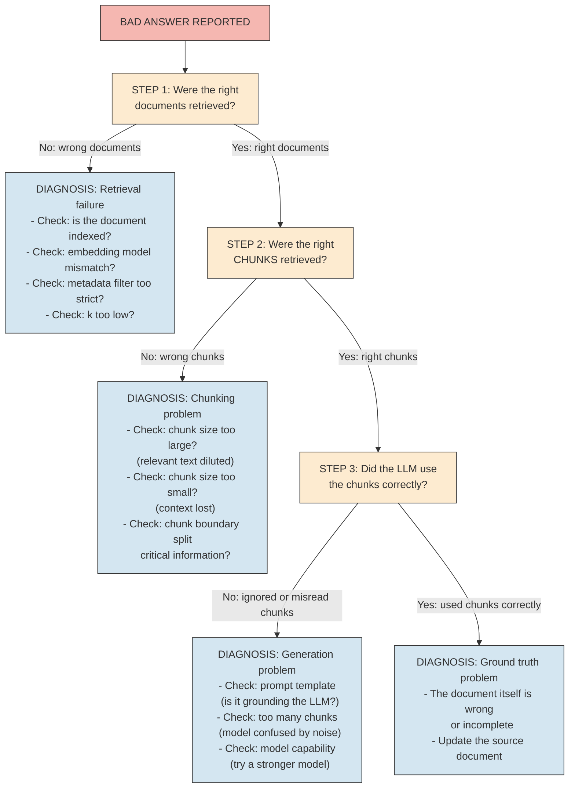
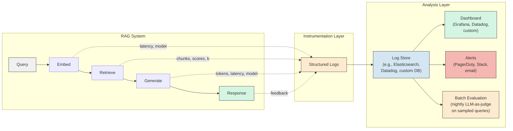

# RAG - Observability

**Why a RAG system that works today will silently degrade tomorrow. What to measure, how to debug, and how to know when things go wrong before your users tell you.**

---

## Why RAG Systems Need Observability

A traditional web application either works or it doesn't. A 500 error is visible. A timeout is measurable. A wrong database query returns obviously wrong data that a test can catch.

RAG systems fail differently. They fail silently. The system returns an answer. The answer sounds confident. The answer is wrong. Nobody notices until a customer complains, a decision is made on bad information, or an audit reveals the problem weeks later.

**Analogy: The Research Assistant Who Stopped Reading.**
You hire a research assistant to answer questions from a library of 10,000 documents. For the first month, the answers are excellent. Then the library adds 2,000 new documents. The assistant doesn't know they exist. The assistant keeps answering from the old documents. The answers are still grammatically perfect, still confidently stated, but now they are outdated. Without checking the assistant's work, you would never know.

RAG observability is how you check the assistant's work -- continuously, automatically, at scale.

---

## What to Measure in a RAG System

RAG has four measurement categories. Each tells you something different about system health.

### 1. Retrieval Quality: Are We Finding the Right Chunks?

This is the most important category. If retrieval fails, generation cannot succeed. A perfect LLM (Large Language Model, pronounced "L-L-M") generating from wrong chunks will produce a confidently wrong answer.

| Metric | What It Measures | How to Compute | Good Value |
|---|---|---|---|
| Precision@k | Of the k retrieved chunks, how many were relevant? | relevant_retrieved / k | > 0.7 |
| Recall@k | Of all relevant chunks in the database, how many did we retrieve? | relevant_retrieved / total_relevant | > 0.8 |
| MRR (Mean Reciprocal Rank) | How high in the results list does the first relevant chunk appear? | Average of (1 / rank_of_first_relevant_result) across queries | > 0.6 |
| Hit Rate | For what fraction of queries did we retrieve at least one relevant chunk? | queries_with_at_least_one_relevant / total_queries | > 0.9 |

**Analogy: The Librarian Test.**
You ask the librarian for the 5 most relevant books on a topic. Precision measures how many of those 5 were actually useful (vs. off-topic). Recall measures whether the librarian missed any important books that were on the shelf. MRR measures whether the most useful book was first in the stack or buried at the bottom. Hit Rate measures whether the librarian found ANYTHING useful at all.

**The catch:** Computing these metrics requires knowing which chunks ARE relevant -- a ground truth. You build this by:

1. **Manual labeling.** For 100-200 representative queries, have domain experts mark which chunks are relevant.
2. **User feedback.** Track which answers users accept vs. reject (thumbs up/down).
3. **LLM-as-judge.** Use a separate LLM to evaluate whether retrieved chunks are relevant to the question (described below).

### 2. Answer Quality: Is the LLM Generating Good Answers?

Even with perfect retrieval, the LLM can still produce poor answers.

| Metric | What It Measures | How to Evaluate |
|---|---|---|
| Faithfulness | Does the answer stick to the retrieved context? Or does it add information from training data? | Compare answer against retrieved chunks. Every claim in the answer should trace to a chunk. |
| Answer relevance | Does the answer actually address the question asked? | Does the answer address what the user asked, or did it go off on a tangent? |
| Completeness | Does the answer cover all relevant points in the retrieved chunks? | Were important details in the chunks omitted from the answer? |
| Hallucination rate | What fraction of answers contain claims not supported by the retrieved chunks? | Automated check: for each claim in the answer, verify it exists in the context. |

**Faithfulness is the single most important answer quality metric.** A faithful answer that is incomplete is fixable (improve the prompt). An unfaithful answer that invents information is dangerous.

### 3. Latency: Where Is the Time Going?

RAG has multiple stages, each with its own latency profile.

| Stage | What Happens | Typical Latency | What Affects It |
|---|---|---|---|
| Embedding | Convert query to vector | 10-50 ms | Model size, local vs. API |
| Retrieval | Vector similarity search | 5-50 ms | Index size, ANN (Approximate Nearest Neighbor) algorithm, hardware |
| Re-ranking | Reorder results with cross-encoder | 50-200 ms | Number of candidates, model size |
| Generation | LLM produces answer | 500-3000 ms | Model size, answer length, local vs. API |
| **Total** | **End to end** | **~600-3300 ms** | **Generation dominates** |

**Track percentiles, not averages.** The average latency might be 800 ms. But if the 99th percentile (P99, pronounced "P-ninety-nine") is 12 seconds, 1 in 100 users is waiting 12 seconds. P50 (median), P90, P95, and P99 tell the real story.

**Latency budget allocation:**

```
Total budget: 2000 ms (user expectation for interactive use)

Embedding:   50 ms   ( 2.5%)
Retrieval:   50 ms   ( 2.5%)
Re-ranking:  200 ms  (10.0%)
Generation:  1500 ms (75.0%)
Overhead:    200 ms  (10.0%)  -- network, serialization, logging
```

If generation takes longer than budgeted, consider: shorter prompts, fewer retrieved chunks, a smaller/faster model, or streaming the response so the user sees partial results immediately.

### 4. Cost: What Does Each Query Cost?

| Cost Component | How to Calculate | Typical Range |
|---|---|---|
| Embedding API call | tokens_embedded * price_per_token | $0.0001 - $0.001 per query |
| LLM API call (input) | prompt_tokens * input_price_per_token | $0.001 - $0.03 per query |
| LLM API call (output) | output_tokens * output_price_per_token | $0.002 - $0.06 per query |
| Vector database | Monthly infrastructure cost / queries_per_month | $0.0001 - $0.01 per query |
| Re-ranking model | tokens_reranked * price_per_token (or self-hosted GPU cost) | $0.0005 - $0.005 per query |
| **Total per query** | Sum of all components | **$0.003 - $0.10** |

**Track cost per query, not just monthly spend.** A sudden increase in queries (or a prompt template change that doubled input tokens) can quietly triple your bill.

---

## LLM-as-Judge Evaluation

Manual evaluation does not scale. You cannot have a human review every answer. The solution: use an LLM to evaluate another LLM's answers.

**How it works:**

```
Evaluator prompt:
"You are evaluating the quality of a RAG system's answer.

Given:
- The user's question
- The retrieved chunks (context)
- The system's answer

Rate the answer on:
1. Faithfulness (1-5): Does every claim in the answer come from the context?
2. Relevance (1-5): Does the answer address the question?
3. Completeness (1-5): Does the answer cover key points from the context?

Provide a score for each dimension and a brief explanation."
```

**The evaluator should be a DIFFERENT model (or at least a different call) than the generator.** Using the same model to evaluate its own output introduces bias -- it tends to rate itself highly.

| Evaluator Approach | Pros | Cons |
|---|---|---|
| Same model, separate call | Cheapest, simplest | Self-evaluation bias |
| Different model (e.g., GPT-4o evaluates Claude output) | Reduces bias | More expensive, requires second API |
| Fine-tuned evaluator | Calibrated to your domain | Requires training data, maintenance |
| Multiple evaluators with majority vote | Most robust | 3x cost |

**Frameworks that implement LLM-as-judge:**

- **RAGAS** (Retrieval-Augmented Generation Assessment, pronounced "RAH-gahs") -- open-source, measures faithfulness, answer relevance, context precision, context recall
- **DeepEval** -- open-source, provides hallucination, answer relevancy, and other metrics
- **TruLens** -- open-source, tracks groundedness, answer relevance, context relevance
- **Custom** -- use the evaluator prompt above with any LLM API

---

## Human-in-the-Loop Feedback

LLM-as-judge catches systematic issues. Humans catch the subtle ones.

### Feedback Collection

| Signal | What It Tells You | How to Collect |
|---|---|---|
| Thumbs up/down | Binary: was the answer useful? | UI button on every response |
| Corrections | What the answer SHOULD have been | Text field on thumbs-down responses |
| Citation clicks | Did the user verify the source? | Track clicks on source links |
| Follow-up queries | Immediate follow-up = first answer was incomplete | Track query sequences per session |
| Copy events | User copied the answer = likely useful | Track clipboard events (with consent) |
| Escalation to human | User gave up on RAG and contacted support | Track support tickets after RAG interaction |

### Building a Feedback Loop



**The 80/20 rule of RAG feedback:** 80% of bad answers come from 20% of failure modes. Fixing the top 5 failure patterns (wrong document retrieved, missing document, poor chunking boundary, weak prompt, outdated content) usually produces dramatic improvement.

---

## Drift Detection: When Quality Degrades Over Time

RAG systems do not fail all at once. They degrade gradually. This is drift.

### Types of RAG Drift

| Drift Type | What Happens | How to Detect |
|---|---|---|
| Knowledge drift | New documents exist but are not indexed. The knowledge base falls behind reality. | Track document count over time. Compare latest document date to current date. Monitor "I don't have enough information" response rate. |
| Embedding drift | The embedding model is updated (new version, different provider) but the existing index was built with the old model. Vectors are now in different spaces. | After model change, test retrieval quality on a benchmark set. Cosine similarities will drop if models are mismatched. |
| Query drift | Users start asking questions about topics not covered in the knowledge base. | Cluster incoming queries. Track the "no relevant results" rate. New clusters appearing = new topics the system cannot handle. |
| Relevance drift | Previously good chunks become stale because the underlying information changed (policy updated, system deprecated). | Track the age distribution of retrieved chunks. If the median age is increasing, the knowledge base is going stale. |

**Analogy: The Textbook Problem.**
A university professor teaches from a textbook published in 2020. In 2021, the textbook is still excellent. In 2023, some chapters are outdated. By 2025, students are learning deprecated methods. The textbook did not "break." It drifted. RAG knowledge bases drift the same way.

### Drift Monitoring Checklist

- **Daily:** Track query volume, latency percentiles, error rates, "I don't know" response rate
- **Weekly:** Run benchmark queries against labeled ground truth. Compare retrieval metrics to baseline.
- **Monthly:** Audit knowledge base freshness. Identify documents not updated in 90+ days. Review user feedback themes.
- **On model change:** Re-run full benchmark suite. Compare before/after retrieval quality. Rebuild index if embedding model changed.

---

## The Drill-Down Debugging Method

When a user reports a bad answer, do not start by tuning the LLM. Start at the retrieval layer and work forward.



**The key insight:** Most RAG failures are retrieval failures, not generation failures. In production systems, 60-80% of bad answers trace back to Step 1 or Step 2. Tuning the LLM prompt when the retrieval is broken is like adjusting the chef's recipe when the wrong ingredients were delivered.

### Debugging Commands (Practical)

When investigating a bad answer, log and inspect these at each stage:

```python
# Step 1: What did we retrieve?
retrieved_chunks = vector_db.query(query_embedding, n_results=5)
for chunk in retrieved_chunks:
    print(f"Score: {chunk.score:.3f} | Source: {chunk.metadata['source']} | Text: {chunk.text[:200]}")

# Step 2: What was the full prompt sent to the LLM?
print(assembled_prompt)  # includes system instructions + chunks + question

# Step 3: What did the LLM return?
print(llm_response)

# Step 4: Compare answer claims to chunk content
# (This can be automated with an LLM-as-judge call)
```

**Save these for every query in production** (or at minimum, for every query that receives negative feedback). They are your debugging breadcrumbs.

---

## Dashboard Design: What to Show, What to Alert On

### Recommended Dashboard Panels

| Panel | Metric | Visualization | Alert Threshold |
|---|---|---|---|
| Query volume | Queries per minute/hour/day | Time series line chart | > 2x normal volume (possible abuse) |
| Latency (P50, P90, P99) | End-to-end response time | Time series with percentile bands | P99 > 5 seconds |
| Retrieval hit rate | Fraction of queries with at least one relevant chunk | Time series, rolling 1-hour window | < 85% (retrieval degrading) |
| "I don't know" rate | Fraction of responses where LLM declined to answer | Time series | > 15% (knowledge gaps) |
| Faithfulness score | Average LLM-as-judge faithfulness (daily sample) | Time series | < 3.5 out of 5 |
| Thumbs down rate | Negative feedback / total feedback | Time series | > 20% |
| Cost per query | Average cost across all components | Time series | > 2x baseline |
| Knowledge base freshness | Age distribution of indexed documents | Histogram | Median age > 90 days |
| Top failure queries | Queries with lowest retrieval scores or negative feedback | Table, updated daily | Review weekly |
| Error rate | Failed queries (timeouts, API errors, empty retrievals) | Time series | > 2% |

### The Observability Pipeline



### What to Log on Every Query

```json
{
  "query_id": "uuid",
  "timestamp": "2026-04-04T14:23:01Z",
  "user_id": "user_123",
  "query_text": "What caused the March 8 outage?",
  "embedding_model": "nomic-embed-text",
  "embedding_latency_ms": 23,
  "retrieval_k": 5,
  "retrieval_latency_ms": 12,
  "retrieved_chunks": [
    {"chunk_id": "abc", "score": 0.94, "source": "runbook_v3.md"},
    {"chunk_id": "def", "score": 0.91, "source": "incident_2026_03_08.md"}
  ],
  "reranking_applied": true,
  "reranking_latency_ms": 87,
  "llm_model": "claude-sonnet-4-20250514",
  "llm_input_tokens": 1240,
  "llm_output_tokens": 187,
  "llm_latency_ms": 1450,
  "total_latency_ms": 1572,
  "estimated_cost_usd": 0.0087,
  "user_feedback": null
}
```

This log entry, captured for every query, is the foundation of all observability. Without it, debugging is guesswork.

---

## Key Takeaways

1. **RAG fails silently.** The answer looks good, sounds confident, and is wrong. Observability is how you catch this.
2. **Retrieval quality is the leading indicator.** If retrieval degrades, answer quality follows. Measure precision, recall, MRR, and hit rate.
3. **Faithfulness is the most important answer metric.** An answer that invents information is worse than no answer.
4. **Track latency by percentile (P50, P90, P99),** not average. The average hides the worst user experiences.
5. **LLM-as-judge scales evaluation** beyond what humans can review. Use a different model than the generator to reduce self-evaluation bias.
6. **Drift is the silent killer.** New documents not indexed, embedding models updated without re-indexing, user questions evolving past the knowledge base. Monitor for all three.
7. **When debugging, start at retrieval.** 60-80% of bad answers are retrieval failures. Work forward: wrong document, wrong chunk, wrong generation, or wrong source data.
8. **Log everything on every query.** Query text, chunks retrieved, scores, latency, cost, model versions, user feedback. This is your debugging breadcrumb trail.

---

## Quick Links

| Chapter | Topic |
|---|---|
| [01 - Why](01_Why.md) | Why RAG matters |
| [02 - Concepts](02_Concepts.md) | Embeddings, vectors, chunking |
| [03 - Hello World](03_Hello_World.md) | Build a RAG system in 20 lines |
| [04 - How It Works](04_How_It_Works.md) | Embeddings, similarity, ANN algorithms |
| [05 - Decisions](05_Decisions.md) | Every tradeoff and choice |
| [06 - Real World](06_Real_World.md) | How production RAG systems work |
| [07 - System Design](07_System_Design.md) | Scaling, caching, hybrid search |
| [08 - Security](08_Security.md) | Prompt injection, data leakage |
| [09 - Observability](09_Observability.md) | This page |
| [10 - Checklist](10_Checklist.md) | Decision table and production readiness |

**Hands-on notebook:** [RAG from Scratch on Colab](https://colab.research.google.com/github/sunilmogadati/systems-in-production/blob/main/implementation/notebooks/AI_Engineer_Accelerator_RAG_from_Scratch.ipynb)
