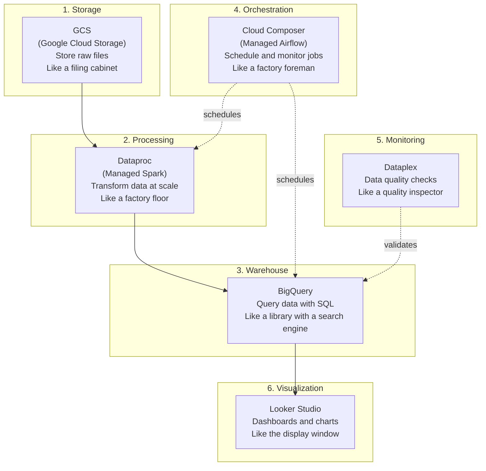
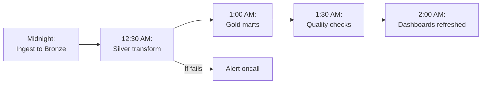
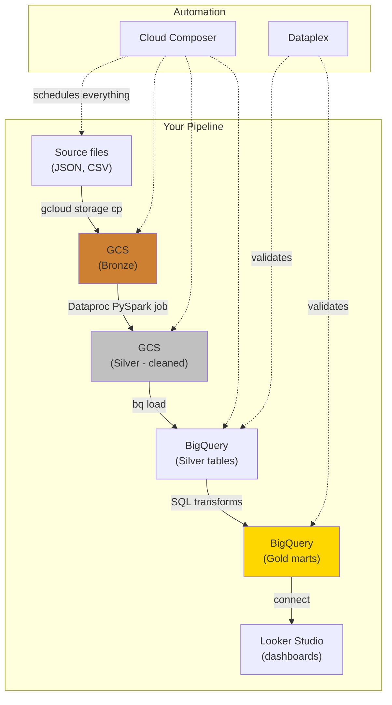

# Cloud Data Pipelines - Concepts

**Every cloud service in plain English. How they connect. What each one does in the pipeline.**

> These concepts apply to any cloud (GCP, AWS, Azure). Examples use GCP as the primary, with AWS equivalents noted. The hands-on notebooks are cloud-specific: [GCP Pipeline](../../../implementation/notebooks/GCP_Full_Pipeline.ipynb) | AWS Pipeline (coming soon).

---

## The GCP Services You Need (and Only These)

There are hundreds of GCP services. For a data pipeline, you need six. Here's what each one does, in the order your data flows through them.



---

## Service 1: GCS (Google Cloud Storage)

**What it is:** A place to store files. Any file, any size, any format.

**Analogy:** A filing cabinet with unlimited drawers. You put files in, you get files out. That's it.

**In the pipeline:** This is where Bronze lives. Raw files land here exactly as they arrived from the source.

**Key concepts:**

| Concept | Plain English |
|---|---|
| **Bucket** | A named container for files. Like a folder, but at the top level. Name must be globally unique. |
| **Object** | Any file stored in a bucket. A CSV, JSON, Parquet file. |
| **URI** | The address of a file: `gs://my-bucket/data/calls.json` |
| **Storage class** | How fast you need access. Standard (fast, expensive) vs Coldline (slow, cheap). |

**What it costs:** ~$0.02/GB/month for Standard. 1TB of raw data = ~$20/month.

**Commands you will use:**

```bash
# Create a bucket
gcloud storage buckets create gs://my-pipeline-bucket --location=us-central1

# Upload a file
gcloud storage cp calls.json gs://my-pipeline-bucket/bronze/calls/

# List files
gcloud storage ls gs://my-pipeline-bucket/bronze/

# Download a file
gcloud storage cp gs://my-pipeline-bucket/bronze/calls/calls.json ./local-copy.json
```

---

## Service 2: Dataproc (Managed Spark)

**What it is:** Apache Spark running on GCP. Google manages the servers. You write the transformation logic.

**Analogy:** A factory floor. You design what the product should look like (the transform code). The factory (Dataproc) provides the machines and workers (servers and CPUs). When the job is done, you shut down the factory and stop paying.

**In the pipeline:** This is where the Silver transform runs. Read from Bronze (GCS), clean/deduplicate/validate, write back to GCS or load into BigQuery.

**Key concepts:**

| Concept | Plain English |
|---|---|
| **Cluster** | A group of machines (VMs) that run your Spark code. You create it, use it, delete it. |
| **Master node** | The machine that coordinates the work. |
| **Worker nodes** | The machines that do the actual processing. More workers = faster processing. |
| **Job** | A PySpark script you submit to the cluster. |

**Why not just use Python on your laptop?** Because your laptop has one CPU and 16GB of RAM. Dataproc can spin up 100 CPUs and 1TB of RAM for 30 minutes, process your data, and shut down. You pay for 30 minutes, not a server running 24/7.

**Commands you will use:**

```bash
# Create a cluster (takes 2-3 minutes)
gcloud dataproc clusters create my-pipeline-cluster \
    --region=us-central1 \
    --num-workers=2 \
    --image-version=2.1-debian11

# Submit a PySpark job
gcloud dataproc jobs submit pyspark \
    gs://my-pipeline-bucket/code/silver_transform.py \
    --cluster=my-pipeline-cluster \
    --region=us-central1

# Delete the cluster when done (stop paying)
gcloud dataproc clusters delete my-pipeline-cluster --region=us-central1
```

---

## Service 3: BigQuery

**What it is:** A data warehouse. You load data in, you query it with SQL. It can scan terabytes in seconds.

**Analogy:** A library with a search engine. You organize your data into tables (books on shelves). Then you ask questions in SQL (search queries). The library finds answers across millions of rows almost instantly.

**In the pipeline:** This is where Gold lives. Star schema tables, pre-aggregated marts, ready for dashboards and ML.

**Key concepts:**

| Concept | Plain English |
|---|---|
| **Dataset** | A container for tables. Like a schema in PostgreSQL. Example: `bronze`, `silver`, `gold`. |
| **Table** | A structured set of rows and columns. Standard SQL. |
| **Partition** | Splitting a table by date so queries only scan relevant data. Saves money. |
| **Clustering** | Sorting data within partitions by frequently queried columns. Faster queries. |
| **Slot** | A unit of compute power. BigQuery automatically allocates slots for your query. |

**What it costs:** Two models:
- **On-demand:** $6.25 per TB scanned. Query 10GB = $0.06. Query 1TB = $6.25.
- **Flat-rate:** Fixed monthly price for guaranteed capacity. Better for heavy, predictable usage.

**The biggest cost mistake:** `SELECT * FROM big_table` scans every column. `SELECT name, date FROM big_table` scans only two columns. Partitioning + column selection = 10x-100x cost savings.

**Commands you will use:**

```bash
# Create a dataset
bq mk --dataset --location=us-central1 my_project:bronze
bq mk --dataset --location=us-central1 my_project:silver
bq mk --dataset --location=us-central1 my_project:gold

# Load data from GCS
bq load --source_format=CSV --autodetect \
    bronze.campaigns \
    gs://my-pipeline-bucket/bronze/campaigns/campaigns.csv

# Query
bq query --use_legacy_sql=false \
    'SELECT campaign_name, COUNT(*) as total_calls
     FROM silver.calls
     GROUP BY campaign_name
     ORDER BY total_calls DESC'
```

---

## Service 4: Cloud Composer (Managed Airflow)

**What it is:** A scheduler that runs your pipeline automatically. It knows what to run, in what order, and what to do if something fails.

**Analogy:** A factory foreman. The foreman doesn't do the work, but makes sure the Bronze job runs at midnight, the Silver job runs after Bronze completes, and the Gold job runs after Silver. If Silver fails, the foreman alerts you and doesn't start Gold.

**In the pipeline:** Orchestrates the entire flow. Without it, you're manually running scripts.



**Key concept:** A **DAG** (Directed Acyclic Graph, pronounced "dag") is a workflow definition. It says: "run task A, then B, then C. If B fails, don't run C. Retry B twice. If still failing, alert the team."

---

## Service 5: Dataplex (Data Quality)

**What it is:** Automated data quality checks. After your transform runs, Dataplex verifies the data meets your expectations.

**Analogy:** A quality inspector at the end of the assembly line. Every unit gets checked before shipping. If it doesn't meet spec, it gets pulled.

**Example checks:**
- Row count: Did we get at least 400 calls today? (Catches ingestion failures)
- Null check: Is `call_id` null in any row? (Catches schema changes)
- Range check: Is `duration` between 0 and 7200 seconds? (Catches data corruption)
- Freshness: Was the data updated in the last 24 hours? (Catches silent pipeline failures)

---

## Service 6: Looker Studio (Dashboards)

**What it is:** A visualization tool that connects directly to BigQuery. Build charts, dashboards, and reports.

**In the pipeline:** The consumer layer. This is what the VP sees. The pipeline's entire purpose is to make this reliable.

---

## How They All Connect



---

## GCP vs AWS: Quick Translation

If you know AWS, here's the mapping:

| What | GCP | AWS |
|---|---|---|
| File storage | GCS | S3 |
| Data warehouse | BigQuery | Redshift |
| Managed Spark | Dataproc | EMR |
| Orchestration | Cloud Composer | MWAA (Managed Airflow) |
| Data quality | Dataplex | Deequ / Glue DQ |
| Dashboards | Looker Studio | QuickSight |
| IAM | Cloud IAM | IAM |
| Serverless compute | Cloud Functions | Lambda |
| Streaming | Pub/Sub | Kinesis |

The concepts are identical. The service names and console UIs differ. If you learn the pipeline on GCP, you can rebuild it on AWS in a day.

---

## The Decision: Which Cloud?

For this material, we use GCP. But the choice depends on the organization:

| Factor | Choose GCP | Choose AWS |
|---|---|---|
| **Data warehouse** | BigQuery is best-in-class for SQL analytics | Redshift is good, but BigQuery is easier to start |
| **Existing cloud** | Already on GCP | Already on AWS |
| **ML integration** | Vertex AI | SageMaker |
| **Cost model** | BigQuery on-demand is simple | More complex pricing across services |
| **Market share** | #3 (growing fast) | #1 (most jobs list AWS) |

**The right answer for learning:** Pick one, learn the concepts, then translate. The pipeline patterns (Bronze/Silver/Gold, orchestration, quality checks) are the same on every cloud.

---

## Quick Links

| Chapter | Topic |
|---|---|
| [01 - Why](01_Why.md) | Why pipelines matter |
| [02 - Concepts](02_Concepts.md) | This page |
| [03 - Hello World](03_Hello_World.md) | Upload, query, see a result in 10 minutes |
