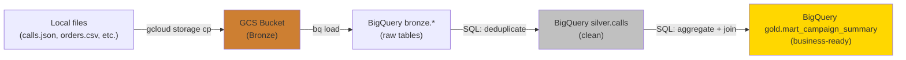

# Cloud Data Pipelines - Hello World

**Upload data to GCS, load it into BigQuery, run a query, see a result. In 10 minutes.**

---

## What You Need

- A GCP account with billing enabled
- The `gcloud` CLI installed (or use Cloud Shell in the browser)
- The call center dataset files (from `data/` in this repo)

If you don't have `gcloud` installed, open **Cloud Shell** directly in the GCP Console (click the terminal icon in the top-right). Everything below works in Cloud Shell with zero setup.

---

## Step 1: Create a Project and Enable Billing

If you already have a GCP project with billing, skip this.

```bash
# Create a project
gcloud projects create my-pipeline-project --name="Pipeline Hello World"

# Set it as the active project
gcloud config set project my-pipeline-project

# Enable billing (must be done in Console UI)
# Go to: console.cloud.google.com/billing
# Link your project to a billing account
```

**You Should See:** `Updated property [core/project].`

**Cost:** Everything in this hello world costs less than $0.50. BigQuery gives 1TB free queries per month. GCS gives 5GB free.

---

## Step 2: Create a GCS Bucket (Bronze)

```bash
# Create the bucket (name must be globally unique, use your name)
gcloud storage buckets create gs://pipeline-hello-YOUR-NAME \
    --location=us-central1

# Verify
gcloud storage ls
```

**You Should See:** `gs://pipeline-hello-YOUR-NAME/`

**What just happened:** You created a storage container in Google's data center in Iowa (us-central1). It's empty. It costs nothing until you put data in it.

---

## Step 3: Upload Data to Bronze

```bash
# Clone the repo (if you haven't already)
git clone --depth 1 https://github.com/sunilmogadati/systems-in-production.git
cd systems-in-production/data

# Upload the call center dataset
gcloud storage cp calls.json gs://pipeline-hello-YOUR-NAME/bronze/calls/
gcloud storage cp orders.csv gs://pipeline-hello-YOUR-NAME/bronze/orders/
gcloud storage cp campaigns.csv gs://pipeline-hello-YOUR-NAME/bronze/campaigns/
gcloud storage cp products.csv gs://pipeline-hello-YOUR-NAME/bronze/products/

# Verify
gcloud storage ls gs://pipeline-hello-YOUR-NAME/bronze/
```

**You Should See:**
```
gs://pipeline-hello-YOUR-NAME/bronze/calls/
gs://pipeline-hello-YOUR-NAME/bronze/campaigns/
gs://pipeline-hello-YOUR-NAME/bronze/orders/
gs://pipeline-hello-YOUR-NAME/bronze/products/
```

**What just happened:** Your raw data is now in the cloud. This is the Bronze layer. Exact copies, no changes.

---

## Step 4: Create BigQuery Datasets

```bash
# Enable the BigQuery API (first time only)
gcloud services enable bigquery.googleapis.com

# Create datasets for each layer
bq mk --dataset --location=us-central1 bronze
bq mk --dataset --location=us-central1 silver
bq mk --dataset --location=us-central1 gold

# Verify
bq ls
```

**You Should See:**
```
  datasetId
 -----------
  bronze
  silver
  gold
```

**What just happened:** You created three empty containers in BigQuery. Think of them as three folders: one for raw data, one for cleaned data, one for business-ready data.

---

## Step 5: Load Bronze Data into BigQuery

```bash
# Load campaigns (CSV with headers)
bq load --source_format=CSV --autodetect \
    bronze.campaigns \
    gs://pipeline-hello-YOUR-NAME/bronze/campaigns/campaigns.csv

# Load orders (CSV with headers)
bq load --source_format=CSV --autodetect \
    bronze.orders \
    gs://pipeline-hello-YOUR-NAME/bronze/orders/orders.csv

# Load products (CSV with headers)
bq load --source_format=CSV --autodetect \
    bronze.products \
    gs://pipeline-hello-YOUR-NAME/bronze/products/products.csv

# Load calls (JSON - note different source_format)
bq load --source_format=NEWLINE_DELIMITED_JSON --autodetect \
    bronze.calls \
    gs://pipeline-hello-YOUR-NAME/bronze/calls/calls.json
```

**You Should See** (for each load):
```
Upload complete.
Waiting on job_xxxx ... (Xs) Current status: DONE
```

**Verify:**
```bash
bq show --format=pretty bronze.calls
bq show --format=pretty bronze.campaigns
```

---

## Step 6: Query Bronze (Your First Result)

```bash
# How many calls do we have?
bq query --use_legacy_sql=false \
    'SELECT COUNT(*) as total_calls FROM bronze.calls'

# Calls per campaign
bq query --use_legacy_sql=false \
    'SELECT campaign_id, COUNT(*) as calls
     FROM bronze.calls
     GROUP BY campaign_id
     ORDER BY calls DESC'

# Find duplicates (data quality issue)
bq query --use_legacy_sql=false \
    'SELECT call_id, COUNT(*) as occurrences
     FROM bronze.calls
     GROUP BY call_id
     HAVING COUNT(*) > 1
     ORDER BY occurrences DESC'
```

**You Should See:** Row counts, campaign breakdowns, and duplicate call_ids.

**This is the hello world moment.** Raw data, in the cloud, queryable. You just built Bronze.

---

## Step 7: Build a Simple Silver Table

Now clean the data. Remove duplicates, keep only the first occurrence.

```bash
# Create a deduplicated Silver table
bq query --use_legacy_sql=false --destination_table=silver.calls \
    'SELECT * EXCEPT(row_num) FROM (
        SELECT *,
            ROW_NUMBER() OVER (PARTITION BY call_id ORDER BY call_id) as row_num
        FROM bronze.calls
    )
    WHERE row_num = 1'

# Verify: count should be less than Bronze
bq query --use_legacy_sql=false \
    'SELECT
        (SELECT COUNT(*) FROM bronze.calls) as bronze_count,
        (SELECT COUNT(*) FROM silver.calls) as silver_count'
```

**You Should See:** Silver count is less than Bronze count (duplicates removed).

**What just happened:** You deduplicated the data. Bronze still has the duplicates (raw copy). Silver has clean data. This is the simplest possible Silver transform.

---

## Step 8: Build a Simple Gold Mart

Create a business-ready table that answers: "How did each campaign perform?"

```bash
bq query --use_legacy_sql=false --destination_table=gold.mart_campaign_summary \
    'SELECT
        c.campaign_id,
        camp.campaign_name,
        COUNT(c.call_id) as total_calls,
        COUNT(o.order_id) as total_orders,
        ROUND(COUNT(o.order_id) / COUNT(c.call_id) * 100, 1) as conversion_rate_pct
     FROM silver.calls c
     LEFT JOIN bronze.campaigns camp ON c.campaign_id = camp.campaign_id
     LEFT JOIN bronze.orders o ON c.call_id = o.call_id
     GROUP BY c.campaign_id, camp.campaign_name
     ORDER BY total_calls DESC'

# See the result
bq query --use_legacy_sql=false \
    'SELECT * FROM gold.mart_campaign_summary'
```

**You Should See:** A clean table showing campaign performance with conversion rates.

---

## What You Just Built



In 10 minutes, you:
1. Stored raw data in the cloud (Bronze)
2. Loaded it into a warehouse (BigQuery)
3. Cleaned it (Silver - deduplication)
4. Built a business mart (Gold - campaign summary)
5. Answered: "Which campaign converts best?"

This is a complete pipeline. Everything that follows in this material makes it more robust, more automated, and production-grade. But the core pattern is exactly this.

---

## Clean Up (Avoid Charges)

```bash
# Delete the bucket and all data
gcloud storage rm --recursive gs://pipeline-hello-YOUR-NAME

# Delete BigQuery datasets
bq rm -r -f bronze
bq rm -r -f silver
bq rm -r -f gold
```

Or keep it running. The data is small enough to stay within the free tier.

---

## What's Next

| Next Step | What You Learn |
|---|---|
| **Silver transforms with PySpark** | Handle complex cleaning at scale (Dataproc) |
| **Gold star schema design** | Fact and dimension tables, surrogate keys |
| **Orchestration** | Automate the pipeline with Cloud Composer |
| **Data quality** | Automated checks with Dataplex |
| **Cost optimization** | Partitioning, clustering, storage classes |

---

## Quick Links

| Chapter | Topic |
|---|---|
| [01 - Why](01_Why.md) | Why pipelines matter |
| [02 - Concepts](02_Concepts.md) | Cloud services in plain English |
| [03 - Hello World](03_Hello_World.md) | This page |
