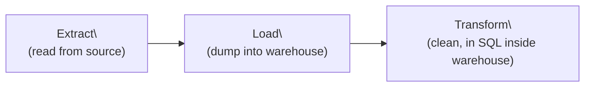
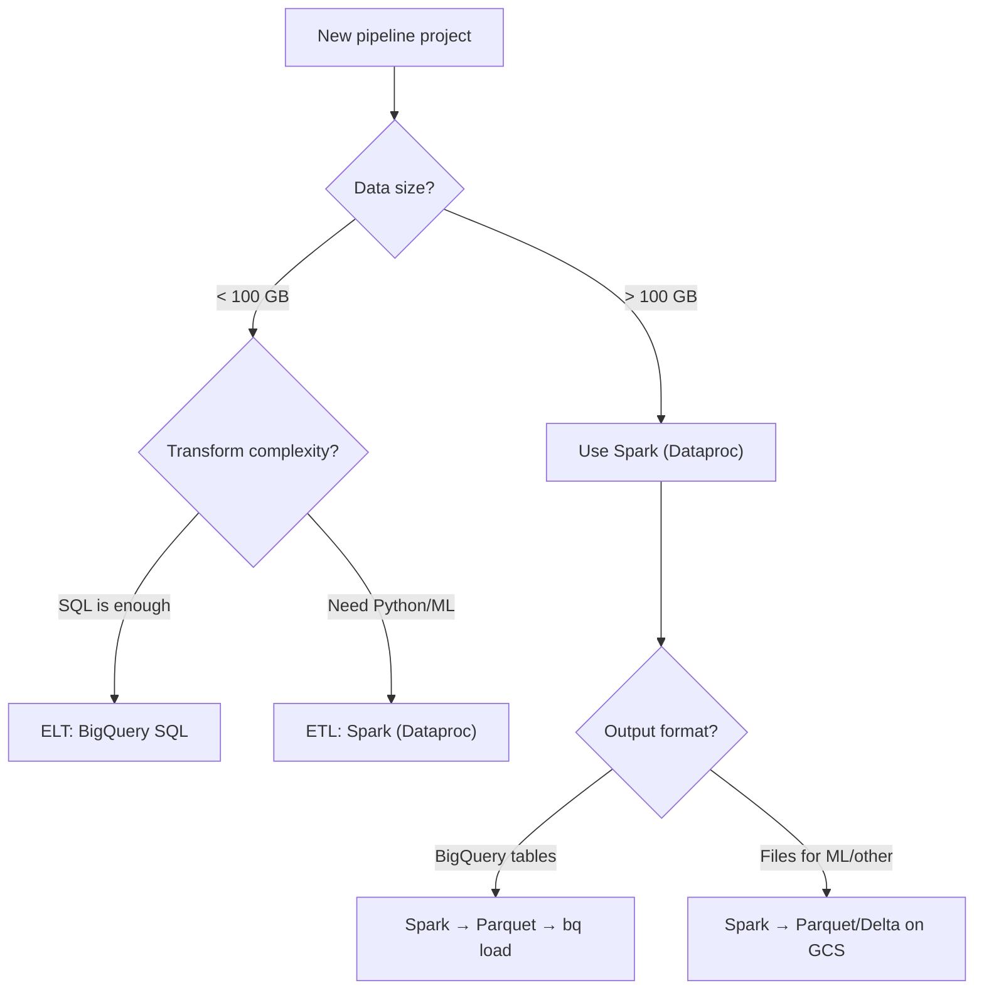

# Cloud Data Pipelines - Scale (Spark, Dataproc, ETL vs ELT)

**When BigQuery SQL isn't enough. Distributed compute for large-scale transforms.**

> These concepts apply to any cloud (GCP, AWS, Azure). Examples use GCP as the primary, with AWS equivalents noted. The hands-on notebooks are cloud-specific: [GCP Pipeline](../../../implementation/notebooks/GCP_Full_Pipeline.ipynb) | AWS Pipeline (coming soon).

---

## When Do You Need Spark?

Everything we built so far uses BigQuery SQL for transforms. That works until it doesn't.

| Situation | BigQuery SQL | Spark (Dataproc) |
|---|---|---|
| Dedup 500 calls | 1 second | Overkill |
| Dedup 50 million calls | 30 seconds | Overkill |
| Dedup 5 billion calls | Minutes, expensive | Same minutes, cheaper compute |
| Parse nested JSON 20 levels deep | Painful in SQL | Natural in Python |
| ML feature engineering (rolling windows, embeddings) | Limited | Built for this |
| Write to multiple formats (Parquet, Delta, Iceberg) | BigQuery tables only | Any format, any location |
| Custom validation logic with Python libraries | Not possible | Full Python ecosystem |

**Rule of thumb:** If your transform is pure SQL and data fits in BigQuery comfortably, stay with BigQuery. If you need Python logic, complex parsing, or ML features, use Spark.

---

## What Is Spark?

A distributed compute engine. You write code that looks like it runs on one machine, but Spark splits the work across many machines automatically.

**Analogy:** You need to sort 1 million letters by zip code. 

- **One person (your laptop):** Months
- **100 people, each sorting 10,000 letters (Spark):** Hours
- **You write the sorting instructions once. Spark distributes the work.**

---

## What Is Dataproc?

Google's managed Spark. You create a cluster (group of machines), submit your code, it runs, you delete the cluster.


**You pay only for the time the cluster is running.** A 10-node cluster running for 30 minutes costs about $5. Then it's gone.

---

## ETL vs ELT

Two patterns for moving and transforming data. The difference is WHERE the transform happens.

### ETL: Extract, Transform, Load


- Transform happens BEFORE loading into the warehouse
- Spark reads raw files from GCS, transforms them, writes clean data to GCS or BigQuery
- The warehouse only sees clean data

**When to use:** Large data, complex transforms, need Python/ML logic

### ELT: Extract, Load, Transform



- Load raw data into the warehouse first
- Transform inside the warehouse using SQL
- The warehouse sees raw data, then you create clean views/tables

**When to use:** Data fits in warehouse, transforms are SQL-expressible, team prefers SQL

### What We Did

Our GCP pipeline is **ELT**:
1. Extract: Files from GCS
2. Load: `bq load` into BigQuery `raw` dataset
3. Transform: SQL `CREATE TABLE silver.*` inside BigQuery

If we used Spark for the Silver transform, it would be **ETL**:
1. Extract: Spark reads from GCS
2. Transform: PySpark dedup, clean, type-fix
3. Load: Write Parquet to GCS, then `bq load` into BigQuery

| Factor | ETL (Spark first) | ELT (SQL in warehouse) |
|---|---|---|
| Transform language | Python/PySpark | SQL |
| Where compute happens | Dataproc cluster (you manage) | BigQuery (Google manages) |
| Cost model | Pay for cluster time | Pay per TB scanned |
| Flexibility | Full Python ecosystem | SQL only |
| Team skill | Need Python + Spark skills | SQL is enough |
| Best for | Large, complex transforms | SQL-friendly transforms |

**Most teams start with ELT (simpler). They add ETL (Spark) when SQL isn't enough.**

---

## A Complete Spark Silver Transform

Here's the same Silver logic from our BigQuery SQL, rewritten in PySpark:

```python
# silver_transform.py
# Submit to Dataproc: gcloud dataproc jobs submit pyspark ...

from pyspark.sql import SparkSession
from pyspark.sql.functions import (
    col, row_number, lower, trim, when, lit,
    to_timestamp, from_utc_timestamp, date_format, hour
)
from pyspark.sql.window import Window

# Initialize Spark
spark = SparkSession.builder.appName("SilverTransform").getOrCreate()

# =============================================
# BRONZE: Read raw data from GCS
# =============================================
BUCKET = "gs://my-pipeline"

calls = spark.read.json(f"{BUCKET}/bronze/calls.json")
orders = spark.read.csv(f"{BUCKET}/bronze/orders.csv", header=True, inferSchema=True)

print(f"Bronze calls: {calls.count()} rows")
print(f"Bronze orders: {orders.count()} rows")

# =============================================
# SILVER: Clean calls
# =============================================

# Dedup: keep first occurrence by call_id
window = Window.partitionBy("call_id").orderBy("start_time")

silver_calls = (calls
    # Dedup
    .withColumn("row_num", row_number().over(window))
    .filter(col("row_num") == 1)
    .drop("row_num")
    
    # Timezone: UTC to Eastern
    .withColumn("call_started_local", 
                from_utc_timestamp(col("start_time"), "US/Eastern"))
    .withColumn("call_ended_local",
                from_utc_timestamp(col("end_time"), "US/Eastern"))
    .withColumn("call_date_local",
                date_format(col("call_started_local"), "yyyy-MM-dd"))
    .withColumn("call_hour_local",
                hour(col("call_started_local")))
    
    # Standardize text
    .withColumn("disposition", lower(trim(col("disposition"))))
    .withColumn("call_type", trim(col("channel")))
    
    # Flag nulls (don't drop)
    .withColumn("has_missing_duration", col("duration").isNull())
    .withColumn("has_missing_disposition", col("disposition").isNull())
)

# SILVER: Clean orders
window_orders = Window.partitionBy("order_id").orderBy(col("order_date").desc())

silver_orders = (orders
    .withColumn("row_num", row_number().over(window_orders))
    .filter(col("row_num") == 1)
    .drop("row_num")
)

# =============================================
# WRITE: Save Silver to GCS as Parquet
# =============================================

silver_calls.write.mode("overwrite") \
    .partitionBy("call_date_local") \
    .parquet(f"{BUCKET}/silver/calls/")

silver_orders.write.mode("overwrite") \
    .parquet(f"{BUCKET}/silver/orders/")

print(f"Silver calls: {silver_calls.count()} rows")
print(f"Silver orders: {silver_orders.count()} rows")
print("Silver transform complete.")

spark.stop()
```

### Submit to Dataproc

```bash
# Step 1: Create cluster
gcloud dataproc clusters create pipeline-cluster \
    --region=us-central1 \
    --num-workers=2 \
    --image-version=2.1-debian11

# Step 2: Upload script
gcloud storage cp silver_transform.py gs://my-pipeline/code/

# Step 3: Submit job
gcloud dataproc jobs submit pyspark \
    gs://my-pipeline/code/silver_transform.py \
    --cluster=pipeline-cluster \
    --region=us-central1

# Step 4: Delete cluster (stop paying)
gcloud dataproc clusters delete pipeline-cluster \
    --region=us-central1
```

---

## Dataproc vs BigQuery SQL: Side by Side

Same transform, two approaches:

**BigQuery SQL (ELT):**
```sql
CREATE OR REPLACE TABLE silver.calls AS
SELECT * EXCEPT(row_num)
FROM (
    SELECT *,
        ROW_NUMBER() OVER (PARTITION BY call_id ORDER BY start_time) AS row_num
    FROM raw.calls
)
WHERE row_num = 1
```

**PySpark on Dataproc (ETL):**
```python
window = Window.partitionBy("call_id").orderBy("start_time")
silver = (calls
    .withColumn("row_num", row_number().over(window))
    .filter(col("row_num") == 1)
    .drop("row_num"))
silver.write.parquet("gs://bucket/silver/calls/")
```

**Same logic. Same result. Different execution engine.** Use whichever fits your team and data size.

---

## The AWS Equivalent

| GCP | AWS | What It Does |
|---|---|---|
| Dataproc | EMR (Elastic MapReduce) | Managed Spark clusters |
| GCS (for Parquet) | S3 | File storage for transformed data |
| BigQuery | Redshift or Athena | Query engine for Gold layer |
| Dataproc Serverless | EMR Serverless | Spark without managing clusters |

---

## Delta Lake and Iceberg (Advanced)

When you write Parquet files to GCS, they're just files. If two jobs write at the same time, you get corrupted data. If you need to update one record, you rewrite the entire file.

**Delta Lake** and **Apache Iceberg** solve this by adding a transaction layer on top of files:

| Feature | Plain Parquet | Delta Lake / Iceberg |
|---|---|---|
| ACID transactions | No | Yes |
| Update/delete single rows | Rewrite entire file | MERGE, UPDATE, DELETE |
| Time travel (query old versions) | No | Yes |
| Schema evolution | Manual | Automatic |
| Concurrent writes | Corruption risk | Safe |

For this material, we use plain Parquet (simpler). When you need transactions on files, Delta Lake or Iceberg is the next step.

---

## Decision Guide: Which Approach When?



**Start with ELT (BigQuery SQL). Add Spark when you need it.** Don't over-engineer.

---

## Quick Links

| Chapter | Topic |
|---|---|
| [01 - Why](01_Why.md) | Why pipelines matter |
| [02 - Concepts](02_Concepts.md) | Cloud services in plain English |
| [03 - Hello World](03_Hello_World.md) | Upload, query, see a result |
| [04 - Automation](04_Automation.md) | Event-driven triggers |
| [05 - Orchestration](05_Orchestration.md) | DAGs, scheduling, failure handling |
| [06 - Scale](06_Scale.md) | This page |
