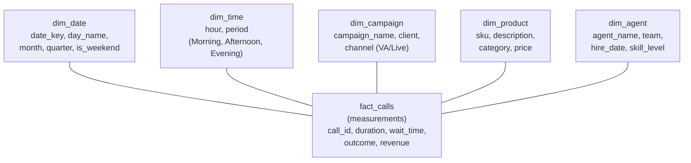
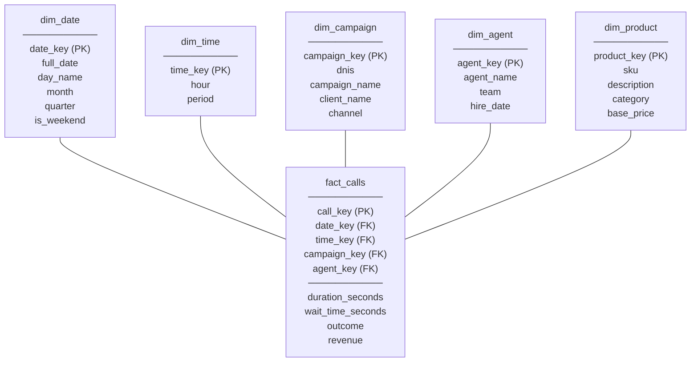

# Data Modeling — Concepts and Mental Models

**The architecture of analytical data — star schema, dimensions, facts, and the decisions that shape them.**

---

> **Glossary note:** Every term is explained in context when it first appears. A full reference glossary is at the end of this chapter.

---

## The Big Picture — From Flat Files to a Star

The call center data arrives as flat files — CSVs and JSON with everything jammed together. A single `calls` record contains the call timestamp, the agent name, the campaign name, the product ordered, the payment method — all in one row. This works for recording calls. It fails for analysis.

**The problem with one big table:**

| Question | What Goes Wrong |
|:---|:---|
| "Average wait time by campaign" | Campaign name is a string repeated in every row. Typos ("Spring Promo" vs "spring promo") split the results. |
| "Revenue by product category for March" | Product info is duplicated across orders. Update the price? Now some rows have the old price, some the new. |
| "Calls by day of week" | The timestamp is a raw datetime. Every query has to extract the day name at runtime. Slow. |
| "How many calls did Agent X handle before and after training?" | No history. If Agent X's team changed, the old team name is overwritten. |

Data modeling solves every one of these by **separating the measurements (facts) from the context (dimensions).**

---

## Star Schema — The Gold Standard

A **star schema** has one **fact table** at the center, surrounded by **dimension tables** — like a hub and spokes.



### Fact Table — The Measurements

The fact table contains **what happened** — the numbers, the events, the transactions. Each row is one measurable event: one call, one order, one payment.

| Column Type | Examples | Analogy |
|:---|:---|:---|
| **Keys** (foreign keys pointing to dimensions) | date_key, campaign_key, agent_key | The addresses on an envelope — they tell you where to look for context |
| **Measures** (the numbers being analyzed) | duration_seconds, wait_time_seconds, revenue | The contents of the envelope — the actual data being measured |
| **Degenerate dimensions** (identifiers with no separate table) | call_id, order_number | A reference number — useful for tracing back to the source, but no separate lookup table needed |

**Key rule:** Fact tables are **tall and narrow.** Millions of rows (one per event), but relatively few columns (keys + measures). The context lives in the dimension tables, not here.

### Dimension Tables — The Context

Dimension tables contain **the who, what, when, where** that makes the fact table numbers meaningful. Without dimensions, "duration = 342 seconds" is meaningless. With dimensions, it becomes "a 5.7-minute call on Monday morning for the Spring Health Promo campaign, handled by Agent Sarah on the VA channel."

| Dimension | What It Answers | Why a Separate Table |
|:---|:---|:---|
| **dim_date** | When? Day name, weekend flag, month, quarter, fiscal year | Pre-computed calendar. Analysts filter by "weekday vs weekend" without parsing timestamps. |
| **dim_time** | What time of day? Hour, period (Morning, Afternoon, Evening, Night) | Enables "calls by time of day" without extracting hours at query time. |
| **dim_campaign** | Which marketing campaign? Client name, channel (VA vs Live Agent) | Campaign attributes change — a campaign might switch from VA to Live. The dimension tracks this. |
| **dim_product** | What was sold? SKU, description, category, price | Product info lives in one place. Update the price once, it is correct everywhere. |
| **dim_agent** | Who handled the call? Name, team, hire date, skill level | Agent attributes change — they get promoted, switch teams. The dimension can track history (SCD, below). |

**Key rule:** Dimension tables are **short and wide.** Relatively few rows (hundreds to thousands — one per product, one per campaign, one per agent), but many descriptive columns.

### Why "Star"?

Draw the fact table in the center. Draw each dimension table around it with a line connecting them. It looks like a star. That is the entire reason for the name.

---

## Surrogate Keys — Why Not Just Use the Campaign Name?

A **surrogate key** (pronounced "SUR-uh-git") is an auto-incrementing integer that uniquely identifies each row in a dimension table. It replaces the **natural key** (the business identifier — campaign name, product SKU, phone number).

| | Natural Key | Surrogate Key |
|:---|:---|:---|
| Example | `'Spring Health Promo'` (text) | `3` (integer) |
| Join speed | Slow (string comparison) | Fast (integer comparison) |
| Stability | Can change ("Spring Promo" renamed to "Q1 Health Campaign") | Never changes |
| Size | Variable (5-100+ bytes) | Fixed (4 bytes) |
| Nulls / gaps | Possible ("" or NULL in source data) | Never — auto-incremented |

**The rule:** Every dimension table gets a surrogate key as its primary key. The fact table stores surrogate keys as foreign keys. Joins are integer-to-integer — fast and reliable.

The natural key still exists in the dimension table as a column — it is how the ETL (Extract, Transform, Load, pronounced "E-T-L") process matches incoming data to existing dimension rows. But it is not the join key.

---

## Slowly Changing Dimensions (SCD) — When Context Changes Over Time

Dimension data changes. An agent gets promoted. A campaign switches channels. A product's price changes. How do you handle it?

**The analogy:** Imagine a phone book. Your neighbor moves. Do you:
- **Overwrite** their old address with the new one? (Simple, but the old address is gone forever.)
- **Add a new line** with the new address, mark the old one as expired, keep both? (More complex, but you have history.)
- **Add a "previous address" column** next to the current one? (Compromise — you keep one level of history.)

Those are the three SCD types:

### SCD Type 1 — Overwrite (No History)

| agent_key | agent_name | team |
|:---|:---|:---|
| 7 | Sarah | Sales → **Support** (overwritten) |

Old value is gone. Simple. Use when history does not matter ("we corrected a typo in the agent's name").

### SCD Type 2 — Add a New Row (Full History)

| agent_key | agent_name | team | effective_date | expiry_date | is_current |
|:---|:---|:---|:---|:---|:---|
| 7 | Sarah | Sales | 2025-01-15 | 2026-03-01 | N |
| 12 | Sarah | Support | 2026-03-01 | 9999-12-31 | Y |

Two rows for Sarah. The old row is expired (is_current = N). The new row is active. Any query filtering `WHERE is_current = 'Y'` gets the current state. Any query joining on date range gets the historical state.

**Use when:** You need to know what the value was at the time of the event. "When this call happened in February, Sarah was on the Sales team — even though she is on Support now." This matters for accurate historical reporting.

### SCD Type 3 — Previous Value Column (Limited History)

| agent_key | agent_name | current_team | previous_team |
|:---|:---|:---|:---|
| 7 | Sarah | Support | Sales |

One row, two columns. You keep exactly one level of history. Simple, but only tracks one change.

### When to Use Which

| Scenario | SCD Type | Why |
|:---|:---|:---|
| Fix a typo in campaign name | **Type 1** (overwrite) | Not a real change — just a correction. No history needed. |
| Agent changes teams | **Type 2** (full history) | Historical reports must show the team at the time of the call, not the current team. |
| Product price changes quarterly | **Type 2** | Revenue calculations need the price at time of purchase, not today's price. |
| Company rebrands a product category | **Type 1 or 3** | If nobody reports on the old category, overwrite. If one level of comparison matters, Type 3. |

> **Default:** Use SCD Type 2 for anything that affects reporting accuracy over time. Use Type 1 for corrections and attributes nobody reports on historically.

---

## Normalization vs Denormalization — Two Philosophies

| | Normalized (OLTP) | Denormalized (OLAP / Star Schema) |
|:---|:---|:---|
| **Goal** | Eliminate redundancy. Each fact lives in exactly one place. | Optimize for fast reads and simple queries. Allow controlled redundancy. |
| **Joins** | Many tables, many joins | Few joins — fact + dimension, that is it |
| **Write speed** | Fast (update one place) | Slower (update dimension, may need to update multiple rows) |
| **Read speed** | Slow (many joins for a single question) | Fast (pre-joined structure, simple GROUP BY queries) |
| **Used for** | Transactional systems (OLTP) — the phone system recording calls | Analytical systems (OLAP) — the dashboard answering business questions |

**The call center's operational database** is normalized — separate tables for agents, campaigns, products, all linked by foreign keys, no duplication. Fast for recording one call.

**The star schema we build** is denormalized — dimension tables may contain pre-joined data (campaign name + client name + channel all in one table, not three). Slower to update, but queries like "revenue by campaign by channel" require one simple join instead of four.

> **The principle:** OLTP and OLAP serve different masters. The operational system serves the application. The analytical model serves the decision-maker. Never try to use one for both — the tradeoffs are opposite.

---

## Star Schema vs Snowflake Schema

A **snowflake schema** normalizes the dimension tables — breaking them into sub-dimensions.

**Star:** `fact_calls` → `dim_campaign` (contains campaign_name, client_name, channel)

**Snowflake:** `fact_calls` → `dim_campaign` (contains campaign_key, campaign_name) → `dim_client` (contains client_key, client_name) → `dim_channel` (contains channel_key, channel_name)

| | Star | Snowflake |
|:---|:---|:---|
| Query simplicity | Simple — one join per dimension | Complex — multiple joins to reach an attribute |
| Storage | Slightly more (redundancy in dimensions) | Slightly less |
| Performance | Faster reads (fewer joins) | Slower reads |
| When to use | **Default.** Most analytical workloads. BigQuery, Redshift, Snowflake (the product) all optimize for star. | When dimension tables are very large (millions of rows) and storage matters. Rare in practice. |

> **Default:** Star schema. Snowflake is an optimization for edge cases. If a dimension table has 50 rows (campaigns) or 10,000 rows (products), the redundancy costs nothing. Snowflaking it adds join complexity for zero benefit.

---

## Partitioning and Clustering — Physical Organization

Data modeling defines the **logical** structure (which tables, which columns). Partitioning and clustering define the **physical** structure (how the data is stored on disk / in the warehouse).

### Partitioning

**Partitioning** divides a table into segments based on a column value — typically a date. When a query filters on that column, the engine reads only the relevant partition instead of scanning the entire table.

**The analogy:** A library organized by year. If someone asks for a 2025 book, you go to the 2025 shelf. You do not scan every shelf in the building. The library is the table. Each shelf is a partition. The year is the partition key.

| Without Partitioning | With Partitioning (by date) |
|:---|:---|
| Query scans 50 million rows | Query scans 170K rows (one day) |
| Cost: $2.50 per query (BigQuery pricing = bytes scanned) | Cost: $0.008 per query |

**BigQuery syntax:**
```sql
CREATE TABLE fact_calls
PARTITION BY DATE(call_timestamp)
AS SELECT * FROM raw_calls;
```

### Clustering (BigQuery) / Bucketing (Hive/Spark)

**Clustering** further organizes data within each partition by sorting on additional columns. When a query filters on clustered columns, the engine skips irrelevant blocks.

```sql
CREATE TABLE fact_calls
PARTITION BY DATE(call_timestamp)
CLUSTER BY campaign_key, agent_key
AS SELECT * FROM raw_calls;
```

Now a query filtering by date AND campaign reads only the relevant date partition AND the relevant campaign blocks within it.

### When to Partition and Cluster

| Your Data | Partition By | Cluster By |
|:---|:---|:---|
| Time-series (calls, events, transactions) | Date/timestamp column | Most frequently filtered columns (campaign, agent, channel) |
| Slowly growing reference data | Usually not needed | — |
| Very large dimension tables (rare) | Consider partitioning if > 1M rows | — |

> **Rule of thumb for BigQuery:** If the table is > 1 GB, partition it. If queries commonly filter on 2-3 specific columns, cluster on those columns. For tables under 1 GB, BigQuery is fast enough without partitioning.

---

## The Call Center Star Schema — The Complete Picture

This is what the material builds toward. Every concept above applied to the call center dataset:



The fact table contains one row per call (510 rows in the sample). Each foreign key points to a dimension table. Any analytical question — "average wait time by day of week by campaign by channel" — is a simple `GROUP BY` with joins to the relevant dimensions.

---

## Glossary — Quick Reference

| Term | Full Form | Pronounced | What It Means |
|:---|:---|:---|:---|
| **OLTP** | Online Transaction Processing | "oh-ell-tee-pee" | Database optimized for recording one transaction at a time (the cash register) |
| **OLAP** | Online Analytical Processing | "oh-lap" | Database optimized for reading/analyzing millions of records (the monthly report) |
| **ETL** | Extract, Transform, Load | "E-T-L" | Pipeline pattern: pull data from source, clean/transform it, load into the warehouse |
| **ELT** | Extract, Load, Transform | "E-L-T" | Modern variant: load raw data first, transform inside the warehouse (BigQuery handles this well) |
| **Star schema** | — | "star SKEE-muh" | Fact table at center, dimension tables around it. The standard analytical model. |
| **Snowflake schema** | — | "SNOW-flake SKEE-muh" | Star schema with normalized dimensions (sub-tables). Rarely needed. |
| **Fact table** | — | "fact table" | Contains measurements/events — one row per transaction. Tall and narrow. |
| **Dimension table** | — | "dih-MEN-shun table" | Contains context (who, what, when, where). Short and wide. |
| **Surrogate key** | — | "SUR-uh-git key" | Auto-incrementing integer ID replacing the business identifier. Fast, stable. |
| **Natural key** | — | "NATCH-ur-ul key" | The business identifier (campaign name, SKU). Exists in the dimension but is not the join key. |
| **SCD** | Slowly Changing Dimension | "S-C-D" | How to handle dimension changes over time (Type 1: overwrite, Type 2: add row, Type 3: add column) |
| **FK** | Foreign Key | "F-K" or "foreign key" | A column in one table that references the primary key of another table |
| **PK** | Primary Key | "P-K" or "primary key" | The unique identifier for each row in a table |
| **3NF** | Third Normal Form | "third normal form" | A normalization level where every non-key column depends only on the primary key. No transitive dependencies. |
| **Partitioning** | — | "par-TISH-un-ing" | Dividing a table into segments by a column value (usually date) so queries scan less data |
| **Clustering** | — | "KLUS-ter-ing" | Sorting data within partitions by additional columns for even faster filtered queries |
| **BigQuery** | — | "big KWEER-ee" | Google's serverless data warehouse. SQL-based. Pay per query (bytes scanned). |
| **GCS** | Google Cloud Storage | "G-C-S" | Google's object storage (equivalent of AWS S3). Where raw files land before loading into BigQuery. |

---

**Next:** [03 — Hello World](03_Hello_World.md) — Build the call center star schema in BigQuery. Upload, model, query — in 15 minutes.
