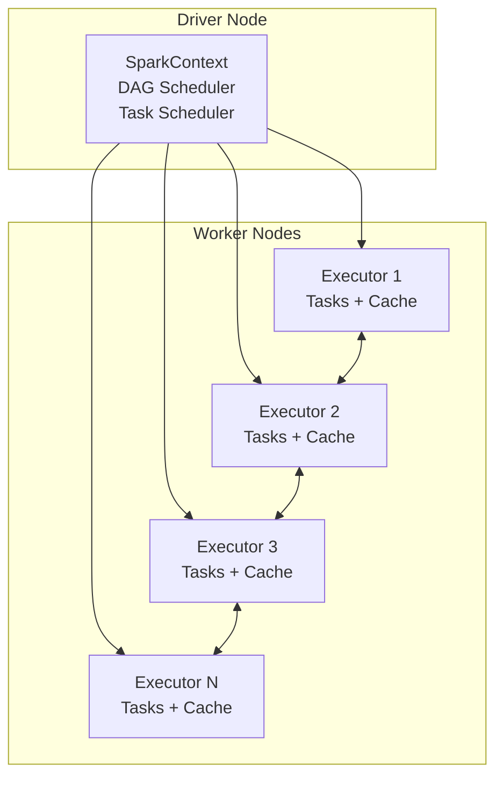
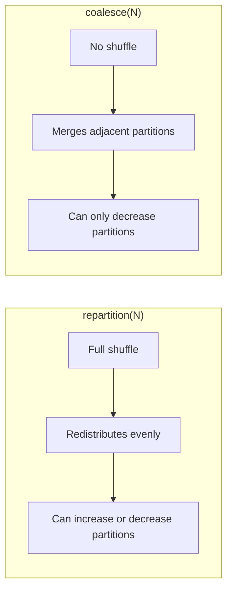
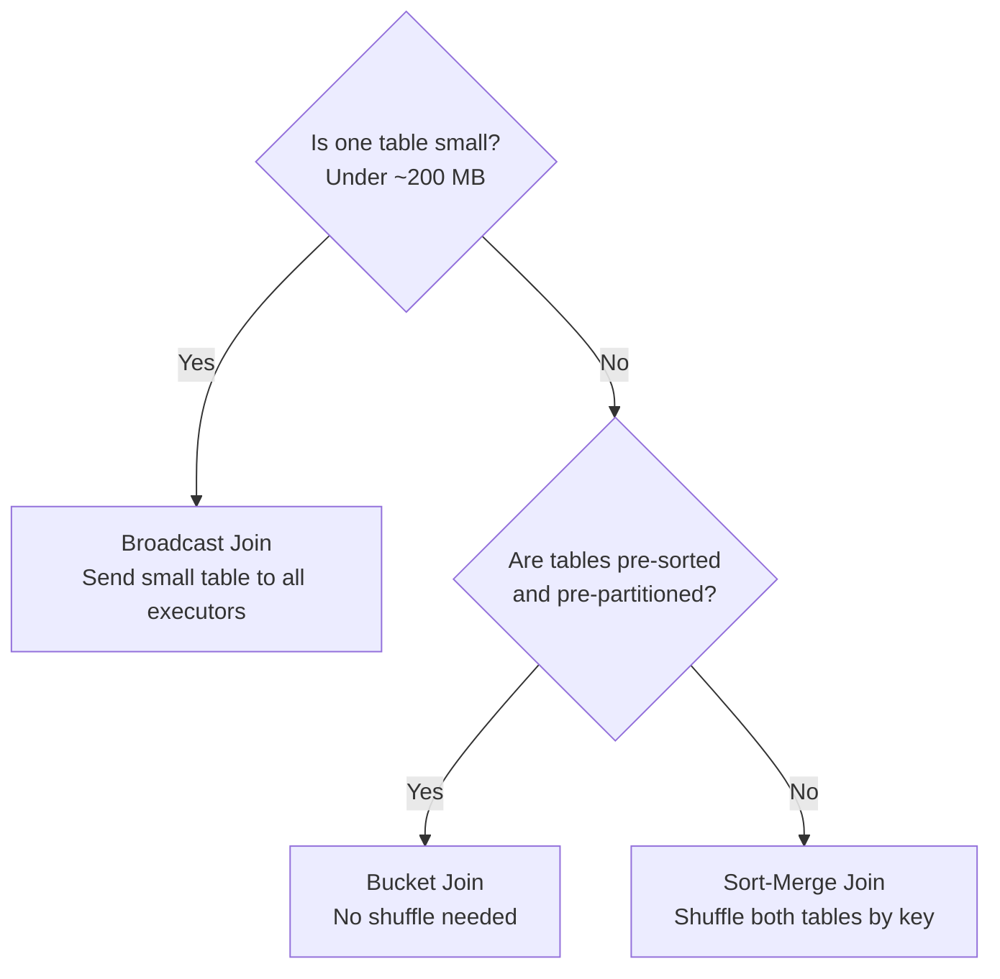
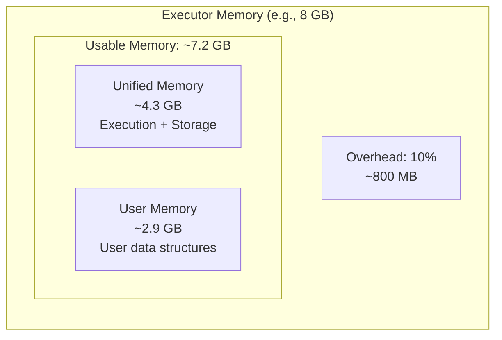

# PySpark - System Design

> How to size clusters, choose join strategies, handle skew, and reason about cost -- the decisions that determine whether your Spark job runs in 5 minutes or 5 hours.

---

## Cluster Architecture

Before sizing anything, understand what you are sizing.



- **Driver:** The coordinator. It plans work (builds the DAG -- Directed Acyclic Graph), assigns tasks to executors, and collects results. It does not process data itself.
- **Executors:** The workers. Each executor runs tasks (units of work on partitions of data) and caches data in memory.

**Analogy:** The driver is the project manager. Executors are the construction crews. The project manager plans, assigns, and tracks -- but never picks up a hammer.

---

## Cluster Sizing Rules of Thumb

There is no universal formula, but these heuristics get you within range on the first attempt.

### Starting Point

| Data Size (compressed) | Workers | Worker Type (GCP) | Total Cores | Total Memory |
|---|---|---|---|---|
| < 10 GB | 2 | n2-standard-4 | 8 | 32 GB |
| 10 - 50 GB | 4 | n2-standard-8 | 32 | 128 GB |
| 50 - 200 GB | 8 | n2-standard-8 | 64 | 256 GB |
| 200 GB - 1 TB | 16 | n2-highmem-8 | 128 | 1 TB |
| > 1 TB | 20+ | n2-highmem-16 | 320+ | 2.5 TB+ |

### Memory Rules

- **Executor memory:** 4-8 GB per core is a safe starting range.
- **Driver memory:** 2-4 GB for most jobs. Increase only if you `collect()` results to the driver.
- **Memory overhead:** Spark reserves 10% (minimum 384 MB) for off-heap use (internal bookkeeping, serialization buffers). If your executor has 8 GB, only ~7.2 GB is usable.
- **Shuffle memory fraction:** By default, 30% of executor memory is reserved for shuffles. Heavy shuffle jobs (lots of `groupBy`, `join`) may need this increased.

```python
# Typical Dataproc cluster creation with sizing
# gcloud dataproc clusters create my-cluster \
#     --num-workers=4 \
#     --worker-machine-type=n2-standard-8 \
#     --properties="spark:spark.executor.memory=6g,spark:spark.driver.memory=4g"
```

---

## Partitioning Strategy

Partitions are how Spark divides data for parallel processing. Too few partitions means idle cores. Too many means overhead from scheduling thousands of tiny tasks.

### Target: 128 MB per partition

This is the sweet spot for most workloads. Calculate:

```
Number of partitions = Total data size / 128 MB
Example: 50 GB dataset = 50,000 MB / 128 MB = ~390 partitions
```

### Partition by Date (for storage)

When writing data to disk, partition by the column you will most often filter on -- usually date.

```python
df.write \
    .partitionBy("order_date") \
    .parquet("gs://data-lake/orders/")
```

This creates directory structure like `orders/order_date=2026-04-04/`. Queries that filter on date read only the relevant directories (partition pruning).

### Repartition vs. Coalesce



| Operation | Shuffle? | Direction | When to Use |
|---|---|---|---|
| `repartition(N)` | Yes | Increase or decrease | Before a large join (even out skew) |
| `repartition(N, "col")` | Yes | Increase or decrease | Co-partition two DataFrames on the join key |
| `coalesce(N)` | No | Decrease only | Before writing (reduce small files) |

**Rule:** Use `coalesce` to reduce partitions (cheaper). Use `repartition` when you need to increase partitions or rebalance skewed data.

---

## Join Strategies

Joins are the most expensive operation in Spark. Choosing the right strategy can mean 10x or 100x performance differences.



### Broadcast Join (small + large)

Spark sends the entire small table to every executor. No shuffle of the large table.

```python
from pyspark.sql.functions import broadcast

# Explicit broadcast -- forces Spark to send dim_product to all executors
result = orders_df.join(
    broadcast(products_df),   # products_df is small (< 200 MB)
    on="product_id"
)
```

**When:** One table fits in executor memory (typically under 200 MB). Spark auto-broadcasts tables under `spark.sql.autoBroadcastJoinThreshold` (default 10 MB), but you should raise this or use explicit `broadcast()` for tables you know are small.

### Sort-Merge Join (large + large)

Both tables are shuffled so that matching keys land on the same executor, then merged in sorted order.

```python
# Spark picks sort-merge join automatically for large-large joins
result = orders_df.join(customers_df, on="customer_id")
```

**When:** Both tables are large. This is the default for big joins. Expensive because of the shuffle, but it works at any scale.

### Bucket Join (pre-organized)

If you write both tables bucketed by the join key, Spark can skip the shuffle entirely.

```python
# Write bucketed (one-time cost)
orders_df.write.bucketBy(256, "customer_id").sortBy("customer_id") \
    .saveAsTable("orders_bucketed")
customers_df.write.bucketBy(256, "customer_id").sortBy("customer_id") \
    .saveAsTable("customers_bucketed")

# Join without shuffle
result = spark.table("orders_bucketed").join(
    spark.table("customers_bucketed"),
    on="customer_id"
)
```

**When:** Tables are joined repeatedly on the same key. The upfront bucketing cost pays for itself over many queries.

---

## Handling Data Skew

Data skew means one partition has dramatically more data than others. One executor does all the work while the rest sit idle.

**Analogy:** Imagine a checkout line at a grocery store. If one line has 50 people and the other 9 lines have 3 people each, the store's throughput is bottlenecked on that single line.

### Detecting Skew

In the Spark UI, look at the **Stage Detail** page. If the max task duration is 10x or more the median task duration, you have skew.

### Fix 1: Adaptive Query Execution (AQE)

Spark 3.x includes AQE, which automatically splits skewed partitions at runtime.

```python
spark.conf.set("spark.sql.adaptive.enabled", "true")                  # Default in Spark 3.2+
spark.conf.set("spark.sql.adaptive.skewJoin.enabled", "true")         # Auto-split skewed partitions
spark.conf.set("spark.sql.adaptive.skewJoin.skewedPartitionFactor", "5")
```

**Try AQE first.** It handles most skew cases without code changes.

### Fix 2: Salting (manual)

For severe skew that AQE cannot resolve, add a random "salt" to the join key to spread hot keys across multiple partitions.

```python
from pyspark.sql.functions import expr, concat, lit

NUM_SALTS = 10

# Salt the skewed (large) table -- append a random number to the key
salted_orders = orders_df.withColumn(
    "salted_key",
    concat(col("customer_id"), lit("_"), (expr("rand() * 10").cast("int")))
)

# Explode the small table -- create 10 copies of each row, one per salt value
from pyspark.sql.functions import explode, array, sequence
import pyspark.sql.functions as F

salted_customers = customers_df.crossJoin(
    spark.range(NUM_SALTS).withColumnRenamed("id", "salt")
).withColumn(
    "salted_key",
    concat(col("customer_id"), lit("_"), col("salt"))
)

# Join on salted key -- load is distributed evenly
result = salted_orders.join(salted_customers, on="salted_key")
```

---

## Memory Management



| Memory Region | Default Share | Purpose |
|---|---|---|
| Overhead | 10% of executor memory | Off-heap: JVM internals, serialization buffers |
| Unified Memory | 60% of usable | Execution (shuffles, joins, sorts) + storage (cached data). Spark borrows between them dynamically. |
| User Memory | 40% of usable | Your UDFs (User-Defined Functions), variables, internal metadata |

**Common mistake:** Setting executor memory to the machine's full RAM. Leave room for the OS and YARN/Mesos overhead. On a 32 GB machine, 24 GB for the executor is a reasonable ceiling.

---

## Dynamic Allocation

Instead of fixing the number of executors, let Spark scale them based on workload.

```python
spark.conf.set("spark.dynamicAllocation.enabled", "true")
spark.conf.set("spark.dynamicAllocation.minExecutors", "2")
spark.conf.set("spark.dynamicAllocation.maxExecutors", "20")
spark.conf.set("spark.dynamicAllocation.executorIdleTimeout", "60s")
```

**How it works:** Spark adds executors when tasks are queued and removes them when they are idle. This is the default on Dataproc and EMR (Elastic MapReduce).

**When to disable it:** Streaming jobs (you want stable executors) or when you need predictable cost per run.

---

## Reading the Spark UI for Performance

The Spark UI (typically at port 4040 on the driver) is your primary performance diagnostic tool. The key tabs:

| Tab | What It Shows | What to Look For |
|---|---|---|
| **Jobs** | One entry per action (count, write, collect) | Failed jobs, long-running jobs |
| **Stages** | Breakdown of each job into stages (separated by shuffles) | Shuffle read/write sizes, skewed stages |
| **Tasks** | Individual tasks within a stage | Max vs median duration (skew indicator), GC time |
| **SQL** | Query plans for DataFrame/SQL operations | Which join strategy Spark chose, filter pushdown |
| **Storage** | Cached DataFrames and their memory usage | Whether your cache fits in memory or spills to disk |
| **Environment** | All Spark configuration values | Verify your settings actually took effect |

---

## Cost Modeling

Spark cost is straightforward:

```
Cost = (Number of nodes) x (Cost per node per hour) x (Job duration in hours)
```

| Lever | How to Pull It |
|---|---|
| Fewer nodes | Right-size cluster; do not over-provision |
| Cheaper nodes | Use preemptible/spot instances for fault-tolerant batch jobs (50-80% discount) |
| Shorter duration | Optimize partitions, fix skew, choose right join strategy |
| Ephemeral clusters | Create-run-delete pattern; pay zero when idle |

**Example cost comparison (Dataproc, us-central1):**

| Configuration | Hourly Cost | 1-hour daily job / month |
|---|---|---|
| 4x n2-standard-8, on-demand | ~$1.60/hr | ~$48/month |
| 4x n2-standard-8, preemptible | ~$0.50/hr | ~$15/month |
| 8x n2-standard-8, persistent 24/7 | ~$3.20/hr | ~$2,304/month |

The persistent cluster costs 48x more than the ephemeral preemptible cluster for the same daily job.

---

## Key Takeaways

1. **Start with the sizing table, then adjust.** No formula replaces observing actual job behavior in the Spark UI.
2. **Target ~128 MB per partition.** Too few partitions wastes cores; too many wastes scheduler overhead.
3. **Broadcast joins are 10-100x faster** when one table is small. Check if Spark is auto-broadcasting; if not, force it.
4. **Turn on AQE for skew handling** before writing manual salting code.
5. **Ephemeral clusters with preemptible nodes** are the single biggest cost lever.

---

## Quick Links

| Chapter | Title |
|---|---|
| [01](01_Foundations.md) | PySpark - Foundations |
| [02](02_Core_Operations.md) | PySpark - Core Operations |
| [03](03_Data_Engineering_Patterns.md) | PySpark - Data Engineering Patterns |
| [04](04_Advanced_Processing.md) | PySpark - Advanced Processing |
| [05](05_Cloud_Integration.md) | PySpark - Cloud Integration |
| [06](06_Production_Patterns.md) | PySpark - Production Patterns |
| **07** | **PySpark - System Design** |
| [08](08_Quality_Security_Governance.md) | PySpark - Quality, Security, Governance |
| [09](09_Observability_Troubleshooting.md) | PySpark - Observability and Troubleshooting |
| [10](10_Decision_Guide.md) | PySpark - Decision Guide |

**Reference notebook:** [Python for DE on Colab](https://colab.research.google.com/github/sunilmogadati/systems-in-production/blob/main/implementation/notebooks/M03_Python_for_Data_Engineering.ipynb)

**Related:** [Cloud Pipeline Scale chapter](../cloud-pipeline/06_Scale.md)
