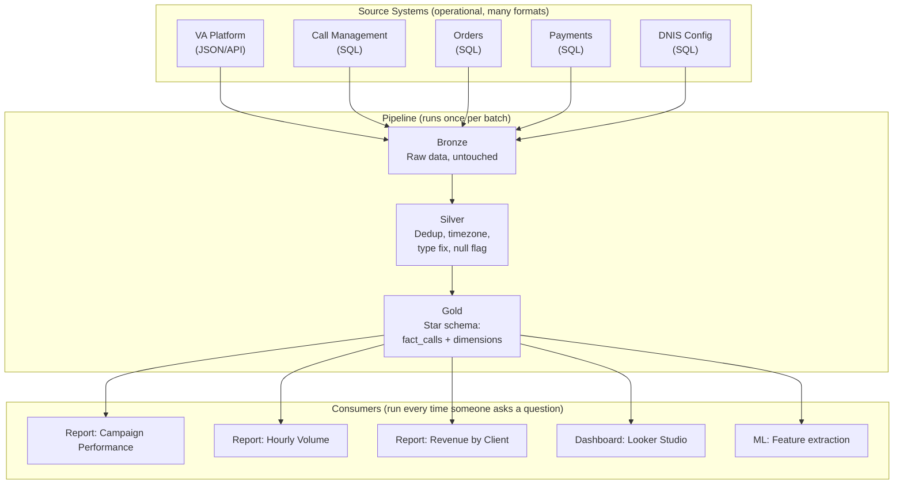

# Star Schema Design — Why It Matters

---

## The Question Every Data Engineer Gets Asked

"The data is already in the database. Why can't we just query it?"

The VP wants to know: conversion rate by campaign by hour for March. The data exists. The call records are in one table. The campaigns are in another. The orders are in a third. Just join them and GROUP BY, right?

Here is what that looks like in practice:

```sql
-- "Conversion rate by campaign by hour for March"
-- Querying source tables directly:

SELECT
    ds.campaign_name,
    ds.media_source,
    EXTRACT(HOUR FROM va.call_started_at AT TIME ZONE 'UTC' AT TIME ZONE 'US/Eastern') AS hour_est,
    COUNT(DISTINCT va.call_id) AS total_calls,
    COUNT(DISTINCT o.order_id) AS orders,
    ROUND(COUNT(DISTINCT o.order_id) * 100.0 / NULLIF(COUNT(DISTINCT va.call_id), 0), 1) AS conversion_pct
FROM va_calls va
JOIN dnis_sources ds ON va.dnis = ds.dnis
LEFT JOIN calls c ON c.voiceprint_id = va.call_id
LEFT JOIN orders o ON o.voiceprint_id = va.call_id
LEFT JOIN order_details od ON od.order_id = o.order_id
WHERE va.call_started_at AT TIME ZONE 'UTC' AT TIME ZONE 'US/Eastern'
    BETWEEN '2026-03-01' AND '2026-03-31 23:59:59'
AND va.disposition NOT IN ('test', 'junk')
AND va.channel = 'VA'
GROUP BY ds.campaign_name, ds.media_source, hour_est
ORDER BY ds.campaign_name, hour_est;
```

It works. And it has seven problems.

---

## The Seven Problems With Querying Source Tables Directly

### Problem 1: Every Analyst Writes the Same Complex Joins

The query above has 5 joins. Every analyst who wants campaign data must write the same join chain: `va_calls → dnis_sources → calls → orders → order_details`. Miss one join → wrong numbers. Use the wrong join key → silent data loss. Ten analysts writing this independently will write it ten different ways.

### Problem 2: Different Systems, Different IDs for the Same Thing

The VA platform calls it `call_id`. The call management system calls it `voiceprint_id`. The order system links on `voiceprint_id` too, but sometimes it is UPPERCASED. The phone config table uses `dnis` as a string in one system and an integer in another.

Every join must account for these differences. A new developer does not know that `calls.voiceprint_id` links to `va_calls.call_id`. There is no foreign key constraint. There is no documentation. It is tribal knowledge.

### Problem 3: Timezone Conversion in Every Query

Timestamps are stored in UTC (Coordinated Universal Time). Reports need Eastern Standard Time. That means every query includes:

```sql
AT TIME ZONE 'UTC' AT TIME ZONE 'US/Eastern'
```

Forget it in one query → March 3rd shows 200 calls instead of 180 (because late-night EST calls spill into the next UTC day). Two analysts using different timezone approaches → two different numbers for the same report.

### Problem 4: No Dedup

Source systems sometimes record the same call twice — a webhook fires twice, an import runs twice, a retry creates a duplicate. The source tables have no unique constraint that prevents this. Every query must either use `DISTINCT` (which can mask real issues) or the analyst must know which duplicates to expect and handle them.

### Problem 5: VA and Live Agent Data Have Different Schemas

VA calls are in `va_calls` with columns like `summary`, `sentiment`, `disconnection_reason`. Live agent calls are in `calls` with columns like `CallDispositionID`, `Revenue`, `CallEndTime`. Combining them requires a UNION with careful column mapping — and the columns do not line up 1:1.

Every report that needs "all calls" must write this UNION. Every report that needs "VA only" or "Live only" must filter. The logic is repeated in every query.

### Problem 6: Revenue Comes From Different Places

For most calls, revenue is in the `orders` table. But some clients store revenue differently — a third-party fulfillment system, a linked fields table, a separate API. The analyst must know which client uses which revenue source. This is business logic embedded in query-time decisions.

### Problem 7: Every New Question Starts From Scratch

"Add day-of-week to the report" → parse the timestamp, extract the day, add it to the GROUP BY. "Add media source" → join another table. "Filter out test calls" → add a WHERE clause based on a phone number lookup table. Every new question requires modifying the same complex query, and every modification risks breaking something.

---

## What a Star Schema Does

A star schema separates the concerns:

| Concern | Where It Is Handled | When It Runs |
|:---|:---|:---|
| **Data cleaning** (dedup, timezone, null handling, type casting) | Silver layer pipeline | Once, when data arrives |
| **Business logic** (disposition mapping, program name overrides, revenue source routing) | Dimension tables (data, not code) | Once, maintained as reference data |
| **Joining data from multiple systems** | Gold layer pipeline (builds the fact table) | Once, when pipeline runs |
| **Answering business questions** | Queries against the star schema | Every time someone asks a question |

The same query — "conversion rate by campaign by hour for March" — on the star schema:

```sql
SELECT
    dc.campaign_name,
    dc.media_source,
    dt.hour,
    COUNT(*) AS total_calls,
    COUNTIF(f.is_order) AS orders,
    ROUND(COUNTIF(f.is_order) / COUNT(*) * 100, 1) AS conversion_pct
FROM fact_calls f
JOIN dim_campaign dc ON f.campaign_key = dc.campaign_key
JOIN dim_date dd ON f.date_key = dd.date_key
JOIN dim_time dt ON f.time_key = dt.time_key
WHERE dd.month_name = 'March'
GROUP BY dc.campaign_name, dc.media_source, dt.hour
ORDER BY dc.campaign_name, dt.hour;
```

### What Changed

| Problem | Source Tables | Star Schema |
|:---|:---|:---|
| **Complex joins** | 5 joins on string keys across different systems | 3 joins on integer keys, same pattern every time |
| **Different IDs** | `call_id` vs `voiceprint_id` vs `CallID` | `campaign_key`, `date_key` — integer, consistent |
| **Timezone** | Inline `AT TIME ZONE` in every query | Converted once in the pipeline. `dim_date` has the correct local date. |
| **Duplicates** | Must dedup in every query | Deduped in the pipeline. `fact_calls` has one row per call by design. |
| **VA + Live** | UNION with column mapping | Already combined in `fact_calls`. Column `call_type` distinguishes them. |
| **Revenue source** | Analyst must know client-specific logic | Pipeline handles it. `fact_calls.total` has the correct revenue regardless of source. |
| **New questions** | Rewrite from scratch | Add a dimension column to GROUP BY. Same base query. |

---

## The Architecture



The complexity lives in the pipeline (runs once, maintained by the data engineering team). The queries are simple (run many times, written by anyone).

---

## The Common Objection: "But It Is Just More Tables"

Yes — a star schema has more tables than querying the sources directly. But the question is not "how many tables" — it is "where does the complexity live?"

| Approach | Complexity Location | Who Bears It |
|:---|:---|:---|
| Query source tables | In every query, every time | Every analyst, every developer, every report |
| Star schema | In the pipeline, once | The data engineering team, one time |

One team absorbs the complexity once. Everyone else gets simple, reliable queries forever. That is the tradeoff — and it is the right one.

---

**Next:** [02 — The Star Schema Design](02_Design.md) — The actual dimension and fact table structures.
**Also:** [02a — The Source Tables](02a_Source_Tables.md) — What the source tables look like and how they relate to each other.
