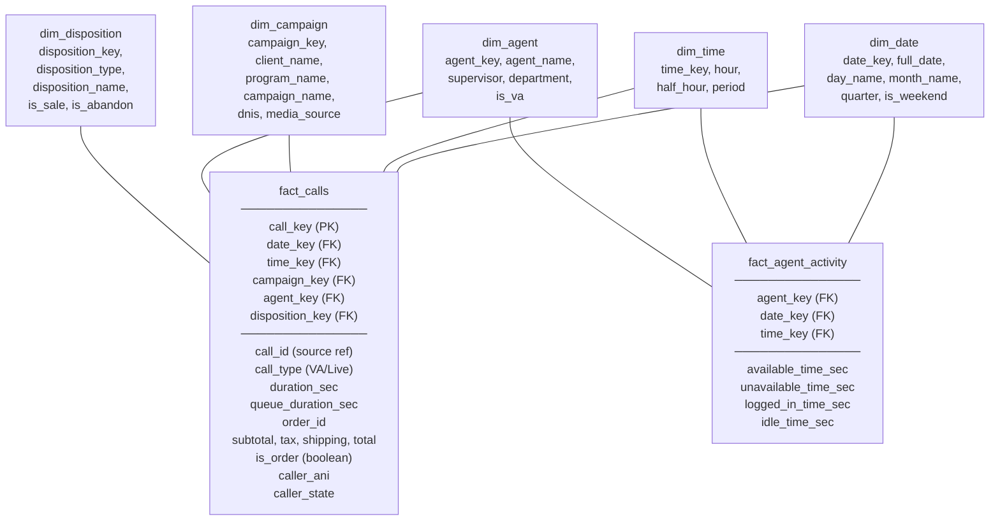
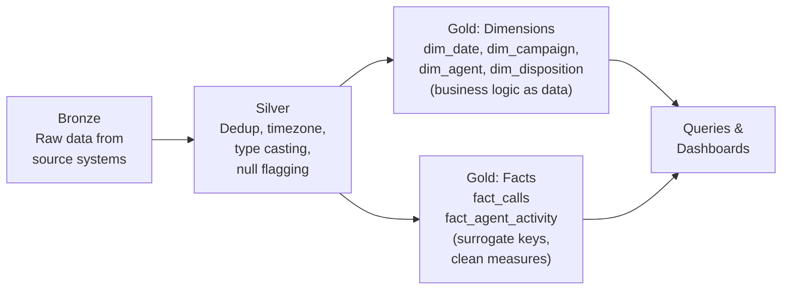

# Star Schema Design — The Tables

**Every dimension table, every fact table, and why each one exists.**

---

## The Complete Schema



---

## Dimension Tables

### dim_date — Pre-Computed Calendar

**Problem it solves:** Every query that filters by date, day of week, month, or weekend/weekday needs to parse a timestamp. Different analysts parse differently. Timezone bugs creep in.

**What it provides:** One row per day, pre-computed. Every query joins on an integer key and gets the day name, month, quarter, weekend flag — without parsing anything.

```sql
CREATE TABLE dim_date (
    date_key        INT PRIMARY KEY,          -- 20260315 (YYYYMMDD as integer — fast joins)
    full_date       DATE NOT NULL,
    day_name        VARCHAR(10),              -- Monday, Tuesday, ...
    day_of_week_num INT,                      -- 1=Sunday, 7=Saturday
    is_weekend      BOOLEAN,
    monday_week     DATE,                     -- Start of the ISO week (for weekly reports)
    month_num       INT,
    month_name      VARCHAR(10),              -- January, February, ...
    quarter         INT,
    year            INT
);
```

**Row count:** 365 (one per day for the year). Built once.

**Timezone:** The pipeline converts UTC → local time when populating this table. Every downstream query uses the correct local date. No `AT TIME ZONE` in any query ever again.

---

### dim_time — Hourly Periods

**Problem it solves:** Staffing reports need calls by hour, by half-hour, by period (Morning/Afternoon/Evening/Night). Without this dimension, every query extracts the hour from a timestamp and writes a CASE WHEN for the period.

**What it provides:** 24 rows. Join once, get all time breakdowns.

```sql
CREATE TABLE dim_time (
    time_key        INT PRIMARY KEY,          -- 0-23 (hour of day)
    hour            INT,
    half_hour_start VARCHAR(5),               -- '14:00'
    half_hour_end   VARCHAR(5),               -- '14:30'
    period          VARCHAR(10)               -- 'Morning', 'Afternoon', 'Evening', 'Night'
);
```

**What it replaces:** In many legacy systems, time-of-day reports are pre-computed as separate columns — one column per half-hour, one per hour. That is 48-96 columns that a single `GROUP BY dt.hour` replaces.

---

### dim_campaign — Client/Program/DNIS Mapping

**Problem it solves:** The source system stores a DNIS (phone number) on each call. To know which campaign, client, and media source that DNIS maps to, every query joins to a config table. If the mapping changes (client renames a program, a new campaign launches), the source data does not change — but the lookup must reflect the current mapping.

**What it provides:** One row per campaign/DNIS combination. The mapping is **data, not code.** When a campaign name changes, update one row — no query modifications.

```sql
CREATE TABLE dim_campaign (
    campaign_key    INT PRIMARY KEY,          -- Surrogate key (auto-increment)
    dnis            VARCHAR(20),              -- The phone number
    client_name     VARCHAR(100),             -- "HealthMax"
    program_name    VARCHAR(100),             -- "SmartPulse English"
    campaign_name   VARCHAR(100),             -- "SmartPulse TV Spring"
    source_name     VARCHAR(100),             -- "SmartPulse TV Spring - MediaBuy Corp"
    media_source    VARCHAR(100),             -- "MediaBuy Corp" (the buyer)
    media_type      VARCHAR(50),              -- "TV", "Digital", "Radio"
    is_active       BOOLEAN
);
```

**Common mistake this prevents:** Hard-coding program name overrides in SQL. In many legacy systems, you see code like `IF client = 'X' THEN set programName = 'Y'`. In the star schema, the correct name is a column in this table. The pipeline reads from this table — not from if/else blocks in code.

---

### dim_agent — Agent Details

**Problem it solves:** Agent performance reports need to join call data with agent metadata (name, team, supervisor). In source systems, agent data lives in a separate system (the phone platform) with different IDs than the call management system.

**What it provides:** One row per agent (including virtual agents). All agent attributes in one place.

```sql
CREATE TABLE dim_agent (
    agent_key       INT PRIMARY KEY,
    agent_id        INT,                      -- Source system ID
    agent_name      VARCHAR(100),
    agent_username  VARCHAR(50),
    user_extension  VARCHAR(10),
    supervisor_name VARCHAR(100),
    supervisor_id   INT,
    department      VARCHAR(50),
    is_va           BOOLEAN                   -- TRUE for virtual agent entries
);
```

---

### dim_disposition — Outcome Lookup

**Problem it solves:** Call outcomes are stored as codes in source systems — integer IDs, failure reason codes, status codes. Reports need human-readable names: "Order", "Abandoned", "Customer Service", "Junk." The mapping from code to name lives in lookup tables — or worse, in CASE WHEN statements in queries.

**What it provides:** One row per disposition combination. The mapping is data.

```sql
CREATE TABLE dim_disposition (
    disposition_key INT PRIMARY KEY,
    disposition_type VARCHAR(50),             -- Internal category: "sale", "abandon", "inquiry"
    disposition_name VARCHAR(50),             -- Display name: "ORDER", "ABANDON", "IVR"
    is_sale         BOOLEAN,
    is_inquiry      BOOLEAN,
    is_abandon      BOOLEAN,
    is_junk         BOOLEAN,
    is_custsvc      BOOLEAN
);
```

**What it replaces:** In legacy systems, disposition mapping is often 20-50 lines of CASE WHEN logic embedded in a stored procedure or a reporting query. Every time a new disposition is added, the CASE WHEN block must be updated and redeployed. In the star schema, adding a new disposition is an INSERT into this table.

---

## Fact Tables

### fact_calls — One Row Per Call

The center of the star. Contains measures (duration, revenue) and foreign keys to every dimension.

```sql
CREATE TABLE fact_calls (
    -- Surrogate key
    call_key            INT PRIMARY KEY,

    -- Dimension keys (integer — fast joins)
    date_key            INT REFERENCES dim_date,
    time_key            INT REFERENCES dim_time,
    campaign_key        INT REFERENCES dim_campaign,
    agent_key           INT REFERENCES dim_agent,
    disposition_key     INT REFERENCES dim_disposition,

    -- Source reference (for tracing back to original systems)
    call_id             VARCHAR(100),
    call_type           VARCHAR(10),         -- 'VA' or 'Live'
    call_date           DATE,                -- For partitioning

    -- Measures
    duration_sec        INT,
    queue_duration_sec  INT,
    hold_duration_sec   INT,
    wrapup_duration_sec INT,

    -- Order data (denormalized for convenience — not every call has an order)
    order_id            INT,
    subtotal            DECIMAL(10,2),
    tax                 DECIMAL(10,2),
    shipping            DECIMAL(10,2),
    total               DECIMAL(10,2),
    is_order            BOOLEAN,

    -- Caller metadata
    disconnection_reason VARCHAR(50),
    caller_ani          VARCHAR(20),
    caller_state        VARCHAR(10),
    caller_city         VARCHAR(50)
);
```

**Key design decisions:**

- **One row per call.** VA and Live agent calls are combined. `call_type` column distinguishes them. No UNION needed at query time.
- **Order data denormalized into the fact.** This is intentional. Most reports need revenue alongside call data. Pre-joining order totals into the fact table avoids an extra join in every query. If line-item detail is needed (which products were sold), join to the `order_details` source table using `order_id`.
- **Partitioned by `call_date`.** BigQuery/Redshift scans only the date range in the WHERE clause instead of the entire table.
- **Clustered by `campaign_key`.** Queries filtered by campaign skip irrelevant data blocks.
- **Unique per call.** The pipeline deduplicates in Silver. The fact table never has duplicates.

### fact_agent_activity — Agent Time Tracking

A separate fact table for agent utilization. This data has a different grain (one row per agent per hour) than `fact_calls` (one row per call).

```sql
CREATE TABLE fact_agent_activity (
    agent_key           INT REFERENCES dim_agent,
    date_key            INT REFERENCES dim_date,
    time_key            INT REFERENCES dim_time,     -- hour
    available_time_sec  INT,
    unavailable_time_sec INT,
    total_time_sec      INT,
    logged_in_time_sec  INT,
    idle_time_sec       INT
);
```

**Why separate?** In legacy systems, agent time is often forced into the same table as call data — creating a row for every agent × every hour via CROSS JOIN, even when no calls happened. That inflates the table and makes call-level queries complex. Separating agent activity into its own fact table keeps `fact_calls` clean. Join them when needed for utilization reports.

---

## The Pipeline That Builds It



Each layer is independent:
- Silver can run without Gold
- Gold can run without queries
- A bug in one layer is isolated — not cascading through hundreds of lines

---

## Summary

| Component | Rows | Purpose |
|:---|:---|:---|
| dim_date | 365 | Calendar lookup — day name, weekend, month, quarter |
| dim_time | 24 | Hour → period (Morning/Afternoon/Evening/Night) |
| dim_campaign | ~10-50 | DNIS → client, campaign, media source mapping |
| dim_disposition | ~10-20 | Outcome code → human-readable name + boolean flags |
| dim_agent | ~10-100 | Agent details, supervisor, VA flag |
| **fact_calls** | **~thousands-millions** | **One row per call. Measures + dimension keys.** |
| fact_agent_activity | ~agents × hours | Agent utilization per hour |

---

**Next:** [02a — The Source Tables](02a_Source_Tables.md) — What the source tables look like before the star schema.
**Then:** [03 — Building It](03_Building_It.md) — Build this star schema on BigQuery, step by step.
