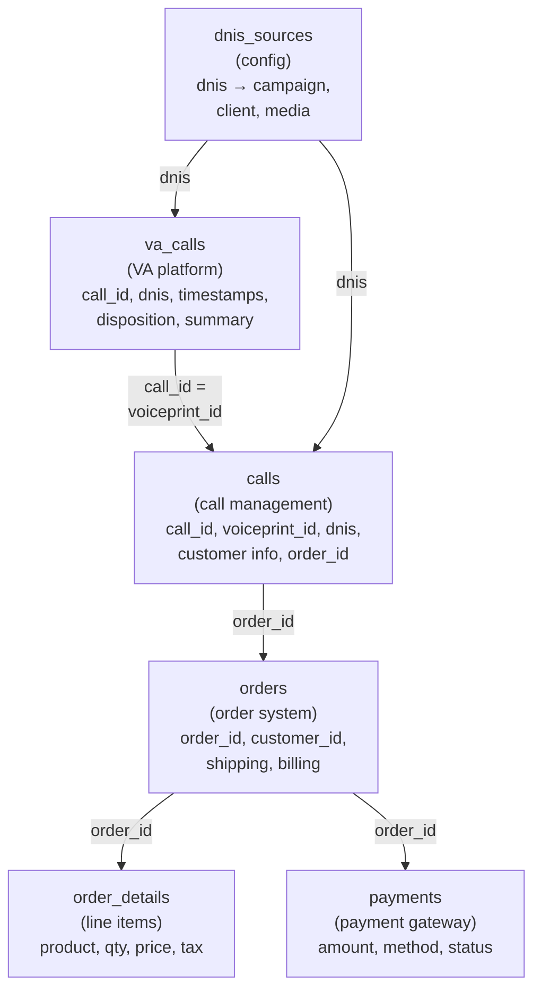

# Star Schema Design — The Source Tables

**What the operational database looks like before we model it for analytics.**

---

## The Problem: Data Spread Across Multiple Systems

A call center does not store everything in one table. Different systems handle different parts of the operation:

| System | What It Stores | Format | Example |
|:---|:---|:---|:---|
| **VA Platform** (Virtual Agent) | VA call records — timestamps, disposition, summary, sentiment | JSON / API | RetellAI, Amazon Connect, Twilio |
| **Phone System** | Call routing — queue time, agent assignment, transfer status | SQL / API | UJet, Five9, Genesys |
| **Call Management** | Core call record — customer info, disposition, order linkage | SQL | Internal CRM / OLX |
| **Order System** | Orders — products, quantities, prices, payment status | SQL | Order management platform |
| **Payments** | Payment transactions — amount, method, CC type, status | SQL | Payment gateway (Chase, Stripe) |
| **DNIS Config** | Phone number → campaign/client mapping | SQL / Config | Admin system |

An analyst who wants to answer "conversion rate by campaign by hour" must join across 4 of these systems. A developer troubleshooting a failed call must query all 6.

---

## The Source Table Schemas

These are the operational tables — designed for recording transactions, not for analytics.

### va_calls (Virtual Agent Call Records)

One row per VA call. Created by the virtual agent platform when a call ends.

```sql
CREATE TABLE va_calls (
    call_id             VARCHAR(100) PRIMARY KEY,  -- "CALL-20260315-00001"
    dnis                VARCHAR(20),               -- Phone number called (routes to campaign)
    caller_phone        VARCHAR(20),               -- Caller's phone number (ANI)
    call_started_at     TIMESTAMP,                 -- UTC timestamp
    call_ended_at       TIMESTAMP,                 -- UTC timestamp
    duration_seconds    INT,
    disposition         VARCHAR(50),               -- "completed", "abandoned", "voicemail", etc.
    disposition_type    VARCHAR(20),               -- "ORDER", "NO_SALE", "ABANDON", etc.
    channel             VARCHAR(10),               -- "VA"
    disconnection_reason VARCHAR(50),              -- "agent_hangup", "customer_hangup", etc.
    summary             TEXT,                      -- AI-generated call summary
    sentiment           VARCHAR(20),               -- "Positive", "Negative", "Neutral"
    session_status      VARCHAR(20)                -- "ended", "transferred", etc.
);
```

### calls (Core Call Records — All Channels)

One row per call (both VA and live agent). Created by the call management system. Different schema from `va_calls` — different system, different column names for the same concepts.

```sql
CREATE TABLE calls (
    call_id             INT PRIMARY KEY,           -- Internal sequential ID
    voiceprint_id       VARCHAR(100),              -- Links to va_calls.call_id for VA calls
    dnis                VARCHAR(20),
    ani                 VARCHAR(20),               -- Caller's phone number (same as caller_phone above, different name)
    call_date           DATETIME,
    call_end_time       DATETIME,
    disposition_id      INT,                       -- FK to disposition lookup (NOT the same as va_calls.disposition)
    customer_first_name VARCHAR(50),
    customer_last_name  VARCHAR(50),
    order_id            INT,                       -- FK to orders table
    revenue             DECIMAL(10,2),
    is_sale             BIT,                       -- 0 or 1
    is_upsell           BIT,
    source_id           INT,                       -- FK to dnis_sources
    email               VARCHAR(255),
    billing_address     VARCHAR(255),
    city                VARCHAR(50),
    state               VARCHAR(20),
    zip                 VARCHAR(20)
);
```

> **Notice:** The same call exists in BOTH `va_calls` (from the VA platform) and `calls` (from the call management system). They use different IDs (`call_id` vs `voiceprint_id`), different column names (`caller_phone` vs `ani`), and different disposition formats (text string vs integer FK). This is the multi-system fragmentation problem.

### orders (Order Headers)

One row per order. Created when a sale is completed.

```sql
CREATE TABLE orders (
    order_id            INT PRIMARY KEY,
    customer_id         INT,
    voiceprint_id       VARCHAR(100),              -- Links to the call that created this order
    order_date          DATETIME,
    ship_first_name     VARCHAR(50),
    ship_last_name      VARCHAR(50),
    ship_address        VARCHAR(255),
    ship_city           VARCHAR(50),
    ship_state          VARCHAR(50),
    ship_zip            VARCHAR(20),
    bill_first_name     VARCHAR(50),
    bill_last_name      VARCHAR(50),
    freight_charge      DECIMAL(10,2),
    sales_tax_rate      FLOAT,
    order_status_id     INT
);
```

### order_details (Line Items)

One row per product in an order. An order with 2 products has 2 rows here.

```sql
CREATE TABLE order_details (
    order_detail_id     INT PRIMARY KEY,
    order_id            INT,                       -- FK to orders
    product_id          INT,
    description         VARCHAR(500),              -- "SmartPulse Monitor", "2-Year Warranty"
    quantity            INT,
    unit_price          DECIMAL(10,2),
    discount            DECIMAL(10,2),
    shipping            DECIMAL(10,2),
    tax                 DECIMAL(10,2),
    is_upsell           BIT
);
```

### payments

One row per payment attempt. A successful order has one payment. A declined-then-retried order has two.

```sql
CREATE TABLE payments (
    payment_id          INT PRIMARY KEY,
    order_id            INT,                       -- FK to orders
    payment_amount      DECIMAL(10,2),
    payment_date        DATETIME,
    payment_method_id   INT,                       -- 1=Visa, 2=MC, 3=Amex, etc.
    cc_last4            VARCHAR(5),
    status              VARCHAR(20),               -- "approved", "declined"
    bill_first_name     VARCHAR(50),
    bill_last_name      VARCHAR(50),
    bill_address        VARCHAR(255),
    bill_city           VARCHAR(50),
    bill_state          VARCHAR(20),
    bill_zip            VARCHAR(20)
);
```

### dnis_sources (Phone Number → Campaign Mapping)

One row per DNIS (phone number). Maps the incoming number to the campaign, client, and media source.

```sql
CREATE TABLE dnis_sources (
    source_id           INT PRIMARY KEY,
    dnis                VARCHAR(20) NOT NULL,       -- "8005550101"
    source_name         VARCHAR(100),               -- "SmartPulse TV Spring - MediaBuy Corp"
    is_active           BIT,
    client_name         VARCHAR(100),               -- "HealthMax"
    campaign_name       VARCHAR(100),               -- "SmartPulse TV Spring"
    program_name        VARCHAR(100),               -- "SmartPulse English"
    media_type          VARCHAR(50),                -- "TV", "Digital", "Radio"
    media_source        VARCHAR(100)                -- "MediaBuy Corp" (the buyer)
);
```

---

## Why Not Query These Directly?

Here is what the query "conversion rate by campaign by hour for March" looks like on the source tables:

```sql
-- Querying source tables directly: 5 joins, timezone logic, dedup, null handling

SELECT
    ds.campaign_name,
    ds.media_source,
    EXTRACT(HOUR FROM va.call_started_at AT TIME ZONE 'UTC' AT TIME ZONE 'US/Eastern') AS hour_est,
    COUNT(DISTINCT va.call_id) AS total_calls,
    COUNT(DISTINCT o.order_id) AS orders,
    ROUND(COUNT(DISTINCT o.order_id) * 100.0 / NULLIF(COUNT(DISTINCT va.call_id), 0), 1) AS conversion_pct,
    ROUND(SUM(od.unit_price * od.quantity), 2) AS total_revenue
FROM va_calls va
-- Join #1: VA call → DNIS source mapping (to get campaign name)
JOIN dnis_sources ds
    ON va.dnis = ds.dnis
-- Join #2: VA call → core call record (to get order linkage)
-- NOTE: Different ID systems! va_calls uses call_id, calls uses voiceprint_id
LEFT JOIN calls c
    ON c.voiceprint_id = va.call_id
-- Join #3: Core call → order (to get order data)
LEFT JOIN orders o
    ON o.voiceprint_id = va.call_id
-- Join #4: Order → order details (to get revenue)
LEFT JOIN order_details od
    ON od.order_id = o.order_id
-- Filter: March only, timezone-aware
WHERE va.call_started_at AT TIME ZONE 'UTC' AT TIME ZONE 'US/Eastern'
    BETWEEN '2026-03-01' AND '2026-03-31 23:59:59'
-- Exclude known junk/test calls
AND va.disposition NOT IN ('test', 'junk')
-- Only VA calls (not live agent — those are in a different table with different schema)
AND va.channel = 'VA'
GROUP BY ds.campaign_name, ds.media_source, hour_est
ORDER BY ds.campaign_name, hour_est;
```

**Problems with this approach:**

| Problem | What Happens |
|:---|:---|
| **5 joins** | Every analyst must know which table joins to which, on which key. Miss one → wrong numbers. |
| **Different ID systems** | `va_calls.call_id` links to `calls.voiceprint_id` — not obvious. New analysts get this wrong. |
| **Timezone inline** | `AT TIME ZONE 'UTC' AT TIME ZONE 'US/Eastern'` in every query. Forget it → wrong dates. Different analysts use different timezone approaches → different numbers. |
| **No dedup** | If `va_calls` has duplicates (source system sent twice), this query double-counts. Must add `DISTINCT` everywhere and hope it works. |
| **VA only** | This query only covers VA calls. Live agent calls are in the `calls` table with a completely different schema. Combining them requires a UNION with column mapping. |
| **Revenue scattered** | Revenue comes from `order_details` (line items). Some clients store revenue differently. The query must know which client uses which revenue source. |
| **Every new report** | Every new question requires a new complex query. The same joins, same timezone logic, same dedup — written from scratch every time. |

### The Same Query on the Star Schema

```sql
-- Star schema: 3 joins on integer keys. Clean. Correct. Same answer.

SELECT
    dc.campaign_name,
    dc.media_source,
    dt.hour,
    COUNT(*)              AS total_calls,
    COUNTIF(f.is_order)   AS orders,
    ROUND(COUNTIF(f.is_order) / COUNT(*) * 100, 1) AS conversion_pct,
    ROUND(SUM(f.order_total), 2) AS total_revenue
FROM fact_calls f
JOIN dim_campaign dc ON f.campaign_key = dc.campaign_key
JOIN dim_date dd     ON f.date_key = dd.date_key
JOIN dim_time dt     ON f.time_key = dt.time_key
WHERE dd.month_name = 'March'
GROUP BY dc.campaign_name, dc.media_source, dt.hour
ORDER BY dc.campaign_name, dt.hour;
```

**What changed:**
- 5 joins → 3 joins (on integer keys — fast)
- Timezone handled in the pipeline, not the query
- VA + Live already combined in `fact_calls` (the pipeline unions them)
- Dedup handled in the pipeline — `fact_calls` has one row per call by design
- Revenue pre-joined — `order_total` is already in the fact table
- Any analyst can write this query. No tribal knowledge required.

---

## The Relationship Between Source Tables



Six tables. Three different ID systems (`call_id` in va_calls, `call_id` INT in calls, `voiceprint_id` as the link). Two different disposition formats (text vs integer FK). Timezone stored differently across tables.

The star schema collapses this into one fact table with integer keys to dimension tables. The complexity is absorbed by the pipeline — not repeated in every query.

---

**Next:** [03 — Building It](03_Building_It.md) — Build the star schema on BigQuery, step by step.
