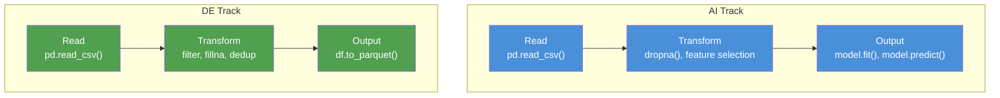

# Python -- Hello World for AI and Data Engineers

**Two tracks, same language, same pattern. Read data, transform it, produce output.**

---

## The Pattern

Every AI task and every data engineering task follows the same three-step pattern in Python:


The only difference between AI and DE is what happens in the "Transform" and "Output" steps:

| Step | AI Engineer | Data Engineer |
|:---|:---|:---|
| **Read** | Load a CSV (Comma-Separated Values) into pandas | Load a CSV into pandas (or PySpark) |
| **Transform** | Select features, split into train/test | Clean nulls, deduplicate, reshape |
| **Output** | Train a model, make predictions | Write to Parquet (columnar binary format) or a warehouse |

This chapter gives you a working example of each track. By the end, you will have run Python code that does something real.

---

## Setup: Three Ways to Run Python

Choose one. Do not overthink this.

### Option A: Google Colab (Zero Setup -- Recommended for Learning)

1. Open a browser
2. Go to [colab.research.google.com](https://colab.research.google.com)
3. Click "New Notebook"
4. You now have a running Python environment with pandas, scikit-learn, and NumPy pre-installed

**You should see:** A notebook interface with a code cell. Type `print("hello")` and press Shift+Enter. The output "hello" appears below the cell.

### Option B: Local Python with uv (Recommended for Projects)

```bash
# Install uv (one-time)
curl -LsSf https://astral.sh/uv/install.sh | sh

# Create a project directory
mkdir python-hello-world && cd python-hello-world

# Initialize the project (creates venv and pyproject.toml)
uv init

# Add the libraries both tracks need
uv add pandas scikit-learn pyarrow

# Verify it works
uv run python -c "import pandas; print(f'pandas {pandas.__version__} ready')"
```

**You should see:** Output like `pandas 2.2.0 ready` (version may differ).

### Option C: Local Python with venv and pip

```bash
# Check Python version (need 3.10+)
python3 --version

# Create a virtual environment
python3 -m venv .venv
source .venv/bin/activate   # macOS/Linux
# .venv\Scripts\activate    # Windows

# Install packages
pip install pandas scikit-learn pyarrow

# Verify
python -c "import pandas; print(f'pandas {pandas.__version__} ready')"
```

### Option D: Docker (Reproducible, No Local Install)

```bash
docker run -it --rm -v $(pwd):/work -w /work python:3.12-slim bash -c \
  "pip install pandas scikit-learn pyarrow && python /work/hello.py"
```

---

## Sample Data

Both tracks use the same dataset: a small CSV of call center records. Create this file or paste it into a Colab cell:

```python
# Run this cell to create sample data (works in Colab or locally)
import pandas as pd

data = {
    "call_id": ["C-1001", "C-1002", "C-1003", "C-1004", "C-1005",
                 "C-1006", "C-1007", "C-1008", "C-1009", "C-1010"],
    "duration_sec": [120, 45, 300, 0, 180, 95, 420, 60, 210, 150],
    "wait_sec": [15, 5, 45, 0, 30, 10, 60, 8, 25, 20],
    "agent": ["Alice", "Bob", "Alice", None, "Carol",
              "Bob", "Alice", "Carol", "Bob", "Alice"],
    "outcome": ["resolved", "resolved", "escalated", "dropped", "resolved",
                "resolved", "escalated", "resolved", "resolved", "escalated"],
    "satisfaction": [5, 4, 2, None, 4, 5, 1, 4, 3, 2]
}

df = pd.DataFrame(data)
df.to_csv("calls.csv", index=False)
print(f"Created calls.csv with {len(df)} records")
print(df.head())
```

**You should see:**

```
Created calls.csv with 10 records
  call_id  duration_sec  wait_sec  agent    outcome  satisfaction
0  C-1001           120        15  Alice   resolved           5.0
1  C-1002            45         5    Bob   resolved           4.0
2  C-1003           300        45  Alice  escalated           2.0
3  C-1004             0         0   None    dropped           NaN
4  C-1005           180        30  Carol   resolved           4.0
```

Notice the intentional data quality issues: call C-1004 has zero duration, a missing agent, and no satisfaction score. Real data always has problems.

---

## AI Track: Load, Train, Predict

**Goal:** Predict whether a call will be escalated based on duration and wait time.

```python
# --- AI TRACK: 5 lines that train a model and make a prediction ---
import pandas as pd
from sklearn.tree import DecisionTreeClassifier

# 1. READ -- Load the data
df = pd.read_csv("calls.csv")

# 2. TRANSFORM -- Prepare features and labels
#    Drop rows with missing data (the dropped call has no useful info)
#    Create a binary label: 1 if escalated, 0 otherwise
clean = df.dropna()
clean["is_escalated"] = (clean["outcome"] == "escalated").astype(int)

# Features: duration and wait time
# Label: whether the call was escalated
X = clean[["duration_sec", "wait_sec"]]
y = clean["is_escalated"]

# 3. OUTPUT -- Train a model and predict
model = DecisionTreeClassifier(random_state=42)
model.fit(X, y)

# Predict: will a 250-second call with 40 seconds of wait be escalated?
prediction = model.predict([[250, 40]])
print(f"Prediction for (250s call, 40s wait): {'escalated' if prediction[0] else 'resolved'}")
print(f"Training accuracy: {model.score(X, y):.0%}")
```

**You should see:**

```
Prediction for (250s call, 40s wait): escalated
Training accuracy: 100%
```

**What just happened:**
1. pandas loaded 10 rows from a CSV into a DataFrame
2. We dropped rows with missing data and created a binary label
3. scikit-learn's DecisionTreeClassifier learned that longer calls with longer waits tend to escalate
4. The model predicted that a 250-second call with 40 seconds of wait would be escalated

**Why 100% accuracy is suspicious:** With only 10 records, the model memorized the training data. This is called overfitting. In production, you split data into training and test sets and evaluate on data the model has never seen. The [Python for AI notebook](https://colab.research.google.com/github/sunilmogadati/systems-in-production/blob/main/implementation/notebooks/AI_Engineer_Accelerator_Python_for_AI.ipynb) covers this properly.

---

## DE Track: Read, Clean, Write

**Goal:** Clean the call data and write it to Parquet for downstream use.

```python
# --- DE TRACK: 5 lines that clean data and write to Parquet ---
import pandas as pd

# 1. READ -- Load the raw data
df = pd.read_csv("calls.csv")
print(f"Raw: {len(df)} records, {df['agent'].isna().sum()} missing agents")

# 2. TRANSFORM -- Apply data quality rules
#    Rule 1: Drop calls with zero duration (invalid records)
#    Rule 2: Fill missing agent names with "UNKNOWN" (don't lose the record)
#    Rule 3: Drop exact duplicate rows
clean = df[df["duration_sec"] > 0].copy()
clean["agent"] = clean["agent"].fillna("UNKNOWN")
clean = clean.drop_duplicates(subset=["call_id"])
print(f"Clean: {len(clean)} records, {clean['agent'].isna().sum()} missing agents")

# 3. OUTPUT -- Write to Parquet (production format)
clean.to_parquet("calls_clean.parquet", index=False)
print(f"Written to calls_clean.parquet ({clean.shape[0]} rows, {clean.shape[1]} columns)")
```

**You should see:**

```
Raw: 10 records, 1 missing agents
Clean: 9 records, 0 missing agents
Written to calls_clean.parquet (9 rows, 6 columns)
```

**What just happened:**
1. pandas loaded 10 rows from a CSV
2. We applied three data quality rules: removed invalid records, filled missing values, and removed duplicates
3. The cleaned data was written to Parquet -- a compressed, typed, columnar format that data warehouses and Spark can read efficiently

**Why Parquet matters:** The CSV was human-readable but slow to query and had no type enforcement. The Parquet file is smaller, faster to read, and preserves column types (integers stay integers, not strings). Every production data pipeline converts to Parquet as early as possible. The [Python for DE notebook](https://colab.research.google.com/github/sunilmogadati/systems-in-production/blob/main/implementation/notebooks/M03_Python_for_Data_Engineering.ipynb) covers this in depth.

---

## Side by Side: Same Pattern, Different Libraries



| Step | AI Code | DE Code | Shared |
|:---|:---|:---|:---|
| Read | `pd.read_csv("calls.csv")` | `pd.read_csv("calls.csv")` | Identical |
| Transform | `df.dropna()`, feature selection | `df[df["col"] > 0]`, `fillna()` | Same pandas API |
| Output | `model.fit(X, y)` | `df.to_parquet("out.parquet")` | Different: model vs file |

The insight: **pandas is the lingua franca.** Whether you are building a model or building a pipeline, you start by loading data into a DataFrame and transforming it. The AI engineer's output is a trained model. The data engineer's output is a clean file or table. The 80% of work before that output is the same.

---

## Verification Checklist

Before moving on, confirm you can do each of these:

| Check | What to Verify |
|:---|:---|
| Python runs | `python --version` prints 3.10 or higher |
| pandas is installed | `import pandas as pd` does not throw an error |
| CSV read works | `pd.read_csv("calls.csv")` returns a DataFrame with 10 rows |
| AI track runs | The model predicts "escalated" for the 250s/40s input |
| DE track runs | `calls_clean.parquet` exists and has 9 rows |
| Parquet read works | `pd.read_parquet("calls_clean.parquet")` returns a DataFrame |

If any check fails, revisit the Setup section. The most common issues:

- **`ModuleNotFoundError: No module named 'pandas'`** -- You are not in your virtual environment. Run `source .venv/bin/activate` (or use `uv run`).
- **`FileNotFoundError: calls.csv`** -- Run the sample data cell first. Your working directory might be different from where the file was saved.
- **`ModuleNotFoundError: No module named 'pyarrow'`** -- Install it: `pip install pyarrow` (required for Parquet support).

---

## What Comes Next

You now have a working Python environment and have run both an AI and a DE workflow. The three chapters in this series covered:

1. **[01 -- Why Python](01_Why.md):** Why Python is the language of AI and data, and how it compares to alternatives.
2. **[02 -- Core Concepts](02_Concepts.md):** Data structures, functions, packages, virtual environments, and the ecosystem map.
3. **03 -- Hello World (this chapter):** Two hands-on tracks demonstrating the shared pattern.

For the full deep dive, continue to the hands-on notebooks:

- **AI track:** [Python for AI on Colab](https://colab.research.google.com/github/sunilmogadati/systems-in-production/blob/main/implementation/notebooks/AI_Engineer_Accelerator_Python_for_AI.ipynb) -- 100+ cells covering NumPy, pandas, scikit-learn, and more
- **DE track:** [Python for DE on Colab](https://colab.research.google.com/github/sunilmogadati/systems-in-production/blob/main/implementation/notebooks/M03_Python_for_Data_Engineering.ipynb) -- 100+ cells covering Python, PySpark, and data engineering patterns
- **Java developers:** [Python for AI Java Dev Guide on Colab](https://colab.research.google.com/github/sunilmogadati/systems-in-production/blob/main/implementation/notebooks/Python_for_AI_Java_Dev_Guide.ipynb) -- Python through a Java developer's lens

---

*Foundations -- Python (Chapter 3 of 3)*
