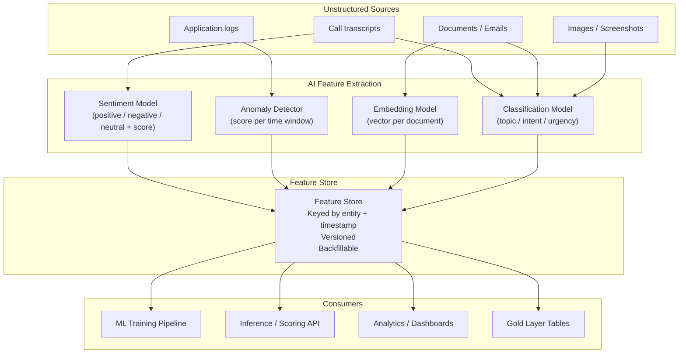
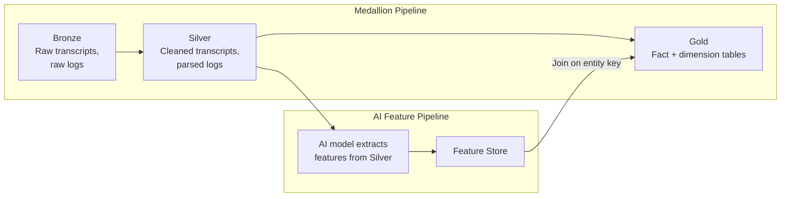

# AI-Derived Feature Engineering Pattern

**The most valuable ML features do not exist in the raw data. They are computed by models from unstructured inputs -- text, audio, images, logs -- and served as first-class features alongside structured data.**

Raw structured data (timestamps, amounts, categories) carries signal, but it plateaus. The next performance gain comes from features that require a model to extract: sentiment from call transcripts, anomaly scores from time series, topic classifications from support tickets, embeddings from documents. This pattern describes how to compute, store, and serve those features reliably.

---

## The Architecture



---

## What AI-Derived Features Look Like

| Source | Model | Output Feature | Type | Example Value |
|---|---|---|---|---|
| Call transcript | Sentiment classifier (fine-tuned BERT or LLM) | `call_sentiment_score` | float [-1.0, 1.0] | -0.73 (frustrated customer) |
| Call transcript | Intent classifier | `call_primary_intent` | categorical | `billing_dispute` |
| Application metrics | Anomaly detector (Isolation Forest, Prophet) | `anomaly_score_5min` | float [0, 1] | 0.92 (likely anomaly) |
| Support ticket text | Embedding model (sentence-transformers) | `ticket_embedding_384` | float[384] | [0.012, -0.034, ...] |
| Document | Topic model (LDA or zero-shot classifier) | `document_topic` | categorical | `compliance_update` |
| Error logs | Pattern extractor (regex + LLM) | `error_category` | categorical | `timeout_downstream_service` |
| Call audio | Speech features (Whisper + post-processing) | `caller_talk_ratio` | float [0, 1] | 0.62 (caller dominated) |

---

## The Feature Store Pattern

AI-derived features are expensive to compute. You compute them once and serve them to many consumers. The feature store is the interface between computation and consumption.

### Feature Store Responsibilities

| Responsibility | What it means |
|---|---|
| **Compute once, serve many** | The sentiment model runs once per transcript. Every downstream model and dashboard reads from the store, not re-runs the model. |
| **Entity + timestamp keying** | Features are keyed by business entity (`customer_id`, `call_id`, `order_id`) and a timestamp. This enables point-in-time lookups for training (no data leakage). |
| **Versioning** | When you retrain the sentiment model, new scores are v2. Old scores (v1) remain available. Consumers migrate on their schedule. |
| **Backfill** | When a new model version is deployed, you can recompute features for historical data. The store tracks which version produced which values. |
| **Online + offline serving** | Offline: batch reads for ML training (feature joins). Online: low-latency reads for real-time inference (key-value lookup). |

### Implementation Options

| Platform | Offline store | Online store | Key strength |
|---|---|---|---|
| **Feast** | Parquet on S3/GCS, BigQuery, Redshift | Redis, DynamoDB | Framework-agnostic. Self-hosted. |
| **Databricks Feature Store** | Delta tables | Databricks serving endpoints | Tight integration with MLflow and Unity Catalog |
| **Vertex AI Feature Store** | BigQuery | Bigtable-backed | Managed. GCP-native. |
| **SageMaker Feature Store** | S3 (offline group) | DynamoDB-backed (online group) | Managed. AWS-native. |
| **Custom (BigQuery + Redis)** | BigQuery tables partitioned by date | Redis with TTL | Full control. Common in orgs that do not want another managed service. |

---

## How AI Features Feed Back Into the Pipeline

AI-derived features do not live in isolation. They join the same pipeline as structured data.



**The join point:** AI-derived features join Gold tables on the entity key. A `calls_fact` table in Gold can include `call_sentiment_score` and `call_primary_intent` as columns, sourced from the feature store. Analysts query Gold without knowing or caring that those columns were produced by a model.

---

## The Dependency Chain Problem

AI-derived features create a dependency: the feature value depends on the model version, which depends on training data, which depends on upstream features. This chain must be tracked.

```
Gold table
  └── call_sentiment_score (v2)
        └── Sentiment Model v2 (deployed 2026-03-01)
              └── Training data: Silver transcripts 2025-01 to 2026-02
                    └── Transcript cleaning pipeline v4
```

**When any node in this chain changes, everything downstream may need recomputation.** The feature store's versioning system is what makes this tractable: you can compute v3 in parallel with v2, validate, and swap.

---

## Failure Modes

| Failure | How it manifests | Detection | Fix |
|---|---|---|---|
| **Feature drift** | The model that produces features was trained on data with different characteristics than current production data. Sentiment scores shift systematically. | Monitor feature distribution over time. Alert when mean or variance shifts beyond 2 standard deviations from the baseline. | Retrain the extraction model on recent data. Backfill features with the new version. |
| **Stale embeddings** | The embedding model has not been updated, but the vocabulary of the domain has changed (new products, new terminology). Embeddings for new concepts map to generic regions of the vector space. | Monitor embedding space density. New records clustering in a single region suggests the model cannot distinguish them. Downstream model performance degradation. | Update the embedding model. Recompute embeddings for affected entities. |
| **Model dependency chain failure** | The sentiment model is retrained and produces slightly different scores. A downstream model trained on v1 scores receives v2 scores at inference time. | Version mismatch alerts: if the training feature version differs from the serving feature version, flag it. | Pin feature versions per consumer. Migrate consumers explicitly when the feature version changes. |
| **Backfill explosion** | A new model version triggers recomputation of 2 years of features across millions of records. The compute cost or time exceeds budget. | Estimate backfill cost before deploying a new model version. Set budget thresholds. | Limit backfill scope (e.g., last 6 months). Use sampling to validate before full backfill. |
| **Data leakage via features** | A feature computed using future data (e.g., "average sentiment for this customer" including calls after the prediction target date) leaks into training. | Point-in-time correctness tests: for any entity at time T, verify that all features were computed using data from before T. | Use the feature store's timestamp-based retrieval. Never compute features with global aggregates that include future data. |
| **Silent model failure** | The extraction model returns a default value (e.g., 0.0 sentiment) for inputs it cannot process. These defaults pollute the feature store. | Monitor the distribution of feature values. A spike in any single value (especially 0.0 or null) suggests extraction failure. | Add confidence scores alongside features. Filter or flag low-confidence extractions. |

---

## When to Use This Pattern

**Use it for:**
- Any ML system where structured features alone have plateaued in performance
- Systems with rich unstructured data (text, audio, logs) that carries signal
- Organizations where multiple models or teams need the same derived features
- Production systems where feature computation cost justifies a shared store

**Do not use it for:**
- Prototyping or early-stage ML where you are still validating whether the problem is solvable (compute features inline, introduce the store later)
- Features that change meaning with every model retrain (unstable features add more complexity than value)
- Systems where the unstructured data is low quality or sparse (garbage in, garbage out applies doubly to AI-derived features)

---

## Decision Checklist

1. **Is the feature expensive to compute?** If it takes >1 second per record or requires a GPU, you need a feature store. If it is a simple regex, compute it inline.
2. **Do multiple consumers need the same feature?** If yes, compute once and store. If only one model uses it, a feature store may be overhead.
3. **Do you need point-in-time correctness for training?** If yes, the feature store's timestamp-based retrieval is essential. Without it, data leakage is nearly inevitable.
4. **How often does the extraction model change?** If frequently, the versioning and backfill capabilities of the feature store are critical. If the model is stable, simpler storage may suffice.
5. **What is the latency requirement?** Offline-only (batch training): any store works. Online (real-time inference): you need a low-latency serving layer (Redis, DynamoDB).
