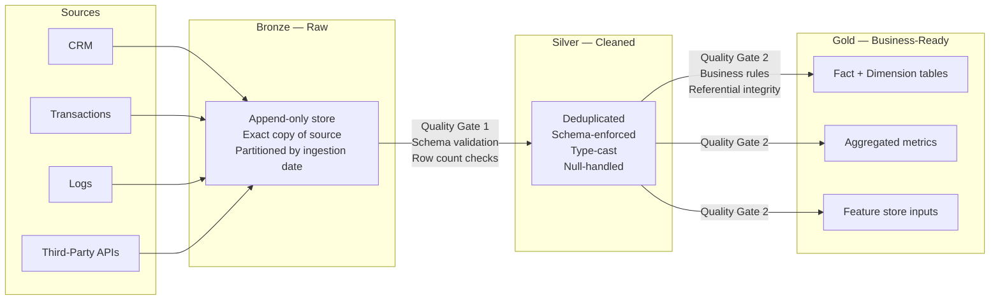
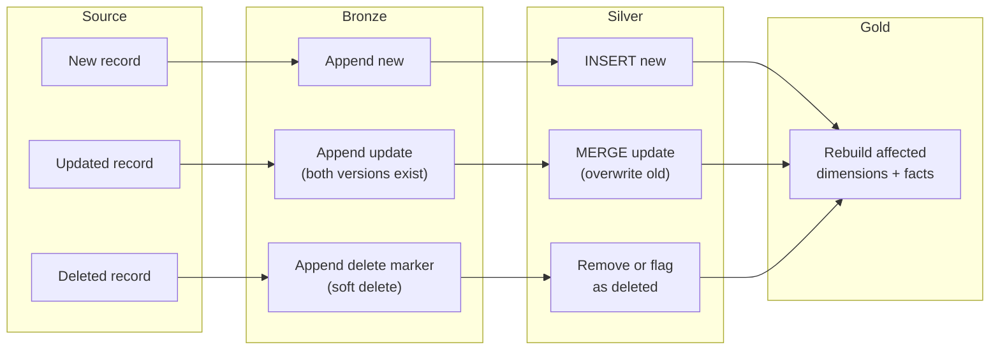
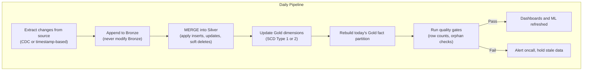

# The Medallion Architecture Pattern

**Raw (Bronze) to Cleaned (Silver) to Business-Ready (Gold). Three layers. Clear boundaries. Reprocessing built in.**

This pattern structures a data lakehouse into three distinct layers, each with a defined responsibility. Data flows forward through quality gates. When something breaks downstream, Bronze lets you go back to the beginning and reprocess without re-extracting from source systems.

---

## The Architecture



---

## Why Three Layers

**Why not two?** Combining raw storage with cleaning means you lose the ability to reprocess. When a transform bug corrupts cleaned data, you have no recovery point. Every system that starts with two layers eventually adds a third.

**Why not four or five?** Additional layers add latency, increase storage cost, and create more surfaces for bugs. Three layers map to three responsibilities: preserve, clean, serve. If you need a fourth, it is usually a downstream consumer responsibility (dashboards, ML), not a pipeline responsibility.

---

## What Belongs in Each Layer

| | Bronze | Silver | Gold |
|---|---|---|---|
| **Purpose** | Preserve exactly what arrived | Enforce quality and consistency | Serve business consumers directly |
| **Schema** | Schema-on-read. Whatever the source sends. | Enforced. Types cast. Nulls handled. | Star schema, aggregates, or feature tables. |
| **Deduplication** | None. Duplicates are preserved. | Applied. Business key + timestamp dedup. | Inherited from Silver. |
| **Granularity** | Source granularity (one row per source record) | Same granularity, cleaned | Often aggregated (daily, per-customer, per-product) |
| **Partitioning** | By ingestion timestamp | By business date or source entity | By query pattern (date ranges, regions) |
| **Retention** | Long. 1-5 years minimum. This is insurance. | Medium. Current + last known good state. | Short to medium. Rebuilt from Silver. |
| **Access** | Data engineers only | Data engineers + advanced analysts | Everyone: analysts, dashboards, ML pipelines |
| **Format** | Whatever arrived (JSON, CSV, Avro, Parquet) | Parquet or Delta/Iceberg (columnar, typed) | Parquet, Delta/Iceberg, or materialized views |

---

## How Each Layer Works

### Bronze: The Insurance Policy

Bronze stores an exact copy of what was extracted from each source system. Nothing is transformed. Nothing is filtered. The ingestion timestamp is added as metadata.

This is the recovery mechanism. When a Silver transform has a bug that silently drops 3% of records, you reprocess from Bronze. When a source system retroactively changes historical data, you have the original version.

**Implementation detail:** Partition Bronze by ingestion date, not by business date. You need to answer "what did we receive on March 15?" without scanning the entire dataset.

### Silver: The Gatekeeper

Silver is where data quality is enforced. Every record passes through explicit validation:

- **Type casting:** Strings to dates, strings to numbers. Failures go to a quarantine table, not silently dropped.
- **Deduplication:** Business key + event timestamp. Last-write-wins or first-write-wins, chosen per entity.
- **Null handling:** Default values, forward-fill, or explicit rejection per column.
- **Schema enforcement:** New columns from source trigger alerts, not silent schema evolution.
- **Cross-reference validation:** Foreign keys resolve. Orphaned records are flagged.

Silver is the single layer where quality rules execute. If quality logic leaks into Gold transforms, you have two places to debug when numbers are wrong.

### Gold: Self-Service

Gold tables are designed for consumption, not for correctness (that is Silver's job). Gold optimizes for:

- **Query patterns:** Pre-joined fact and dimension tables. Analysts do not need to know the join path.
- **Aggregation:** Daily rollups, customer lifetime metrics, campaign performance summaries.
- **Naming:** Business language. `total_revenue`, not `sum_amt_usd_v2`.
- **SLAs:** Gold tables have refresh commitments. Consumers depend on them.

---

## Implementation by Platform

| Concern | GCS + BigQuery | S3 + Redshift | Delta Lake (Databricks) | Apache Iceberg |
|---|---|---|---|---|
| **Bronze storage** | GCS bucket, Parquet or raw format | S3 bucket, Parquet or raw | Delta table, append-only | Iceberg table, append snapshots |
| **Silver storage** | BigQuery dataset or GCS Parquet | Redshift Spectrum or S3 Parquet | Delta table with MERGE | Iceberg table with MERGE |
| **Gold storage** | BigQuery materialized views or tables | Redshift tables | Delta table | Iceberg table |
| **Quality gates** | Dataplex, dbt tests, Great Expectations | dbt tests, Great Expectations | Delta Expectations, dbt | dbt tests, Great Expectations |
| **Schema evolution** | BigQuery handles additive changes | Manual ALTER TABLE | Delta handles schema evolution | Iceberg handles schema evolution |
| **Time travel** | BigQuery (7-day default, configurable) | Redshift (snapshot restore) | Delta (configurable retention) | Iceberg (snapshot-based, unlimited) |
| **MERGE support** | BigQuery MERGE statement | Redshift MERGE (2023+) | Native Delta MERGE | Native Iceberg MERGE |

---

## Full Reload vs Incremental (The MERGE Decision)

| Strategy | How it works | When to use | Risk |
|---|---|---|---|
| **Full reload** | Drop and rebuild Silver/Gold from Bronze on every run | Small datasets (<10M rows). Early-stage pipelines. When correctness matters more than speed. | Expensive at scale. Long processing windows. |
| **Incremental append** | Process only new Bronze records since last run | Event streams, logs, append-only data | Cannot handle late-arriving data or retroactive corrections |
| **MERGE (upsert)** | Match on business key, update existing rows, insert new ones | Dimension tables, entities that change over time | MERGE logic is a common source of subtle bugs. Test thoroughly. |
| **Snapshot + swap** | Build new Gold table, swap with old atomically | When downstream consumers cannot tolerate partial updates | Requires double storage during build |

**The common path:** Start with full reload. Move to MERGE when the processing window exceeds the SLA. Keep full reload as a recovery mechanism you can trigger manually.

---

## Failure Modes

| Failure | How it manifests | Detection | Fix |
|---|---|---|---|
| **Stale Bronze** | Source extraction job fails silently. Bronze stops updating. Silver and Gold serve yesterday's data as if it were today's. | Row count checks comparing expected vs actual. Freshness monitors on ingestion timestamp. | Fix extraction. Backfill Bronze. Reprocess Silver and Gold for affected dates. |
| **Silver transform bug** | A code change drops records, miscasts types, or applies wrong dedup logic. Bad data flows to Gold. | Data quality tests between Bronze and Silver (row count preservation, value distribution checks). Regression tests on known edge cases. | Fix the transform. Reprocess Silver from Bronze. Rebuild Gold from Silver. This is why Bronze exists. |
| **Gold schema drift** | A Silver schema change propagates to Gold, breaking downstream dashboards or ML feature pipelines. | Schema comparison checks in the Gold build step. Consumer-side contract tests. | Roll back Gold to last known good version (time travel). Fix the schema mapping. Notify consumers. |
| **Orphaned records** | Silver dedup or filtering removes records that Gold joins depend on. Counts silently drop. | Referential integrity checks between Gold fact and dimension tables. Trend monitoring on key metrics. | Trace back through Silver to identify which quality rule removed the records. Adjust rule or fix source data. |
| **Reprocessing cascade** | Fixing Bronze triggers Silver rebuild, which triggers Gold rebuild. Processing time exceeds the daily window. | Monitor reprocessing duration. Set alerts when reprocessing time exceeds 80% of the available window. | Limit reprocessing scope to affected partitions. Use incremental reprocessing where possible. |

---

## Handling Incremental Changes (Adds, Updates, Deletes)

The hello-world version of Bronze-Silver-Gold uses full reload: drop the table, recreate from scratch. That works for small data. In production, source data changes continuously: new records arrive, existing records get updated, some get deleted. Each layer handles this differently.

### How Changes Flow Through the Pipeline



### Bronze: Append-Only, Never Modify

Bronze is an immutable log. You NEVER update or delete records in Bronze.

| Change Type | What Happens in Bronze | Why |
|---|---|---|
| **New record** | Append it | Standard ingestion |
| **Updated record** | Append the new version (old version stays) | Both versions exist. Silver decides which to keep. |
| **Deleted record** | Append a delete marker (soft delete flag, or a CDC record with `op=DELETE`) | Bronze never physically deletes. The delete is itself a record of what happened. |

**Why append-only?** Because Bronze is your insurance. If Silver has a bug, you reprocess from Bronze. If you delete from Bronze, you lose the ability to go back.

**How to identify new records:**

| Method | How It Works | Best For |
|---|---|---|
| **Timestamp-based** | `WHERE updated_at > last_ingestion_time` | Source tables with reliable timestamps |
| **CDC (Change Data Capture)** | Debezium, GCP Datastream, AWS DMS read the database transaction log | High-volume sources, captures deletes |
| **Full extract + diff** | Extract everything, compare with last Bronze load, keep only changes | Sources without timestamps or CDC |
| **File-based** | New file arrives = new data (date-partitioned files) | Batch file drops (CSV, Parquet from partners) |

CDC is the gold standard because it captures inserts, updates, AND deletes directly from the database log. You don't miss anything, and you don't need to scan the entire source table.

### Silver: MERGE (Upsert) and Soft Deletes

Silver is where changes get applied. The pattern is MERGE: match on a business key, update if changed, insert if new.

**For updates (MERGE):**

```sql
-- BigQuery / Snowflake
MERGE INTO silver.customers AS target
USING bronze.customers_daily AS source
ON target.customer_id = source.customer_id
WHEN MATCHED AND source.updated_at > target.updated_at
    THEN UPDATE SET
        target.name = source.name,
        target.email = source.email,
        target.updated_at = source.updated_at
WHEN NOT MATCHED
    THEN INSERT (customer_id, name, email, updated_at)
    VALUES (source.customer_id, source.name, source.email, source.updated_at)
```

**For deletes — two approaches:**

| Approach | How | When to Use |
|---|---|---|
| **Soft delete** | Add `is_deleted = TRUE` and `deleted_at` columns. MERGE sets the flag. Record stays in Silver. | Need to keep history. Regulatory requirements. Most common in production. |
| **Hard delete** | `DELETE FROM silver.customers WHERE customer_id IN (select deleted_ids from bronze_cdc)` | No regulatory requirement to retain. Storage costs matter. |

**Soft delete is almost always better.** You can always filter `WHERE is_deleted = FALSE` in Gold. You can never get back a hard-deleted record.

**PySpark equivalent (Delta Lake):**

```python
from delta.tables import DeltaTable

silver = DeltaTable.forPath(spark, "gs://bucket/silver/customers/")

silver.alias("target").merge(
    daily_changes.alias("source"),
    "target.customer_id = source.customer_id"
).whenMatchedUpdate(
    condition="source.operation = 'UPDATE'",
    set={"name": "source.name", "email": "source.email", "updated_at": "source.updated_at"}
).whenMatchedUpdate(
    condition="source.operation = 'DELETE'",
    set={"is_deleted": "true", "deleted_at": "source.event_time"}
).whenNotMatchedInsert(
    values={"customer_id": "source.customer_id", "name": "source.name", 
            "email": "source.email", "is_deleted": "false"}
).execute()
```

**Why Delta Lake or Iceberg for Silver?** Plain Parquet files can't do MERGE. You'd have to read all files, apply changes in memory, and rewrite. Delta Lake and Iceberg handle this natively with transaction logs.

### Gold: Rebuild Affected Partitions

Gold tables (dimensions and facts) are typically rebuilt, not merged. When Silver changes:

**Dimensions (slow-changing):**

| SCD Type | What Happens | When to Use |
|---|---|---|
| **Type 1** (overwrite) | `MERGE` updates the dimension row. Old value is lost. | Current state only. "What is the customer's address NOW?" |
| **Type 2** (versioned) | Old row gets `end_date = today`. New row inserted with `start_date = today`. Both exist. | Need history. "What was the address when they placed order #4592?" |
| **Type 3** (previous column) | Add `previous_value` column alongside current value | Only need one level of history |

**Facts (event-based):**

Facts are usually append-only (one row per event). A call happened, an order was placed. You don't update a call that already happened.

But there are exceptions:
- **Late-arriving facts:** An order arrives after the daily pipeline ran. Insert it into the correct partition.
- **Corrected facts:** A financial transaction was recorded wrong. Mark the old one as voided, insert the correction.
- **Retroactive changes:** A returned order changes the revenue number. Update the fact or insert a negative adjustment row.

**The rebuild pattern:**

```sql
-- Rebuild only today's partition of the fact table
-- (don't rebuild the entire table for a daily change)
DELETE FROM gold.fact_orders WHERE order_date = CURRENT_DATE();

INSERT INTO gold.fact_orders
SELECT ... FROM silver.orders
JOIN gold.dim_customer ...
JOIN gold.dim_product ...
WHERE order_date = CURRENT_DATE();
```

**Rebuild the affected partition, not the entire table.** For a table with 50M rows and 365 days of data, rebuilding one day's partition (137K rows) takes seconds. Rebuilding everything takes minutes to hours.

### The Full Incremental Pipeline



### Full Reload vs Incremental: When to Choose

| Factor | Full Reload | Incremental (MERGE) |
|---|---|---|
| **Data size** | < 1M rows | > 1M rows |
| **Source has reliable timestamps** | Not required | Required (or use CDC) |
| **Source supports CDC** | Not required | Ideal |
| **Storage format** | Any (Parquet, CSV, BigQuery) | Delta Lake or Iceberg for file-based Silver (need MERGE support) |
| **Pipeline complexity** | Low (drop + recreate) | Higher (MERGE logic, delete handling, partition management) |
| **Recovery** | Simple (rerun everything) | Complex (need to handle partial failures) |
| **Cost at scale** | Expensive (reprocess everything daily) | Cheap (process only changes) |

**Start with full reload. Switch to incremental when full reload takes too long or costs too much.** For most teams, that happens around 1-10M rows.

---

## When to Use This Pattern

**Use it for:**
- Analytics and reporting pipelines where data arrives in batches
- ML feature pipelines where features are derived from structured data
- Regulatory reporting where auditability and reprocessing are required
- Any system where multiple consumers (dashboards, models, APIs) read from the same data

**Do not use it for:**
- Real-time streaming where latency requirements are under 1 minute (use Kappa architecture or streaming-first patterns instead)
- Simple single-source, single-consumer pipelines where the overhead of three layers adds no value
- Transactional systems where the source of truth is the operational database, not the lakehouse

---

## Decision Checklist

Before implementing, answer these:

1. **Do you need to reprocess historical data?** If yes, Bronze is non-negotiable.
2. **Do multiple consumers read the same data?** If yes, Gold prevents each consumer from reimplementing quality logic.
3. **Is your data small enough for full reload?** If yes, start there. MERGE adds complexity.
4. **Who owns each layer?** Data engineering owns Bronze and Silver. Analytics/ML teams own Gold table definitions. Unclear ownership causes drift.
5. **What is your freshness SLA?** This determines whether you run hourly, daily, or on-demand. It also determines whether full reload is viable.
