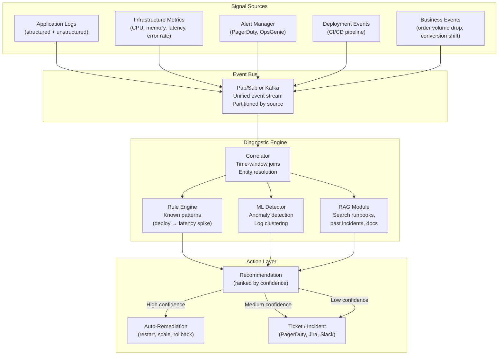
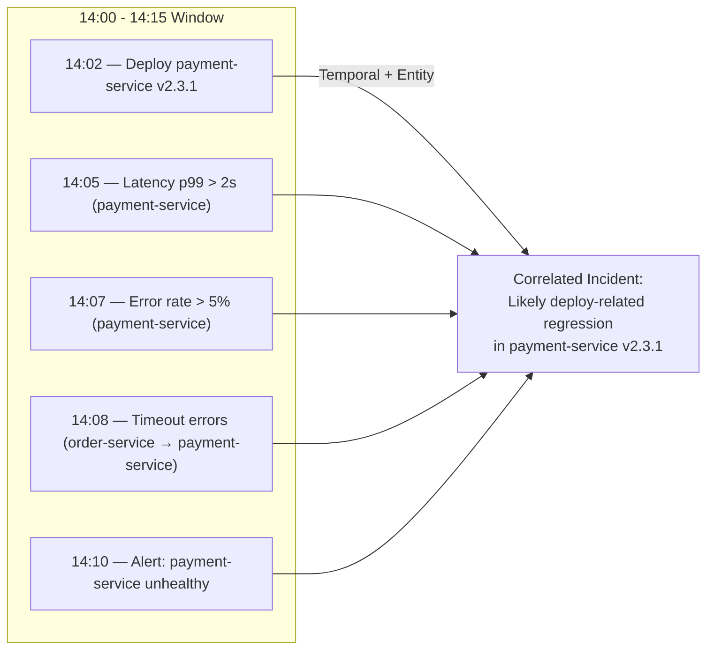

# Event-Driven Production Diagnostics Pattern

**System events -- logs, metrics, alerts, deployments -- trigger diagnostic workflows that correlate signals, identify root causes, and recommend actions. The system investigates before a human opens a terminal.**

Most production systems generate more signals than any team can process. Alerts fire, logs accumulate, metrics fluctuate. The human response is reactive: an alert triggers a page, an engineer opens a dashboard, starts grepping logs, and spends 20-60 minutes correlating signals manually. The event-driven diagnostics pattern automates the correlation and preliminary investigation, so the human starts with a diagnosis rather than a pile of raw signals.

---

## The Architecture

---

## The Signal Chain

### Step 1: Collect

Every system emits events. The diagnostic engine consumes them through a unified event bus.

| Signal type | Source | Format | Volume |
|---|---|---|---|
| **Application logs** | stdout/stderr, log aggregator (Datadog, Splunk, CloudWatch) | Structured JSON or semi-structured text | High (thousands/second) |
| **Infrastructure metrics** | Prometheus, CloudWatch, Datadog | Time-series (metric name, value, timestamp, labels) | Medium (hundreds/second) |
| **Alerts** | PagerDuty, OpsGenie, custom alerting | Event (severity, service, description, timestamp) | Low (tens/day) |
| **Deployment events** | CI/CD pipeline (GitHub Actions, ArgoCD, Spinnaker) | Event (service, version, timestamp, commit hash) | Low (tens/day) |
| **Business metrics** | Analytics pipeline, real-time dashboards | Time-series or events (conversion rate, order volume, error rate by product) | Medium |

**Key requirement:** Every event must carry a timestamp and at least one entity identifier (service name, host, request ID, customer ID). Without these, correlation is impossible.

### Step 2: Correlate

The correlator joins signals across sources within time windows. This is the core of the pattern.

| Correlation type | How it works | Example |
|---|---|---|
| **Temporal** | Events within N minutes of each other are grouped | Deployment at 14:02, latency spike at 14:05, error rate increase at 14:07 |
| **Entity-based** | Events sharing a service name, host, or request ID are grouped | All events for `payment-service` in the last 30 minutes |
| **Causal** | Known cause-effect relationships are applied | Deployment of service X always precedes latency changes in service Y (downstream dependency) |
| **Statistical** | Anomaly detection flags unusual co-occurrence of events | Error rate in service A and timeout rate in service B spike simultaneously but have no direct dependency (shared database bottleneck) |

### Step 3: Diagnose

Three diagnostic approaches run in parallel:

**Rule engine:** Encodes known patterns from past incidents.

| Rule | Condition | Diagnosis |
|---|---|---|
| Deploy → regression | Deployment event within 15 minutes of latency or error spike for the same service | Probable deploy regression. Recommend rollback. |
| Dependency cascade | Downstream service errors spike after upstream service degradation | Root cause is upstream. Investigate upstream first. |
| Resource exhaustion | CPU >90% or memory >85% sustained for >5 minutes | Scaling issue. Recommend horizontal scale or investigate memory leak. |
| Certificate / credential expiry | Connection errors spike across multiple downstream calls from one service | Check TLS certificates and API key expiration dates. |

**ML detector:** Identifies patterns that rules cannot encode.

- Log clustering (group similar log lines, surface novel clusters that do not match known patterns)
- Time-series anomaly detection (identify metric behavior that is unusual relative to the same time window in previous weeks)
- Change-point detection (identify the exact moment a metric shifted, correlate with other events at that moment)

**RAG module:** Searches organizational knowledge for relevant context.

- Past incident reports (postmortems) for similar symptoms
- Runbooks for the affected service
- Architecture documentation showing dependencies
- Recent change logs and release notes

### Step 4: Recommend

The engine produces ranked recommendations:

| Confidence | Action | Example |
|---|---|---|
| **High (>90%)** | Auto-remediate (with human notification) | Rollback deployment when pattern matches a known deploy regression and the previous version was stable |
| **Medium (60-90%)** | Create incident with diagnosis and recommended steps | "Likely database connection pool exhaustion. See runbook X. Similar incident on 2026-01-15." |
| **Low (<60%)** | Create incident with correlated signals for human investigation | "Unusual co-occurrence of events. No matching pattern. Correlated signals attached." |

---

## The Human-in-the-Loop Decision

The most consequential design decision is where to draw the line between automated action and human review.

| Factor | Automate | Require human |
|---|---|---|
| **Reversibility** | Action is easily reversible (rollback, restart, scale up) | Action is irreversible or expensive to reverse (data deletion, customer notification) |
| **Confidence** | Diagnosis confidence >90% AND the pattern has been seen before | Novel pattern or low confidence |
| **Blast radius** | Affects a single service or non-critical path | Affects payment processing, auth, or data integrity |
| **Time sensitivity** | Issue is causing active customer impact and human response time exceeds 15 minutes | Issue is degraded but not critical; human response time is acceptable |
| **Regulatory** | No regulatory requirement for human approval | Financial transactions, healthcare, or other regulated domains |

**The safe default:** Start with everything requiring human approval. Move actions to auto-remediation one at a time as confidence in the diagnostic pattern increases. Track the auto-remediation accuracy rate. If it drops below 95%, pull that action back to human review.

---

## Connection to Production Intelligence

This pattern is the operational layer of a broader Production Intelligence architecture. The diagnostic engine consumes the same data that feeds the Bronze-Silver-Gold pipeline:

- **Bronze:** Raw logs, metrics, and events (the diagnostic engine reads from here)
- **Silver:** Cleaned and structured events (the diagnostic engine can also read from here for higher-quality signals)
- **Gold:** Aggregated incident data, diagnostic outcomes, and remediation effectiveness (the diagnostic engine writes here for reporting and feedback)

The feedback loop applies: when a diagnosis is confirmed or rejected by a human, that outcome feeds back into the rule engine and ML models, improving future diagnostics.

---

## Failure Modes

| Failure | How it manifests | Detection | Fix |
|---|---|---|---|
| **Alert fatigue** | Too many low-confidence recommendations. Engineers stop reading them. Critical issues get buried. | Track the acknowledgment rate and time-to-acknowledge. If acknowledgment rate drops below 70% or time-to-ack increases, the signal-to-noise ratio is too low. | Raise the confidence threshold for creating incidents. Group related signals into a single incident. Add suppression rules for known low-priority patterns. |
| **False positives** | The engine diagnoses a problem that does not exist. Engineers investigate, find nothing, lose trust. | Track the false positive rate (incidents created that are closed as "no issue"). Target <10%. | Tighten correlation windows. Require multiple corroborating signals before firing. Add negative rules ("if metric recovers within 2 minutes, do not alert"). |
| **Missed correlations** | Signals from different systems are not correlated because they lack a shared identifier or the time window is too narrow. | Review postmortems for incidents where the root cause was identifiable from available signals but the engine did not flag it. | Expand entity resolution (map service names across systems). Widen correlation windows. Add cross-service dependency mapping. |
| **Stale runbooks** | The RAG module retrieves outdated runbooks that recommend steps for an architecture that no longer exists. | Track runbook effectiveness (was the recommended action correct?). Flag runbooks not updated in >6 months. | Require runbook updates as part of the deployment process. Add "last verified" dates to runbooks. |
| **Auto-remediation cascade** | The engine auto-remediates (e.g., rolls back a deployment), which triggers new events, which triggers another diagnosis, which triggers another auto-remediation. | Circuit breaker: limit auto-remediations to N per service per hour. Detect remediation loops (same action repeated within M minutes). | Implement circuit breakers. After auto-remediation, enter a cooldown period where only human-approved actions are allowed. |
| **Event bus lag** | The event bus falls behind. The diagnostic engine processes stale events and generates diagnoses for issues that have already resolved. | Monitor consumer lag on the event bus. Alert when lag exceeds the correlation window. | Scale consumer capacity. Add event expiry (discard events older than the correlation window). |

---

## When to Use This Pattern

**Use it for:**
- Any production system with more than 10 alerts per day (the point where manual triage becomes unsustainable)
- Systems with complex dependencies where root cause is rarely in the alerting service
- Organizations where mean time to resolution (MTTR) is a tracked metric and needs to improve
- Environments with frequent deployments (multiple per day) where deploy-related regressions are common

**Do not use it for:**
- Systems with fewer than a handful of alerts per week (manual investigation is sufficient and cheaper)
- Single-service architectures with straightforward failure modes (a restart script is simpler than a diagnostic engine)
- Organizations without structured logging or centralized metrics (the diagnostic engine needs input signals; build observability first)

---

## Decision Checklist

1. **Do you have structured, centralized signals?** If logs are unstructured and scattered across hosts, invest in observability infrastructure before building diagnostics.
2. **What is your current MTTR?** If median MTTR is under 10 minutes, the ROI of automated diagnostics is low. If it is over 30 minutes, the pattern pays for itself quickly.
3. **How many services and dependencies?** The value of correlation increases with system complexity. For 3 services, manual correlation works. For 30 services, it does not.
4. **Do you have historical incident data?** Past postmortems and runbooks are the RAG module's training data. Without them, the engine starts cold.
5. **What is the blast radius of auto-remediation failure?** If a bad auto-rollback causes an outage, start with recommendation-only and earn trust before enabling automation.
6. **Who owns the diagnostic rules?** SRE/platform team owns the engine. Service teams own the rules for their services. Unclear ownership leads to stale rules.
