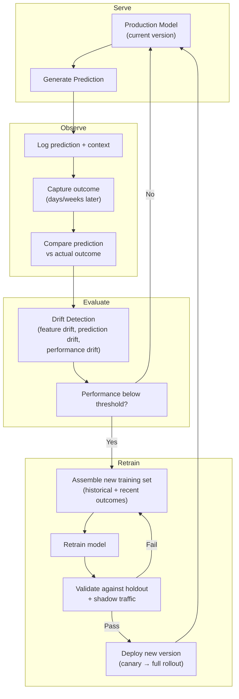
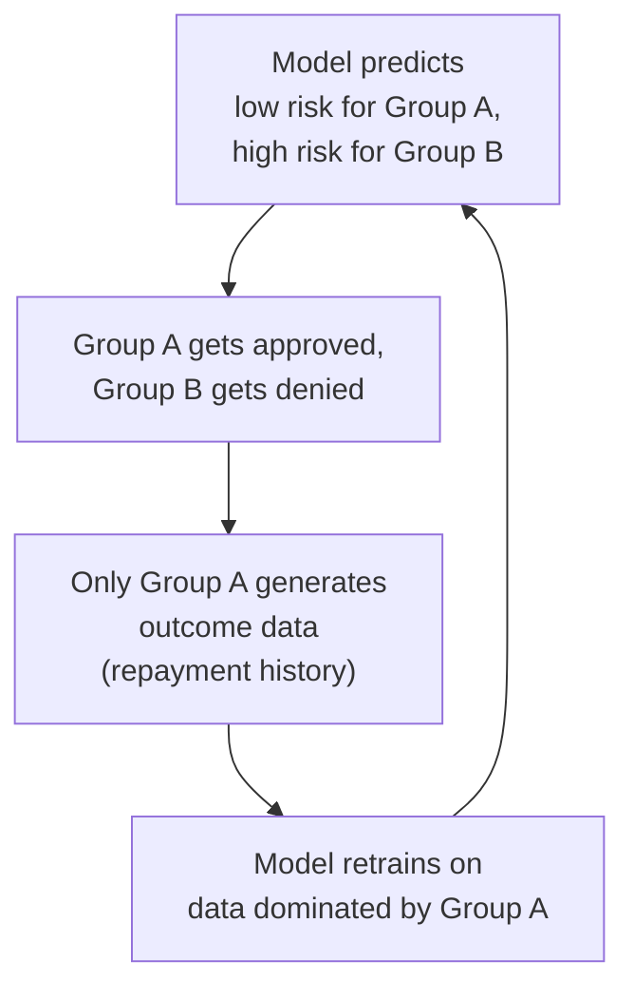

# Production Feedback Loop Pattern

**System output becomes system input. Predictions produce outcomes. Outcomes improve predictions. Without this loop, every production ML system degrades.**

A model deployed without a feedback loop is a snapshot of the past. The world changes -- customer behavior shifts, product mix evolves, fraud tactics adapt -- and the model's accuracy erodes. The feedback loop closes the circuit: the model's predictions generate real-world outcomes, those outcomes are captured as new training signal, and the model is retrained. This is not optional. It is the difference between a system that improves and one that decays.

---

## The Architecture



---

## Types of Feedback

| Type | Source | Latency | Signal quality | Example |
|---|---|---|---|---|
| **Explicit** | User provides direct feedback | Immediate | High (but biased -- only engaged users respond) | Thumbs up/down on a recommendation. Agent marks a prediction as correct/incorrect. |
| **Implicit** | User behavior reveals the outcome | Minutes to hours | Medium (requires interpretation) | User clicks a recommended item. User ignores an alert. Customer calls back within 24 hours (prediction of "resolved" was wrong). |
| **Outcome-based** | Business process completes | Days to weeks | High (ground truth) | Loan defaults 90 days later. Patient is readmitted within 30 days. Fraud is confirmed by investigation. |
| **Automated** | System compares prediction to measurable result | Varies | High (if the measurement is reliable) | Predicted call duration vs actual. Predicted demand vs actual orders. Predicted anomaly vs confirmed incident. |

### The Ground Truth Delay Problem

Most valuable feedback has a delay. You predict loan default, but you do not know the actual outcome for 90 days. You predict churn, but churn is confirmed only when the customer cancels months later.

**Implications:**
- You cannot retrain on today's predictions using today's outcomes. There is a structural lag.
- The retraining dataset is always older than the serving data. Drift detection bridges this gap.
- Fast proxy metrics (e.g., "customer contacted support within 7 days" as a proxy for churn) can accelerate the loop but introduce noise.

---

## Retraining Triggers

| Trigger | How it works | When to use | Risk |
|---|---|---|---|
| **Scheduled** | Retrain every N days/weeks regardless of performance | Stable environments where drift is gradual and predictable | Wastes compute if the model is still performing well. Misses sudden drift between intervals. |
| **Performance threshold** | Retrain when a monitored metric (accuracy, precision, F1, RMSE) drops below a defined threshold | Any system where ground truth is available with reasonable latency | Requires reliable ground truth. Threshold too tight = constant retraining. Threshold too loose = degraded service. |
| **Drift detection** | Retrain when input feature distributions or prediction distributions shift significantly (KL divergence, PSI, Wasserstein distance) | When ground truth is delayed (weeks/months) and you need an early warning | Drift does not always mean performance degradation. False positives cause unnecessary retraining. |
| **Event-driven** | Retrain on a known change: new product launch, market shift, regulatory change, major data source update | When you know in advance that the model's assumptions will break | Requires organizational awareness. Someone must know to trigger the retrain. |

**The common approach:** Scheduled retraining as a baseline (weekly or monthly), with drift detection as an early warning, and performance threshold as a hard trigger.

---

## The Dangerous Feedback Loop

When a model's predictions influence the data it will be trained on, you get a self-reinforcing loop that amplifies bias rather than correcting it.



**The problem:** Group B is denied, so you never observe their actual outcomes. The model trains on a biased sample and becomes more confident in its bias. This is selection bias, and it is the most common failure mode in production feedback loops.

**Mitigations:**

| Mitigation | How it works | Cost |
|---|---|---|
| **Exploration** | Randomly approve a small percentage of "denied" predictions to collect outcome data from the underrepresented group | Direct cost of incorrect approvals. Regulatory risk in some domains. |
| **Counterfactual estimation** | Use causal inference techniques to estimate what would have happened to denied cases | Complex to implement. Estimates are noisy. |
| **Stratified sampling** | Ensure the retraining dataset includes minimum representation from all segments | Requires explicit segment tracking. May undersample the majority. |
| **Fairness constraints** | Add demographic parity or equalized odds constraints to the training objective | May reduce overall accuracy. Requires defining protected groups. |

---

## Implementation Components

### Prediction Logging

Every prediction must be logged with enough context to reconstruct the decision later:

| Field | Purpose |
|---|---|
| `prediction_id` | Unique identifier for this prediction |
| `model_version` | Which model version produced this prediction |
| `timestamp` | When the prediction was made |
| `entity_id` | What entity (customer, order, call) this prediction is about |
| `input_features` | The feature values used (snapshot at prediction time) |
| `prediction_value` | The model's output (score, class, ranking) |
| `confidence` | Model's confidence or probability |
| `outcome` | Filled in later when ground truth is available |
| `outcome_timestamp` | When the outcome was observed |

### Outcome Joining

The prediction log and outcome log are separate streams that must be joined:

```sql
-- Join predictions to outcomes
SELECT
    p.prediction_id,
    p.model_version,
    p.prediction_value,
    p.confidence,
    o.actual_outcome,
    CASE WHEN p.prediction_value = o.actual_outcome THEN 1 ELSE 0 END AS correct,
    TIMESTAMP_DIFF(o.outcome_timestamp, p.timestamp, DAY) AS feedback_delay_days
FROM predictions p
LEFT JOIN outcomes o
    ON p.entity_id = o.entity_id
    AND p.timestamp < o.outcome_timestamp
    AND o.outcome_timestamp < TIMESTAMP_ADD(p.timestamp, INTERVAL 90 DAY)
```

**Note the LEFT JOIN:** Predictions without outcomes yet are still tracked. The `feedback_delay_days` field reveals how long it takes for feedback to arrive and whether your retraining schedule is aligned with that delay.

---

## Failure Modes

| Failure | How it manifests | Detection | Fix |
|---|---|---|---|
| **Data leakage in feedback** | Future outcome data leaks into the training features. Model performs unrealistically well in training, poorly in production. | Compare training metrics to production metrics. A large gap (>5% absolute) suggests leakage. Inspect feature timestamps vs label timestamps. | Enforce point-in-time feature retrieval. Audit the join between features and labels. |
| **Delayed ground truth** | Outcomes arrive weeks or months after predictions. The retraining dataset is always stale. | Monitor the distribution of `feedback_delay_days`. If median delay exceeds the retraining interval, the loop is too slow. | Use proxy metrics with shorter delay. Combine scheduled retraining with drift detection for early warning. |
| **Label noise** | Feedback is incorrect or ambiguous. User clicks "thumbs down" by accident. Automated outcome measurement has errors. | Monitor label flip rate (how often a label changes after initial assignment). High flip rate = noisy labels. | Use label smoothing. Require confirmation for critical labels. Weight recent, confirmed labels higher than older ones. |
| **Selection bias (dangerous loop)** | Model's predictions determine which data is collected. Training set becomes unrepresentative. | Monitor demographic/segment representation in the training set over time. Compare to the population distribution. | Implement exploration (random sampling of denied cases). Use counterfactual estimation. |
| **Concept drift undetected** | The relationship between features and outcomes changes, but the model's predictions still look statistically normal. | Monitor performance metrics segmented by time period, customer segment, and product. Aggregate metrics can hide segment-level decay. | Retrain with recent data. Consider separate models for segments with different drift rates. |
| **Retraining makes it worse** | A retrained model performs worse than the current production model. Deployed without proper validation. | Always validate against a holdout set AND shadow traffic before full deployment. Automated rollback if production metrics degrade post-deploy. | Canary deployment: route 5-10% of traffic to the new model. Compare metrics. Roll forward only if the new model wins. |

---

## When to Use This Pattern

**Use it for:**
- Any production ML system that runs for more than a month
- Systems where the underlying data distribution changes (customer behavior, market conditions, adversarial environments like fraud)
- Systems where prediction accuracy directly impacts revenue or operational decisions
- Systems with accessible outcome data (even if delayed)

**Do not use it for:**
- One-time analyses or batch predictions that will not be repeated
- Systems where the underlying distribution is static (physical constants, well-characterized engineering processes)
- Prototypes where you are still validating the problem definition (close the loop after you know what you are building)

---

## Decision Checklist

1. **How long until you get ground truth?** If <24 hours, the loop can be tight. If >90 days, you need drift detection as an early proxy.
2. **Does the model's prediction influence the outcome data?** If yes, you have a dangerous feedback loop. Plan for exploration from day one.
3. **What is the retraining cost?** GPU hours, data pipeline runs, validation cycles. This determines whether you retrain daily, weekly, or monthly.
4. **What is the deployment risk?** If a bad model costs revenue or safety, you need canary deployment with automated rollback. If the cost of a bad model is low, simpler deployment is acceptable.
5. **Who owns the outcome data?** The team that produces predictions is rarely the team that captures outcomes. Establish data contracts across teams before building the loop.
