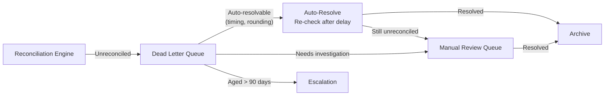

# Cross-System Reconciliation Pattern

**When data lives in 3-7 systems and the numbers don't match. How to detect, explain, and resolve discrepancies across system boundaries.**

Every organization past a certain size has the same problem: the CRM says 1,247 orders, the billing system says 1,239, and the warehouse system says 1,251. Everyone is "right" in their own context. Nobody agrees. The reconciliation pattern provides a systematic approach to detecting and resolving these discrepancies.

---

## The Architecture

```mermaid
graph TD
    subgraph "Source Systems"
        CRM["CRM<br/>(Salesforce, HubSpot)"]
        BILL["Billing System<br/>(Stripe, NetSuite)"]
        WMS["Warehouse / Fulfillment<br/>(ShipBob, Custom)"]
        CS["Customer Support<br/>(Zendesk, Intercom)"]
    end

    subgraph "Extraction Layer"
        E1["Extract + Snapshot<br/>Timestamp each pull"]
    end

    subgraph "Normalization Layer"
        N["Normalize IDs<br/>Normalize timestamps<br/>Normalize statuses<br/>Normalize currency/units"]
    end

    subgraph "Reconciliation Engine"
        JOIN["Join on business keys"]
        COMPARE["Compare expected vs actual<br/>by entity, by field"]
        FLAG["Flag discrepancies<br/>Severity: Critical / Warning / Info"]
    end

    subgraph "Output"
        REPORT["Discrepancy Report<br/>Per-record detail + summary"]
        DLQ["Dead Letter Queue<br/>Unreconciled records"]
        ACTION["Remediation Steps<br/>Auto-fix or manual review"]
    end

    CRM --> E1
    BILL --> E1
    WMS --> E1
    CS --> E1
    E1 --> N
    N --> JOIN
    JOIN --> COMPARE
    COMPARE --> FLAG
    FLAG --> REPORT
    FLAG --> DLQ
    FLAG --> ACTION
```



---

## Why Reconciliation Is Harder Than It Sounds

The naive approach -- join everything on `order_id` and compare -- fails immediately in production. Here is why:

### The Five Mismatches

| Mismatch type | Example | Why it breaks the join |
|---|---|---|
| **Identifier format** | CRM stores `ORD-00123`, billing stores `123`, warehouse stores `ord_123` | String matching fails. You need a canonical ID mapping. |
| **Timing** | An order is created in CRM at 11:58 PM EST. Billing processes it at 12:02 AM UTC the next day. | The "same" order appears on different dates in different systems. Daily aggregates diverge. |
| **Granularity** | CRM has one record per order. Billing has one record per line item. Warehouse has one record per shipment. | 1 CRM order = 3 billing records = 2 shipment records. Row counts never match. |
| **Status definitions** | CRM "Completed" means signed. Billing "Completed" means paid. Warehouse "Completed" means shipped. | Status-based filters produce different record sets from each system. |
| **Eventual consistency** | A refund is processed in billing but takes 24-48 hours to propagate to CRM and warehouse. | At any point in time, systems disagree. Only after propagation delay do they converge. |

---

## The Reconciliation Engine

### Step 1: Normalize

Before comparing, bring every source into the same shape.

| Normalization | What to do |
|---|---|
| **IDs** | Strip prefixes, pad to consistent length, lowercase. Store both the canonical ID and the source-specific ID. |
| **Timestamps** | Convert everything to UTC. Store the original timezone offset. Align to a consistent granularity (daily = midnight UTC). |
| **Statuses** | Create a status mapping table per source system. Map source-specific statuses to a canonical set: `created`, `active`, `completed`, `cancelled`, `refunded`. |
| **Currency** | Convert to a single currency using the exchange rate at transaction time, not at reconciliation time. |
| **Granularity** | Aggregate the more granular source to match the less granular one. Or disaggregate. Document which direction you chose and why. |

### Step 2: Join on Business Keys

The business key is the entity that should exist in all systems. For orders: `order_id` + `customer_id`. For payments: `payment_id` or `invoice_id`.

**Critical:** Use outer joins, not inner joins. Inner joins silently drop the records you most need to see -- the ones that exist in one system but not another.

```sql
-- Outer join to surface ALL records, including orphans
SELECT
    COALESCE(crm.canonical_order_id, bill.canonical_order_id, wms.canonical_order_id) AS order_id,
    crm.order_total AS crm_total,
    bill.amount_charged AS billing_total,
    wms.shipped_value AS warehouse_total,
    CASE
        WHEN crm.canonical_order_id IS NULL THEN 'MISSING_IN_CRM'
        WHEN bill.canonical_order_id IS NULL THEN 'MISSING_IN_BILLING'
        WHEN wms.canonical_order_id IS NULL THEN 'MISSING_IN_WAREHOUSE'
        WHEN ABS(crm.order_total - bill.amount_charged) > 0.01 THEN 'AMOUNT_MISMATCH'
        ELSE 'RECONCILED'
    END AS reconciliation_status
FROM crm_normalized crm
FULL OUTER JOIN billing_normalized bill
    ON crm.canonical_order_id = bill.canonical_order_id
FULL OUTER JOIN warehouse_normalized wms
    ON COALESCE(crm.canonical_order_id, bill.canonical_order_id) = wms.canonical_order_id
```

### Step 3: Compare and Flag

| Severity | Condition | Example | Action |
|---|---|---|---|
| **Critical** | Record exists in one system but not another | Order in CRM but not in billing | Immediate investigation. Data loss or sync failure. |
| **Warning** | Values differ beyond tolerance | CRM total = $500, billing total = $495 | Review. May be timing (partial refund not yet propagated) or legitimate error. |
| **Info** | Values differ within tolerance | Timestamps differ by < 5 minutes | Log for trend analysis. No immediate action. |

### Step 4: Tolerance Windows

Not every difference is a problem. Define tolerances per field:

| Field | Tolerance | Rationale |
|---|---|---|
| Amount | +/- $0.01 (rounding) or +/- 2% (exchange rate) | Currency conversion and rounding create small differences |
| Timestamp | +/- 24 hours | Cross-system propagation delay |
| Status | Allow 48-hour lag | Eventual consistency windows |
| Row count | +/- 0.1% | Minor timing differences in extraction |

---

## The Dead Letter Queue

Records that fail reconciliation after the tolerance window go to a dead letter queue (DLQ). The DLQ is not a dumping ground. It is a triage queue with these properties:

- **Each record has a reason code:** `ID_NOT_FOUND`, `AMOUNT_MISMATCH`, `STATUS_CONFLICT`, `DUPLICATE_IN_SOURCE`
- **Each record has an age:** How long has this been unreconciled?
- **Each record has an assigned owner:** Auto-assigned based on source system
- **Retention:** Records older than 90 days without resolution get escalated



---

## Failure Modes

| Failure | How it manifests | Detection | Fix |
|---|---|---|---|
| **ID format mismatch** | Join produces zero matches. Reconciliation report shows 100% "missing" in one or more systems. | Monitor match rate. If it drops below 95%, something changed in a source system's ID format. | Update the canonical ID mapping. Reprocess. |
| **Timezone inconsistency** | Daily aggregates differ by a consistent amount (roughly one day's worth of records). | Compare daily totals shifted by +/- 1 day. If the shifted comparison reconciles, it is a timezone bug. | Fix the extraction timestamp conversion. Document the source system's timezone convention. |
| **Eventual consistency gap** | Records appear "missing" but resolve themselves 24-48 hours later. DLQ fills with false positives. | Track the auto-resolution rate. If >80% of DLQ records resolve within 48 hours, your tolerance window is too tight. | Widen the tolerance window. Run reconciliation on T-2 data instead of T-0. |
| **Orphaned records** | Records exist in a downstream system (warehouse) but not upstream (CRM). The order was deleted or cancelled in CRM but already shipped. | Monitor for records that exist in "later" systems but not "earlier" ones in the business process flow. | This is often a legitimate business scenario (cancellation after fulfillment). Build explicit handling. |
| **Source schema change** | A source system renames a column or changes a field type. Extraction succeeds but normalization produces nulls or wrong values. | Null rate monitoring per field. Schema drift detection on extraction. | Update the normalization mapping. Add schema contract tests to extraction. |
| **Volume spike** | A bulk import or migration in a source system creates thousands of new records that overwhelm the reconciliation window. | Monitor record volume per source per day. Alert on >2x normal volume. | Increase processing capacity. Consider running reconciliation in batches. |

---

## When to Use This Pattern

**Use it for:**
- Financial systems where regulators require proof that numbers tie across systems
- Order management spanning CRM, billing, fulfillment, and support systems
- Multi-vendor data where each vendor has its own reporting and you need a unified view
- Mergers and acquisitions where two companies' systems must be reconciled before migration
- Any system where "the numbers don't match" is a recurring conversation

**Do not use it for:**
- Single-system pipelines where there is only one source of truth
- Real-time operational decisions (reconciliation is inherently batch)
- Systems where approximate answers are acceptable (reconciliation's cost is precision)

---

## Decision Checklist

1. **How many source systems?** If 2, a simple join may suffice. At 3+, you need the full pattern with normalization and tolerance windows.
2. **What is the business key?** If there is no shared identifier across systems, you need a master data management (MDM) strategy first. Reconciliation depends on joinable keys.
3. **What is the acceptable delay?** If you reconcile at T-0, you will see false positives from eventual consistency. T-2 is a common starting point.
4. **Who owns resolution?** Every discrepancy needs an owner. If nobody owns the DLQ, it becomes a landfill.
5. **What is the tolerance?** Define it per field, per source system pair, before building the engine. Discovering tolerances in production is expensive.
