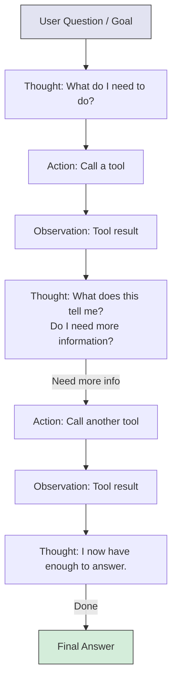
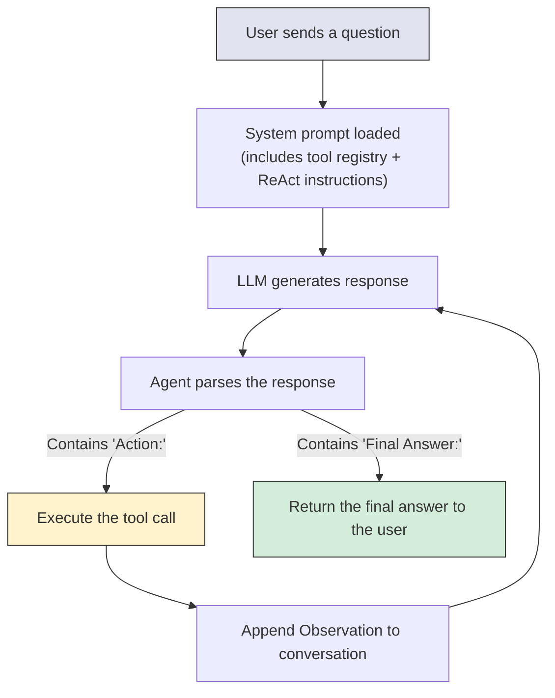
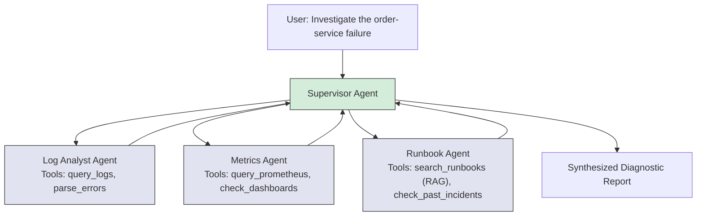

# AI Agents - Concepts

**Agent architecture, the ReAct pattern, tools, memory, and multi-agent systems. Every concept in plain English before you see any code.**

---

## The Core Idea: LLM + Tools + Reasoning Loop

A chatbot is an LLM (Large Language Model) that generates text. An agent is an LLM that can also **use tools** and **decide what to do next** in a loop.

Three components make an agent:

| Component | What It Does | Analogy |
|---|---|---|
| **LLM** (the brain) | Reasons about the situation, decides what to do next | A detective's mind |
| **Tools** (the hands) | Functions the agent can call: search, calculate, query a database, call an API | The detective's phone, computer, and lab equipment |
| **Reasoning loop** (the process) | The cycle of think, act, observe, think again | The detective's investigation method: gather evidence, form a theory, test it, revise |

Remove any one of these and you do not have an agent:
- LLM without tools = chatbot (can only talk)
- Tools without LLM = automation script (can only follow hardcoded steps)
- LLM + tools without a loop = single tool call (one action, no follow-up)

---

## The Detective Analogy

This analogy carries through every concept in this chapter.

**An agent is like a detective.**

A detective gets a case (the user's question or goal). The detective does not know the answer yet. So the detective:

1. **Thinks:** "Based on what I know, I should check the security camera footage." (reasoning)
2. **Acts:** Goes to the security office, reviews the footage. (tool call)
3. **Observes:** "The footage shows a delivery truck at 2:15 AM." (tool result)
4. **Thinks again:** "Interesting. Now I should check the delivery schedule." (more reasoning)
5. **Acts again:** Calls the dispatch office. (another tool call)
6. **Observes:** "No delivery was scheduled for that time." (tool result)
7. **Concludes:** "An unauthorized truck was at the building at 2:15 AM. This is the lead." (final answer)

The detective did not know the answer at step 1. The answer emerged through a cycle of reasoning and investigation. That is exactly how an AI agent works.

---

## The ReAct Pattern

**ReAct = Reason + Act**

ReAct (introduced by Yao et al., 2022) is the foundational pattern for AI agents. The LLM alternates between reasoning (thinking out loud) and acting (calling tools).

The format:

```
Thought: I need to find the current temperature in Seattle.
Action: weather_lookup
Action Input: {"city": "Seattle"}
Observation: 52 degrees Fahrenheit, partly cloudy.
Thought: I now have the temperature. The user asked for Celsius, so I need to convert.
Action: calculator
Action Input: {"expression": "(52 - 32) * 5/9"}
Observation: 11.11
Thought: I now have the answer in Celsius.
Final Answer: The current temperature in Seattle is approximately 11 degrees Celsius (52 degrees Fahrenheit), partly cloudy.
```

Each cycle of Thought-Action-Observation is one **step**. The agent loops until it reaches a Final Answer or hits a maximum step limit.



**Why "Thought" matters:** Without the explicit thinking step, the LLM tends to jump straight to an action that might not be the right one. The "Thought" step forces the LLM to reason about what it knows and what it still needs. Research shows this improves accuracy significantly compared to just calling tools directly.

---

## Tools: What Agents Can Do

A tool is a function that the agent can call. The agent does not execute the tool itself -- it tells the agent framework which tool to call and with what inputs. The framework executes the function and returns the result to the agent.

**Common tool types:**

| Tool Type | What It Does | Example |
|---|---|---|
| **Calculator** | Performs math | `calculator("(52 - 32) * 5/9")` returns `11.11` |
| **Search** | Searches the internet or a document store | `web_search("latest Python release")` returns results |
| **Database query** | Runs SQL against a database | `query_db("SELECT count(*) FROM orders WHERE status='failed'")` |
| **API call** | Calls an external service | `get_weather("Seattle")` returns current conditions |
| **RAG retrieval** | Searches a vector database for relevant documents | `search_runbooks("connection pool exhaustion fix")` returns runbook sections |
| **Code execution** | Runs Python code | `run_python("import pandas; df = pd.read_csv('data.csv'); print(df.shape)")` |
| **File operations** | Reads or writes files | `read_file("/var/log/app.log")` returns log contents |

**The key insight:** The agent CHOOSES which tool to use based on the question. The agent is not hardcoded to call the calculator -- it reads the question, reasons that math is needed, and decides to call the calculator. If the question were about weather, it would call the weather tool instead. This decision-making is what makes it an agent rather than a script.

---

## Tool Registry: How Agents Know Their Tools

The agent does not magically know what tools exist. You define them in a **tool registry** -- a list of tools with their names, descriptions, and expected inputs.

```
Available tools:
1. calculator - Performs mathematical calculations
   Input: {"expression": "a math expression as a string"}

2. weather_lookup - Gets current weather for a city
   Input: {"city": "city name"}

3. search_runbooks - Searches production runbooks using RAG
   Input: {"query": "what to search for"}
```

This registry is included in the agent's **system prompt** -- the instructions that tell the LLM how to behave. The LLM reads these descriptions and uses them to decide which tool fits the current situation.

**Why descriptions matter:** If the calculator tool is described as "Performs mathematical calculations," the agent will use it when math is needed. If it is described poorly as "A tool," the agent will not know when to use it. Good tool descriptions are as important as good code.

---

## The Agent Loop: Step by Step

Here is the complete execution flow of a ReAct agent:



1. The user sends a question
2. The system prompt (with tool descriptions and ReAct instructions) is prepended
3. The LLM generates text that includes either an Action (tool call) or a Final Answer
4. The agent framework parses the output
5. If it is an Action: execute the tool, append the result as an Observation, send everything back to the LLM
6. If it is a Final Answer: return it to the user
7. Repeat until done or max steps reached

**The conversation grows with each step.** After 3 tool calls, the LLM sees the original question plus 3 Thought-Action-Observation sequences. This accumulated context is how the agent "remembers" what it has already done in the current task.

---

## Single-Agent vs. Multi-Agent Systems

| Architecture | What It Means | When to Use | Example |
|---|---|---|---|
| **Single agent** | One LLM with a set of tools. Handles everything. | Simple tasks, clear scope, fewer than ~5 tools | "Check the weather and convert to Celsius" |
| **Multi-agent** | Multiple specialized agents, each with their own tools, coordinated by a supervisor agent | Complex tasks, different expertise needed, many tools | "Investigate this production incident end-to-end" |

**Why multi-agent?**

A single agent with 20 tools gets confused. It has to read 20 tool descriptions, decide which subset is relevant, and coordinate complex multi-step workflows. Performance degrades.

Multi-agent systems solve this by specialization:



Each agent is an expert in its domain (3-5 tools). The supervisor coordinates them. This mirrors how human teams work: you do not ask one person to be the log expert, the metrics expert, and the runbook expert. You assemble a team.

The hands-on notebook builds both: a single ReAct agent from scratch, then a multi-agent system with LangGraph. [Agents on Colab](https://colab.research.google.com/github/sunilmogadati/systems-in-production/blob/main/implementation/notebooks/Agents.ipynb)

---

## Agent Memory

Agents need memory at two levels:

| Memory Type | What It Stores | Lifespan | Analogy |
|---|---|---|---|
| **Short-term (working memory)** | The current conversation: all Thoughts, Actions, Observations so far in this task | One task/session | The detective's notepad during an active investigation |
| **Long-term (persistent memory)** | Past investigations, learned patterns, user preferences | Across tasks/sessions | The detective's case files and experience |

**Short-term memory** is built into the agent loop. Each Observation is appended to the conversation, so the LLM sees everything it has done so far. The limit is the LLM's context window -- once the conversation exceeds it, the oldest information gets dropped.

**Long-term memory** requires external storage. Common approaches:

| Approach | How It Works | When to Use |
|---|---|---|
| **Conversation history in a database** | Store past conversations, retrieve relevant ones when starting a new task | Customer support agents that need to remember past interactions |
| **Vector database of past actions** | Embed past agent traces, retrieve similar ones as examples | Agents that improve by learning from past successes and failures |
| **Key-value store** | Store specific facts: "User prefers Celsius" or "Last incident was a connection pool issue" | Personalization, avoiding repeated questions |

Most agents start with short-term memory only. Long-term memory is added when the agent needs to learn from experience or remember context across sessions.

---

## Key Terms Glossary

| Term | Full Name | Pronunciation | What It Means |
|---|---|---|---|
| **Agent** | -- | "AY-jent" | An LLM + tools + reasoning loop that can take actions to accomplish a goal |
| **Tool** | -- | -- | A function the agent can call (search, calculate, query, API call) |
| **ReAct** | Reason + Act | "ree-ACT" | The pattern where the LLM alternates between thinking and acting |
| **CoT** | Chain-of-Thought | "C-O-T" or "chain of thought" | Prompting the LLM to reason step-by-step before answering |
| **Tool calling** | -- | -- | The LLM's ability to output structured requests to invoke functions |
| **Function calling** | -- | -- | Same as tool calling. The term used by OpenAI's API. |
| **Orchestration** | -- | "or-keh-STRAY-shun" | Coordinating multiple agents or tools to accomplish a complex task |
| **LangChain** | -- | "lang-CHAYN" | A Python framework for building LLM applications including agents |
| **LangGraph** | -- | "lang-GRAF" | A LangChain extension for building stateful, multi-agent workflows as graphs |
| **MCP** | Model Context Protocol | "M-C-P" | An open protocol (by Anthropic) for connecting LLMs to external tools and data sources in a standardized way |
| **Hallucination** | -- | -- | When the LLM generates information that is not real (invents a tool, fabricates a result) |
| **Grounding** | -- | -- | Connecting the LLM's output to real data (via tools, RAG) to reduce hallucination |

---

## How Agents Relate to Other AI Components

| Component | Role | Relationship to Agents |
|---|---|---|
| **ML (Machine Learning)** | Predicts outcomes from structured data | Agent can CALL an ML model as a tool ("Will this alert escalate?") |
| **Deep Learning** | Detects patterns in unstructured data (images, time series) | Agent can CALL a DL model as a tool ("Is this metric anomalous?") |
| **RAG** | Retrieves relevant documents and generates answers | Agent can CALL RAG as a tool ("What does the runbook say?") |
| **Agent** | Orchestrates all of the above | The coordinator that decides WHICH component to call and WHEN |

The agent is the glue. It is not smarter than the individual components -- it is the decision-maker that connects them into a workflow.

See the full system: [Production Diagnostics Architecture](../../../systems/production-diagnostics/architecture.md)

---

## Quick Links

| Chapter | Topic |
|---|---|
| [01 - Why](01_Why.md) | Why agents matter |
| [02 - Concepts](02_Concepts.md) | This page |
| [03 - Hello World](03_Hello_World.md) | Build a working agent in ~30 lines |
| [04 - How It Works](04_How_It_Works.md) | The ReAct loop in detail |
| [05 - Building It](05_Building_It.md) | LLM, framework, architecture tradeoffs |
| [06 - Production Patterns](06_Production_Patterns.md) | How production agent systems work |
| [07 - System Design](07_System_Design.md) | Scaling, state, fault tolerance |
| [08 - Quality, Security, Governance](08_Quality_Security_Governance.md) | Prompt injection, tool misuse, sandboxing |
| [09 - Observability & Troubleshooting](09_Observability_Troubleshooting.md) | Tracing, cost monitoring, debugging |
| [10 - Decision Guide](10_Decision_Guide.md) | Decision table and production readiness |

**Hands-on notebook:** [Agents on Colab](https://colab.research.google.com/github/sunilmogadati/systems-in-production/blob/main/implementation/notebooks/Agents.ipynb) -- builds everything from a from-scratch ReAct agent to multi-agent systems with LangGraph, all running locally with Ollama.

**Production architecture:** [Production Diagnostics Architecture](../../../systems/production-diagnostics/architecture.md)
