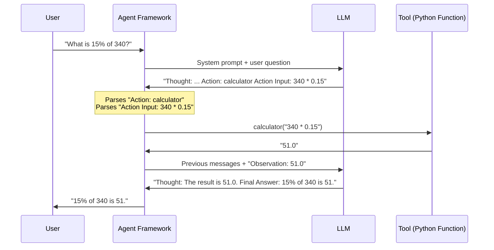
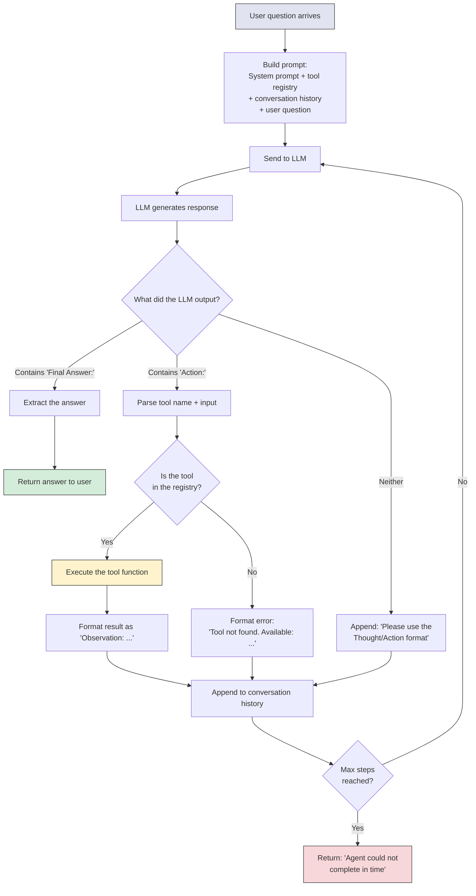

# AI Agents - How It Works

**How the LLM generates structured tool calls. How the agent parses them. Why agents fail. And how to prevent the common failure modes.**

---

## The Magic is in the Prompt

The LLM does not "know" it is an agent. It does not have a built-in concept of tools, actions, or observations. Everything the agent does comes from one thing: **the system prompt**.

The system prompt teaches the LLM a format. The LLM follows the format. The agent framework parses the format and executes the tools. That is the entire mechanism.

**Analogy: A Form Letter.**
Imagine you give someone a form: "Fill in the blanks. Write your THOUGHT, then the ACTION you want to take, then the INPUT for that action." They fill it in. You read what they wrote, do the action for them, and write the result on the form. Then you hand it back and say "now fill in the next section." The person is not "calling functions" -- they are filling in a structured template. The agent framework does the actual calling.

---

## The System Prompt That Creates an Agent

Here is a minimal but complete system prompt that turns an LLM into a ReAct agent:

```
You are a helpful assistant with access to the following tools:

- calculator: Evaluates a math expression. Input: a math expression as a string.
- weather_lookup: Gets current weather for a city. Input: a city name.
- search_runbooks: Searches production runbooks. Input: a search query.

To use a tool, you MUST respond in this EXACT format:

Thought: <your reasoning about what to do next>
Action: <the tool name, exactly as listed above>
Action Input: <the input to pass to the tool>

After I tell you the result (as an Observation), continue with another
Thought/Action or give your final answer.

When you have enough information to answer, respond in this format:

Thought: <your final reasoning>
Final Answer: <your complete answer to the user's question>

Rules:
- Always start with a Thought
- Only use tools listed above
- Do not make up tool results
- If you cannot answer, say so
```

**Why each part matters:**

| Prompt Section | Purpose | What Happens If Missing |
|---|---|---|
| Tool list with descriptions | Tells the LLM what tools exist | LLM hallucinates tool names |
| Exact format specification | Tells the LLM how to structure its output | LLM outputs free text that the parser cannot read |
| "MUST" and "EXACT" | Forces compliance with the format | LLM deviates, especially smaller models |
| "Only use tools listed above" | Prevents hallucinated tools | LLM invents tools like `google_search` or `database_query` that do not exist |
| "Do not make up tool results" | Prevents the LLM from guessing what a tool would return | LLM writes `Observation: 72 degrees` without actually calling the tool |

---

## How the LLM Generates Tool Calls

When the LLM receives a question like "What is 15% of 340?", it generates text token by token. The system prompt has taught it to produce a specific format:

```
Thought: The user wants me to calculate 15% of 340. I should use the calculator tool.
Action: calculator
Action Input: 340 * 0.15
```

**The LLM does not "call" the calculator.** It outputs the text `Action: calculator`. The agent framework reads this text, recognizes the pattern, and calls the actual Python function `calculator("340 * 0.15")`.

This is text generation, not function execution. The LLM's job is to produce the right text. The framework's job is to act on it.



---

## How Parsing Works

The agent framework parses the LLM's output using simple string matching:

```python
# Simplified parsing logic
if "Final Answer:" in response:
    # Extract everything after "Final Answer:"
    answer = response.split("Final Answer:")[-1].strip()
    return answer  # Done

if "Action:" in response and "Action Input:" in response:
    # Extract the tool name
    tool_name = response.split("Action:")[-1].split("\n")[0].strip()
    # Extract the input
    tool_input = response.split("Action Input:")[-1].split("\n")[0].strip()
    # Call the tool
    result = TOOLS[tool_name](tool_input)
    # Feed the result back as an Observation
    return f"Observation: {result}"
```

**This is fragile.** If the LLM writes `Action : calculator` (extra space) or `action: calculator` (lowercase), the parser might miss it. Production frameworks like LangChain handle these edge cases with more robust parsing, but the principle is the same.

---

## ReAct (Text Parsing) vs. Function Calling (Structured Output)

There are two ways an LLM can communicate tool calls:

| Approach | How It Works | Pros | Cons |
|---|---|---|---|
| **ReAct (text parsing)** | LLM outputs `Action: tool_name` as plain text. Framework parses the text. | Works with ANY LLM (including local models via Ollama). No special API needed. | Parsing is fragile. LLM can format it wrong. |
| **Function calling (structured output)** | LLM outputs a JSON (JavaScript Object Notation) object like `{"tool": "calculator", "input": "340 * 0.15"}`. API returns it as structured data. | Reliable parsing. No text extraction needed. | Only works with API providers that support it (OpenAI, Anthropic, Google). Not available with most local models. |

**Function calling example (OpenAI API):**

```python
# The LLM returns structured JSON, not free text
{
    "tool_calls": [
        {
            "function": {
                "name": "calculator",
                "arguments": "{\"expression\": \"340 * 0.15\"}"
            }
        }
    ]
}
```

**Which to use:**

| Situation | Use |
|---|---|
| Learning, local models, Ollama | ReAct (text parsing) |
| Production with OpenAI/Anthropic/Google APIs | Function calling (structured output) |
| Need to support multiple LLM providers | ReAct (works everywhere) or abstract behind a framework |

The notebook uses ReAct with Ollama because it works with any model and teaches you what is happening under the hood. In production, you would typically use function calling for reliability.

---

## The Full Agent Execution Loop



**Key decision points:**

1. **Final Answer detected:** The loop ends. The answer is returned.
2. **Action detected with valid tool:** The tool is executed and the result fed back.
3. **Action detected with invalid tool:** An error is fed back, giving the LLM a chance to correct itself.
4. **Neither detected:** The LLM did not follow the format. A nudge message is sent to get it back on track.
5. **Max steps reached:** Safety valve. The loop ends even if the LLM has not finished.

---

## Why Agents Fail

Understanding failure modes is more valuable than understanding success. Here are the five most common ways agents fail:

### Failure 1: Hallucinated Tools

The LLM invents a tool that does not exist.

```
Thought: I need to search Google for the latest information.
Action: google_search
Action Input: "latest Python release date"
```

The tool `google_search` was never defined. The LLM generated it because it has seen this pattern in its training data.

**Fix:** Validate tool names against the registry. Return an error message listing available tools. Most agents self-correct after seeing the error.

### Failure 2: Wrong Format

The LLM outputs the action in a slightly different format than expected.

```
Thought: I should calculate this.
Tool: calculator          <-- "Tool:" instead of "Action:"
Input: 340 * 0.15         <-- "Input:" instead of "Action Input:"
```

**Fix:** Use more robust parsing (regex patterns, multiple format variants). Or use function calling (structured output) instead of text parsing.

### Failure 3: Infinite Loops

The agent keeps calling tools without converging on an answer.

```
Step 1: Action: search_runbooks → "Connection pool fix: set max_lifetime=300"
Step 2: Action: search_runbooks → same query, same result
Step 3: Action: search_runbooks → same query, same result
...
```

**Fix:** Set a `max_steps` limit. Track which tools have been called with which inputs, and skip duplicate calls. Add "If you have enough information, give a Final Answer" to the prompt.

### Failure 4: Fabricated Observations

The LLM generates both the action AND the observation without actually calling the tool.

```
Thought: I need to check the weather.
Action: weather_lookup
Action Input: Seattle
Observation: 72°F, sunny       <-- The LLM made this up!
Thought: I now have the answer.
Final Answer: It is 72°F and sunny in Seattle.
```

The LLM wrote the Observation line itself instead of waiting for the framework to provide it. The actual weather might be 45°F and rainy.

**Fix:** The framework must stop parsing after `Action Input:` and never let the LLM's own `Observation:` lines count as tool results. Only observations injected by the framework are trusted.

### Failure 5: Context Window Overflow

After many steps, the conversation (system prompt + all Thoughts + all Actions + all Observations) exceeds the LLM's context window. The oldest information gets truncated, and the agent "forgets" what it was doing.

```
Step 1-5: Gathered information about the incident
Step 6-8: Context window full, early observations dropped
Step 9: Agent re-asks a question it already answered in Step 2
```

**Fix:** Summarize intermediate steps instead of keeping full history. Or use a model with a larger context window. LangGraph handles this with checkpointing and state management.

---

## How to Constrain Agents

Production agents need guardrails. Here are the essential constraints:

| Constraint | What It Does | Typical Value |
|---|---|---|
| **Max steps** | Limits the number of Thought-Action-Observation cycles | 5-10 for simple tasks, 15-20 for complex |
| **Timeout** | Wall-clock time limit for the entire agent run | 30-120 seconds |
| **Tool validation** | Reject tool calls where the tool name is not in the registry | Always on |
| **Input validation** | Validate tool inputs before execution (SQL injection prevention, etc.) | Always on in production |
| **Output filtering** | Check the final answer for PII (Personally Identifiable Information), harmful content, etc. | Always on in production |
| **Cost limit** | Maximum LLM API cost per agent run | $0.10-$1.00 per run |
| **Human approval** | Require human confirmation before executing certain tools (database writes, deployments) | For high-risk actions |

**The principle:** Give the agent enough freedom to be useful, but not enough to be dangerous. Start with tight constraints and loosen them as you build trust.

---

## The Prompt Engineering That Makes Agents Work

Three prompting techniques that significantly improve agent reliability:

### 1. Few-Shot Examples

Include an example of a successful agent run in the system prompt:

```
Here is an example of how to use tools:

User: What is the weather in Seattle in Celsius?
Thought: I need to get the weather first, then convert the temperature.
Action: weather_lookup
Action Input: Seattle
Observation: 52°F, partly cloudy
Thought: Now I need to convert 52°F to Celsius.
Action: calculator
Action Input: (52 - 32) * 5 / 9
Observation: 11.11
Thought: I have the temperature in Celsius.
Final Answer: The weather in Seattle is approximately 11°C (52°F), partly cloudy.
```

This shows the LLM exactly what good agent behavior looks like. It is dramatically more effective than just describing the format.

### 2. Explicit Tool Selection Guidance

```
Choose the right tool:
- If the question involves math or numbers, use calculator
- If the question involves weather, use weather_lookup
- If the question involves production issues or fixes, use search_runbooks
- If you can answer from your own knowledge, give a Final Answer directly
```

This reduces wrong tool selection, especially for smaller models.

### 3. Stop Conditions

```
You MUST give a Final Answer within 5 steps.
If you cannot find the answer after 3 tool calls, say "I could not find
enough information to answer this question" as your Final Answer.
```

This prevents infinite loops and forces the agent to converge.

---

## Quick Links

| Chapter | Topic |
|---|---|
| [01 - Why](01_Why.md) | Why agents matter |
| [02 - Concepts](02_Concepts.md) | Agent architecture, ReAct, tools, memory |
| [03 - Hello World](03_Hello_World.md) | Build a working agent in ~30 lines |
| [04 - How It Works](04_How_It_Works.md) | This page |
| [05 - Building It](05_Building_It.md) | LLM, framework, architecture tradeoffs |
| [06 - Production Patterns](06_Production_Patterns.md) | How production agent systems work |
| [07 - System Design](07_System_Design.md) | Scaling, state, fault tolerance |
| [08 - Quality, Security, Governance](08_Quality_Security_Governance.md) | Prompt injection, tool misuse, sandboxing |
| [09 - Observability & Troubleshooting](09_Observability_Troubleshooting.md) | Tracing, cost monitoring, debugging |
| [10 - Decision Guide](10_Decision_Guide.md) | Decision table and production readiness |

**Hands-on notebook:** [Agents on Colab](https://colab.research.google.com/github/sunilmogadati/systems-in-production/blob/main/implementation/notebooks/Agents.ipynb) -- see all of this in action, including failure handling and multi-agent coordination.

**Production architecture:** [Production Diagnostics Architecture](../../../systems/production-diagnostics/architecture.md)
