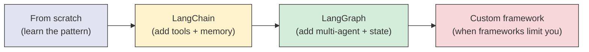
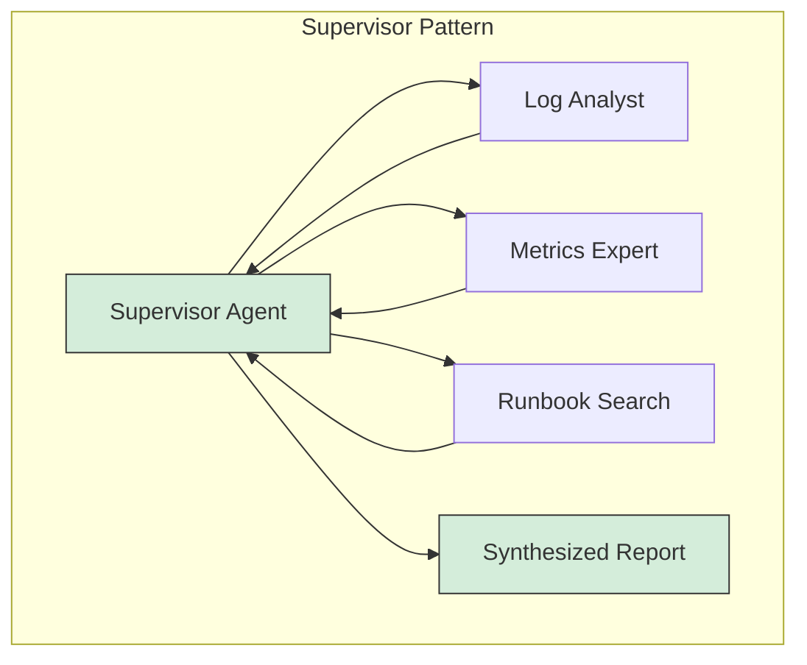
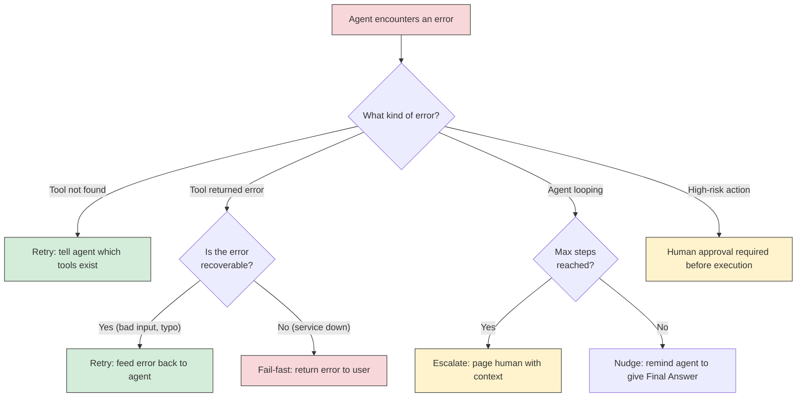
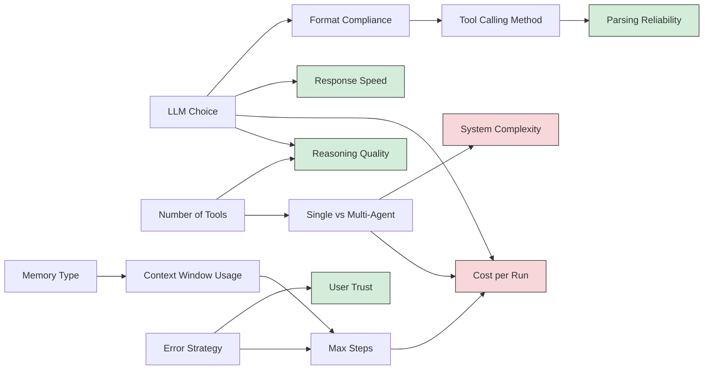

# AI Agents - Decisions

**Every architectural choice in an agent system, with tradeoffs, defaults, and guidance on when to deviate from the defaults.**

---

## Why Decisions Matter More Than Code

The agent loop is 30 lines of Python (you saw it in Chapter 03). The decisions around that loop determine whether the agent is useful or dangerous. A well-chosen LLM with 3 well-designed tools will outperform a poorly-chosen LLM with 20 badly-designed tools every time.

**Analogy: Hiring a Team.**
Building an agent is like hiring. The code is the job description (simple). The decisions are: Who do you hire (LLM)? What tools do you give them (tool design)? How much autonomy do they get (constraints)? Do they work alone or in a team (single vs. multi-agent)? How do you handle mistakes (error strategy)? Those decisions determine whether the team delivers or creates chaos.

---

## Decision 1: LLM Choice

Which model powers the agent's reasoning?

| Model | Runs Where | Cost per 1M Output Tokens | Reasoning Quality | Tool-Following Reliability | Speed |
|---|---|---|---|---|---|
| Mistral 7B | Local (Ollama) | Free | Good for simple tasks | Moderate -- sometimes breaks format | ~30 tokens/sec on M-series Mac |
| Llama 3 8B | Local (Ollama) | Free | Good general purpose | Good | ~25 tokens/sec on M-series Mac |
| Llama 3 70B | Local (Ollama, needs 48GB+ RAM) | Free | Very good | Very good | ~5 tokens/sec (CPU-bound) |
| GPT-4o (OpenAI) | API | ~$15 | Excellent | Excellent (native function calling) | ~80 tokens/sec |
| GPT-4o-mini (OpenAI) | API | ~$0.60 | Very good | Very good | ~100 tokens/sec |
| Claude Sonnet (Anthropic) | API | ~$15 | Excellent | Excellent (native tool use) | ~80 tokens/sec |
| Claude Haiku (Anthropic) | API | ~$1.25 | Good | Good | ~150 tokens/sec |

**The core tradeoff: quality vs. cost vs. privacy.**

- **Local models (Mistral, Llama):** Free, private, no data leaves your machine. But reasoning quality is lower, and they are more likely to break the ReAct format.
- **API models (GPT-4o, Claude Sonnet):** Best reasoning quality and format compliance. But every call costs money, and your data goes to a third party.
- **Small API models (GPT-4o-mini, Haiku):** The middle ground. Good enough for most agent tasks at a fraction of the cost.

| Scenario | Recommended Model | Why |
|---|---|---|
| Learning and prototyping | Mistral 7B (local) | Free, no API key, instant feedback loop |
| Internal tool, moderate complexity | GPT-4o-mini or Claude Haiku | Good quality at low cost |
| Complex multi-step reasoning | GPT-4o or Claude Sonnet | Best reasoning, best format compliance |
| Air-gapped / compliance / privacy | Llama 3 70B (local) | No data leaves the network |
| High-volume production (1000+ runs/day) | GPT-4o-mini or Haiku | Cost at scale is the constraint |

**Default:** Mistral 7B for learning. GPT-4o-mini or Claude Haiku for production MVP. Upgrade to Sonnet/GPT-4o only where complexity demands it.

---

## Decision 2: Framework Choice

Build from scratch or use a framework?

| Framework | What It Is | Complexity | Best For |
|---|---|---|---|
| **From scratch** | Your own Python loop (as in Chapter 03) | Lowest | Learning. Understanding the fundamentals. Simple single-agent tasks. |
| **LangChain** | Python framework for LLM (Large Language Model) applications. Agents, chains, tools, memory. | Medium | Single-agent systems, rapid prototyping, access to 100+ pre-built tools |
| **LangGraph** | Extension of LangChain for stateful, multi-agent workflows modeled as directed graphs | Medium-High | Multi-agent systems, complex workflows with branching and state |
| **Autogen** (Microsoft) | Framework for multi-agent conversations where agents talk to each other | Medium | Collaborative agent scenarios, research, agent debates |
| **CrewAI** | Framework where agents have "roles" and collaborate on tasks | Medium | Role-based agent teams (researcher, writer, editor) |
| **Custom orchestration** | Your own framework using raw API calls | Highest | Enterprise systems with specific requirements that no framework covers |

**The progression most teams follow:**



**When to skip frameworks:**
- If your agent has 1-2 tools and a single workflow, a from-scratch implementation is simpler and easier to debug than bringing in LangChain
- If you need full control over every LLM call, token count, and retry -- frameworks add overhead

**When frameworks save you weeks:**
- Pre-built tool integrations (LangChain has tools for Google Search, Wikipedia, SQL databases, APIs, file systems, and more)
- Built-in memory management (conversation history, summarization)
- Multi-agent coordination (LangGraph handles message passing, state, and routing between agents)

**Default:** Start from scratch to learn. Move to LangChain for production single-agent. Move to LangGraph for multi-agent. The notebook walks through all three in sequence.

---

## Decision 3: Single Agent vs. Multi-Agent

When should you use one agent vs. multiple?

| Factor | Single Agent | Multi-Agent |
|---|---|---|
| **Number of tools** | Fewer than 5-7 | More than 7 (split across agents) |
| **Task complexity** | Linear: do A, then B, then C | Branching: do A and B in parallel, combine results, then do C or D depending |
| **Expertise domains** | One domain (just logs, or just metrics) | Multiple domains (logs + metrics + runbooks + database) |
| **Failure isolation** | One failure breaks everything | One agent's failure does not break others |
| **Debugging** | Easy: one conversation to trace | Harder: multiple conversations, message passing |
| **Latency** | Lower (one LLM call chain) | Higher (multiple agents, supervisor coordination) |
| **Cost** | Lower (fewer total LLM calls) | Higher (each agent makes its own calls, plus supervisor calls) |

**The rule of thumb:** Start with a single agent. Split into multi-agent ONLY when:
1. The single agent's performance degrades because it has too many tools
2. The task naturally decomposes into independent sub-tasks
3. You need different LLMs for different parts (cheap model for simple tasks, expensive model for reasoning)

**Multi-agent architectures:**

| Pattern | How It Works | When to Use |
|---|---|---|
| **Supervisor** | One agent delegates to specialized agents, synthesizes results | Most common. Clear hierarchy. Easy to reason about. |
| **Peer-to-peer** | Agents pass messages to each other without a central coordinator | When no single agent has authority over the workflow |
| **Pipeline** | Agent A's output feeds into Agent B, which feeds into Agent C | Sequential processing with different expertise at each stage |
| **Debate** | Multiple agents answer the same question, then a judge agent picks the best | When accuracy matters more than speed (medical, legal) |



**Default:** Single agent for tasks with fewer than 5 tools. Supervisor pattern for multi-agent.

---

## Decision 4: Tool Design

How many tools, and how granular?

| Approach | Example | Pros | Cons |
|---|---|---|---|
| **Granular (many small tools)** | `get_error_count`, `get_latency_p99`, `get_cpu_usage`, `get_memory_usage` | Agent has fine-grained control. Each tool does one thing well. | Agent must make more decisions about which tool to call. More chances for wrong tool selection. |
| **Coarse (few big tools)** | `get_service_health` (returns error count, latency, CPU, memory all at once) | Fewer decisions for the agent. Less room for error. | Agent gets more data than it might need. Harder to compose tools for novel tasks. |
| **Mixed** | Key actions are coarse tools, specific queries are granular | Balance of simplicity and flexibility | More tools to document and maintain |

**Tool design principles:**

| Principle | What It Means | Example |
|---|---|---|
| **Clear names** | The tool name should describe what it does | `search_runbooks` not `sr` or `tool_3` |
| **Clear descriptions** | The LLM reads the description to decide when to use it | "Searches production runbooks for a specific error or topic" not "searches stuff" |
| **Typed inputs** | Define what the tool expects | `{"query": "string", "max_results": "int"}` not just "some input" |
| **Useful error messages** | When a tool fails, the error should help the agent self-correct | "No results found for 'conection pool' -- did you mean 'connection pool'?" not just "Error" |
| **Idempotent reads** | Read-only tools should be safe to call multiple times | `get_service_health()` returns the same data if called twice in 5 seconds |
| **Confirmed writes** | Tools that change state should require explicit confirmation | `restart_service(service, confirm=True)` -- the agent must explicitly pass `confirm=True` |

**Default:** 3-5 granular tools per agent. Clear names and descriptions. Read-only tools only until you are confident in the agent's reliability.

---

## Decision 5: Agent Memory

How much does the agent remember, and for how long?

| Memory Type | What It Stores | Implementation | When to Use |
|---|---|---|---|
| **Stateless** | Nothing between runs. Each task starts fresh. | No extra code needed. | Simple Q&A agents, one-shot tasks |
| **Conversational** | The full conversation within a single session | Append each message to a list. Send the full list to the LLM each turn. | Chat agents, multi-turn interactions within a session |
| **Summarized** | A compressed summary of the conversation (to fit context window) | After N turns, summarize the conversation and replace history with the summary | Long conversations that would exceed the context window |
| **Persistent** | Facts, preferences, and past interactions stored in a database | Vector database or key-value store, queried at the start of each session | Agents that serve the same users over weeks/months |

**The context window constraint:**
Every message in the conversation costs tokens. A 10-step agent run with verbose tool results can easily consume 4,000-8,000 tokens of context. If your LLM has a 32K token context window, that limits you to ~4 complex agent runs in a single session before history must be trimmed or summarized.

| LLM | Context Window | Approx. Agent Steps Before Overflow |
|---|---|---|
| Mistral 7B | 32K tokens | ~15-20 steps |
| Llama 3 8B | 8K tokens | ~4-5 steps |
| GPT-4o | 128K tokens | ~60-80 steps |
| Claude Sonnet | 200K tokens | ~100+ steps |

**Default:** Conversational memory for most use cases. Add summarization when conversations regularly exceed 10 turns. Add persistent memory only when the agent needs to learn from past sessions.

---

## Decision 6: Error Handling Strategy

What happens when the agent makes a mistake?

| Strategy | What Happens | When to Use |
|---|---|---|
| **Retry** | The error is fed back to the agent as an Observation. The agent tries a different approach. | Default for most errors. The agent often self-corrects. |
| **Fail-fast** | The agent stops immediately and returns an error to the user. | When the error is unrecoverable (authentication failure, service down) |
| **Human escalation** | The agent stops and pages a human with full context of what it tried. | When the agent's confidence is low or the action is high-risk |
| **Fallback** | The agent switches to a simpler strategy or a different LLM. | When the primary approach is unreliable (switch from complex reasoning to simple lookup) |

**Error handling decision tree:**



**Default:** Retry with error feedback for most failures. Fail-fast for infrastructure errors. Human escalation for high-risk actions (database writes, deployments, customer-facing responses).

---

## Decision 7: Structured Output vs. Free-Text Parsing

How does the agent communicate tool calls?

| Approach | How It Works | Reliability | LLM Requirements |
|---|---|---|---|
| **Free-text parsing (ReAct)** | Agent outputs "Action: tool_name" as text. Framework parses it. | Lower -- LLM can break format | Works with any LLM |
| **Function calling (structured)** | Agent outputs JSON via the LLM's native function calling API. Framework reads structured data. | Higher -- format is enforced by the API | Only LLMs with function calling support (OpenAI, Anthropic, Google) |
| **Constrained generation** | Force the LLM to output valid JSON using grammar constraints | High -- format guaranteed | Local models with libraries like `guidance` or `outlines` |

| Scenario | Recommended Approach |
|---|---|
| Learning, understanding the mechanics | Free-text ReAct |
| Production with OpenAI/Anthropic APIs | Function calling |
| Production with local models | Constrained generation or robust ReAct parsing |
| Multi-provider (need to switch LLMs easily) | Framework abstraction (LangChain handles both transparently) |

**Default:** Free-text ReAct for learning. Function calling for production with API models. LangChain abstraction when you need provider flexibility.

---

## Decision 8: Safety Constraints (Max Steps / Timeout / Cost)

How much autonomy does the agent get?

| Constraint | Conservative | Moderate | Aggressive |
|---|---|---|---|
| **Max steps** | 3 | 5-10 | 15-25 |
| **Timeout** | 15 seconds | 30-60 seconds | 120+ seconds |
| **Max cost per run** | $0.01 | $0.05-$0.10 | $0.50-$1.00 |
| **Allowed tool types** | Read-only | Read + safe writes | Read + write + execute |
| **Human approval** | Every tool call | Only write operations | Only destructive operations |

**Start conservative.** Loosen constraints based on measured performance and trust.

**The cost equation for agents:**
Each agent step involves at least one LLM call. With GPT-4o ($15/1M output tokens), a 5-step agent run generating ~500 tokens per step costs approximately:

```
5 steps x 500 tokens x ($15 / 1,000,000 tokens) = $0.0375 per run
```

At 1,000 runs per day: $37.50/day or ~$1,125/month.

With GPT-4o-mini ($0.60/1M output tokens), the same workload: $1.50/day or ~$45/month.

| Daily Volume | GPT-4o Cost/Month | GPT-4o-mini Cost/Month | Local Mistral Cost/Month |
|---|---|---|---|
| 100 runs | ~$112 | ~$4.50 | $0 (hardware only) |
| 1,000 runs | ~$1,125 | ~$45 | $0 |
| 10,000 runs | ~$11,250 | ~$450 | $0 |

**Default:** Max 5 steps, 30-second timeout, read-only tools, $0.10 cost limit per run. Adjust based on task complexity and observed behavior.

---

## Architect Decision Checklist

Use this table when designing a new agent system. Fill in each row.

| Decision | Options | Your Choice | Why |
|---|---|---|---|
| LLM | Mistral (local) / Llama (local) / GPT-4o-mini / GPT-4o / Haiku / Sonnet | | |
| Framework | From scratch / LangChain / LangGraph / Autogen / CrewAI / Custom | | |
| Architecture | Single agent / Multi-agent (supervisor) / Multi-agent (pipeline) | | |
| Number of tools | 1-3 / 4-7 / 8+ (split across agents) | | |
| Tool granularity | Granular (many small) / Coarse (few big) / Mixed | | |
| Memory | Stateless / Conversational / Summarized / Persistent | | |
| Error handling | Retry / Fail-fast / Human escalation / Fallback | | |
| Tool calling method | Free-text ReAct / Function calling (structured) / Constrained generation | | |
| Max steps | 3 / 5 / 10 / 15+ | | |
| Timeout | 15s / 30s / 60s / 120s+ | | |
| Cost limit per run | $0.01 / $0.05 / $0.10 / $0.50+ / Free (local) | | |
| Human-in-the-loop | Every call / Write operations / Destructive only / Never | | |

**Fill this out BEFORE writing code.** The notebook lets you experiment with different configurations: [Agents on Colab](https://colab.research.google.com/github/sunilmogadati/systems-in-production/blob/main/implementation/notebooks/Agents.ipynb)

---

## Decision Interaction Map

Decisions are not independent. Changing one affects others.



**Common interaction patterns:**
- **Cheap LLM + more steps:** A less capable model may need more attempts, but at lower cost per attempt. Can still be cheaper overall.
- **Expensive LLM + fewer steps:** A more capable model gets it right in fewer steps. Often the cheaper option for complex tasks.
- **More tools + multi-agent:** When tool count grows, split tools across specialized agents to maintain quality.
- **Persistent memory + summarization:** Long-lived agents need both -- persist facts to a database, summarize conversations to fit the context window.
- **High-risk tools + human approval:** Any tool that modifies state (database writes, deployments, customer communications) should require human confirmation until trust is established.

---

## The "Start Here" Defaults

If you are building your first agent system, use these defaults. Optimize later with data.

| Decision | Default Value | Why |
|---|---|---|
| LLM | Mistral 7B (local via Ollama) | Free, fast iteration, no API key, teaches you the mechanics |
| Framework | From scratch (30-line loop) | Understand what frameworks do before adopting one |
| Architecture | Single agent | Simpler to build, debug, and reason about |
| Tools | 2-3 granular, read-only tools | Enough to be useful, few enough to be reliable |
| Memory | Conversational (within session) | Built into the loop, no extra infrastructure |
| Error handling | Retry with error feedback | Agents self-correct most errors |
| Tool calling | Free-text ReAct | Works with any model, teaches the mechanics |
| Max steps | 5 | Enough for most simple tasks |
| Timeout | 30 seconds | Prevents runaway agents |
| Cost limit | Free (local model) | No cost surprises while learning |
| Human-in-the-loop | Not needed for read-only tools | Add when you introduce write operations |

These defaults get you a working agent in under an hour. After that, the decision that usually changes first is the LLM -- moving from local to API for better reasoning quality. Then adding more tools. Then moving to a framework. Then multi-agent.

---

## Quick Links

| Chapter | Topic |
|---|---|
| [01 - Why](01_Why.md) | Why agents matter |
| [02 - Concepts](02_Concepts.md) | Agent architecture, ReAct, tools, memory |
| [03 - Hello World](03_Hello_World.md) | Build a working agent in ~30 lines |
| [04 - How It Works](04_How_It_Works.md) | The ReAct loop in detail |
| [05 - Building It](05_Building_It.md) | This page |
| [06 - Production Patterns](06_Production_Patterns.md) | How production agent systems work |
| [07 - System Design](07_System_Design.md) | Scaling, state, fault tolerance |
| [08 - Quality, Security, Governance](08_Quality_Security_Governance.md) | Prompt injection, tool misuse, sandboxing |
| [09 - Observability & Troubleshooting](09_Observability_Troubleshooting.md) | Tracing, cost monitoring, debugging |
| [10 - Decision Guide](10_Decision_Guide.md) | Decision table and production readiness |

**Hands-on notebook:** [Agents on Colab](https://colab.research.google.com/github/sunilmogadati/systems-in-production/blob/main/implementation/notebooks/Agents.ipynb)

**Production architecture:** [Production Diagnostics Architecture](../../../systems/production-diagnostics/architecture.md)
