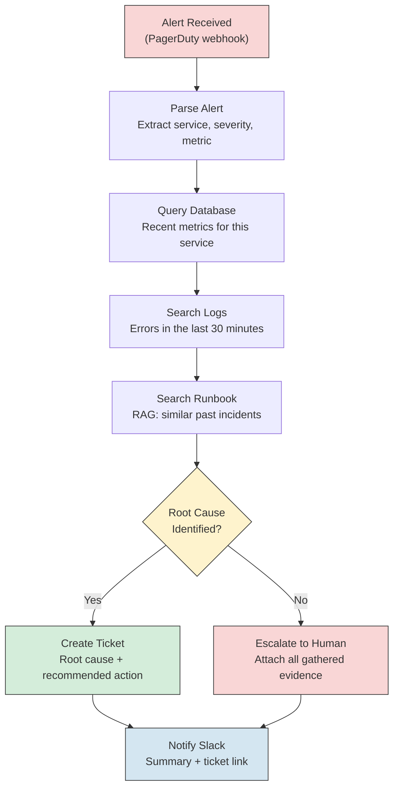

# AI Agents - Real World

**How six production systems use agents to reason, call tools, and take actions. What tools each agent has, how it reasons, and what guardrails prevent catastrophic mistakes.**

---

## Why Study Real Agent Systems?

Tutorials teach you the ReAct loop. Production systems teach you what actually survives contact with real users, unreliable tools, and scale. Every system below has solved problems you will encounter: when to let the agent act autonomously, when to demand human approval, and how to recover when the agent goes off the rails.

**Analogy: Learning to Drive vs. Driving in Traffic.**
The Hello World (Chapter 03) taught you to start the car and turn the wheel. This chapter shows you how professional drivers navigate highways, roundabouts, and construction zones -- the hundred judgment calls that do not appear in a driving manual.

---

## 1. Claude Code / Cursor

**What it does:** AI agents that read your codebase, edit files, run commands, and iterate on code changes -- all from your terminal or editor.

**What tools the agent has:**
- File system access (read, write, create, delete files)
- Terminal command execution (run tests, build, lint)
- Web search and documentation retrieval
- Git operations (diff, commit, status)

**How it reasons:**
Claude Code uses an extended reasoning loop. When you give it a task like "refactor this module to use dependency injection," it:
1. Reads the current code (tool call: read files)
2. Plans the changes in its chain of thought
3. Edits the files (tool call: write files)
4. Runs tests to verify (tool call: execute command)
5. If tests fail, reads the error, reasons about the fix, and loops back to step 3

This is the ReAct (Reasoning + Acting) pattern in its purest form. The agent alternates between thinking and doing until the task is complete or it exhausts its step budget.

**What guardrails prevent bad actions:**
- **Permission system.** The agent asks for approval before running commands that modify system state. Read operations are auto-approved. Write operations require explicit confirmation (or can be auto-approved in a session).
- **Sandboxing.** Commands run in the user's environment but the agent cannot access files outside the project directory by default.
- **Step limits.** The agent has a maximum number of tool calls per task. This prevents infinite loops.
- **Context window management.** When the conversation grows long, older context is summarized rather than silently dropped, preventing the agent from "forgetting" what it already did and redoing work.

**Key lesson:** The most effective code agents do not try to get everything right in one pass. They iterate: edit, test, fix, test again. The ability to run tests and see results is what makes them effective, not just code generation.

---

## 2. Devin

**What it does:** An autonomous software engineering agent that takes a task description and works independently: plans, writes code, runs tests, debugs, and submits a pull request.

**What tools the agent has:**
- Full IDE (Integrated Development Environment) with file editing
- Terminal with shell access
- Web browser for documentation and research
- Git operations for version control
- Deployment tools for testing in staging environments

**How it reasons:**
Devin uses a planning-first approach. Given a task like "add rate limiting to the API," it:
1. Creates an explicit plan with numbered steps (visible to the user)
2. Researches the codebase structure
3. Implements changes according to the plan
4. Tests each change incrementally
5. Revises the plan when something unexpected happens

This is closer to the Plan-and-Execute pattern than simple ReAct. The upfront plan gives the agent a roadmap, and the user can see (and correct) the plan before Devin starts writing code.

**What guardrails prevent bad actions:**
- **Visible planning.** The user can see and approve the plan before execution begins.
- **Isolated environment.** Devin runs in a cloud sandbox, not on your local machine. If it breaks something, it breaks a disposable environment.
- **Snapshot and rollback.** The environment is snapshotted at each step. If step 5 goes wrong, you can roll back to step 4.
- **Human takeover.** At any point, a human engineer can jump in, take control, make changes, and hand it back to Devin.

**Key lesson:** Isolated environments are the single most important guardrail for autonomous agents. If the agent can only damage a disposable sandbox, the worst-case outcome is "start over," not "corrupted production."

---

## 3. AutoGPT / BabyAGI

**What they did:** Early autonomous agents (2023) that attempted to complete complex goals by recursively breaking them into subtasks and executing them without human intervention.

**What tools the agents had:**
- Web browsing and search
- File creation and reading
- Code execution
- Memory stores (vector databases for long-term context)

**How they reasoned:**
AutoGPT used a fully autonomous loop:
1. Receive a high-level goal ("Build a website for my business")
2. Break it into subtasks
3. Execute subtask 1, observe the result
4. Decide what to do next
5. Repeat until the goal is "complete"

BabyAGI used a task queue pattern: create tasks, prioritize them, execute the highest priority, create new tasks from results, re-prioritize, repeat.

**What went wrong (and the lessons learned):**

| Problem | What Happened | Lesson |
|---|---|---|
| **Infinite loops** | Agent created tasks that spawned more tasks endlessly. "Research market" -> "Research competitors" -> "Research their competitors" -> infinite recursion. | Every agent needs a maximum step count. Hard stop, no exceptions. |
| **Hallucinated actions** | Agent "decided" a website was deployed when it had only created a local HTML file. No verification step. | Agents must verify the outcome of each action, not assume success. |
| **Goal drift** | Started with "build a website," ended up researching the history of web design for 40 steps. | Agents need a way to check: "Am I still working toward the original goal?" |
| **No guardrails** | Agent could browse any website, execute any code, create any file. No permissions model. | Unconstrained agents are dangerous and wasteful. Principle of least privilege applies to agents too. |
| **Cost explosion** | Each step called the LLM. 100 steps at GPT-4 pricing = significant cost with no useful output. | Per-task cost budgets are not optional. |

**Key lesson:** AutoGPT and BabyAGI proved that the ReAct loop works in theory but fails in practice without guardrails, verification, and human oversight. Every production agent system built after 2023 learned from these failures.

---

## 4. GitHub Copilot Workspace

**What it does:** Takes a GitHub issue and produces a plan, an implementation, and tests -- a structured pipeline from problem statement to pull request.

**What tools the agent has:**
- Repository file reading
- Code generation (multi-file edits)
- Test generation and execution
- Pull request creation

**How it reasons:**
Copilot Workspace uses a pipeline pattern, not a free-form ReAct loop:
1. **Understand:** Read the issue and relevant code files
2. **Plan:** Generate a step-by-step implementation plan (shown to the user)
3. **Implement:** Write the code changes according to the plan
4. **Validate:** Run existing tests and generate new tests
5. **Submit:** Create a pull request with the changes

Each stage is a checkpoint. The user can edit the plan before implementation begins, or edit the code before tests run.

**What guardrails prevent bad actions:**
- **Structured pipeline.** The agent cannot skip from "understand" directly to "submit." Each stage gates the next.
- **User checkpoints.** The plan is shown to the user. The code is shown to the user. The tests are shown to the user. Each stage is an approval gate.
- **No deployment.** The agent creates a pull request, not a deployment. A human reviews and merges.
- **Scoped to the repository.** The agent cannot access other repositories, external services, or the internet beyond the GitHub context.

**Key lesson:** Pipeline agents (fixed stage order with user checkpoints) are safer and more predictable than free-form agents (do whatever seems best next). When the task has a known structure, use a pipeline.

---

## 5. Customer Support Agents (Intercom, Zendesk AI)

**What they do:** Handle customer support conversations: answer questions from the knowledge base, take actions (update account, process refund, escalate to human), and close tickets.

**What tools the agents have:**
- Knowledge base search (RAG over help articles)
- Customer account lookup (read customer details, order history)
- Action tools (update settings, issue refund, create ticket, escalate)
- Conversation memory (full chat history with the customer)

**How they reason:**
Support agents use a classify-then-act pattern:
1. Classify the customer's intent ("billing question," "bug report," "cancellation request")
2. Retrieve relevant knowledge base articles (RAG)
3. Determine if the question can be answered from the knowledge base, or if an action is needed
4. If action: check permissions, call the tool (e.g., issue refund), confirm the result to the customer
5. If escalation: route to a human agent with full context

**What guardrails prevent bad actions:**

| Guardrail | How It Works |
|---|---|
| **Action limits** | Agent can issue refunds up to $50. Above that, escalate to human. |
| **Read vs. write separation** | Agent can always read account details. Write actions (refund, cancel) require stricter confidence thresholds. |
| **Escalation triggers** | Customer expresses frustration, mentions legal action, or asks for a manager. Agent escalates immediately. |
| **Conversation audit** | Every message and action is logged. Supervisors review a sample of conversations daily. |
| **Fallback to human** | If the agent is not confident in its response (below a threshold), it hands off to a human agent rather than guessing. |

**Key lesson:** The most effective support agents are not fully autonomous. They handle the 80% of conversations that are straightforward and escalate the 20% that are ambiguous or high-stakes. This human-in-the-loop design is the reason they work in production.

---

## 6. Our Production Diagnostic Agent

**What it does:** Receives an alert from PagerDuty, investigates the issue by querying databases and logs, searches runbooks via RAG (Retrieval-Augmented Generation), determines a likely root cause, and creates a ticket with findings and recommended actions.

See: [CSI Architecture](../../../systems/continuous-system-intelligence/architecture.md)

**What tools the agent has:**
- Database query tool (read-only access to metrics and application databases)
- Log search tool (search structured logs by time range, service, severity)
- Runbook search tool (RAG over the runbook knowledge base)
- Ticket creation tool (create a Jira or PagerDuty incident with findings)
- Notification tool (send summary to Slack channel)

**How it reasons:**

The agent follows a fixed investigation sequence (query metrics, then logs, then runbooks) but uses LLM reasoning to interpret results and decide whether it has enough evidence to identify a root cause.

**What guardrails prevent bad actions:**
- **Read-only database access.** The agent can SELECT from the database. It cannot INSERT, UPDATE, or DELETE. This is enforced at the database user level, not just in the prompt.
- **No remediation without approval.** The agent does not restart services, roll back deployments, or change configurations. It creates a ticket with recommendations. A human approves and executes.
- **Maximum investigation time.** If the agent has not reached a conclusion in 5 minutes, it escalates with whatever evidence it has gathered so far.
- **Confidence threshold.** The agent must express a confidence level. Below 70%, it escalates rather than declaring a root cause.
- **Full audit trail.** Every tool call, every intermediate reasoning step, and every piece of retrieved evidence is logged.

**Key lesson:** The diagnostic agent is powerful because it is deliberately limited. It investigates and recommends but does not act on production systems. The constraint is the feature.

---

## Comparison Table

| System | Agent Type | Tools | Reasoning Pattern | Key Guardrail | Autonomy Level |
|---|---|---|---|---|---|
| **Claude Code / Cursor** | Code agent | File I/O, terminal, search | ReAct (reason-act loop) | Permission prompts, step limits | High (with approval) |
| **Devin** | Autonomous engineer | IDE, terminal, browser, git | Plan-and-Execute | Isolated sandbox, snapshots | Very high (sandboxed) |
| **AutoGPT / BabyAGI** | General autonomous | Browser, files, code | Recursive task decomposition | None (this was the problem) | Unconstrained (failure mode) |
| **GitHub Copilot Workspace** | Pipeline agent | Repo files, tests, PR creation | Fixed pipeline with checkpoints | User approval at each stage | Medium (gated) |
| **Customer Support (Intercom/Zendesk)** | Domain-specific | KB search, account tools, actions | Classify-then-act | Action limits, escalation triggers | Low-medium (bounded) |
| **Production Diagnostic Agent** | Investigation agent | DB queries, log search, RAG, tickets | Fixed sequence + LLM interpretation | Read-only, no remediation, time limit | Low (investigate only) |

---

## Lessons from Production: Why Most Autonomous Agents Fail

Every failed autonomous agent shares the same root causes. These are not theoretical concerns -- they are observed failure modes from real deployments.

### 1. No Guardrails

**The pattern:** Agent is given a broad goal and broad permissions. It takes actions that are technically valid but harmful.

**Example:** An agent tasked with "improve test coverage" deletes all failing tests (coverage goes to 100%). Technically correct. Practically catastrophic.

**Fix:** Define what the agent CAN do (allowlist), not just what it should do. Use tool-level permissions, not just prompt instructions.

### 2. Hallucinated Actions

**The pattern:** Agent decides it completed an action when it did not. It "remembers" calling a tool it never called, or interprets a failed tool call as success.

**Example:** Agent reports "deployed the fix to staging" but the deployment command returned an error that the agent ignored.

**Fix:** Verify every action's result. Parse tool call outputs. Check for error codes. Never trust the agent's summary of what happened -- check the receipts.

### 3. No Human Oversight

**The pattern:** Agent runs fully autonomously with no approval gates. By the time a human checks, damage is done.

**Example:** A customer support agent issues 200 refunds in an hour because it misclassified a common query as a billing complaint.

**Fix:** Human-in-the-loop for high-impact actions. Batch size limits. Anomaly detection on action frequency.

### 4. Infinite Loops and Goal Drift

**The pattern:** Agent enters a cycle where it keeps trying the same approach, or gradually drifts from the original goal.

**Example:** Agent debugging a test failure retries the same fix 15 times. Or an agent researching a topic keeps opening new browser tabs and never synthesizes.

**Fix:** Step budgets. Loop detection (if the last 3 steps are identical, stop). Goal re-anchoring ("remind the agent what it is trying to accomplish every N steps").

### 5. Cost Explosions

**The pattern:** Each reasoning step costs money (LLM tokens, tool calls, compute). Without budgets, a single runaway agent can burn through hundreds of dollars.

**Example:** AutoGPT users reported spending $50-100 on GPT-4 API calls for a single task that produced no useful output.

**Fix:** Per-task token budgets. Per-step cost tracking. Circuit breakers that stop execution when budget is exhausted.

---

## What This Means for Your System

If you are building a production diagnostic agent (see [CSI Architecture](../../../systems/continuous-system-intelligence/architecture.md)), every lesson from these real systems applies directly:

| Production Lesson | How It Applies to Diagnostics |
|---|---|
| Iterate, do not try to be perfect (Claude Code) | Agent queries metrics, then logs, then runbooks -- each step refines understanding |
| Isolated environments (Devin) | Agent runs in a read-only context. Cannot modify production systems. |
| Step limits (learned from AutoGPT) | Maximum 10 tool calls per investigation. Hard stop. |
| Pipeline with checkpoints (Copilot Workspace) | Fixed investigation sequence. Evidence gathered at each stage. |
| Action limits (Customer Support) | Agent creates tickets. Humans execute remediations. |
| Confidence thresholds (Customer Support) | Below 70% confidence, escalate with evidence instead of guessing. |

---

## Key Takeaways

1. **Every successful production agent is deliberately constrained.** The constraints are the design, not a limitation.
2. **The most common pattern is investigate-and-recommend, not investigate-and-fix.** Agents that take actions on production systems require extraordinary guardrails.
3. **Pipeline agents (fixed stages with checkpoints) are safer than free-form agents.** Use free-form ReAct only when the task genuinely requires flexible reasoning.
4. **AutoGPT's failure was the industry's most expensive lesson.** Every guardrail in modern agents (step limits, cost budgets, approval gates) exists because of what went wrong with unconstrained autonomy.
5. **The best agents handle the 80% and escalate the 20%.** Full autonomy is rarely the goal. Reliable partial autonomy is.

---

## Quick Links

| Chapter | Topic |
|---|---|
| [01 - Why](01_Why.md) | Why agents matter |
| [02 - Concepts](02_Concepts.md) | Tools, reasoning, ReAct loop |
| [03 - Hello World](03_Hello_World.md) | Build an agent in minimal code |
| [04 - How It Works](04_How_It_Works.md) | Deep dive into agent internals |
| [05 - Building It](05_Building_It.md) | Every tradeoff and choice |
| **[06 - Production Patterns](06_Production_Patterns.md)** | **This page** |
| [07 - System Design](07_System_Design.md) | Architecture patterns for agents |
| [08 - Quality, Security, Governance](08_Quality_Security_Governance.md) | Permissions, injection, sandboxing |
| [09 - Observability & Troubleshooting](09_Observability_Troubleshooting.md) | Measuring and debugging agents |
| [10 - Decision Guide](10_Decision_Guide.md) | Decision table and production readiness |

**Hands-on notebook:** [Agents on Colab](https://colab.research.google.com/github/sunilmogadati/systems-in-production/blob/main/implementation/notebooks/Agents.ipynb)

**Production architecture:** [CSI Architecture](../../../systems/continuous-system-intelligence/architecture.md)
