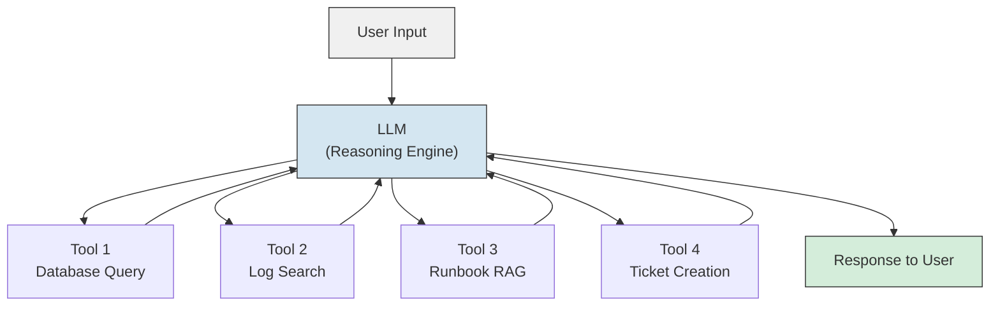
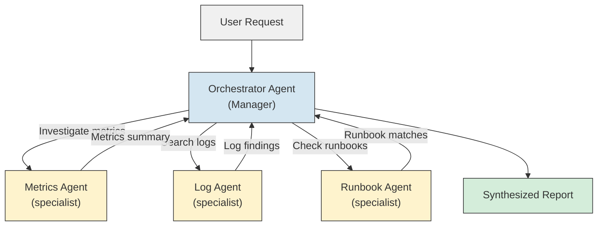
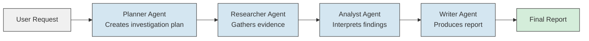
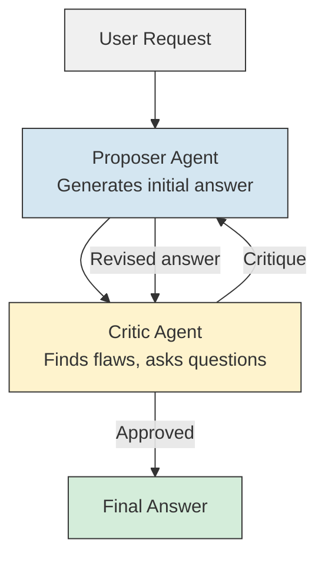
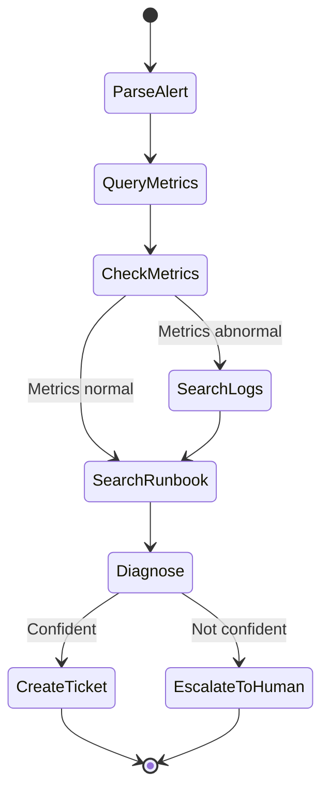
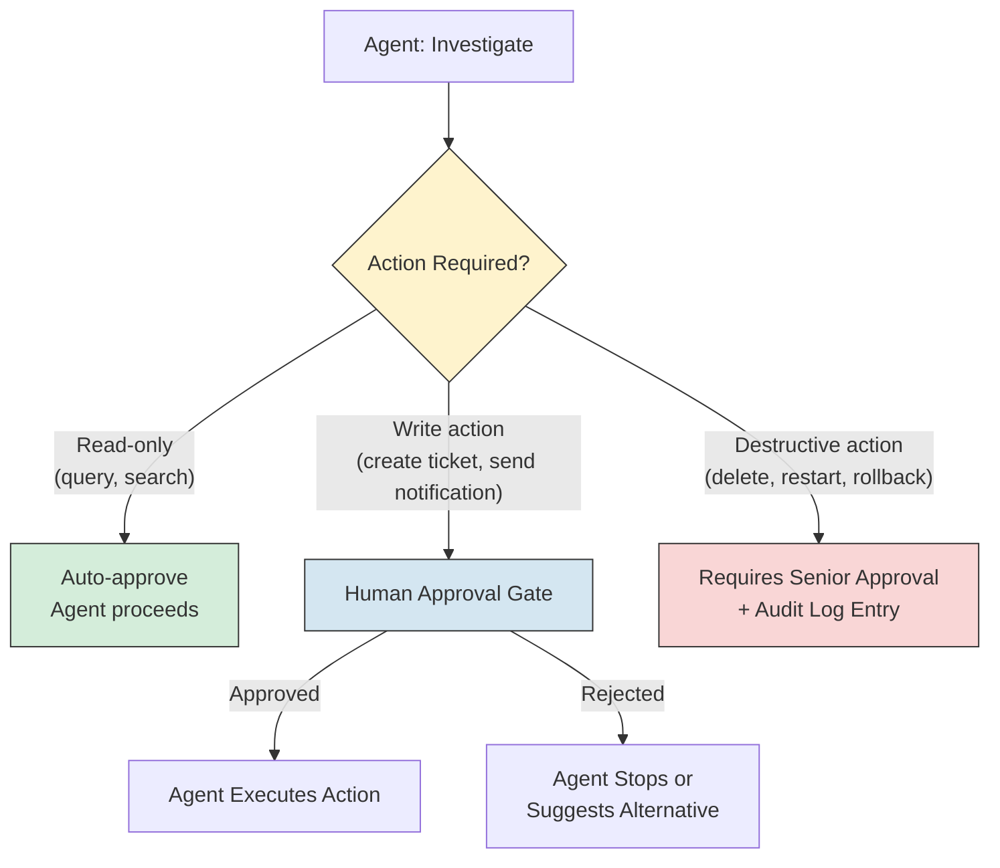
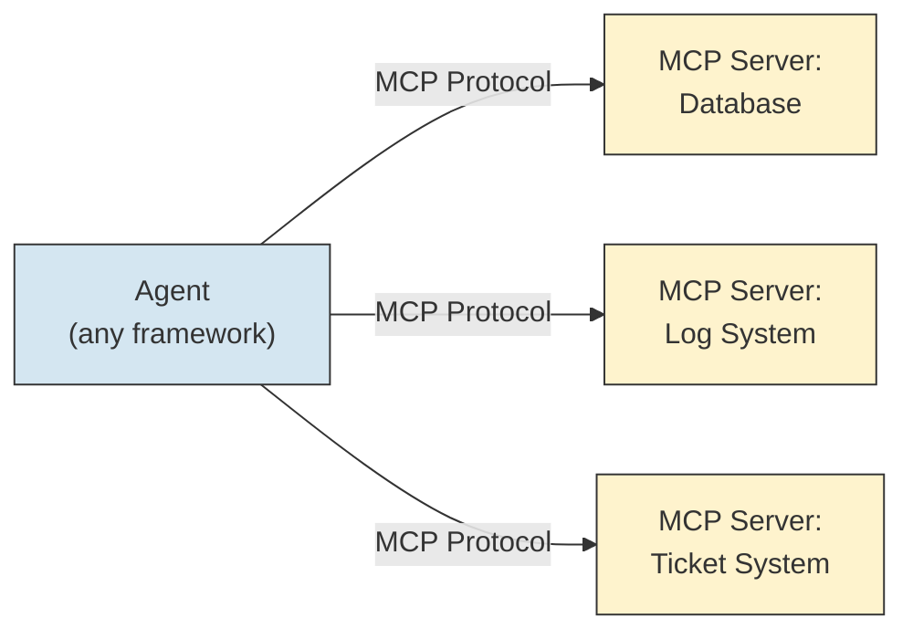

# AI Agents - System Design

**Architecture patterns for building agents: single agent, multi-agent, pipelines, human-in-the-loop, tool design, protocol standards, and cost control. Every pattern with a diagram and tradeoffs.**

---

## Why System Design Matters for Agents

An agent is not just an LLM with tools. It is a distributed system: the LLM reasons, tools execute, state must be managed, errors must be handled, and costs must be controlled. Poor system design is why most agent prototypes never reach production.

**Analogy: Building a House vs. Building a Neighborhood.**
A single agent is a house -- one architect, one floor plan, one set of rooms. A multi-agent system is a neighborhood -- multiple houses that need roads, utilities, zoning rules, and a way to communicate. You do not design a neighborhood the same way you design a house.

---

## Single Agent Architecture

The simplest architecture: one LLM, multiple tools, a reasoning loop.



**When to use:** Most agent tasks. If your task requires reasoning over multiple tools but can be handled by a single decision-maker, start here.

**Advantages:**
- Simple to build and debug
- One context window holds all state
- Predictable cost (one LLM call per reasoning step)

**Disadvantages:**
- Context window fills up on complex tasks (many tool calls = many tokens)
- One LLM handles all decision-making, even when subtasks require different expertise
- Difficult to parallelize (tools are called sequentially)

**When to upgrade:** When the single agent's context window overflows, when different subtasks need different prompts or models, or when you need parallel execution.

---

## Multi-Agent Architectures

When a single agent is not enough, you split the work across multiple agents. There are three primary patterns.

### Pattern 1: Orchestrator (Hub and Spoke)

One "manager" agent delegates subtasks to specialist agents. The specialists report back to the manager, who synthesizes the results.



**When to use:** When subtasks are independent and can run in parallel. When each subtask benefits from a specialized prompt or model.

**Real-world example:** A production diagnostic system where the orchestrator receives an alert and dispatches three specialists simultaneously -- one queries metrics, one searches logs, one searches runbooks. The orchestrator synthesizes their findings into a single report.

**Tradeoffs:**

| Advantage | Disadvantage |
|---|---|
| Specialists can run in parallel | Orchestrator is a single point of failure |
| Each specialist has a focused prompt and context | More complex coordination logic |
| Easy to add new specialists | Orchestrator must understand all specialist capabilities |
| Specialists can use different models (cheap for simple tasks, expensive for complex ones) | Total cost is higher (multiple LLM calls) |

### Pattern 2: Pipeline (Sequential Agents)

Agents run in a fixed sequence. Each agent's output is the next agent's input.



**When to use:** When the task has a natural sequential structure. When each stage transforms the data in a specific way.

**Real-world example:** GitHub Copilot Workspace (Chapter 06) uses a pipeline: Understand -> Plan -> Implement -> Validate -> Submit. Each stage builds on the previous.

**Tradeoffs:**

| Advantage | Disadvantage |
|---|---|
| Predictable execution order | Cannot parallelize stages |
| Easy to debug (check each stage's output) | Slow (latency is the sum of all stages) |
| Each stage has a focused prompt | Error in stage 1 propagates through all subsequent stages |
| Natural checkpoints for human review | Rigid -- cannot skip stages or loop back easily |

### Pattern 3: Debate (Adversarial Refinement)

Multiple agents argue about the answer. One proposes, another critiques, and they iterate until convergence.



**When to use:** When answer quality is critical and you want to catch errors before they reach the user. When the task involves judgment calls where a second opinion adds value.

**Real-world example:** Code review agents where one agent writes code and another reviews it for bugs, security issues, and style violations.

**Tradeoffs:**

| Advantage | Disadvantage |
|---|---|
| Higher quality outputs (errors caught by critic) | 2x or more LLM cost per task |
| Reduces hallucination (critic checks claims) | Can loop indefinitely if proposer and critic disagree |
| Natural audit trail (the debate is the reasoning) | Slower than single-pass generation |

---

## LangGraph for Multi-Agent Systems

LangGraph (by LangChain) models agent workflows as state machines with conditional edges. This is the most popular framework for building multi-agent systems in Python.

**Key concepts:**

| Concept | Plain English | Example |
|---|---|---|
| **State** | A shared data object that all agents can read and write to | `{"alert": "CPU high", "metrics": null, "logs": null, "diagnosis": null}` |
| **Node** | A function that reads state, does work (possibly calling an LLM or tool), and updates state | The "metrics agent" node queries the database and writes results to `state["metrics"]` |
| **Edge** | A connection between nodes that determines execution order | After the "metrics" node, go to the "logs" node |
| **Conditional edge** | An edge that chooses the next node based on state | If `state["metrics"]` shows normal values, skip to the "diagnosis" node. If abnormal, go to "logs" for more detail. |



**Why state machines matter for agents:** Free-form ReAct loops are flexible but unpredictable. State machines give you explicit control over which actions happen in which order, which transitions are allowed, and where the agent can loop. This is the difference between "the agent does whatever it thinks is best" and "the agent follows a defined workflow with escape hatches."

---

## Tool Design Patterns

The tools you give an agent determine what it can do. How you design those tools determines how well it does them.

### Thin Tools (Do One Thing)

Each tool performs a single, atomic operation. The agent composes them.

| Tool | Input | Output |
|---|---|---|
| `query_metrics` | service name, time range | Metric values |
| `search_logs` | service name, time range, severity | Log entries |
| `search_runbook` | query string | Matching runbook sections |
| `create_ticket` | title, description, severity | Ticket ID |

**Advantages:** Flexible. The agent can combine tools in any order. Easy to test each tool independently.

**Disadvantages:** The agent must make more decisions (which tool, what parameters, what order). More reasoning steps = more tokens = more cost.

### Thick Tools (Do Complex Workflows)

Each tool performs a multi-step workflow. The agent delegates entire sub-processes.

| Tool | Input | Output |
|---|---|---|
| `investigate_service` | service name | Combined metrics + logs + anomaly summary |
| `diagnose_from_runbook` | alert description, evidence | Root cause + recommended action |
| `create_incident_report` | all findings | Formatted ticket with severity, root cause, timeline |

**Advantages:** Fewer agent reasoning steps. Lower token cost. Less room for the agent to make bad decisions.

**Disadvantages:** Less flexible. If the workflow inside the thick tool does not fit the situation, the agent cannot adapt.

### When to Use Which

| Situation | Tool Style | Why |
|---|---|---|
| Exploratory tasks (agent does not know what it needs) | Thin tools | Agent needs flexibility to follow the evidence |
| Predictable workflows (same steps every time) | Thick tools | Reduce reasoning overhead and cost |
| Production systems with strict cost budgets | Thick tools | Fewer LLM calls |
| Research or creative tasks | Thin tools | Agent needs to combine tools in novel ways |
| **Most production systems** | **Mix of both** | **Thin tools for investigation, thick tools for actions** |

---

## Human-in-the-Loop: Approval Gates

Any agent that takes actions on real systems needs approval gates -- points where a human must confirm before the agent proceeds.



**The three tiers of agent actions:**

| Tier | Examples | Approval Required |
|---|---|---|
| **Read** | Query database, search logs, retrieve runbooks | None (auto-approve) |
| **Write** | Create ticket, send Slack message, update status | Standard approval (one human) |
| **Destructive** | Restart service, roll back deployment, delete data | Senior approval + audit log |

**Analogy: Airport Security Zones.**
- Read actions = public terminal (anyone can walk around)
- Write actions = boarding gate (show your ticket)
- Destructive actions = cockpit (multiple checks, locked door, two keys)

---

## MCP (Model Context Protocol)

MCP (Model Context Protocol) is a standard for how agents connect to tools and data sources. It was introduced by Anthropic in 2024 and is rapidly becoming the standard interface between LLMs and external systems.

**The problem MCP solves:** Without MCP, every agent framework invents its own way to define tools, pass parameters, and return results. This means tools built for LangChain do not work in CrewAI, and tools built for Claude do not work in GPT-based agents.

**How MCP works:**



| Concept | Plain English |
|---|---|
| **MCP Server** | A wrapper around a data source or service that exposes its capabilities in a standard format. One MCP server for your database, one for your log system, one for Jira. |
| **MCP Client** | The agent (or agent framework) that connects to MCP servers and calls their tools. |
| **Tool definition** | A standardized JSON (JavaScript Object Notation) schema describing what the tool does, what parameters it accepts, and what it returns. |
| **Resource** | A piece of data the MCP server exposes (a file, a database record, a document). |
| **Prompt** | A template the MCP server suggests for how the agent should use its tools. |

**Why it matters:** MCP means you write a database tool ONCE, and it works with Claude, GPT, Llama-based agents, LangChain, CrewAI, or any MCP-compatible framework. Build tools once, use everywhere.

---

## A2A (Agent-to-Agent Protocol)

A2A (Agent-to-Agent protocol, pronounced "A-two-A") is Google's protocol for agents to communicate with each other. While MCP connects agents to tools, A2A connects agents to other agents.

**When you need A2A:** When your system has multiple agents built by different teams (or different vendors) that must collaborate. For example:
- Your diagnostic agent (built in-house) needs to ask a vendor's monitoring agent for analysis
- A planning agent from Team A needs to hand off to an execution agent from Team B

**Key concepts:**

| Concept | Plain English |
|---|---|
| **Agent Card** | A machine-readable description of what an agent can do, published at a known URL (like a business card for agents). |
| **Task** | A unit of work sent from one agent to another. Has a lifecycle: submitted, working, completed, failed. |
| **Message** | A structured communication between agents within a task. |
| **Artifact** | An output produced by the task (a report, a file, a diagnosis). |

**Analogy:** MCP is like USB -- it connects a computer to peripherals (keyboard, mouse, printer). A2A is like email -- it connects one computer to another computer. Both are needed, for different things.

---

## Cost Control

Agents are expensive. Every reasoning step costs LLM tokens. Every tool call may incur API costs or compute charges. Without controls, a single agent can consume significant budget.

### Cost Control Mechanisms

| Mechanism | How It Works | Example |
|---|---|---|
| **Max iterations** | Hard limit on the number of reasoning steps per task | "Stop after 15 steps, no matter what" |
| **Token budget** | Maximum tokens (input + output) the agent can consume per task | "Budget: 50,000 tokens per investigation" |
| **Per-step cost tracking** | Track cumulative cost after each step. Stop when budget is exceeded. | Step 1: $0.02, Step 2: $0.03, ... Step 8: budget exceeded, stop |
| **Circuit breaker** | If the agent fails N consecutive tool calls, stop and escalate | "3 consecutive failures = stop and alert a human" |
| **Model tiering** | Use cheap models for simple reasoning, expensive models only when needed | Haiku for classification steps, Sonnet for synthesis |
| **Caching** | Cache tool results and LLM responses for repeated patterns | Same alert type = cached investigation, skip LLM calls |

### Cost Estimation Template

| Component | Per-Step Cost | Steps per Task | Cost per Task |
|---|---|---|---|
| LLM reasoning (Sonnet) | ~$0.02-0.05 | 5-10 | $0.10-0.50 |
| Tool calls (API) | ~$0.001-0.01 | 3-8 | $0.003-0.08 |
| Embedding (for RAG tools) | ~$0.0001 | 1-3 | $0.0001-0.0003 |
| **Total per task** | | | **$0.10-0.58** |
| **Daily (100 tasks)** | | | **$10-58** |
| **Monthly (3,000 tasks)** | | | **$300-1,740** |

These numbers vary significantly by model, task complexity, and tool costs. The point is: estimate BEFORE you deploy, not when the bill arrives.

---

## The 10-Step System Design Framework: Production Diagnostic Agent

Applying the 10-step system design framework to the agent from [Production Diagnostics Architecture](../../systems/production-diagnostics/architecture.md).

### Step 1: Requirements

| Requirement | Value |
|---|---|
| What triggers the agent? | PagerDuty alert webhook |
| What does it produce? | Jira ticket with root cause analysis and recommended action |
| Latency target? | Investigation complete within 5 minutes |
| Accuracy target? | Root cause identified correctly 70%+ of the time |
| Who are the users? | On-call SRE (Site Reliability Engineer) team |
| Compliance? | SOC 2 (System and Organization Controls 2) audit logging required |

### Step 2: Agent Architecture

Single agent with an orchestrator twist: one main agent that runs a fixed investigation sequence but can conditionally skip steps based on intermediate results.

### Step 3: Tool Design

| Tool | Type | Access Level | Error Handling |
|---|---|---|---|
| `query_metrics` | Thin | Read-only | Return empty result on timeout, do not retry more than 2 times |
| `search_logs` | Thin | Read-only | Return partial results if log volume is high; paginate |
| `search_runbook` | Thin (RAG) | Read-only | Return top 3 matches with confidence scores |
| `create_ticket` | Thick | Write (requires approval in production) | Retry once on API failure, then escalate |
| `notify_slack` | Thin | Write | Fire and forget (non-critical path) |

### Step 4: State Management

```
{
  "alert_id": "PD-12345",
  "service": "payment-service",
  "severity": "high",
  "metrics": null,        // populated by query_metrics
  "logs": null,           // populated by search_logs
  "runbook_matches": null, // populated by search_runbook
  "diagnosis": null,      // populated by LLM reasoning
  "confidence": null,     // 0.0 to 1.0
  "ticket_id": null,      // populated by create_ticket
  "step_count": 0,
  "total_tokens": 0,
  "elapsed_seconds": 0
}
```

### Step 5: Reasoning Flow

Use LangGraph state machine (see diagram in the LangGraph section above). Key conditional edges:
- If metrics are normal, skip directly to runbook search
- If confidence is below 0.7, escalate instead of creating a ticket
- If step count exceeds 10, force escalation

### Step 6: Guardrails

- Read-only database user (enforced at infrastructure level)
- Max 10 tool calls per investigation
- 5-minute wall-clock timeout
- Confidence threshold: 0.7
- All tool calls logged to audit table

### Step 7: Cost Control

- Budget: 50,000 tokens per investigation
- Model: Claude Sonnet for main reasoning, Haiku for classification sub-steps
- Cache: repeated alert types use cached investigation patterns

### Step 8: Security

See Chapter 08 for full security design. Summary: read-only DB access, no remediation tools, prompt injection defense on alert content, audit logging.

### Step 9: Observability

See Chapter 09 for full observability design. Summary: trace every step, track cost per investigation, alert on investigation failures.

### Step 10: Iteration

- Week 1: Deploy with human-in-the-loop for all ticket creation
- Week 2-4: Review investigation quality, tune runbook RAG
- Month 2: Auto-approve ticket creation for high-confidence diagnoses
- Month 3: Add new tools (trace search, deployment history)
- Ongoing: Monthly review of diagnosis accuracy, cost trends, and false escalations

---

## Key Takeaways

1. **Start with a single agent.** Multi-agent adds complexity. Only split when you have a clear reason (context overflow, parallelism, different model needs).
2. **Orchestrator pattern is the most common multi-agent design.** One manager, multiple specialists. Clean separation of concerns.
3. **Pipeline agents are safest for structured tasks.** Fixed stages with checkpoints prevent the agent from going off-script.
4. **Tool design is as important as prompt design.** Thin tools for flexibility, thick tools for predictability. Most systems use a mix.
5. **Human-in-the-loop is a feature, not a crutch.** Approval gates at the right points make agents trustworthy enough for production.
6. **MCP standardizes agent-to-tool connections.** Build tools once, use across frameworks.
7. **Cost control is a first-class design concern.** Step limits, token budgets, model tiering, and caching are not optimizations -- they are requirements.

---

## Quick Links

| Chapter | Topic |
|---|---|
| [01 - Why](01_Why.md) | Why agents matter |
| [02 - Concepts](02_Concepts.md) | Tools, reasoning, ReAct loop |
| [03 - Hello World](03_Hello_World.md) | Build an agent in minimal code |
| [04 - How It Works](04_How_It_Works.md) | Deep dive into agent internals |
| [05 - Building It](05_Building_It.md) | Every tradeoff and choice |
| [06 - Production Patterns](06_Production_Patterns.md) | How production agents work |
| **[07 - System Design](07_System_Design.md)** | **This page** |
| [08 - Quality, Security, Governance](08_Quality_Security_Governance.md) | Permissions, injection, sandboxing |
| [09 - Observability & Troubleshooting](09_Observability_Troubleshooting.md) | Measuring and debugging agents |
| [10 - Decision Guide](10_Decision_Guide.md) | Decision table and production readiness |

**Hands-on notebook:** [Agents on Colab](https://colab.research.google.com/github/sunilmogadati/systems-in-production/blob/main/implementation/notebooks/Agents.ipynb)

**Production architecture:** [Production Diagnostics Architecture](../../systems/production-diagnostics/architecture.md)
