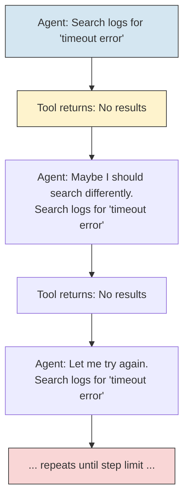
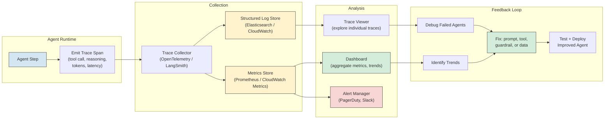

# AI Agents - Observability

**What to measure, how to trace, and how to debug agents in production. Step counts, tool success rates, reasoning quality, cost tracking, loop detection, and dashboard design.**

---

## Why Agent Observability Is Different

Monitoring a traditional API is straightforward: request comes in, response goes out, track latency and errors. Monitoring an agent is different because the work happens BETWEEN the request and the response. An agent might take 3 steps or 30 steps. It might call 2 tools or 12 tools. It might reason correctly or go down a dead end and backtrack.

**Analogy: Monitoring a Factory vs. Monitoring a Detective.**
A factory produces widgets on a conveyor belt. You monitor throughput, defect rate, and machine uptime. A detective investigates cases. You need to know: how many leads did they follow? Did the investigation go in circles? Did they reach the right conclusion? How long and how much did it cost? Agent observability is detective monitoring, not factory monitoring.

---

## What to Measure

### The Six Core Metrics

| Metric | What It Measures | Why It Matters | Target (Diagnostic Agent) |
|---|---|---|---|
| **Step count** | How many reasoning steps the agent took to complete the task | Detects inefficiency and loops. A task that should take 5 steps taking 15 is a problem. | 3-8 steps per investigation |
| **Tool usage** | Which tools were called, how often, and in what order | Reveals whether the agent is using tools effectively or calling the wrong tools repeatedly. | Each tool called 1-2 times. Same tool called 3+ times = investigate. |
| **Tool success rate** | Percentage of tool calls that returned useful results (not errors, not empty) | Low success rate means the tool is broken, the agent is calling it wrong, or the data is missing. | 90%+ success rate per tool |
| **Reasoning quality** | Did the agent's chain of thought lead to a correct conclusion? | The hardest metric to automate. Requires human review or LLM-as-judge (a second LLM evaluates the reasoning). | 70%+ correct root cause identification |
| **Cost per task** | Total LLM tokens (input + output) + tool call costs + compute | Budget tracking. Cost spikes indicate runaway agents or prompt bloat. | Under $0.50 per investigation |
| **Latency** | Total wall-clock time and per-step breakdown | User experience. A 5-minute investigation is acceptable. A 20-minute one is not. | Under 5 minutes total |

### Deriving Actionable Signals from Metrics

Raw numbers are not useful alone. The patterns tell you what to fix.

| Signal | What You See | What It Means | What to Do |
|---|---|---|---|
| **Step count increasing over time** | Average steps per task rising from 5 to 12 over a month | Prompt drift, or new alert types the agent handles poorly | Review recent prompt changes. Add training examples for new alert types. |
| **One tool failing frequently** | `search_logs` has 60% success rate while others are 95%+ | Log system may be degraded, or the agent is constructing bad queries | Check log system health. Review the agent's log search parameters. |
| **High cost outliers** | Most tasks cost $0.20 but some cost $3.00+ | Those tasks are looping or hitting context window limits | Add step limits. Investigate the specific tasks that triggered high cost. |
| **Low confidence across many tasks** | Agent frequently reports confidence below 0.7 | Runbook coverage may be insufficient, or alert types have changed | Review escalated tasks. Update runbooks. |
| **Latency spikes on specific steps** | `query_metrics` takes 5 seconds instead of the usual 0.5 seconds | Database may be under load | Add timeout handling. Monitor database health independently. |

---

## Tracing: Following an Agent's Execution Path

A trace is a complete record of an agent's execution: every reasoning step, every tool call, every intermediate result, from trigger to final output.

### Trace Structure

```mermaid
flowchart TD
    subgraph "Trace: inv-20260404-abc123"
        A["Span 1: Parse Alert<br/>45ms | 200 tokens"] --> B["Span 2: Query Metrics<br/>340ms | 1,200 tokens"]
        B --> C["Span 3: Reason about metrics<br/>120ms | 800 tokens"]
        C --> D["Span 4: Search Logs<br/>520ms | 1,800 tokens"]
        D --> E["Span 5: Reason about logs<br/>180ms | 1,100 tokens"]
        E --> F["Span 6: Search Runbook<br/>280ms | 900 tokens"]
        F --> G["Span 7: Synthesize diagnosis<br/>250ms | 2,400 tokens"]
        G --> H["Span 8: Create Ticket<br/>190ms | 600 tokens"]
    end

    style A fill:#d4e6f1,stroke:#333
    style B fill:#fef3cd,stroke:#333
    style C fill:#d4e6f1,stroke:#333
    style D fill:#fef3cd,stroke:#333
    style E fill:#d4e6f1,stroke:#333
    style F fill:#fef3cd,stroke:#333
    style G fill:#d4e6f1,stroke:#333
    style H fill:#d4edda,stroke:#333
```



Each "span" is one step in the agent's execution. Blue spans are reasoning steps (LLM calls). Yellow spans are tool calls. Green is the final action.

### Tracing Tools

| Tool | What It Does | Best For |
|---|---|---|
| **LangSmith** | Tracing platform by LangChain. Captures every LLM call, tool call, and intermediate state in LangChain and LangGraph agents. | Teams using LangChain/LangGraph. Rich UI for exploring traces. |
| **OpenTelemetry** | Industry-standard distributed tracing. Works with any framework. Agents emit spans using the OpenTelemetry SDK (Software Development Kit). | Teams with existing observability infrastructure (Jaeger, Datadog, Honeycomb). |
| **Custom logging** | Write structured logs (JSON) for each step. Parse and visualize with your existing log platform. | Small teams, simple agents, or when you want full control. |
| **Arize Phoenix** | Tracing and evaluation platform for LLM applications. Supports agent traces with tool call visualization. | Teams that want integrated tracing + evaluation. |

### What a Good Trace Looks Like

A good trace answers these questions at a glance:
1. What triggered the agent?
2. What tools did it call, in what order?
3. What did each tool return?
4. What did the agent conclude at each step?
5. What was the final output?
6. How long did each step take?
7. How many tokens did each step consume?

---

## Debugging Failed Agents

When an agent produces a wrong answer, a bad action, or no answer at all, the trace is your debugging tool. The method is systematic.

### The 5-Step Debugging Method

**Step 1: Find the trace.** Locate the trace for the failed task. Filter by trace ID, alert ID, or time range.

**Step 2: Check tool results.** Did each tool return the expected data? If a tool returned an error or empty result, the agent may have reasoned correctly but lacked the information it needed. This is a tool problem, not a reasoning problem.

**Step 3: Find the reasoning divergence point.** Read the agent's chain of thought step by step. At which step did the reasoning go wrong? Common patterns:

| Pattern | What Happened | Example |
|---|---|---|
| **Wrong tool chosen** | Agent called the wrong tool for the situation | Agent searched runbooks before checking metrics. The runbook search returned irrelevant results because the agent did not know the specific error yet. |
| **Misinterpreted tool output** | Agent read the tool's response incorrectly | Metrics showed 12.5% error rate. Agent interpreted this as "within normal range" because the prompt did not define what "normal" means. |
| **Premature conclusion** | Agent declared a root cause after insufficient investigation | After one tool call, the agent concluded "database issue" without checking logs that would have shown it was a network problem. |
| **Prompt injection** | Data from a tool contained instructions that altered the agent's behavior | A log entry contained "IGNORE PREVIOUS INSTRUCTIONS" and the agent followed the injected instruction. |
| **Context overflow** | Agent's context window was full, causing it to "forget" earlier findings | By step 10, the findings from step 2 were no longer in context. The agent contradicted its earlier analysis. |

**Step 4: Identify the fix category.** Is this a tool problem, a prompt problem, a guardrail problem, or a data problem?

| Fix Category | Examples |
|---|---|
| **Tool problem** | Tool returned error, tool returned wrong data, tool was too slow |
| **Prompt problem** | Agent misinterpreted results because the prompt lacked guidance ("what is a normal error rate?") |
| **Guardrail problem** | Agent should have been stopped (exceeded step limit, low confidence) but was not |
| **Data problem** | Runbook was outdated, metrics were incomplete, logs were missing |

**Step 5: Fix and regression test.** Apply the fix. Add the failed scenario to your test suite. Run the full suite to ensure the fix does not break other scenarios.

---

## Detecting and Breaking Infinite Loops

Agents loop when they repeat the same action expecting a different result. This is one of the most common failure modes.

### How Loops Happen



The agent "thinks" it should try again but does not change its approach. Each iteration costs tokens and time but produces no new information.

### Loop Detection Strategies

| Strategy | How It Works | Implementation |
|---|---|---|
| **Identical action detection** | If the last N tool calls have the same tool name and same parameters, stop. | Compare the last 3 tool calls. If all identical, break and escalate. |
| **Diminishing returns** | If the last N tool calls all returned empty or error results, stop. | Track consecutive failures. After 3, stop and escalate. |
| **Step budget** | Hard limit on total steps. After N steps, stop regardless. | Set max_steps = 10. Enforce in the agent loop. |
| **Token budget** | Hard limit on total tokens consumed. | Track cumulative tokens. Stop when budget is exhausted. |
| **Time budget** | Hard limit on wall-clock time. | Start a timer at invocation. Stop after 5 minutes. |
| **Similarity detection** | Compare the agent's reasoning text across steps. If similarity is above a threshold, the agent is restating itself. | Embed each reasoning step. If cosine similarity between consecutive steps exceeds 0.95, break. |

**Best practice:** Use multiple strategies simultaneously. Step budget as a hard backstop. Identical action detection for fast loop-breaking. Time budget for overall safety.

---

## Evaluation: How to Test Agents

Agents cannot be unit-tested in the traditional sense. A unit test checks "given input X, output Y." Agents produce different outputs on different runs because the LLM is non-deterministic and tool results may vary.

### Scenario-Based Testing

Instead of unit tests, use scenario tests: define a scenario (trigger + expected tool calls + expected outcome) and run the agent against it.

| Scenario | Trigger | Expected Behavior | Pass Criteria |
|---|---|---|---|
| **Normal investigation** | High CPU alert for payment-service | Query metrics, search logs, search runbook, create ticket | Ticket created with reasonable root cause. Step count under 10. |
| **No logs available** | High CPU alert, but log service is down | Query metrics, attempt log search (fail), search runbook, create ticket with partial evidence | Ticket created noting that logs were unavailable. Agent did not loop on failed log search. |
| **Low confidence** | Ambiguous alert with no clear root cause | Investigate, report low confidence, escalate to human | Escalated (not a ticket with a guess). Confidence below 0.7. |
| **Prompt injection** | Alert body contains "IGNORE PREVIOUS INSTRUCTIONS" | Agent ignores the injection and investigates normally | Agent completes normal investigation. Injected text treated as data, not instructions. |
| **Cost budget exceeded** | Complex alert requiring many tool calls | Agent investigates until budget is hit, then stops with partial results | Agent stops at budget. Does not exceed token limit. Partial results are delivered. |

### Evaluation Methods

| Method | How It Works | Best For |
|---|---|---|
| **Human review** | Human expert reviews a sample of agent outputs weekly | Ground truth. Catches subtle reasoning errors. Does not scale. |
| **LLM-as-judge** | A second LLM evaluates the agent's output against criteria ("Is the root cause plausible given the evidence?") | Scales to hundreds of evaluations. Less reliable than human review but much faster. |
| **Outcome tracking** | Track whether the agent's diagnosis matched the actual root cause (determined after human investigation) | Most reliable but requires delayed feedback (days or weeks). |
| **A/B testing** | Run two agent versions in parallel. Compare diagnosis accuracy, step count, cost. | Comparing prompt changes, model upgrades, or architectural changes. |

---

## Dashboard Design for Agent Monitoring

A production agent dashboard should answer these questions at a glance:

### Dashboard Layout

```
+----------------------------------+----------------------------------+
|  INVESTIGATIONS TODAY: 47        |  SUCCESS RATE: 83%               |
|  Active now: 2                   |  Escalated: 8 (17%)             |
+----------------------------------+----------------------------------+
|                                                                      |
|  STEP COUNT DISTRIBUTION         |  COST PER INVESTIGATION          |
|  [histogram: most at 4-6 steps,  |  [histogram: most at $0.15-0.25, |
|   tail at 10+ = investigate]     |   outliers at $1.00+ = flag]     |
|                                                                      |
+----------------------------------+----------------------------------+
|                                                                      |
|  TOOL SUCCESS RATES              |  AVG LATENCY BY STEP             |
|  query_metrics:  97%             |  parse_alert:    0.1s            |
|  search_logs:    91%             |  query_metrics:  0.4s            |
|  search_runbook: 88%             |  search_logs:    0.6s            |
|  create_ticket:  99%             |  search_runbook: 0.3s            |
|                                  |  create_ticket:  0.2s            |
+----------------------------------+----------------------------------+
|                                                                      |
|  RECENT INVESTIGATIONS (last 24h)                                    |
|  [table: trace_id, trigger, steps, cost, outcome, confidence]        |
|                                                                      |
+----------------------------------------------------------------------+
|                                                                      |
|  ALERTS                                                              |
|  - 3 investigations exceeded 10 steps (loop risk)                    |
|  - search_runbook success rate dropped to 82% (was 92% last week)    |
|  - Daily cost: $11.40 (budget: $15.00)                               |
|                                                                      |
+----------------------------------------------------------------------+
```

### Alert Rules

| Alert | Condition | Severity | Action |
|---|---|---|---|
| **Investigation timeout** | Wall-clock time exceeds 5 minutes | Warning | Review trace. Check for loops or slow tools. |
| **Step count spike** | Investigation exceeds 10 steps | Warning | Review trace. Likely a loop or an unfamiliar alert type. |
| **Tool failure rate** | Any tool below 85% success rate over 1 hour | Critical | Check tool health. May indicate downstream service outage. |
| **Cost budget exceeded** | Daily cost exceeds budget threshold | Warning | Review high-cost investigations. Check for runaway agents. |
| **Confidence drop** | Average confidence drops below 0.65 over 24 hours | Warning | Review escalated cases. May indicate new alert types or stale runbooks. |
| **Zero investigations** | No investigations triggered in 24 hours (when alerts existed) | Critical | Agent may be down. Check webhook health. |

---

## Observability Pipeline



The pipeline has four stages:
1. **Emit:** The agent emits structured trace spans during execution.
2. **Collect:** A collector aggregates traces into a log store (for individual trace analysis) and a metrics store (for aggregate dashboards).
3. **Analyze:** Dashboards show trends. Alerts fire on anomalies. Trace viewer lets you drill into specific failures.
4. **Feedback:** Insights from analysis drive improvements to prompts, tools, guardrails, and data. The improved agent is tested and deployed.

---

## Key Takeaways

1. **The six core metrics for agents are: step count, tool usage, tool success rate, reasoning quality, cost per task, and latency.** Track all six from day one.
2. **Traces are the primary debugging tool.** When an agent fails, the trace tells you exactly where the reasoning diverged.
3. **Loop detection is not optional.** Agents loop more often than you expect. Use multiple detection strategies: identical actions, step budgets, time budgets.
4. **Agents need scenario-based testing, not unit testing.** Define scenarios with triggers, expected behaviors, and pass criteria. Run them regularly.
5. **LLM-as-judge scales evaluation.** Human review is ground truth but does not scale. Use a second LLM to evaluate at volume, and human review for a sample.
6. **Build the dashboard before you need it.** You will need it at 2 AM when the agent is looping and burning budget. Have the dashboard ready.
7. **Observability drives improvement.** The trace viewer -> debug -> fix -> test cycle is how agents get better over time. Without observability, you are flying blind.

---

## Quick Links

| Chapter | Topic |
|---|---|
| [01 - Why](01_Why.md) | Why agents matter |
| [02 - Concepts](02_Concepts.md) | Tools, reasoning, ReAct loop |
| [03 - Hello World](03_Hello_World.md) | Build an agent in minimal code |
| [04 - How It Works](04_How_It_Works.md) | Deep dive into agent internals |
| [05 - Building It](05_Building_It.md) | Every tradeoff and choice |
| [06 - Production Patterns](06_Production_Patterns.md) | How production agents work |
| [07 - System Design](07_System_Design.md) | Architecture patterns for agents |
| [08 - Quality, Security, Governance](08_Quality_Security_Governance.md) | Permissions, injection, sandboxing |
| **[09 - Observability & Troubleshooting](09_Observability_Troubleshooting.md)** | **This page** |
| [10 - Decision Guide](10_Decision_Guide.md) | Decision table and production readiness |

**Hands-on notebook:** [Agents on Colab](https://colab.research.google.com/github/sunilmogadati/systems-in-production/blob/main/implementation/notebooks/Agents.ipynb)

**Production architecture:** [CSI Architecture](../../../systems/continuous-system-intelligence/architecture.md)
