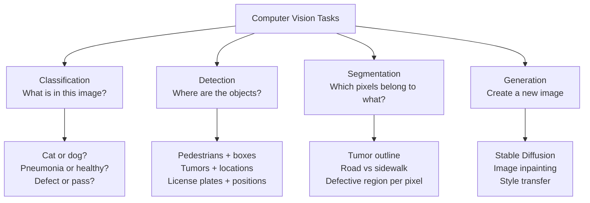

# Computer Vision — Why This Matters

**Why systems that see are reshaping which problems are solvable, and where the people who need vision the most can finally get it.**

---

## The Radiologist, the Farmer, and the Inspector

There is a hospital in eastern India where one radiologist serves 200,000 people. She trained for ten years to spot what most doctors cannot — a mass too small for the untrained eye, the early shadow of a tumor, the asymmetry that a non-specialist would miss. A patient comes in with chest pain. The X-ray takes two minutes. Her reading takes twenty. There is a queue of forty patients waiting. By 9 PM she is exhausted, and a tired radiologist misses things.

In 2017–2018, a team at Stanford trained a CNN (Convolutional Neural Network) on tens of thousands of chest X-rays (the CheXNet line of work, built on the publicly released NIH ChestX-ray dataset). The model learned to identify pneumonia at the level of expert radiologists on that benchmark. Today, deployments of similar models in low-resource hospitals do the first read in seconds. The radiologist confirms or overrides. Her throughput triples. Her error rate drops because the model catches what she missed when tired, and she catches what the model missed when uncertain. Patients get treated faster.

A farmer in rural Kenya loses 40% of her cassava crop every year to a disease no one in her village can identify. The nearest agronomist serves a district of 500,000 people. She photographs a diseased leaf with her phone. A CNN trained on millions of plant images identifies *cassava brown streak virus*, recommends a treatment, and estimates how many days she has before it spreads. She saves what is left of the crop. Her children eat this winter.

A manufacturing line in Mexico produces 50,000 brake calipers per day. One in 5,000 has a microscopic crack — invisible at line speed, but a brake failure on a highway. Human inspectors at the end of the line miss roughly 1 in 200 defects, even when fully attentive. A CNN connected to four overhead cameras catches every crack the inspectors do, plus the ones they miss. The defect rate drops from 0.02% to 0.001%. The product recall budget collapses.

---

## What This Technology Delivers

These are not future scenarios. They are deployed today. CNN-based chest-imaging models from multiple vendors (Aidoc, Lunit, Annalise.ai, and others) are FDA-cleared (US Food and Drug Administration) and run in hospital networks worldwide. PlantVillage and similar agricultural systems serve millions of farmers via phone apps. Industrial vision systems from Cognex, Keyence, and the open-source ecosystem inspect billions of products per year on assembly lines worldwide.

Computer vision delivers something humans have always wanted but never had at scale: **the trained eye, available anywhere, working without fatigue, at a cost that approaches zero per inference**.

A radiologist's pattern-recognition skill, deployed across ten thousand clinics simultaneously. A factory inspector's attention, multiplied by a thousand cameras. A botanist's diagnostic skill, in every farmer's pocket.

Behind every one of these systems, an engineer architected the pipeline. Someone made it work in production — not just on a benchmark dataset, but with real lighting, real lens dirt, real edge cases, real adversarial inputs, real regulatory constraints. Someone took a model that achieved 96% on a research paper and turned it into a system that runs at 30 frames per second on a phone in a field, in monsoon, with a partly cracked screen.

The model is the core. But the system around it — the camera, the data pipeline, the labeling process, the serving infrastructure, the monitoring, the security, the governance — is what makes it real. **A CV model in a notebook is a research result. A CV model inside a well-architected system is a product that changes outcomes.**

---

## The Vision Tasks

Computer vision is not one task. It is a family. Knowing which task you are solving is the first decision; everything downstream depends on it.



| Task | What It Outputs | Architecture | Real Example |
|---|---|---|---|
| **Classification** | A single label per image | CNN, ViT | "This is a tumor" |
| **Detection** | Multiple bounding boxes + labels | YOLO, R-CNN family | "Three pedestrians, one car, here, here, here" |
| **Segmentation** | A label for every pixel | U-Net, DeepLab | "These pixels are tumor; these are healthy tissue" |
| **Generation** | A new image | Diffusion, GAN | "Generate a photo of a cat in this style" |

This playbook covers all four — but the foundation chapters (01-05) focus on classification, the simplest task. Detection, segmentation, and generation get dedicated [`architectures/`](architectures/) deep dives.

---

## Why MLP Fails on Images

You can train an MLP (Multi-Layer Perceptron) on images. It just falls apart fast. Two reasons.

### Reason 1: The Parameter Explosion

Take a small image: 224x224 pixels in color (RGB). That is 224 × 224 × 3 = **150,528 input numbers** per image. If your first MLP layer has 1,000 neurons, you need:

```
150,528 inputs × 1,000 neurons = 150,528,000 weights
```

**150 million parameters in the first layer alone.** A modern image is 1024x1024. The first layer would have 3 billion parameters. The model would never train; you cannot fit enough labeled data, you cannot fit it in GPU memory, and even if you could, it would memorize the training set instead of learning real features.

### Reason 2: No Spatial Awareness

Even worse: an MLP treats input pixel `(0, 0)` as completely unrelated to pixel `(0, 1)`. It does not know they are neighbors. It has no concept of "above," "below," "next to," or "edge." Real images depend on those relationships — a cat's ear is *above* its eye, the wheel is *below* the car body. An MLP can only learn these patterns the hard way: by memorizing examples.

> **The flattening analogy.** Flattening an image to feed it into an MLP is like cutting a city map into 1cm squares, putting them in a bag, shuffling, and asking someone to guess the city's layout from the shuffled pieces. The pieces are all there. The structure is destroyed.

CNNs solve both problems with **two ideas:** look at small local patches (preserves spatial structure), and reuse the same filter everywhere (cuts parameters by orders of magnitude). Chapter [02 — Concepts](02_Concepts.md) makes this precise.

---

## The Vision Breakthroughs — A Short History

Computer vision did not become useful overnight. The arc:

| Year | Milestone | Why It Mattered |
|---|---|---|
| **1995** | **LeNet** by Yann LeCun | First commercial CNN. Read handwritten checks for the US Postal Service and banks. ~99% accuracy on digits. |
| **2012** | **AlexNet** wins ImageNet | First deep CNN to dominate the ImageNet competition. Cut top-5 error from ~26% (the prior year's best, hand-engineered) to **15.3%** in a single year. The "deep learning works" moment. |
| **2014** | **VGG** | Showed that depth + small (3x3) filters wins. Set the template every CNN paper used for years. |
| **2015** | **ResNet** | **Skip connections** — the breakthrough that made networks 100+ layers deep trainable. Won ImageNet. The architecture is still a workhorse a decade later. |
| **2017** | **MobileNet** | CNNs that run on phones. Made on-device CV practical. |
| **2020** | **ViT (Vision Transformer)** | Treats image patches as tokens. Beats CNNs at scale (when you have enormous datasets). The first non-CNN architecture to dominate vision. |
| **2022** | **ConvNeXt** | A CNN designed with Transformer-era tricks. Showed CNNs are not obsolete — they remain competitive at the top of leaderboards. |
| **2023+** | **Multimodal vision-language models** (CLIP, GPT-4V, LLaVA) | Vision and language merged. The model can describe an image, answer questions about it, and reason about its contents. |

Three things to take from this list:

1. **CNNs remain dominant for most production vision.** ResNet, EfficientNet, and their descendants are still what ships in 2026.
2. **ViT wins at extreme scale.** When you have billions of images and big GPUs, ViT outperforms. When you have a few thousand labeled medical images, CNN wins because of its inductive bias for spatial structure.
3. **Vision-language models are the new frontier.** A CV system that can also *talk* about what it sees opens use cases CNN-only systems cannot reach.

---

## Why Now? — The Three Drivers (Vision Edition)

The general "why now" for AI applies to vision (see [Deep Learning → Why](../deep-learning/01_Why.md#why-now--the-three-drivers)). But vision had three specific accelerants:

### 1. ImageNet Made Vision Trainable

Before ImageNet (2009), no labeled image dataset was big enough to train a deep CNN. Fei-Fei Li's team spent two years labeling 14 million images by hand, hiring crowdsourced workers via Amazon Mechanical Turk to apply 22,000 categories. The dataset became the universal benchmark — and the universal pre-training corpus. Every modern CV model traces a lineage back to ImageNet weights.

### 2. GPUs Were Built for Convolutions

A convolution operation is millions of small parallel multiplications — exactly the workload **GPUs (Graphics Processing Units, "G-P-U")** are designed for. The 2012 AlexNet result was made possible because Krizhevsky and colleagues hand-coded the convolution kernel for NVIDIA GPUs. Today, that hand-coding lives inside cuDNN and TensorRT. Every CV inference call is a GPU operation.

### 3. Transfer Learning Made Vision Cheap

The biggest practical breakthrough was **transfer learning**: train a CNN on ImageNet (millions of images), then fine-tune the last few layers on your specific task with just a few hundred examples. A medical imaging team with 500 labeled X-rays can fine-tune a ResNet pretrained on ImageNet and reach near-radiologist accuracy. Without transfer learning, every CV team would need ImageNet-scale data; with it, the barrier collapses to a few hundred labels.

This is why a small startup can ship a defect detection system in a quarter, not five years. The pretrained model does 90% of the work. Your data does the last 10%.

---

## Where Computer Vision Fits in Production Systems

Vision rarely ships standalone. It is a component of a larger system.

| Component | What It Does | Where Vision Fits |
|---|---|---|
| **Sensor / Camera Pipeline** | Captures pixels, handles lens, lighting, frame rate | Upstream of the model |
| **CV Model** | **Turns pixels into predictions** (label, boxes, masks, embeddings) | **The model itself** |
| **Business Logic** | Decides what to do with the prediction (alert, queue, route) | Downstream |
| **Feedback Loop** | Captures hard cases, retrains, deploys updates | Closes the loop |

A self-driving car has 8 cameras. Each frame goes through a CNN that detects pedestrians, cars, lanes, signs. The output goes to a planning system that decides what the car does. The whole system is integrated. The CNN by itself drives nothing.

In our **Production Diagnostic Intelligence System (CSI):**

| Component | How CV Helps |
|---|---|
| Anomaly detection | A CNN watching dashboards (metrics rendered as images) flags unusual patterns |
| Document analysis | OCR (Optical Character Recognition) + CNN extracts data from screenshots, error reports, support tickets with images |
| UI testing | Visual regression detection — CNN spots when a UI element drifted between deploys |

See the full architecture: [CSI Architecture](../../../systems/continuous-system-intelligence/architecture.md)

---

## What You Will Learn in This Material

| Chapter | What You Learn |
|---|---|
| [01 — Why](01_Why.md) | This page. Why vision matters. Why MLP fails on images. The vision tasks. The historical arc. |
| [02 — Concepts](02_Concepts.md) | Convolution, stride, padding, pooling, depth, 1x1 conv, hierarchical features. The math, in plain English with worked numerical examples. |
| [03 — Hello World](03_Hello_World.md) | Build a working CNN in 30 lines of PyTorch on MNIST. |
| [04 — How It Works](04_How_It_Works.md) | Receptive field, training diagnostics for vision, transfer learning, data augmentation strategies. |
| [05 — Building It](05_Building_It.md) | Architecture choices (CNN vs ViT), data pipeline patterns, label quality, when to fine-tune vs train from scratch. |
| [06 — Production Patterns](06_Production_Patterns.md) | Tesla Autopilot, Google retinal screening, Apple FaceID, manufacturing defect detection. Real systems, real architectures. |
| [07 — System Design](07_System_Design.md) | Serving (Triton, ONNX, TensorRT), edge deployment, batching, GPU economics, multi-model serving. |
| [08 — Quality, Security, Governance](08_Quality_Security_Governance.md) | Adversarial inputs, dataset bias, drift, regulatory compliance (FDA for medical, ISO for automotive). |
| [09 — Observability & Troubleshooting](09_Observability_Troubleshooting.md) | Measuring CV model quality in production. Per-class metrics, confidence calibration, what to alert on. |
| [10 — Decision Guide](10_Decision_Guide.md) | "Should I use vision here?" decision table. Production readiness checklist. |

### Architecture Deep Dives (Building Out)

| Doc | When to Read |
|---|---|
| `architectures/cnn-fundamentals.md` | When you want LeNet → AlexNet → VGG depth |
| `architectures/resnet-and-modern.md` | When you are choosing between ResNet, EfficientNet, ConvNeXt for production |
| `architectures/vision-transformers.md` | When you have a large dataset and are deciding ViT vs CNN |
| `architectures/object-detection.md` | When the task is "find objects and their locations" |
| `architectures/segmentation.md` | When the task is "label every pixel" |

### Foundations and Math

This playbook builds on:

- [Deep Learning](../deep-learning/) — perceptron, backprop, training loop, diagnostics. Read first if new to neural networks.
- [Math for AI](../math-for-ai.md) — derivatives, chain rule, gradient descent, dot products. Refresher on demand.

**Hands-on notebooks:**
- [Computer Vision From Scratch on Colab](https://colab.research.google.com/github/sunilmogadati/systems-in-production/blob/main/implementation/notebooks/Computer_Vision_From_Scratch.ipynb) — pure NumPy. Manual convolution by hand, then verified against PyTorch's `F.conv2d`. **Start here.**
- [Computer Vision CNN on Colab](https://colab.research.google.com/github/sunilmogadati/systems-in-production/blob/main/implementation/notebooks/Computer_Vision_CNN.ipynb) — same ideas in PyTorch with a full CNN trained on MNIST, training loop, diagnostics, and evaluation.

---

**Next:** [02 — Concepts](02_Concepts.md) — Convolution, the output formula, pooling, hierarchical features. The mechanics of how a CNN actually sees.
