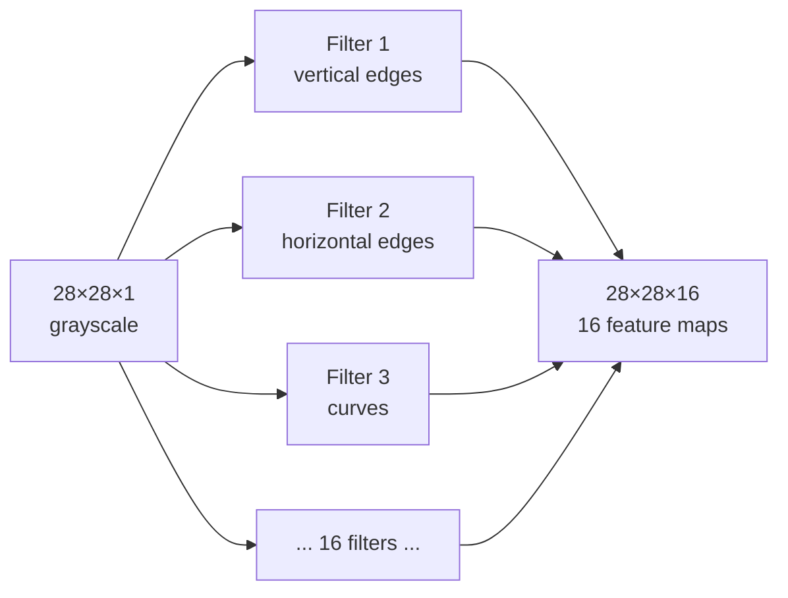
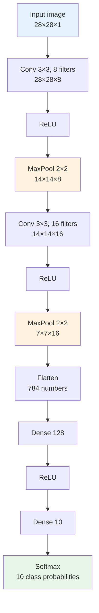

# Computer Vision — Concepts and Mental Models

**Convolution, stride, padding, pooling, depth — the mechanics of how a network sees. With worked numerical examples.**

---

> **Build on the foundations.** Backpropagation, the training loop, optimizers, and loss curves are universal — they live in [Deep Learning → Concepts](../deep-learning/02_Concepts.md) and [Math for AI](../math-for-ai.md). This chapter focuses on what is *unique to vision*: convolution, pooling, spatial structure.

---

## The Two Big CNN Ideas

A CNN (Convolutional Neural Network, "C-N-N") is built on two ideas. Master these two and the rest is mechanics.

### Idea 1: Local Connectivity

Look at a small patch, not the whole image.

**Why.** A pixel in the top-left corner of an image is rarely relevant to a pixel in the bottom-right. Faces, objects, edges, textures — all of these are *local* phenomena. Make every neuron look at only a small neighborhood (typically 3x3 or 5x5 pixels).

**Analogy.** A security guard watches one room, not the whole city. Each guard reports anomalies in their patch. The system aggregates the reports.

### Idea 2: Weight Sharing

Reuse the same filter everywhere on the image.

**Why.** A vertical edge looks like a vertical edge whether it is in the top-left of the image or the bottom-right. Train *one* edge detector, slide it across the image, and use the same weights at every position. This single decision cuts parameter count by orders of magnitude — and is the reason CNNs train at all on images.

**Analogy.** One magnifying glass, scanned across the page. Same lens. Different positions reveal different content.

These two ideas — **local patches + shared filters** — are the entire conceptual leap from MLP to CNN. The rest of this chapter unpacks the mechanics.

---

## How Convolution Works — Mechanically

A **convolution** is a filter sliding across an input, doing a weighted sum at each location.

The filter (also called a **kernel**) is a small grid of learnable weights — usually 3x3 or 5x5. At every position, the filter:

1. Overlays a patch of the input
2. Multiplies element by element
3. Sums the results
4. Adds a bias
5. Writes one output value
6. Slides to the next position

That output number says: **"How strongly does this patch match the pattern this filter is looking for?"**

### Worked Example — One Filter Slide, By Hand

Input image patch (3x3):

```
 0  0  1
 0  1  1
 1  1  0
```

Filter (3x3) — happens to be a vertical edge detector:

```
 1  0 -1
 1  0 -1
 1  0 -1
```

Bias: `b = 1`.

**Step 1:** Multiply element-by-element.

```
 0·1   0·0   1·(-1)        0   0  -1
 0·1   1·0   1·(-1)    =   0   0  -1
 1·1   1·0   0·(-1)        1   0   0
```

**Step 2:** Sum every cell.

```
0 + 0 + (-1) + 0 + 0 + (-1) + 1 + 0 + 0 = -1
```

**Step 3:** Add bias.

```
z = -1 + 1 = 0
```

**Step 4:** Apply the activation function (ReLU).

```
ReLU(0) = max(0, 0) = 0
```

The first cell of the output feature map is `0`. Slide the filter one column to the right and repeat. Slide row by row across the entire image. The result is one **feature map** — a 2D grid where each cell is one filter-and-position match.

> **Key intuition.** This is not magic. It is dot product + bias + activation, exactly what every neuron has done since [02 — Concepts](../deep-learning/02_Concepts.md). The only difference is that the same weights get reused at every position. *That* is what convolution adds.

---

## The Output Shape Formula

When you slide a filter across an input, the output is smaller than the input (usually). The exact size depends on input size, filter size, stride, and padding.

**The most important formula in computer vision exams and code:**

```
O = (N + 2P - F) / S + 1
```

| Symbol | Meaning |
|---|---|
| **O** | Output size (one spatial dimension) |
| **N** | Input size (one spatial dimension) |
| **F** | Filter size |
| **S** | Stride — how far the filter moves between positions |
| **P** | Padding — extra zero-pixels added around the input |

The output **depth** equals the **number of filters** you use. Filter depth must match input depth (e.g., a 3x3 filter on an RGB input is actually 3x3x3).

### Worked Examples

| Input | Filter | Stride | Padding | Calculation | Output |
|:---|:---|:---:|:---:|:---|:---|
| 28x28 | 3x3 | 1 | 0 | (28 + 0 − 3) / 1 + 1 = 26 | 26x26 |
| 28x28 | 3x3 | 1 | 1 | (28 + 2 − 3) / 1 + 1 = 28 | 28x28 ("same" padding) |
| 28x28 | 5x5 | 1 | 0 | (28 + 0 − 5) / 1 + 1 = 24 | 24x24 |
| 28x28 | 3x3 | 2 | 0 | (28 + 0 − 3) / 2 + 1 = 13 | 13x13 |
| 32x32 | 5x5 | 1 | 2 | (32 + 4 − 5) / 1 + 1 = 32 | 32x32 ("same" padding) |

### Same Padding — A Useful Shortcut

If you want the output to be **the same size** as the input (a common choice in modern architectures), use padding `P = (F − 1) / 2`:

| Filter Size | Same Padding |
|---|---|
| 3x3 | P = 1 |
| 5x5 | P = 2 |
| 7x7 | P = 3 |

> **In code.** PyTorch and TensorFlow let you write `padding='same'` and they compute it for you. But you need the formula in your head to debug shape mismatches — the most common CNN bug.

---

## Padding and Stride — What They Buy You

### Padding

Add zeros around the input so the filter can sit on the edge pixels.

| Without padding | With padding |
|---|---|
| Output shrinks every layer | Output stays the same size |
| Edge pixels are seen by the filter only once | Edge pixels are seen as often as center pixels |
| Information from edges is lost | Edge information is preserved |

**When to use:** Almost always use same padding (`P = (F-1)/2`) for convolutions. Reserve "no padding" for the final layers where you intentionally want to shrink.

### Stride

How far the filter moves between positions.

| Stride | Effect |
|---|---|
| **1** | Filter moves one pixel at a time. Maximum detail preserved. Most compute. Default for most layers. |
| **2** | Filter skips every other position. Output is roughly half the size in each dimension. Fast downsampling. |
| **>2** | Aggressive downsampling. Used in early layers of some architectures (ResNet's 7x7 stride-2 first layer). |

A stride-2 convolution is the standard alternative to a pooling layer for shrinking feature maps.

---

## Multiple Filters — Depth Is How You See More

One filter detects one type of pattern (one kind of edge, one texture). Real images need many patterns detected simultaneously — vertical edges, horizontal edges, diagonal edges, color blobs, textures. The solution: **use many filters in parallel**.

If you apply 16 filters to a 28x28x1 input with same padding, the output is **28x28x16** — a feature map with 16 channels, each tracking a different learned pattern.



**Output depth = number of filters.** Each filter learns to detect a different pattern. The next layer's filters then combine these patterns into more complex ones.

---

## Pooling — Shrink and Keep the Strongest Signal

A **pooling layer** takes a small region (typically 2x2) and reduces it to a single value. The two common variants:

| Pooling | What It Does | When to Use |
|---|---|---|
| **Max Pooling** | Take the maximum in the region | Keep the strongest activation. Default. |
| **Average Pooling** | Take the mean in the region | Smooth aggregation. Common at the end of a network before the final classifier. |

### Worked Example — Max Pooling

A 4x4 feature map with 2x2 max pooling, stride 2:

```
 1  2 | 3  0          max(1,2,5,6) = 6   max(3,0,1,2) = 3
 5  6 | 1  2    →
-----+----                                       6  3
 0  3 | 4  4          max(0,3,7,1) = 7   max(4,4,2,9) = 9   →   7  9
 7  1 | 2  9
```

Two key properties:

1. **Pooling has zero learnable parameters.** It is a fixed operation. No weights to train.
2. **Pooling halves the spatial dimensions** (with 2x2, stride 2). 26x26x16 → 13x13x16. The depth does not change.

**Why pool?** Three reasons:

- **Reduce compute** — fewer pixels means fewer multiplications in subsequent layers
- **Translation invariance** — if a feature shifts by 1 pixel, the pooled output stays the same. The model becomes less sensitive to exact position.
- **Larger receptive field** — pooling lets later layers see a bigger portion of the original image (more on this in [04 — How It Works](04_How_It_Works.md))

Modern architectures sometimes replace pooling with stride-2 convolutions (which serve the same downsampling role but with learnable weights). Both are valid.

---

## Flattening — The Bridge to Dense Layers

After several conv + pool stages, the network has rich feature maps but cannot feed them directly into a classifier. A classifier needs a flat vector. **Flattening** is the bridge.

### Worked Example

A final pooled feature map of shape **5x5x16**:

```
5 × 5 × 16 = 400 numbers
```

Flatten reshapes the 3D feature volume into a 1D vector of 400 numbers. The fully connected (dense) layer that follows reads this vector and produces the final classification scores.

**Important properties:**

- Flattening has **zero learnable parameters**
- It does not change the values, only the shape
- It must happen *after* the conv layers have done their feature extraction — flattening a raw image immediately gives back the broken MLP from earlier in this chapter

### The Anti-Pattern

Bad: flatten the raw image first.

```
28×28 image → flatten → 784 numbers → MLP → output    ← Loses spatial structure
```

Good: extract local features first, then flatten.

```
28×28 image → conv → pool → conv → pool → 5×5×16 → flatten → 400 → dense → output
```

---

## 1×1 Convolutions — The Channel Mixer

A 1x1 filter sounds useless. It looks at one pixel. How can that detect anything?

It does not detect spatial patterns. It mixes **channels**.

If your input is 28x28x16 (16 feature maps from previous filters) and you apply 8 filters of size 1x1, the output is 28x28x8. The 1x1 conv:

- **Mixes information across channels** — each output pixel is a learned weighted sum of all 16 input channels at that location
- **Changes depth without changing spatial size** — useful for compressing features before an expensive layer
- **Is computationally cheap** — way fewer parameters than a 3x3 conv

**Where you see it.** ResNet bottleneck blocks (1x1 → 3x3 → 1x1), Inception modules, MobileNet's depthwise-separable convolutions. Whenever a paper says "channel reduction" or "bottleneck," it is doing 1x1 convolutions.

---

## Hierarchical Features — Why CNNs Work So Well

The single most important conceptual fact about CNNs: **layers learn a hierarchy**, with no human telling them to.

| Layer Depth | What the Filters Detect (Vision) |
|---|---|
| **Layer 1-2** | Edges, color blobs, simple textures |
| **Layer 3-4** | Corners, simple shapes, repeated textures |
| **Layer 5-7** | Object parts — eyes, wheels, leaves, fur |
| **Layer 8+** | Whole objects — faces, cars, dogs |

Nobody tells Layer 5 "look for eyes." It learns to detect eyes because detecting eyes reduces the loss when the task is "classify dog vs cat." The architecture provides the depth; the data and the task decide what each layer represents.

This is the same hierarchy story from the Deep Learning playbook ([01 — Why → hierarchical features](../deep-learning/01_Why.md#why-hand-engineered-features-failed)) — but in vision it is most visible. You can literally visualize the filters in trained CNNs and watch the hierarchy emerge.

---

## Activation Functions in CNNs — ReLU and Its Pitfalls

CNNs almost always use **ReLU (Rectified Linear Unit, "REE-loo")** between conv layers:

```
ReLU(x) = max(0, x)
```

| Input | ReLU Output |
|---|---|
| -3 | 0 |
| 0 | 0 |
| 5 | 5 |

**Why ReLU dominates:**

- Cheap (one comparison per element)
- Does not suffer from vanishing gradients the way sigmoid/tanh do
- Stacks well — deep networks remain trainable

### The Dying ReLU Problem

If a neuron's input is consistently negative, ReLU outputs 0. The gradient is also 0. The neuron stops learning. Permanently. **A "dead" neuron contributes nothing.**

If many neurons die early in training, the network's effective capacity drops. The model underfits, sometimes catastrophically.

### Two Mitigations

**Leaky ReLU** — small slope on the negative side:

```
LeakyReLU(x) = x          if x > 0
             = 0.01 · x   if x ≤ 0
```

```
LeakyReLU(-3) = -0.03
LeakyReLU(5)  = 5
```

Negative inputs still pass a small gradient, so neurons can recover. Use Leaky ReLU when dying ReLU becomes a measurable problem (loss plateaus early, many activations stuck at 0).

**He initialization** — weights start in a range tuned for ReLU. Keeps activations healthy at the start of training. Reduces dead neurons before they happen.

**Batch normalization** — normalizes activations per-batch. Prevents activations from drifting too far negative.

> **Default setup.** Use ReLU + He initialization + Batch Normalization between conv layers. Switch to Leaky ReLU only if you observe dying ReLU symptoms after diagnosis.

---

## Parameter Counting — A Conv Layer

The formula:

```
parameters_per_filter = F × F × D_in + 1     (the +1 is the bias)
total_parameters       = (F × F × D_in + 1) × K
```

| Symbol | Meaning |
|---|---|
| **F** | Filter size (e.g., 3 for a 3x3 filter) |
| **D_in** | Input depth (number of input channels) |
| **K** | Number of filters (= output depth) |

### Worked Example 1

First conv layer of an MNIST CNN:

- Input: 28x28x1 (grayscale, depth = 1)
- Filter: 3x3
- Number of filters: 8

```
per filter = 3 · 3 · 1 + 1 = 10 parameters
total      = 10 · 8 = 80 parameters
```

### Worked Example 2

Second conv layer (depth has grown):

- Input: 28x28x8 (output of layer 1, depth = 8)
- Filter: 3x3
- Number of filters: 16

```
per filter = 3 · 3 · 8 + 1 = 73 parameters
total      = 73 · 16 = 1,168 parameters
```

### Worked Example 3 — Compare to MLP

A fully-connected layer that takes the same 28x28x8 input and produces 16 outputs would have:

```
(28 · 28 · 8) · 16 + 16 = 100,368 parameters
```

The conv layer with the same effective output channels uses **86x fewer parameters** because of weight sharing. **This is why CNNs are tractable on images and MLPs are not.**

---

## Training a CNN — Numbers by Hand

You have seen [forward-only convolution](#how-convolution-works--mechanically) with worked numbers. Real CNNs **train** — forward + loss + backward + update, repeatedly. Backprop through a conv layer has one feature MLPs do not have: **weight-sharing gradient accumulation**. Every filter weight collects gradient contributions from every position it was applied to.

This section walks one training cycle by hand. Every number computed. The companion notebook ([Computer Vision From Scratch on Colab](https://colab.research.google.com/github/sunilmogadati/systems-in-production/blob/main/implementation/notebooks/Computer_Vision_From_Scratch.ipynb)) runs the same example in NumPy and verifies against PyTorch autograd.

### The Setup

Smallest network that exercises every CNN-specific gradient.

```
Input X (3×3):           Filter W (2×2):
 1  0  1                  0.5  -0.3
 0  1  0                  0.1   0.4
 1  0  1

Bias b = 0.1
Target y = 1.5
Learning rate α = 0.1
```

The network: **`X → Conv(W,b) → ReLU → sum → y_pred`**. The `sum` is a stand-in for a global pooling head — it gives one output number from a feature map and lets us compute a scalar loss with `y_pred − target`.

Six learnable parameters: 4 filter weights + 1 bias = 5. (Conventional naming counts the 4 filter weights and 1 bias as 5 parameters.)

### Forward Pass

Output spatial size: `(3 − 2)/1 + 1 = 2`, so the feature map is **2×2**.

Compute each cell:

```
z[0,0] = 1·0.5 + 0·(-0.3) + 0·0.1 + 1·0.4 + 0.1 = 1.0
z[0,1] = 0·0.5 + 1·(-0.3) + 1·0.1 + 0·0.4 + 0.1 = -0.1
z[1,0] = 0·0.5 + 1·(-0.3) + 1·0.1 + 0·0.4 + 0.1 = -0.1
z[1,1] = 1·0.5 + 0·(-0.3) + 0·0.1 + 1·0.4 + 0.1 = 1.0
```

Pre-activation feature map:
```
z =  1.0  -0.1
    -0.1   1.0
```

Apply ReLU element-wise:
```
h =  1.0  0.0
     0.0  1.0
```

Two cells were killed by ReLU (their `z` was negative). They will get **zero gradient** in the backward pass.

```
y_pred = sum(h) = 1.0 + 0 + 0 + 1.0 = 2.0
```

### Loss

```
L = 0.5·(y_pred − target)² = 0.5·(2.0 − 1.5)² = 0.5·0.25 = 0.125
```

### Backward Pass — Where CNN Gets Interesting

The gradient seed:
```
∂L/∂y_pred = y_pred − target = 0.5
```

**Through the sum.** Since `y_pred = sum of h[i,j]`, every `∂y_pred/∂h[i,j] = 1`. So:
```
∂L/∂h =  0.5  0.5
         0.5  0.5
```

**Through ReLU.** `∂h/∂z = 1` if `z > 0`, else `0`. The ReLU mask is `[[1, 0], [0, 1]]` (the diagonal cells survived):
```
∂L/∂z = ∂L/∂h ⊙ ReLU′(z)
      =  0.5  0.0
         0.0  0.5
```

The two dead cells contribute nothing further — their gradient path is closed.

**Through the bias.** Every position contributes (each `z[i,j]` includes one `+b`). So:
```
∂L/∂b = sum of ∂L/∂z = 0.5 + 0 + 0 + 0.5 = 1.0
```

**Through the filter weights — the weight-sharing trick.** Here is the unique part of CNN backprop. The same filter weight `W[u,v]` was used at every output position, sliding across the input. Its gradient is the **sum** of gradient contributions from every output cell where it was applied:

```
∂L/∂W[u,v] = sum over (i,j) of ∂L/∂z[i,j] · X[i+u, j+v]
```

For `W[0,0]` (top-left of the filter):

| Output cell | Patch position | `∂L/∂z[i,j]` × `X[i+0, j+0]` | Contribution |
|---|---|---|---|
| (0,0) | X[0,0]=1 | 0.5 × 1 | **+0.5** |
| (0,1) | X[0,1]=0 | 0 × 0 | 0 |
| (1,0) | X[1,0]=0 | 0 × 0 | 0 |
| (1,1) | X[1,1]=1 | 0.5 × 1 | **+0.5** |
| **Total** | | | **`∂L/∂W[0,0]` = 1.0** |

Same accumulation for the other three filter weights. Result:

```
∂L/∂W =  1.0  0.0
         0.0  1.0
```

Notice **the dead-ReLU cells contributed nothing**, but the alive cells (top-left and bottom-right of the feature map) contributed once each. Each filter weight got two contributions; with these specific input patterns, two of the four weights got non-zero gradients.

### Update

Gradient descent with α = 0.1: `new = old − α · gradient`.

```
W[0,0] = 0.5  − 0.1·1.0 = 0.4
W[0,1] = -0.3 − 0.1·0.0 = -0.3
W[1,0] = 0.1  − 0.1·0.0 = 0.1
W[1,1] = 0.4  − 0.1·1.0 = 0.3

b      = 0.1  − 0.1·1.0 = 0.0
```

Updated weights:
```
W =  0.4  -0.3
     0.1   0.3

b = 0.0
```

That is one full training step on one example. The weights moved in the direction that reduces loss for this image.

### What's Special About CNN Backprop — Two Things

| Feature | Why It Matters |
|---|---|
| **Weight-sharing gradient accumulation** | Every filter weight gets a **sum** of gradient contributions, not a single gradient. This is what `loss.backward()` does for you in PyTorch — but understanding it explains why CNNs are parameter-efficient AND why they generalize: each weight learns from *every* position it was applied to. |
| **Dead-ReLU gradient blocking** | Pre-activation cells with `z ≤ 0` contribute zero downstream gradient. This explains the **dying ReLU problem** in image: if many cells consistently fire negative, large patches of the feature map stop learning. Leaky ReLU mitigates by letting a small gradient pass. |

### Forward + Backward in One Picture

```mermaid
graph TD
    X["Input X<br/>3×3 image"]
    W["Filter W<br/>2×2 + bias b"]

    X --> Conv["Conv: z = W ⊛ X + b"]
    W --> Conv
    Conv --> Z["z (2×2 feature map)"]
    Z --> ReLU["h = ReLU&#40;z&#41;"]
    ReLU --> H["h (2×2)"]
    H --> Sum["y_pred = sum&#40;h&#41;"]
    Sum --> Loss["L = 0.5·&#40;y_pred − target&#41;²"]

    Loss -.->|"∂L/∂y_pred"| Sum
    Sum -.->|"all 1's"| H
    H -.->|"ReLU mask: alive cells only"| Z
    Z -.->|"∂L/∂b = sum of ∂L/∂z"| BiasG[Update b]
    Z -.->|"∂L/∂W&#91;u,v&#93; = Σ ∂L/∂z·X&#91;i+u,j+v&#93;<br/>(weight sharing!)"| WG[Update W]

    style X fill:#E3F2FD
    style Loss fill:#FFEBEE
    style WG fill:#E8F5E9
    style BiasG fill:#E8F5E9
```



Solid arrows = forward (compute prediction). Dashed arrows = backward (compute gradients). The unique CNN-specific edge is the dashed line into `Update W` — that gradient is a **sum across positions**, not a single number.

### Why This Generalizes

In a real CNN with 64 filters of 3×3 on a 224×224 input, the same accumulation happens — each of the 9 filter weights gets gradient contributions from `(224−2) × (224−2) ≈ 49,000` positions per training image. Per batch of 64 images, ~3 million contributions per weight. Each weight learns from all of them.

This is what PyTorch's autograd does invisibly when you write `loss.backward()` after a `nn.Conv2d` layer. Now you know what is happening underneath.

---

## The Full CNN Pipeline — One Picture



This is the canonical CNN. Every variant — LeNet, AlexNet, VGG, ResNet — is a richer or rearranged version of this pattern. Once you can draw this from memory, you can read any CNN paper.

---

## Beyond CNN — Vision Transformers (Brief)

A **ViT (Vision Transformer, "V-I-T")** does not use convolutions at all. It:

1. Splits the image into fixed-size patches (e.g., 16x16)
2. Flattens each patch into a vector
3. Treats the sequence of patch vectors like a sequence of tokens (similar to words in language)
4. Runs them through a Transformer (self-attention)

**When ViT wins:** very large datasets (300M+ images), where ViT's flexibility and attention over distant patches beats CNN's local-only inductive bias.

**When CNN wins:** small to medium datasets (under 1M images), edge deployment, when training compute is limited. CNN's spatial inductive bias acts like built-in regularization — it cannot help but learn local-then-global features. ViT has to *learn* that structure from data.

In production today (2026), **CNNs and ViTs are both used.** ConvNeXt and other "modernized CNNs" perform competitively with ViTs at the top of leaderboards. The choice depends on dataset size, compute, and deployment target. For the architecture deep-dive on the Transformer mechanics that ViT inherits, see [`../transformers/architectures/transformer.md`](../transformers/architectures/transformer.md).

---

## CNN vs MLP vs ViT — Decision Table for Vision

| | MLP | CNN | ViT |
|:---|:---|:---|:---|
| **Inductive bias for spatial structure** | None | Strong (local + shared) | Weak (must be learned) |
| **Parameter efficiency on images** | Poor | Excellent | Moderate |
| **Performance on small data (< 100k images)** | Poor | Best | Poor (overfits) |
| **Performance on medium data (100k - 10M)** | Poor | Best | Good (with augmentation) |
| **Performance on large data (10M+)** | Poor | Good | Best |
| **Edge / mobile deployment** | N/A | Excellent (MobileNet, EfficientNet-Lite) | Possible but heavier |
| **When to choose** | Skip — almost never use MLP for images | Default choice for most production CV | When you have a billion images and big GPUs |

---

## Glossary — Quick Reference

### Vision-Specific Terms

| Term | Pronounced | Meaning |
|---|---|---|
| **CNN** | "C-N-N" | Convolutional Neural Network — the dominant vision architecture |
| **Convolution** | "con-voh-LOO-shun" | Filter sliding across the input, doing weighted sums |
| **Filter / Kernel** | "FIL-ter / KUR-nul" | A small matrix of learnable weights (e.g., 3x3) |
| **Feature Map** | — | The 2D output of one filter applied across the input |
| **Stride** | — | How many pixels the filter moves between positions |
| **Padding** | — | Zeros added around the input so filters can sit on edges |
| **Pooling** | — | Reducing a region to a single value (max or average) |
| **MaxPool** | "MAX-pool" | Take the maximum in each pooling window |
| **AvgPool** | "AV-er-edge pool" | Take the average in each pooling window |
| **Flatten** | — | Reshape a 3D feature map into a 1D vector |
| **1x1 Conv** | "one by one con-voh-LOO-shun" | A convolution with a 1x1 filter — mixes channels, does not see spatial neighbors |
| **Receptive Field** | — | The region of the original image one neuron eventually sees (covered in [04](04_How_It_Works.md)) |
| **ViT** | "V-I-T" or "vit" | Vision Transformer — a non-CNN vision architecture |
| **ImageNet** | — | The 14M-image dataset that made deep learning in vision possible |
| **Transfer Learning** | — | Pretraining on a large dataset, then fine-tuning on your specific task |

### The Output Formula

```
O = (N + 2P - F) / S + 1
```

### Same Padding

```
P = (F - 1) / 2     (3x3 → P=1, 5x5 → P=2, 7x7 → P=3)
```

### Conv Layer Parameters

```
total = (F · F · D_in + 1) · K
```

---

**Next:** [03 — Hello World](03_Hello_World.md) — Build a working CNN in 30 lines of PyTorch.
