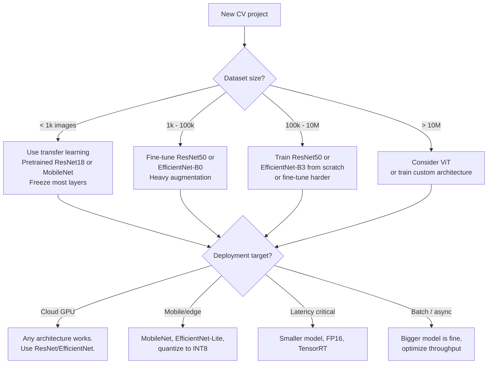
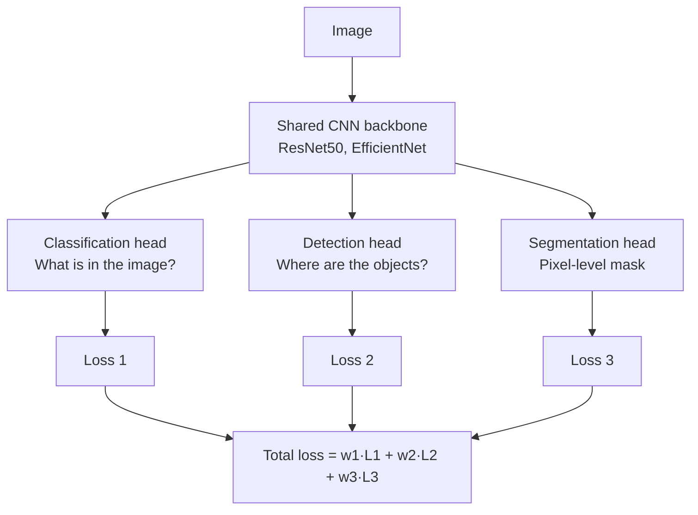

# Computer Vision — Building It

**Architecture choices, optimizer recipes, data pipeline patterns, label quality. Every decision a CV engineer faces, with the tradeoff that drove it.**

---

## The Decision Tree

Before writing code, walk through this. Most CV mistakes are made before training starts — by choosing the wrong architecture for the data, or skipping data quality work for fancy models.



---

## Choosing an Architecture

The honest truth: **for 90% of production CV projects, a pretrained ResNet50 or EfficientNet-B0 fine-tuned on your data is the right answer.** The remaining 10% have specific needs (extreme low latency, extreme accuracy, novel domain) that justify custom work.

### The Modern Architecture Menu

| Architecture | Year | Parameters | ImageNet Top-1 | When to Use |
|---|---|---:|---:|---|
| **ResNet18** | 2015 | 11M | 70% | Smallest "real" CNN. Fine-tuning baseline. Edge deployment. |
| **ResNet50** | 2015 | 26M | 76% | Workhorse. Default for most production tasks. |
| **EfficientNet-B0** | 2019 | 5M | 77% | Better accuracy per parameter than ResNet. Default for mobile. |
| **EfficientNet-B3** | 2019 | 12M | 81% | When ResNet50 is not accurate enough. |
| **MobileNetV3-Small** | 2019 | 2.5M | 67% | Phone deployment. Optimized for inference. |
| **ConvNeXt-Tiny** | 2022 | 28M | 82% | Modernized CNN. Competitive with ViT. |
| **ViT-Base/16** | 2020 | 86M | 81% | Large datasets. Transfer from massive pretraining. |
| **Swin-Tiny** | 2021 | 28M | 81% | Hierarchical Transformer. Strong on detection/segmentation. |

> **The Pareto principle in CV.** EfficientNet-B0 with proper augmentation and 10k labeled images will beat ResNet50 trained sloppily on 100k images. Architecture choice matters less than data quality, augmentation, and training discipline.

### When Each Family Wins

**Use ResNet50** when: you want the default; the team knows it; you have any reasonable amount of data (10k+ images).

**Use EfficientNet** when: parameter efficiency matters; deploying to mobile or edge; need slightly better accuracy than ResNet at the same compute.

**Use MobileNet** when: deploying to phones or microcontrollers; latency under 50ms required; willing to trade a few accuracy points for inference speed.

**Use ViT** when: you have a very large dataset (100M+ images) or you can transfer from CLIP/DINOv2/large pretrained vision-language models. ViT struggles on small datasets without massive pretraining.

**Use ConvNeXt** when: you want CNN inductive bias with Transformer-era performance. A safe modern choice when ResNet feels dated.

---

## The Training Recipe — What Modern CV Looks Like

A 2026-era training recipe for a fine-tuning project on ResNet50:

```python
import torch
import torch.nn as nn
import torchvision.models as models
import torchvision.transforms as T
from torch.utils.data import DataLoader

# === DATA AUGMENTATION ===
train_transform = T.Compose([
    T.RandomResizedCrop(224, scale=(0.5, 1.0)),
    T.RandomHorizontalFlip(),
    T.ColorJitter(brightness=0.2, contrast=0.2, saturation=0.2),
    T.RandomErasing(p=0.25),
    T.ToTensor(),
    T.Normalize(mean=[0.485, 0.456, 0.406], std=[0.229, 0.224, 0.225]),
])

# === MODEL ===
model = models.resnet50(weights='IMAGENET1K_V2')
model.fc = nn.Linear(model.fc.in_features, NUM_CLASSES)
model = model.to(device)

# === OPTIMIZER ===
# Different learning rates: small for pretrained backbone, larger for new head
optimizer = torch.optim.AdamW([
    {'params': [p for n, p in model.named_parameters() if 'fc' not in n], 'lr': 1e-5},
    {'params': model.fc.parameters(), 'lr': 1e-3},
], weight_decay=0.01)

# === SCHEDULER ===
# Cosine decay with linear warmup — modern default
scheduler = torch.optim.lr_scheduler.OneCycleLR(
    optimizer,
    max_lr=[1e-5, 1e-3],
    total_steps=len(train_loader) * NUM_EPOCHS,
    pct_start=0.1,            # 10% warmup
)

# === LOSS ===
# Label smoothing — prevents overconfident predictions
loss_fn = nn.CrossEntropyLoss(label_smoothing=0.1)

# === TRAINING LOOP ===
# (Same five steps from Hello World, plus scheduler.step())
```

### What Each Choice Buys You

| Choice | Why |
|---|---|
| `RandomResizedCrop` + `RandomHorizontalFlip` | The two augmentations every modern CV recipe includes. Non-negotiable. |
| `RandomErasing` | Robustness to occlusion. Cheap and effective. |
| Different learning rates for backbone vs head | The pretrained backbone is mostly right; aggressive updates would corrupt it. The new head is randomly initialized; it needs a faster LR. |
| `AdamW` over `Adam` | Better weight decay handling. The modern default. |
| `OneCycleLR` (warmup + cosine decay) | Reaches a better minimum than constant LR. Standard in modern recipes. |
| Label smoothing 0.1 | Prevents the model from outputting 1.0 confidence. Calibrates probabilities. Helps generalization. |

This recipe will get you within a few percentage points of state-of-the-art on most fine-tuning tasks. Spend your remaining tuning time on data quality, not hyperparameters.

---

## Data Pipeline Patterns

Most CV failures are data failures. Time spent on data quality is the highest-ROI work in any vision project.

### Label Quality — The Underrated Variable

A noisy label is worse than no label. **A 5% label noise rate caps your model's accuracy at ~95% no matter how good the architecture is** — the model has to be wrong on the noisy labels to be right.

| Label Source | Typical Noise Rate | Mitigation |
|---|---|---|
| Single annotator, casual labeling | 5-15% | Re-label with second annotator on disagreements |
| Multiple annotators, consensus required | 1-3% | Acceptable for most tasks |
| Expert annotators, calibrated | < 1% | Required for medical, autonomous driving |
| Bootstrap from existing model | Variable | Manual review of uncertain cases |

> **The 1,000-image audit.** Before training, manually review 1,000 random labeled images. Count errors. If error rate > 5%, fix the labeling pipeline before training. This takes one engineer one day. It saves weeks of debugging "why won't my accuracy go above 90%."

### Train/Val/Test Split — Avoid Leakage

The cardinal sin of CV: train and test sets sharing examples (or near-duplicates).

| Risk | How It Happens | Mitigation |
|---|---|---|
| **Exact duplicates** | Same image in two places, same label | Hash images, deduplicate before splitting |
| **Near duplicates** | Same scene, different angle (security cameras at different timestamps) | Group by source/session, split by group |
| **Temporal leakage** | Train on June, test on July, but data shifts seasonally | Split by time, not random shuffle |
| **Patient leakage** (medical) | Multiple X-rays of same patient in train and test | Split by patient ID |
| **Geographic leakage** | Train on Europe, claim it generalizes | Split by region; report cross-region accuracy |

**Always split first, augment second.** If you augment then split, copies of the same image end up in both sets.

### Versioning Data

Models change. Data changes. Without versioning, you cannot reproduce a result, debug a regression, or audit what trained the model that made a clinical decision.

| Tool | What It Does |
|---|---|
| **DVC (Data Version Control)** | Git for large files. Tracks data hashes alongside code. |
| **Label Studio + S3 versions** | Label management with versioned exports |
| **Weights & Biases / Comet** | Experiment tracking — what data, what hyperparameters, what metrics |
| **Custom: hash + manifest** | A JSON manifest with `image_hash → label, source, timestamp`. Smallest viable. |

For a regulated domain (medical, automotive), **data versioning is required, not optional.** Auditors will ask "what trained the model that made this prediction?" You need an answer.

---

## Hyperparameter Tuning — What Actually Matters

There is a long list of hyperparameters in any modern CV training recipe. Most do not matter much. The few that do:

### High Impact — Tune Carefully

| Hyperparameter | Why It Matters | Typical Range |
|---|---|---|
| **Learning rate** | Single biggest accuracy-driver. Wrong LR and nothing else can save you. | 1e-5 to 1e-3 (Adam family) |
| **Batch size** | Affects effective LR, gradient noise, GPU memory | 32, 64, 128, 256 |
| **Augmentation strength** | Too weak = overfit. Too strong = underfit. | Start with standard recipe, adjust |

### Medium Impact — Try a Few Values

| Hyperparameter | Why | Typical |
|---|---|---|
| Weight decay | Regularization | 0.01 (AdamW), 1e-4 (SGD) |
| Number of epochs | More = longer training; over-train hurts | 20-100 for fine-tuning |
| Warmup length | Helps with deep models / large LR | 5-10% of total steps |

### Low Impact — Use the Default

| Hyperparameter | Default |
|---|---|
| Optimizer epsilon | 1e-8 |
| Beta1, beta2 (Adam) | 0.9, 0.999 |
| Label smoothing | 0.1 |
| Dropout in head | 0.0 to 0.2 |

> **The 80/20 rule.** Get the learning rate right, get the data right, use a sensible architecture. The rest of the tuning will buy you 1-2 percentage points at most. If your model is at 85% and you need 95%, the answer is more data or better data, not finer hyperparameter sweeps.

---

## Fine-Tune vs Train From Scratch — Decision Table

| Your Situation | Recommendation |
|---|---|
| < 1,000 images, domain similar to ImageNet (everyday objects, scenes) | Feature extraction (freeze backbone) on ResNet18 |
| 1,000 - 50,000 images, domain similar to ImageNet | Fine-tune ResNet50 (small LR on backbone, larger on head) |
| 50,000 - 1M images, similar domain | Fine-tune ResNet50 or EfficientNet-B3 with full LR |
| 1,000 - 100,000 images, very different domain (medical, satellite, microscopy) | Fine-tune anyway — features are still useful, just less so. Augment heavily. |
| > 1M images, very different domain | Train from scratch is now plausible. Try fine-tuning first as baseline. |
| > 100M images of any domain | ViT or train custom. You are now in research territory. |

**Default rule for anyone shipping in 2026: fine-tune.** Training from scratch is rarely worth the time when pretrained models exist.

---

## Multi-Task Learning — When One Model Does Several Jobs

Sometimes you want to detect AND segment AND classify in one model. **Multi-task learning** shares the early conv layers (which learn general features) and branches into task-specific heads.



**Tesla's Autopilot** uses this pattern at large scale ("HydraNet"). One backbone, ~50 task heads, trained jointly. Saves compute, lets tasks share features.

**When to use:** when tasks are related (multiple vision tasks on the same image), when you have data for all tasks, when inference latency matters (one forward pass, multiple outputs).

**When not to use:** when tasks are unrelated (better to train separate models), when one task's data dominates (loss weighting becomes hard), when you cannot debug the joint training.

---

**Next:** [06 — Production Patterns](06_Production_Patterns.md) — Tesla Autopilot, Google retinal screening, Apple FaceID, manufacturing defect detection. Real systems, real architectures, real production tradeoffs.
