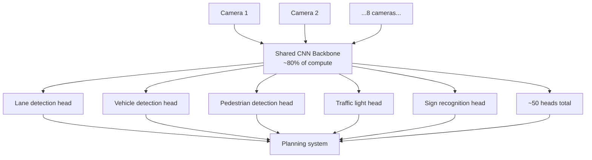
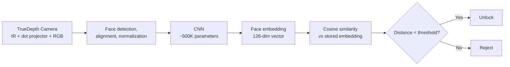
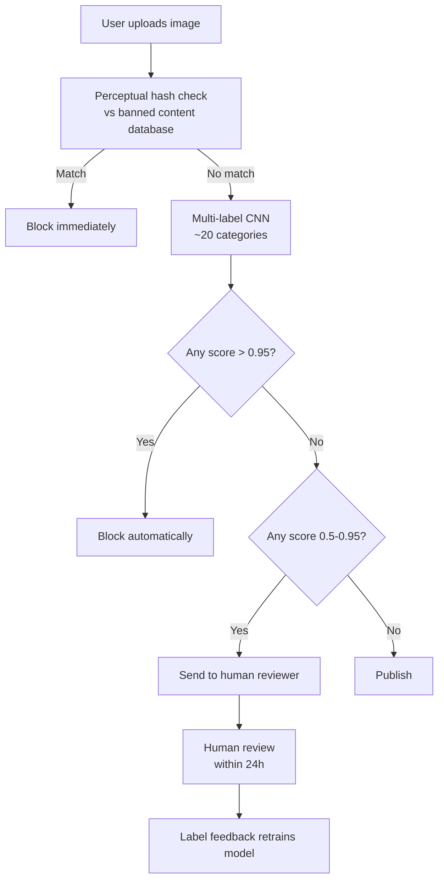

# Computer Vision — Production Patterns

**How real systems ship CV at scale. Tesla Autopilot, Google retinal screening, Apple FaceID, manufacturing inspection, content moderation. The architectures, the constraints, the lessons.**

---

## How to Read This Chapter

Each pattern below is a real production system, with publicly available technical details. The point is not to copy any single one — it is to see the **shape** of CV in production: what changes when you go from notebook to deployed, what tradeoffs every team faces, what lessons cost real money to learn.

---

## Pattern 1: Tesla Autopilot — Multi-Task CNN at Scale

**The problem.** A car has 8 cameras. It needs to identify cars, pedestrians, traffic lights, lanes, road signs, drivable surface, and free space — simultaneously, at 36 frames per second, with under 100ms total system latency, on automotive-grade hardware.

**The architecture.** Tesla calls it **HydraNet**. One shared CNN backbone (similar to ResNet) + ~50 task-specific heads.

**Why multi-task.** Running 50 separate models is too slow. One backbone shares the feature extraction (which is most of the compute). Each head is small and fast. **Total inference time on 8 cameras: ~30ms** on the on-vehicle Tesla FSD chip.

**The hard part is not the model.** It is:

- **Data labeling at scale.** Tesla labels ~10,000 hours of new driving footage per week. They built a custom labeling tool with auto-labeling assistance.
- **Edge case mining.** "Show me every frame where the model was uncertain about whether something was a person." Run that across the fleet's data, label hard cases, retrain.
- **Shadow mode validation.** New models run in parallel with the deployed model on real cars without affecting driving behavior. Compare predictions. Find regressions before the new model takes over.
- **Continuous deployment.** Software updates push new vision models OTA (Over The Air) every few weeks.

**Lesson.** A successful production CV team spends **far more time on data and validation infrastructure than on the model.** The model is 10% of the work.

**Sources.** Tesla AI Day presentations (2021, 2022). Andrej Karpathy's talks on Tesla's data engine.

---

## Pattern 2: Google Retinal Screening — Medical-Grade CV

**The problem.** Detect diabetic retinopathy (DR) from retinal photographs. Deploy in clinics in India, Thailand, and other countries where ophthalmologists are scarce. Match the accuracy of expert ophthalmologists. Be FDA-cleared (US Food and Drug Administration) and CE-marked (European conformity).

**The architecture.** A CNN trained on 128,000 labeled retinal images. Originally Inception-v3 (a 2015 architecture). Later iterations use EfficientNet variants.

**What "medical grade" requires beyond accuracy:**

| Requirement | What It Means in Practice |
|---|---|
| **Sensitivity ≥ 90%** | Must catch 90%+ of true cases (false negatives are dangerous) |
| **Specificity ≥ 90%** | Must not over-flag healthy patients (false positives waste specialist time) |
| **Calibration** | When the model says 80% confidence, it must be right 80% of the time |
| **Reproducibility** | Same image must always produce the same prediction |
| **Audit trail** | Every prediction must be traceable to a specific model version, training data version, deployment context |
| **Failure modes** | The model must explicitly flag images it cannot read (low quality, eye not centered) rather than guess |
| **Bias auditing** | Performance must be measured across demographics — by age, ethnicity, eye color — and gaps documented |
| **Continuous monitoring** | Real-world performance tracked after deployment; drift triggers re-training |

**The deployment.** Not on phones. The model runs on a small box in the clinic with a dedicated GPU. The retinal camera connects via USB. Results in under 10 seconds. Internet is not required for inference (often unreliable in deployment regions).

**Lesson.** Medical CV is **20% model, 80% process**. The training is comparatively easy. The validation, regulatory clearance, deployment infrastructure, and ongoing monitoring are where the real engineering happens.

**Sources.** Gulshan et al., "Development and Validation of a Deep Learning Algorithm for Detection of Diabetic Retinopathy in Retinal Fundus Photographs," JAMA, 2016. Google Health publications.

---

## Pattern 3: Apple FaceID — On-Device CNN with Hardware Security

**The problem.** Unlock the phone by recognizing the user's face. Must work in the dark, with sunglasses, with a beard, without makeup, after surgery, with a hat. Must reject everyone else (false-acceptance rate < 1 in 1,000,000). Must run on the phone (no cloud roundtrip — a privacy and latency requirement). Must complete in well under 500ms.

**The architecture.** A CNN that produces a face **embedding** (a vector representation, typically 128 or 512 dimensions). Comparison is done by measuring the distance between the embedding of the live capture and the stored embedding of the registered face.

**The hard parts:**

- **3D structure prevents 2D photo attacks.** The TrueDepth system projects 30,000 IR dots and reconstructs a 3D face mesh. A photo of you on someone else's phone produces a flat surface, not a face — the model rejects.
- **Secure Enclave.** The face embedding never leaves the Secure Enclave (a separate cryptographic chip on the iPhone). Even iOS itself cannot read it. If the phone is compromised, FaceID data is not.
- **Adaptive learning.** The model gradually updates its stored representation as your face changes (beard growth, weight change, aging). This is on-device incremental learning, no cloud involved.
- **Failure escalates to passcode.** After 5 failures, FaceID is disabled and only the passcode unlocks. Adversarial attacks have a small window.

**Lesson.** On-device CV is **as much hardware engineering as software**. The TrueDepth sensor, the Secure Enclave, and the optimized CNN are designed together. You cannot retrofit privacy — you bake it in from the silicon up.

**Sources.** Apple FaceID security white paper. Apple Machine Learning Research blog.

---

## Pattern 4: Manufacturing Defect Detection — High-Reliability Vision

**The problem.** Inspect every part on a high-speed manufacturing line. Catch microscopic defects that humans miss. Run continuously, 24/7, in a factory environment with vibration, dust, and variable lighting.

**Typical setup:**

| Component | Role |
|---|---|
| 2-8 industrial cameras | Capture parts from multiple angles |
| Lighting controllers | Consistent, controlled illumination (often coaxial or backlit) |
| Trigger system | Camera fires when a part is in position (photoelectric sensor) |
| Inference computer | Edge GPU (Jetson, NVIDIA RTX) or industrial PC |
| CNN model | Often a custom-trained ResNet18 or MobileNet variant |
| Reject mechanism | Air jet, robot arm — physically removes defective parts |

**The model.** Often surprisingly small. A single defect class can be solved with ResNet18 fine-tuned on 5,000-50,000 labeled images. The hard part is not the model — it is **edge case coverage**.

**Edge cases that ship CV systems:**

- Lighting changes between day and night shifts → train under both conditions
- New part variants introduced quarterly → retraining pipeline must be fast
- Conveyor speed changes → image timing/blur changes
- Camera lens gets dirty → fail-safe: detect lens degradation, alert operator
- New defect types appear (process drift) → continuous data collection, periodic re-training

**The reliability target.** Many manufacturing CV systems target **99.9%+ uptime** and **>99% defect catch rate**. Below 99% is unacceptable; the cost of one missed defect (warranty, recall) is more than the system saves.

**Vendors.** Cognex, Keyence, Omron VS, MVTec, plus custom in-house systems. The big-vendor systems are integrated hardware + software; custom systems use OpenCV + PyTorch and are deployed via NVIDIA Jetson or industrial PCs.

**Lesson.** Production CV in manufacturing is **defined by edge cases, not by accuracy on a benchmark**. The model that gets 99.5% on the test set might fail catastrophically on the third-shift's slightly different lighting. Continuous monitoring and a fast retraining loop are the system, not the model.

---

## Pattern 5: Content Moderation at Platform Scale

**The problem.** Detect prohibited content (violence, nudity, weapons, hate symbols) in images uploaded to a large social media platform. Process billions of images per day. Sub-second latency per image. Multiple categories per image (an image can be both "violence" and "weapon"). Constantly evolving adversarial users trying to bypass.

**Typical architecture:**

**The model.** Often a multi-task CNN producing 10-50 category scores. ResNet variants or EfficientNet. Trained on millions of labeled examples per category.

**Why two thresholds (0.5, 0.95)?**

- **Above 0.95:** auto-block. False positive rate is acceptable.
- **0.5 - 0.95:** human review. Model is uncertain; humans are the safety net.
- **Below 0.5:** allow. Mostly safe content.

**The hard parts:**

- **Adversarial users.** People deliberately modify images to evade detection — apply filters, add noise, watermark over content. The model needs adversarial training to be robust.
- **Cultural context.** A symbol benign in one culture is hate speech in another. Models must handle context — and platforms must be transparent about their decisions.
- **Speed at scale.** Billions of images per day means tens of thousands of GPU-seconds per second of wall-clock time. Inference cost is a real budget item.
- **Drift.** Trends change. New visual memes emerge weekly. Models must retrain on recent data continuously.

**Lesson.** **Confidence-based routing is more important than the model itself.** A 95% accurate model is fine if you have a workflow that routes uncertain cases to humans. A 99% accurate model with no human-in-the-loop ships incorrectly 1% of the time — at billion-scale, that is 10 million wrong decisions per day.

---

## Common Threads Across All Five

Notice what these systems share, regardless of domain:

| Theme | Manifestation |
|---|---|
| **The model is 10-20% of the system.** | The other 80% is data, validation, deployment, monitoring, retraining. |
| **Edge cases are where systems fail.** | Average accuracy is misleading. Test on the long tail. |
| **Continuous retraining loops are not optional.** | Data drifts. The world changes. A static model decays. |
| **Pretrained backbones + domain fine-tuning.** | Almost no production system trains from scratch. ResNet/EfficientNet pretrained, fine-tuned. |
| **Confidence calibration matters.** | The model's confidence must be trustworthy for downstream routing. |
| **Hardware-software co-design at the edge.** | Mobile CV is not "the model on a phone." It is the CNN, the chip, the camera, and the OS designed together. |

---

## What This Means for Your Project

If you are starting a production CV project, the order of work that actually ships (regardless of domain):

1. **Collect 1,000 representative examples.** Do not skip this. Do it before training anything.
2. **Audit labels** — sample 100, count errors, fix the labeling process if error rate > 5%.
3. **Pick a pretrained model** (ResNet50 or EfficientNet-B0 by default).
4. **Fine-tune** with the [Chapter 05 recipe](05_Building_It.md#the-training-recipe--what-modern-cv-looks-like).
5. **Evaluate on edge cases** — not just average accuracy. Per-class, per-condition.
6. **Build a feedback loop** — collect failures, re-label, periodic re-training.
7. **Plan deployment** before you need it — serving infrastructure, monitoring, drift detection ([07 — System Design](07_System_Design.md), [09 — Observability](09_Observability_Troubleshooting.md)).
8. **Quality, security, governance** before launch ([08](08_Quality_Security_Governance.md)).

The teams that ship reliably do these eight steps in order. The teams that fail try to skip steps 1, 2, 5, 6, 7. Do not be the second kind.

---

**Next:** [07 — System Design](07_System_Design.md) — Serving (Triton, ONNX, TensorRT), edge deployment, batching strategies, GPU economics, multi-model serving.
