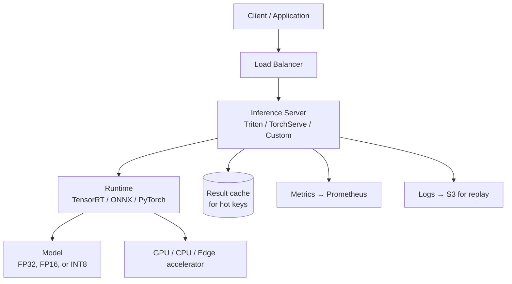
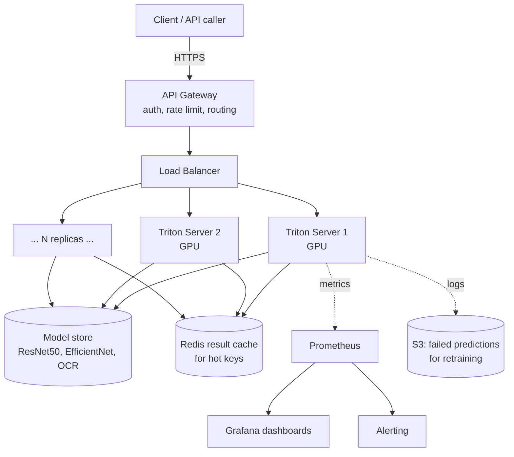

# Computer Vision — System Design

**Serving, deployment, batching, GPU economics, multi-model serving. The infrastructure that turns a `.pth` file into a system thousands of clients hit per second.**

---

## The Serving Stack

A trained model in PyTorch is the start. Production CV needs:



Every layer has tradeoffs. Get the stack right, and you serve 10x more traffic on the same hardware. Get it wrong, and you over-provision GPUs trying to fix what is fundamentally a serving problem.

---

## Inference Servers — What Each One Buys You

| Server | Vendor | Strengths | When to Use |
|---|---|---|---|
| **NVIDIA Triton** | NVIDIA | Multi-framework (PyTorch, TensorFlow, ONNX, TensorRT), dynamic batching, multi-model on one GPU | Production GPU deployment. The default for serious workloads. |
| **TorchServe** | Meta / PyTorch | PyTorch-native, simpler setup, custom handlers in Python | Pure PyTorch shops, simpler than Triton |
| **TensorFlow Serving** | Google | TF-native, battle-tested at Google | TF-only workloads |
| **ONNX Runtime Server** | Microsoft | Cross-platform, light, runs on CPU well | CPU deployment, edge, smaller services |
| **Custom FastAPI / Flask + PyTorch** | You | Maximum flexibility, easiest to start | Prototypes, low-traffic services. Will not scale past ~100 RPS without significant work. |

> **The default recommendation.** Use **NVIDIA Triton** for any GPU-served CV workload above ~50 requests per second. The dynamic batching feature alone usually pays for the integration work.

---

## Model Optimization for Inference

A model trained in PyTorch FP32 (32-bit floating-point) is almost never the model you should serve. Two transformations are standard:

### Step 1: Convert to ONNX (Open Neural Network Exchange)

ONNX is a portable format that decouples the model from the framework. Once your model is in ONNX, you can serve it with TensorRT, ONNX Runtime, OpenVINO, or any runtime that supports ONNX.

```python
import torch

# Export trained model to ONNX
dummy_input = torch.randn(1, 3, 224, 224)
torch.onnx.export(
    model,
    dummy_input,
    "model.onnx",
    input_names=["input"],
    output_names=["output"],
    dynamic_axes={"input": {0: "batch_size"}},   # variable batch size
    opset_version=17,
)
```

The ONNX file runs on multiple runtimes; the original `.pth` file does not.

### Step 2: Optimize with TensorRT (or equivalent)

**TensorRT** is NVIDIA's optimizing compiler for neural networks. It analyzes the model graph, fuses operations (e.g., conv + batchnorm + ReLU into one CUDA kernel), and selects optimal kernels for the specific GPU you are serving on.

**Typical speedups vs PyTorch FP32:**

| Optimization | Speedup | Accuracy Cost |
|---|---:|---|
| ONNX (just the format change) | 1.0-1.2x | None |
| TensorRT FP32 (kernel fusion) | 1.5-3x | None |
| TensorRT FP16 (half precision) | 3-6x | Negligible (<0.1% top-1 on most CNNs) |
| TensorRT INT8 (8-bit integer) | 5-10x | 0.5-2% (acceptable for most production) |
| TensorRT INT4 (extreme quantization) | 10-15x | 1-5% (requires careful calibration) |

**The order of operations:** train in FP32 → export to ONNX → optimize with TensorRT → deploy. Each step is automated; the engineer's job is to **measure accuracy at each stage** and stop where the loss becomes unacceptable.

### Quantization — INT8 in Practice

Most production CV models are quantized to INT8. Two approaches:

| Approach | How | When to Use |
|---|---|---|
| **Post-Training Quantization (PTQ)** | Quantize the trained model using a small calibration dataset (~100 representative images) | Simplest. Default. Usually works for CNNs. |
| **Quantization-Aware Training (QAT)** | Train with simulated quantization in the loop | When PTQ loses too much accuracy. More work, better recovery. |

**PTQ workflow with TensorRT:**

```python
# Pseudocode — actual API depends on TensorRT version
calibrator = create_calibrator(calibration_images=100_images_loader)
trt_engine = build_engine(
    onnx_path="model.onnx",
    precision="int8",
    calibrator=calibrator,
)
```

Run, measure accuracy, ship if acceptable.

---

## Batching — The Single Biggest Throughput Lever

A GPU running one image at a time is wasteful. Most of the GPU sits idle waiting for the next request.

**Batched inference** packs multiple requests into one forward pass. The GPU is utilized; throughput goes up by 5-50x at the cost of slightly higher per-request latency.

### Static vs Dynamic Batching

| Mode | How It Works | Use Case |
|---|---|---|
| **Static batching** | Always batch exactly N images. Wait if fewer arrive. | Offline / async jobs. Simple. |
| **Dynamic batching** | Batch whatever arrives within a small time window (e.g., 10ms) | Online serving. **The default.** Triton does this automatically. |

### The Batch Size / Latency Tradeoff

| Batch Size | Throughput | Per-Request Latency |
|---:|---:|---:|
| 1 | 100 images/sec | 10ms |
| 8 | 700 images/sec | 12ms |
| 32 | 2,000 images/sec | 16ms |
| 128 | 4,000 images/sec | 32ms |

(Numbers are illustrative — actual depends on model and GPU.)

**The pattern:** linear-ish throughput gains until the GPU saturates, then diminishing returns. Find the knee, set max batch size there.

> **Rule of thumb:** for a ResNet50 on a T4 GPU, max batch size 32 hits the sweet spot — high throughput, latency under 20ms. For a smaller model (MobileNet), 64-128 is fine.

### When Latency Matters Most — Single-Request Mode

For **autonomous driving, AR/VR, robotics**, latency is critical. You cannot batch — every frame must complete before the next. In this regime:

- Use FP16 or INT8
- Use TensorRT
- Use a smaller model (MobileNet, EfficientNet-Lite)
- Pin the model to a dedicated GPU (no multi-tenancy)

Single-request inference at 30 FPS (33ms budget) on a Jetson Orin is achievable with these optimizations and a properly sized model.

---

## Edge Deployment — When the Cloud Is Not an Option

Running CV on a phone, a robot, a security camera, or an embedded device. The constraints:

| Constraint | Impact |
|---|---|
| **No internet** | Inference must run locally |
| **Power budget** | Mobile: < 1 watt during inference |
| **Memory** | Often < 100 MB total for model + runtime |
| **Heat** | Sustained inference heats up the device — can throttle |
| **Battery** | Every Joule counts |

### Edge Runtimes

| Runtime | Platforms | Strengths |
|---|---|---|
| **TensorFlow Lite** | Android, iOS, microcontrollers | Mature, broad ecosystem |
| **Core ML** | iOS / macOS only | Optimized for Apple Neural Engine, best perf on Apple devices |
| **ONNX Runtime Mobile** | Cross-platform | Smallest mobile footprint of full ONNX |
| **TensorRT** | NVIDIA Jetson / DRIVE | Best perf on NVIDIA edge hardware |
| **OpenVINO** | Intel CPUs / VPUs | Best perf on Intel edge hardware |
| **NCNN, MNN** | Mobile (Chinese ecosystem) | Lightweight, custom kernels |

### Edge Model Sizes (Typical)

| Model | Parameters | Size on Disk (INT8) | Inference Time on Phone |
|---|---:|---:|---:|
| MobileNetV3-Small | 2.5M | ~3 MB | 10-20ms |
| EfficientNet-Lite0 | 4.7M | ~5 MB | 20-30ms |
| MobileNetV2 (default) | 3.5M | ~4 MB | 15-25ms |
| ResNet50 (quantized) | 26M | ~25 MB | 50-100ms (might be too slow for mobile) |

**Rule for mobile.** Your model + runtime should be under 10 MB on disk and under 30 ms latency on a mid-range phone. If not, scale down the architecture.

---

## GPU Economics — How to Estimate Inference Cost

Cloud GPU pricing (2026 ballpark, AWS/GCP/Azure):

| GPU | Hourly Cost | Typical FPS (ResNet50, FP16, batch 32) |
|---|---:|---:|
| **T4** | $0.35 | 800-1,200 FPS |
| **L4** | $0.60 | 1,500-2,000 FPS |
| **A10G** | $1.00 | 2,500-3,500 FPS |
| **A100 40GB** | $3.00-4.00 | 5,000-8,000 FPS |
| **H100** | $5.00-10.00 | 10,000-15,000 FPS |

### Calculating Cost per Inference

For a service handling 100 images per second on a T4:

```
GPU cost: $0.35/hour = $0.0001/sec
Throughput: 1,000 FPS (one T4)
Cost per inference: $0.0001 / 1,000 = $0.0000001 per image = $0.10 per million inferences
```

**Rough rule:** with proper batching and optimization, **CV inference costs $0.10-1.00 per million images**. Pricing your service:

- Internal use: cost is what you pay the cloud
- B2B SaaS: charge $1-10 per 1,000 images, depending on value delivered
- Consumer app: subsidize from advertising / subscription, target sub-cent per inference

### When Cost Matters More

| Scenario | Cost Sensitivity |
|---|---|
| Internal monitoring dashboard | Low — $50/month for unlimited inference is fine |
| B2B image moderation API | Medium — margins matter; optimize aggressively |
| Consumer-facing photo app at scale | High — sub-cent per inference is required |
| Autonomous vehicle (each car has its own GPU) | Hardware cost dominates; per-inference cost is irrelevant |

---

## Multi-Model Serving — Sharing GPUs

Most teams have multiple CV models — classification, detection, OCR (Optical Character Recognition), face detection, etc. Running each on its own GPU is wasteful.

**Triton supports multi-model concurrency.** One GPU runs multiple models. When request rates are uneven (lots of classification, occasional OCR), the GPU stays busy.

### Strategies

| Strategy | When to Use |
|---|---|
| **Model ensembles in Triton** | Pipeline (e.g., detection → crop → classification) on one GPU, one HTTP call |
| **Multi-instance GPU (MIG, A100/H100)** | Hardware-partition the GPU into separate instances per model |
| **Model warmup + LRU cache** | Cache the active models in GPU memory, evict least-recently-used |
| **Separate model servers per GPU** | Simpler operationally, less efficient |

### When NOT to Multi-Tenant

- **Latency-critical models** (autonomous driving) — dedicate the GPU
- **Models with very different memory requirements** (tiny + huge) — fragmentation
- **Compliance requires isolation** (healthcare, financial services)

---

## A Reference Architecture for Production CV

Putting it together, here is what a real production CV service looks like:



**Key features:**

- **Multiple Triton replicas behind a load balancer** — horizontal scaling
- **Centralized model store** — versioned, all replicas pull the same model
- **Result cache for repeated images** — image hash → result, big wins for content moderation
- **Failed predictions logged to S3** — feeds the retraining pipeline ([Chapter 09](09_Observability_Troubleshooting.md))
- **Metrics to Prometheus, alerts on regression**

This is the floor. Add streaming (Kafka), feature flags (LaunchDarkly), and feature stores as the system grows.

---

**Next:** [08 — Quality, Security, Governance](08_Quality_Security_Governance.md) — Adversarial inputs, dataset bias, drift, regulatory compliance for medical and automotive CV.
