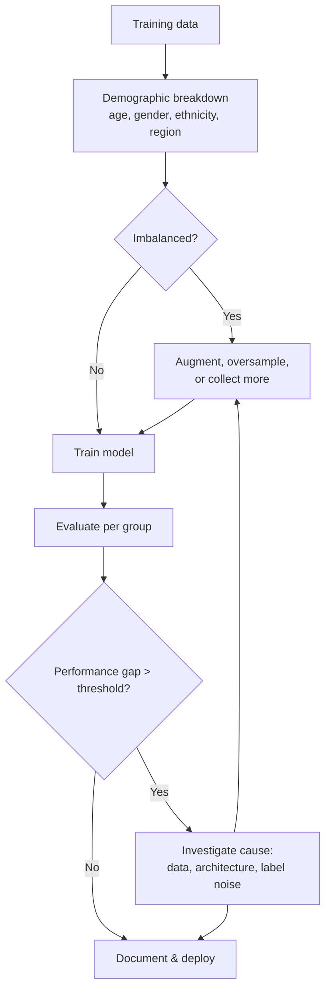
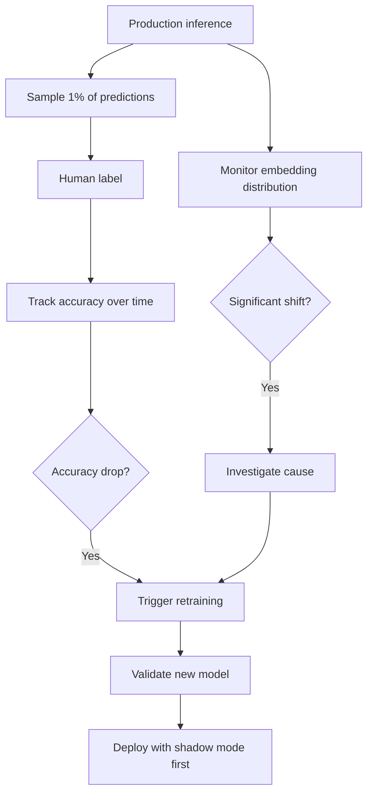

# Computer Vision — Quality, Security, Governance

**Adversarial inputs, dataset bias, drift detection, regulatory compliance. The risks that get CV systems pulled from production after they ship.**

---

## Why This Chapter Exists

A CV model that gets 99% accuracy on a benchmark can:

- Be fooled by a sticker on a stop sign (adversarial)
- Misclassify dark-skinned faces at 10x the rate of light-skinned faces (bias)
- Silently degrade by 20% three months after deployment (drift)
- Get the company sued or recalled because no one documented the training data (governance)

These are not edge cases. They are the leading causes of CV system failure in production. This chapter is what you do about them.

---

## Adversarial Inputs

A CNN sees what the input pixels say. Crafted inputs can lie.

### The Two Classes of Attack

| Attack Class | What It Does | Example |
|---|---|---|
| **Targeted attack** | Make the model predict a specific wrong class | Make a stop sign get classified as "speed limit 45" |
| **Untargeted attack** | Make the model predict any wrong class | Make a face be classified as anything other than the actual person |

### Three Common Attack Methods

| Attack | How It Works | Real-World Threat |
|---|---|---|
| **FGSM (Fast Gradient Sign Method)** | Compute the gradient of the loss with respect to the input pixels, then nudge each pixel in the direction that increases the loss. Imperceptible to humans. | Mostly academic. Requires white-box access to the model. |
| **Patch attack** | Print a small, deliberately crafted patch that, when shown in the camera frame, causes misclassification | Real threat. A printable patch can fool a face-recognition system. |
| **Physical adversarial** | Modify physical objects (sticker on sign, glasses on face) | Documented in research; some real-world incidents. |

### Defenses

| Defense | What It Does | Cost |
|---|---|---|
| **Adversarial training** | Train the model on adversarial examples — it learns to be robust | Doubles training time; some accuracy loss |
| **Input preprocessing** | Apply transformations (random crop, JPEG compression, blur) before inference — these often disrupt attacks | Small accuracy loss, easy to implement |
| **Confidence thresholding** | Reject predictions below a confidence threshold, escalate to humans | Most practical defense for content moderation, KYC, financial |
| **Defense in depth** | Multiple models, ensemble voting, human review for uncertain cases | Standard production pattern |

> **The honest truth.** No defense is perfect. For high-stakes systems (autonomous driving, financial, medical), assume an adversarial attacker is possible and design the **system** (not just the model) to be robust — multiple sensors, multiple models, human-in-the-loop where stakes are high.

---

## Dataset Bias — The Silent Failure Mode

Your CV model is only as fair as your training data. **Imbalanced or biased data produces imbalanced or biased models, even with no malicious intent.**

### Documented Examples

| System | Bias Found | How |
|---|---|---|
| **Commercial face recognition** | Up to 100x higher false-match rate for dark-skinned women vs light-skinned men | NIST FRVT (Face Recognition Vendor Test) studies, 2018-present |
| **Medical imaging models** | Lower accuracy on female patients when trained on male-dominated datasets | Multiple peer-reviewed studies in radiology |
| **Self-driving pedestrian detection** | Lower accuracy on dark-skinned pedestrians at night | Wilson et al. 2019 (Georgia Tech) |
| **Satellite agricultural classification** | Better accuracy in regions over-represented in training (often US Midwest) | Documented in deployments to Africa, Asia |

These are not implementation bugs. They are direct consequences of training data composition.

### Auditing for Bias — A Workflow



### Bias Mitigation Tactics

| Tactic | When |
|---|---|
| **Stratified sampling** during data collection | Always — collect proportionally across groups |
| **Re-weighting losses** for under-represented classes | Quick fix, easy to implement |
| **Targeted data collection** for under-represented groups | Right answer for serious systems |
| **Per-group threshold calibration** | When you cannot collect more data quickly |
| **Adversarial debiasing** (gradient methods) | Research-grade; requires care |

> **The hardest part.** "Demographically balanced data" is harder than it sounds. Self-reported demographic data is often missing or unreliable. Some teams use proxy variables; that introduces its own risks. There is no shortcut — bias auditing is ongoing work, not a one-time checkbox.

---

## Concept Drift and Distribution Drift

A model trained on photos from 2024 will degrade on photos from 2026. Not because the model changes — because the world does.

### Types of Drift

| Drift Type | Example |
|---|---|
| **Covariate shift** | Input distribution changes (camera lens upgraded, lighting in factory changed, photo styles evolved) |
| **Label shift** | The base rate of classes changes (defect rate doubles after process change) |
| **Concept drift** | The relationship between input and label changes (a "spam" image five years ago looks different today) |

### Detecting Drift

| Method | What It Watches | Alerts When |
|---|---|---|
| **Output distribution monitoring** | Distribution of predicted class probabilities | Distribution shifts significantly from baseline |
| **Confidence drop** | Mean confidence of predictions over time | Mean confidence drops > 10% |
| **Embedding drift** | Distribution of penultimate-layer features | KL divergence vs baseline exceeds threshold |
| **Direct accuracy on held-out feedback** | Real labels from human reviewers / customers | Accuracy drops below SLA |

### A Drift-Resilient System



> **The principle.** No model is "deployed and done." Plan for retraining from day one — your system needs a feedback loop, a labeled-sample pipeline, and an automated retraining workflow. Without these, your model decays silently.

---

## Regulatory Compliance — Domain-Specific

CV in regulated domains has constraints beyond accuracy. Know which apply to you before training.

### Medical Imaging — FDA, CE Mark

| Requirement | Implication for CV Engineering |
|---|---|
| **510(k) clearance** (US, FDA) | Demonstrate substantial equivalence to a legally-marketed device. Months-to-years process. |
| **De Novo classification** | For novel device types — more rigorous |
| **CE mark** (EU) | Conformity to EU medical device regulations |
| **Design controls** | Documented, traceable engineering process — every change tracked |
| **Clinical validation** | Trial data with pre-specified endpoints |
| **Post-market surveillance** | Ongoing monitoring required after deployment |

A medical CV team needs a regulatory specialist on the team from day one, not when shipping.

### Automotive — ISO 26262, ISO 21448

| Requirement | Implication |
|---|---|
| **ISO 26262** (functional safety) | ASIL ratings; deterministic behavior; redundancy; documented failure modes |
| **ISO 21448** (SOTIF — safety of the intended functionality) | Coverage of edge cases the model might not handle well |
| **Traceability** | Every prediction must be traceable to model version, training data, validation criteria |
| **Determinism** | Same input must always produce the same output (challenging with floating-point, multi-threaded inference) |

### Privacy — GDPR, CCPA, Biometric Laws

| Regulation | Impact on CV |
|---|---|
| **GDPR** (EU) | Face data is biometric data — strict consent, right to deletion, data minimization |
| **CCPA / CPRA** (California) | Similar consumer rights |
| **Illinois BIPA** | Strict biometric consent law — significant fines for violations |
| **EU AI Act** (in force 2025+) | Risk-based classification of AI systems; strict requirements for high-risk applications |

A CV system processing face data without explicit, recorded user consent in many jurisdictions is illegal — not just risky.

### Financial Services — KYC, OFAC

| Requirement | Implication |
|---|---|
| **KYC (Know Your Customer)** | Identity verification via document + selfie. Must meet false-match-rate thresholds. |
| **AML (Anti-Money Laundering)** | Auditable predictions, retention requirements |
| **Document fraud detection** | Adversarial robustness is a regulator's question, not a research interest |

---

## Privacy Engineering for CV

Even outside regulated domains, CV touches sensitive data. Best practices:

| Practice | Implementation |
|---|---|
| **On-device inference** when possible | Face unlock, photo analysis on phone — no cloud round-trip |
| **Embedding-only storage** | Store the face vector, not the image. Cannot reconstruct face from a 128-dim vector. |
| **Differential privacy** for training | Add calibrated noise to training to prevent membership inference |
| **Federated learning** | Train across distributed devices without centralizing raw data |
| **Data minimization** | Collect only what you need. Delete after use. Document retention. |
| **Secure Enclave / TEE for inference** | Hardware-backed isolation (Apple Secure Enclave, ARM TrustZone) |

Apple's FaceID is the textbook implementation: face data stays in the Secure Enclave; it never touches the network; iOS itself cannot read it. This is privacy by architecture, not by policy.

---

## Model Cards — Documenting What You Trained

A **model card** is a short structured document describing a CV model's intended use, performance, limitations, and bias evaluation. It is the model's **README**. Increasingly mandatory for B2B sales, regulators, and ethical deployment.

A minimal model card:

```markdown
# Model Card: Defect Detection v3.2

## Intended Use
Detect surface defects on stamped steel brake calipers in factory line inspection.

## NOT Intended For
- Other materials (plastic, aluminum)
- Other parts (rotors, pads)
- Quality grading beyond defect/no-defect

## Training Data
- 47,000 labeled images
- Collected from Plant A and Plant B (2024-2026)
- Lighting: 6500K LED, 800 lux, coaxial
- All images human-reviewed, 2-annotator consensus

## Performance
- Test accuracy: 99.2% (held-out 5,000 images)
- Per-class accuracy: defect 96.5%, pass 99.4%
- Confusion matrix: see appendix

## Known Limitations
- Sensitive to lens cleanliness — flag detected at 50% confidence drop
- Untested on Plant C lighting conditions
- Defect class imbalance — only 200 defect examples in training set
- Has not been evaluated for adversarial robustness

## Versioning
- Model: ResNet50 backbone, fine-tuned
- Training run: 2026-04-15
- Data version: v3.2 (DVC commit abc123)
- Validation: passed acceptance test 2026-04-18

## Maintenance
- Retraining cadence: monthly
- Drift monitoring: confidence distribution, weekly check
- On-call: defect-detection@team.com
```

Model cards are short. Their value is **forcing the team to write down what they assumed.** Most "the model fails in production" failures trace back to assumptions that were never written down.

---

## A Pre-Deployment Checklist

Before any CV model goes to production:

| ✓ | Item |
|---|---|
| ☐ | Model card written and reviewed |
| ☐ | Per-class metrics evaluated, not just overall accuracy |
| ☐ | Bias evaluation across demographic groups (where applicable) |
| ☐ | Adversarial robustness tested (or accepted as known limitation) |
| ☐ | Confidence calibration verified |
| ☐ | Drift monitoring instrumented before deploy |
| ☐ | Rollback plan documented (how do you revert to the previous model in < 1 hour?) |
| ☐ | Failure modes documented (what does the system do when the model is uncertain or fails?) |
| ☐ | Regulatory requirements identified and documented (medical, automotive, biometric) |
| ☐ | Privacy: data flow audited, consent verified |
| ☐ | On-call team identified and trained |
| ☐ | Retraining pipeline functional (not just planned) |

If you cannot check most of these, you are not ready to deploy. **Going to production without these is the single biggest predictor of CV system failure within the first six months.**

---

**Next:** [09 — Observability & Troubleshooting](09_Observability_Troubleshooting.md) — Measuring CV model quality in production. Per-class metrics, confidence calibration, what to alert on.
