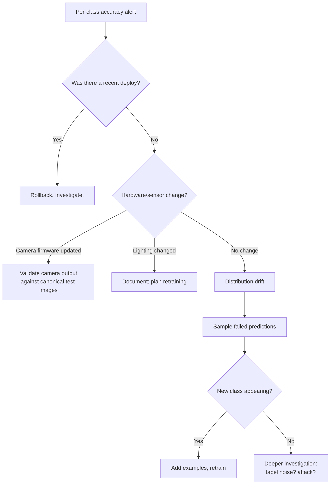
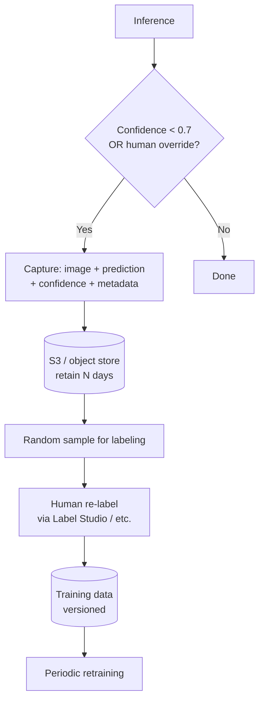

# Computer Vision — Observability & Troubleshooting

**Measuring CV model quality in production. Per-class metrics, confidence calibration, what to alert on, runbooks for the most common failures.**

---

## What to Measure — Beyond Accuracy

"Accuracy" is the wrong single number for CV in production. Watch these instead:

| Metric | What It Tells You |
|---|---|
| **Per-class accuracy** | Which classes are degrading. Average accuracy hides catastrophic failures on small classes. |
| **Per-class precision and recall** | Critical for imbalanced classes. A 99% accurate medical screening with 50% recall on the minority class is dangerous. |
| **Confidence distribution** | The shape of your model's confidence over time. Drift here precedes accuracy drop. |
| **Calibration** | When the model says 80%, is it right 80% of the time? Often not. |
| **Per-condition accuracy** | Per lighting, per camera, per location, per time of day. Hide here for production failures. |
| **Latency p50, p95, p99** | The tail matters. p99 latency drives user experience. |
| **Throughput (FPS)** | Cost driver. Track over time. |
| **Cost per inference** | Tracks resource utilization. Spikes mean infrastructure is wrong. |

---

## The Confusion Matrix — Required Reading

For any classification task, the confusion matrix tells the story average accuracy hides. For a binary defect-detection model:

|  | **Predicted: Defect** | **Predicted: Pass** |
|---|---|---|
| **Actual: Defect** | True Positive (TP) — caught | False Negative (FN) — **missed** |
| **Actual: Pass** | False Positive (FP) — wasted inspection | True Negative (TN) — correct |

From these four numbers:

```
Accuracy   = (TP + TN) / (TP + FP + TN + FN)
Precision  = TP / (TP + FP)         # of predicted defects, how many were real?
Recall     = TP / (TP + FN)         # of actual defects, how many did we catch?
F1         = 2 · (P · R) / (P + R)  # harmonic mean — balances P and R
```

### Picking Which Metric to Optimize

| Cost Pattern | Optimize | Why |
|---|---|---|
| **False negatives are dangerous** (missed cancer, missed defect, fraud detection) | **Recall** | Cannot afford to miss a positive case |
| **False positives are expensive** (manual review queue, wasted shipping) | **Precision** | Each false positive triggers human work |
| **Balanced costs** | **F1** | Harmonic mean balances both |
| **One class is rare** (1 in 1000) | **Precision-Recall AUC** | ROC-AUC misleads for imbalanced data |

### A Common Trap — Class Imbalance

You have 10,000 normal images and 100 defects (1% defect rate). A model that always predicts "normal" achieves **99% accuracy**. It is also useless.

```
Precision (defect) = 0 / 0   = undefined
Recall (defect)    = 0 / 100 = 0
F1 (defect)        = 0
```

**Always look at per-class metrics for imbalanced classes.** Average accuracy will lie to you.

---

## Confidence Calibration

A model says "I am 90% sure this is a tumor." Is it actually right 90% of the time on cases with that confidence?

If yes → calibrated. If no → overconfident or underconfident.

**Why it matters.** Many production decisions depend on confidence:

- "If confidence > 0.95, auto-approve. Else, send to human review."
- "Use prediction only if confidence > 0.8, else fall back."
- "Aggregate predictions weighted by confidence."

If the confidence is meaningless, all of these break.

### Measuring Calibration — Reliability Diagram

Bucket predictions by confidence (0.0-0.1, 0.1-0.2, ..., 0.9-1.0). For each bucket, plot the actual accuracy vs the bucket's confidence midpoint.

```
Perfect calibration: line goes through (0.5, 0.5), (0.9, 0.9), etc.

Confidence  | Accuracy in that bucket
0.5 ─ 0.6   | 55%   ← well calibrated
0.6 ─ 0.7   | 65%   ← well calibrated
0.7 ─ 0.8   | 71%   ← slightly overconfident
0.8 ─ 0.9   | 78%   ← overconfident
0.9 ─ 1.0   | 85%   ← significantly overconfident
```

CNN models with cross-entropy loss are typically **overconfident** out of the box.

### Fixing Calibration

| Method | How | When |
|---|---|---|
| **Temperature scaling** | Divide logits by a learned scalar `T` before softmax. T > 1 softens predictions. | The default. One-line fix. Tune T on a held-out validation set. |
| **Platt scaling** | Logistic regression on top of logits | Binary problems |
| **Isotonic regression** | Non-parametric mapping from raw scores to calibrated probabilities | When you need flexibility |
| **Label smoothing during training** | Soft targets (e.g., 0.9 / 0.1 instead of 1.0 / 0.0) | Best done at training time |

> **Production rule.** Always calibrate before deploying. Always re-calibrate after retraining. An uncalibrated model breaks downstream confidence-based logic silently.

---

## What to Alert On

Not every metric deserves a page. The signals that should wake someone up:

### Page-Worthy (P1)

| Signal | Threshold | Why |
|---|---|---|
| Per-class accuracy drop | > 5% absolute drop in any class | Could be drift, a deploy bug, or sensor failure |
| p99 latency | > 2x baseline | User-facing impact |
| Throughput drop | > 30% drop | Cost spike or hardware issue |
| Service availability | < 99.5% | SLA breach |
| Inference error rate | > 1% requests failing | Pipeline broken |

### Investigate-Soon (P2)

| Signal | Threshold |
|---|---|
| Confidence distribution shift | KL divergence > 0.1 from baseline |
| Embedding distribution drift | Significant shift in feature space |
| Increase in human reviewer override rate | > 20% increase |
| New unknown classes appearing | Sustained > 1% of inputs |

### Track-Trend (no page)

| Signal |
|---|
| Cost per inference |
| Disk usage (logs, snapshots) |
| Model size trends |
| Retraining cycle duration |

### What NOT to Alert On

- Average accuracy — can stay flat while specific classes fail
- Single-batch metrics — too noisy
- Anything that fires more than once per week — alert fatigue is real

---

## Runbooks for Common Production Failures

### Failure 1: Sudden Accuracy Drop

**Symptom.** Per-class accuracy dropped 8% overnight. Customer complaints incoming.

**Triage flow:**



**Common root causes (rough order of frequency):**

1. **Recent deploy regression.** Rollback, then investigate.
2. **Camera/sensor drift.** Lens dirt, firmware update, lighting change.
3. **Distribution shift.** New product variant, seasonal change, demographic shift.
4. **Adversarial activity.** Sudden attack on the system.
5. **Pipeline bug.** Normalization stats changed, image preprocessing changed.

### Failure 2: Latency Spike

**Symptom.** p99 latency went from 50ms to 500ms.

**Likely causes:**

| Cause | How to Check |
|---|---|
| GPU memory pressure (OOM swapping) | `nvidia-smi`, look for >90% memory utilization |
| Batch starvation (no batching happening) | Check Triton metrics — `inference_request_duration` vs `compute_input_duration` |
| Cold start (model just loaded) | First request after deploy is always slower |
| Network slowness | Check network metrics — is it inference or transport? |
| New, larger model accidentally deployed | `kubectl describe deployment` — what model image is running? |

### Failure 3: Cost Spike

**Symptom.** GPU bill went up 3x this month with no traffic increase.

**Likely causes:**

| Cause | How to Check |
|---|---|
| Auto-scaling went wild | Check scaling history — when did replicas spike? |
| Cache hit rate dropped | If you have a result cache, has hit rate fallen? |
| Inference is no longer batched | Triton dynamic batching disabled or misconfigured |
| GPU type changed | Did someone "upgrade" to a more expensive GPU? |
| Deployment in extra regions | Multi-region rollout that wasn't unwound |

### Failure 4: A Class Is Failing Specifically

**Symptom.** Overall accuracy is fine. Per-class accuracy on "tumor" dropped from 92% to 75%.

**Action plan:**

1. **Pull recent failures for that class.** Are they obvious or subtle?
2. **Compare distribution to training.** Is the test condition no longer represented?
3. **Check class-specific confidence.** Has it dropped, or are predictions confidently wrong?
4. **Re-label a sample.** Are the failures actually mislabeled?
5. **Add data and retrain.** If genuinely new patterns, this is the only fix.

> **The principle:** average metrics smooth over class-specific failures. Always look at per-class. The systems that fail invisibly are the ones where one class slowly degrades while overall accuracy stays stable.

---

## A Production Monitoring Dashboard

The minimum viable dashboard for a production CV service:

```
┌──────────────────────────────────────────────────────┐
│  OVERVIEW                                            │
│  Requests/sec: 432    Errors: 0.02%   p99: 47ms     │
├──────────────────────────────────────────────────────┤
│  ACCURACY (last 24h)                                 │
│  Overall: 97.8%                                      │
│  Per-class:                                          │
│    Class A: 99.1%  ▁▂▃▄▅▆▇█    (improving)          │
│    Class B: 95.2%  █▇▆▅▄▃▂▁    (DEGRADING ⚠)        │
│    Class C: 98.7%  ▄▄▄▄▄▄▄▄    (stable)             │
├──────────────────────────────────────────────────────┤
│  CONFIDENCE                                          │
│  Mean: 0.84  Median: 0.91                            │
│  % > 0.95: 67%   % < 0.5: 3%                         │
│  Calibration error: 0.04 (good)                      │
├──────────────────────────────────────────────────────┤
│  INFRASTRUCTURE                                      │
│  GPUs: 4 active   Memory: 78%   Cost: $14.40/hour   │
├──────────────────────────────────────────────────────┤
│  RECENT EVENTS                                       │
│  • 14:23  Class B accuracy dropped 4% → investigation │
│  • 11:08  Deployed model v3.2.1                      │
└──────────────────────────────────────────────────────┘
```

Build this with Grafana + Prometheus + custom dashboards for the model-specific metrics. Open it every morning. The teams that catch problems early are the ones with this discipline.

---

## A Failure-Capture Pipeline

When the model gets something wrong, capture it. That data is gold for retraining.



**Key design points:**

- Capture only **interesting** failures (low confidence, human disagreement) — capturing every prediction blows storage costs
- Tag each capture with **context** (model version, deployment region, time, sensor) — so you can later say "the failures cluster in Region X with the new camera firmware"
- **Periodic re-labeling** — a small team labels a sample weekly; that flow into training
- **Privacy** — purge or anonymize after retention window; comply with regional data laws

The retraining cadence depends on the domain:

| Domain | Typical Cadence |
|---|---|
| Manufacturing defect detection | Weekly to monthly |
| Content moderation | Daily to weekly (drift is fast) |
| Medical imaging | Quarterly (regulatory friction) |
| Autonomous driving | Continuous (Tesla deploys new vision models every few weeks) |

---

## The 5-Minute Health Check

Every morning, every CV team should be able to answer in 5 minutes:

1. **Is overall accuracy stable?** (look at per-class trends)
2. **Is confidence calibration intact?**
3. **Are any new classes appearing?**
4. **Is throughput where we expect?**
5. **Are costs in budget?**

If you cannot answer these in 5 minutes, your dashboards are wrong. Fix the dashboards before fixing anything else.

---

**Next:** [10 — Decision Guide](10_Decision_Guide.md) — "Should I use computer vision here?" decision table. Production readiness checklist.
