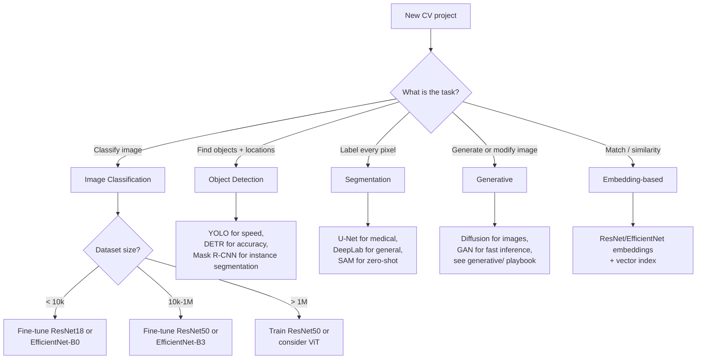

# Computer Vision — Decision Guide

**"Should I use computer vision here?" The decision table that saves you from building the wrong thing. Plus the production readiness checklist.**

---

## The Core Decision: Should You Use CV at All?

| Your Situation | Recommendation |
|---|---|
| Task can be solved by a rule (file extension, presence of a string, structured field) | **Don't use CV.** Use the rule. |
| Task involves images and "humans can do it but not at scale" | **Use CV.** This is the sweet spot. |
| Task involves images but humans struggle too (subtle medical diagnosis, novel anomalies) | **Cautious yes.** Define the success metric carefully. |
| Task involves text (OCR, document understanding) | **Use CV + NLP.** OCR first, then language model. |
| Task involves video and you need event detection | **Use CV.** Choose architecture based on temporal reasoning needs. |
| Task is "the camera might see something useful" with no specific question | **Define the question first.** Then decide. |
| Highly regulated domain (medical, automotive, financial) | **Use CV but plan 2x the engineering time** — most goes to validation, governance, regulatory. |
| Real-time requirement < 50ms total | **Use CV but architect carefully.** MobileNet + TensorRT + dedicated GPU. |
| Privacy-sensitive (faces, medical imagery, private spaces) | **Use CV but on-device** if possible. Don't centralize raw images. |

---

## Architecture Decision Tree

You have decided to use CV. Now: which architecture?

---

## When NOT to Use Each Architecture

| Architecture | Don't Use When |
|---|---|
| **MLP** | Almost any image task — see [02 — Concepts → Why MLP Fails](02_Concepts.md) |
| **CNN (ResNet/EfficientNet)** | You have a billion images and need maximum accuracy at any compute cost — consider ViT |
| **MobileNet** | You have a cloud GPU and don't need on-device — use a more accurate model |
| **ViT** | You have a small dataset (under 100k labeled) — CNN beats ViT here |
| **YOLO** | You need pixel-precise object boundaries — use Mask R-CNN |
| **U-Net** | The task is classification or detection — segmentation is different |
| **Diffusion** | You need real-time generation (< 100ms) — use GAN or smaller model |
| **CLIP / vision-language models** | Pure visual classification with no text component — overkill |

---

## Build vs Buy

Most teams should not train CV models from scratch. Decision:

| Situation | Recommendation |
|---|---|
| Standard task (object detection, OCR, face detection, content moderation) | **Buy.** AWS Rekognition, Google Vision API, Azure Computer Vision, Cloudflare Workers AI. Often $1-5 per 1,000 images. |
| Specialized task (your specific defect types, your specific medical imaging) | **Build.** Pretrained backbone + fine-tune. |
| Adjacent to a standard task (custom labels on top of detection) | **Hybrid.** Buy the heavy lifting (detection), build the custom logic (your label taxonomy). |
| Compliance requires data not leave your network | **Build or self-host.** Many cloud APIs are off-limits in regulated environments. |
| Heavy volume (> 100M inferences/month) | **Probably build.** Cloud APIs become expensive at this scale; in-house infra wins. |
| Differentiating capability for your business | **Build.** This becomes a moat. |

> **The 80/20 of CV in 2026.** For 80% of business problems, a cloud API solves the problem in a week. For the remaining 20% — your specific domain, your specific data, your specific scale — you fine-tune. Almost no one trains from scratch.

---

## Production Readiness Checklist

Before declaring a CV system production-ready:

### Data
| ✓ | Item |
|---|---|
| ☐ | Training data version controlled (DVC, S3 versions, or manifest) |
| ☐ | Train/val/test split documented; verified no leakage |
| ☐ | Label quality audited (1,000-image manual review) |
| ☐ | Class balance documented |
| ☐ | Demographic / condition balance documented (where applicable) |

### Model
| ✓ | Item |
|---|---|
| ☐ | Architecture choice justified |
| ☐ | Training recipe reproducible (seed, hyperparameters, code commit) |
| ☐ | Model card written ([Chapter 08](08_Quality_Security_Governance.md)) |
| ☐ | Per-class metrics evaluated, not just average accuracy |
| ☐ | Confidence calibration verified |
| ☐ | Adversarial robustness tested (or accepted as known limitation) |

### Inference
| ✓ | Item |
|---|---|
| ☐ | Model exported to deployment format (ONNX, TensorRT, Core ML, etc.) |
| ☐ | Latency p50, p95, p99 measured at target batch size |
| ☐ | Throughput measured |
| ☐ | Load tested at expected peak QPS + 50% headroom |
| ☐ | Failure modes tested (malformed input, timeout, GPU OOM) |

### Operations
| ✓ | Item |
|---|---|
| ☐ | Monitoring dashboard live (per-class, latency, throughput, cost) |
| ☐ | Alerts configured for the page-worthy signals ([Chapter 09](09_Observability_Troubleshooting.md)) |
| ☐ | Runbooks for common failures |
| ☐ | Rollback plan documented and tested |
| ☐ | On-call team identified and trained |

### Governance
| ✓ | Item |
|---|---|
| ☐ | Regulatory requirements identified (FDA, ISO, GDPR, BIPA as applicable) |
| ☐ | Privacy review completed |
| ☐ | Bias evaluation documented (where applicable) |
| ☐ | Audit log of training data, model versions, deployment events |
| ☐ | Failure-capture pipeline in place |
| ☐ | Retraining cadence and trigger defined |

If you cannot check most of these, you are not ready. **The teams that ship reliably go through this list before launch. The teams that fail discover each item on this list the hard way, in production, with users affected.**

---

## Cost Estimation Worksheet

Before committing to a CV project, estimate end-to-end cost.

### Initial Build (One-Time)

| Item | Typical Hours | Notes |
|---|---:|---|
| Data collection / acquisition | 40-200+ | Often the longest task |
| Labeling | $0.05-$5 per image, depending on complexity | Crowdsource simple, expert-label medical |
| Training pipeline | 40-80 | ML engineer time |
| Initial training runs (compute) | $100-$10,000 | Cloud GPU costs |
| Validation infrastructure | 40-80 | Test sets, eval metrics, dashboards |
| Deployment infrastructure | 40-120 | Serving, monitoring, alerting |

### Ongoing (Per Year)

| Item | Typical Cost |
|---|---|
| Inference compute | Depends on volume — see [07 — System Design](07_System_Design.md#gpu-economics--how-to-estimate-inference-cost) |
| Periodic retraining | 1-10% of initial training cost per cycle |
| Continuous labeling for retraining | $50/k - $500/k labeled images |
| On-call engineering | 0.1-0.5 of an engineer FTE |
| Storage (training data, captured failures) | $20-200/month per TB |

### Total Cost of Ownership Example

A medium B2B CV product (defect detection for a manufacturing line):

| Phase | Cost |
|---|---|
| Year 1 build | ~$200k engineering + $30k labeling + $5k compute |
| Year 1 ongoing | ~$50k inference + $20k labeling + $40k engineering on-call |
| Year 2+ ongoing | ~$80k all-in |

For a SaaS at $30k/year per customer, breakeven is ~3 customers. The economics are strong **only if** the system actually works in production. The risk concentrates in the validation/deployment phase, which is why the production readiness checklist matters.

---

## When to Stop and Reconsider

CV projects fail. Some signals it's time to pause and reconsider:

| Signal | What to Do |
|---|---|
| Cannot reach 80% accuracy after 2 months of trying | The task may not be solvable from these images. Reconsider the data — different angle, different lighting, different sensor. |
| Accuracy is high in test, low in production | Distribution gap. Pivot effort to data collection, not modeling. |
| Per-class accuracy differs by > 30% between classes | Class imbalance or label issues. Fix data before modeling. |
| Stakeholder says "the model needs to be 100% reliable" | This is a false requirement. Reframe: what is the cost-of-error tradeoff? Build a system, not a model. |
| Regulatory team has not been engaged 6 months in | **Stop and engage them.** Regulatory work is on the critical path for medical/automotive/financial. |
| Team has not built monitoring before deployment | **Stop and build it.** Deploying without monitoring is shipping a system you cannot operate. |

---

## The CV-Engineer Mindset

Beyond the technical decisions, the mental model that distinguishes engineers who ship reliably:

| Mindset | What It Looks Like |
|---|---|
| **Data is the product** | Spend more time on data quality than model architecture |
| **Average metrics lie** | Always look at per-class, per-condition, per-segment |
| **Models decay** | Plan retraining from day one |
| **Systems beat models** | A 95% model with human-in-the-loop beats a 99% model alone |
| **The world is bigger than the test set** | Test on edge cases, adversarial inputs, demographic diversity |
| **Boring infrastructure wins** | Serving, monitoring, retraining, governance — these are where production lives |

---

## What's Next

You have built the foundations. The architecture deep dives expand from here:

| Doc | When to Read |
|---|---|
| `architectures/cnn-fundamentals.md` (coming) | LeNet, AlexNet, VGG — the foundation architectures |
| `architectures/resnet-and-modern.md` (coming) | ResNet, EfficientNet, ConvNeXt — modern CNN architectures |
| `architectures/vision-transformers.md` (coming) | ViT, hybrids, when ViT beats CNN |
| `architectures/object-detection.md` (coming) | YOLO, R-CNN family, DETR — for detection tasks |
| `architectures/segmentation.md` (coming) | FCN, U-Net, DeepLab — for pixel-level tasks |

And the sibling playbooks for related domains:

- [Deep Learning](../deep-learning/) — foundations (already built)
- [Transformers](../transformers/) — for NLP/LLM (coming)
- [Generative](../generative/) — for image generation (GAN/Diffusion/VAE) (coming)
- [RAG](../rag/) — for retrieval-augmented systems (already built)
- [Agents](../agents/) — for autonomous AI systems (already built)

---

**Where you started:** [01 — Why](01_Why.md). Read backwards from here if you want to revisit any concept.

**Hands-on companions:**
- [Computer Vision From Scratch on Colab](https://colab.research.google.com/github/sunilmogadati/systems-in-production/blob/main/implementation/notebooks/Computer_Vision_From_Scratch.ipynb) — manual convolution by NumPy, PyTorch verification
- [Computer Vision CNN on Colab](https://colab.research.google.com/github/sunilmogadati/systems-in-production/blob/main/implementation/notebooks/Computer_Vision_CNN.ipynb) — full CNN trained on MNIST in PyTorch
