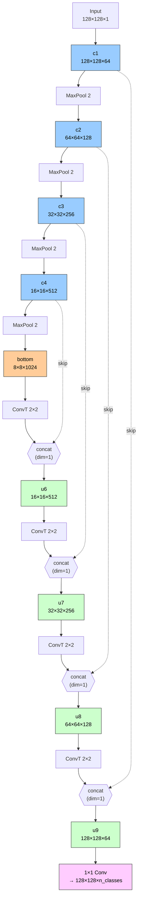
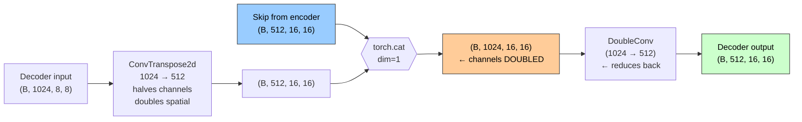

# U-Net (Image Segmentation)

This reference covers U-Net for semantic image segmentation across four sections: concepts and architecture, code, mathematics, and common questions and answers.

---

# Section 1 — Concepts and Architecture

This section is a narrative chapter on U-Net. Every technical term is defined inline the first time it appears. Math and code are deferred to Sections 2 and 3.

## 1.1 What problem are we solving?

The story of U-Net begins with a question that ordinary image classifiers cannot answer. A classifier looks at a picture and produces a single label — "cat," "tumor," "salt" — describing the whole image at once. But many real problems need a finer answer. A radiologist looking at a microscopy slide wants to know exactly *which pixels* belong to a cell membrane. A self-driving car wants to know which pixels are road, which are sidewalk, which are pedestrian. This question — "for every pixel in the image, what class does it belong to?" — is called **image segmentation** (the task of assigning a class label to every pixel of the input image, producing an output that has the same spatial size as the input but where each position holds a class identity rather than a color).

It helps to place segmentation alongside its cousins. **Image classification** (assigning one label to the entire image — for example, "dog" or "not dog") collapses everything into one answer. **Object detection** (finding objects and drawing a rectangular bounding box around each one) is more spatial but still coarse — a bounding box covers everything inside the rectangle, including background pixels that happen to fall within it. **Semantic segmentation** (the variant U-Net solves, where every pixel is assigned a class label without distinguishing between separate instances of that class — two adjacent dogs are both simply labeled "dog") produces a per-pixel class map with no boxes and no leftover background inside the answer. **Instance segmentation** (which additionally distinguishes between different instances of the same class — dog #1 versus dog #2) is a separate architectural family.

U-Net was born in biomedical image analysis. The original 2015 paper by Ronneberger and colleagues — "U-Net: Convolutional Networks for Biomedical Image Segmentation" — was applied first to **electron microscopy** (a high-resolution imaging technique that produces grayscale images of biological tissue at a scale where individual cell membranes are visible) for segmenting neuronal cell membranes. The challenge was twofold: labels are extremely fine-grained (a cell membrane is a thin line just a few pixels wide), and biomedical training data is *tiny* (researchers might have only thirty annotated images because pixel-perfect annotation requires a domain expert and many hours per image). Any architecture that worked here had to be both spatially precise and data-efficient. U-Net's solution ended up generalizing far beyond microscopy: today it segments satellite imagery, identifies salt deposits in seismic scans, guides autonomous vehicles, and forms the noise-prediction backbone of modern image-generation diffusion models.

## 1.2 Why a regular CNN classifier doesn't work

To understand U-Net's shape, it helps first to understand why the obvious architecture — a standard **CNN classifier** (a stack of convolutional layers followed by fully-connected layers, designed to output one class label per image) — cannot do segmentation. The recipe goes like this. The image enters as a grid of pixels organized into one channel for grayscale or three for color (a **channel** is one layer of pixel values; a color image has three because red, green, and blue brightness are stored separately). A **convolutional layer** (a learned filter that slides across the image computing weighted sums of small neighborhoods) extracts local features. A **pooling layer** (a non-learnable downsampler that summarizes each small window into a single value, typically by taking the maximum) shrinks the spatial size. After several rounds of conv-then-pool, the feature map is small spatially but rich in channels. Finally, a **fully-connected layer** (also called a dense layer — every output neuron sees every input value, used at the end of classifiers to produce a fixed-size output vector) flattens the feature map and produces one score per class.

This is brilliant for classification because each step deepens *semantic* understanding while reducing the spatial extent the network has to process. But two things are now permanently lost. The first is **spatial location** — by the time the spatial dimensions have been pooled from 224×224 down to 7×7, the precise pixel coordinates of any feature are gone; only a coarse spatial sketch remains. The second is **fine spatial detail** — sharp object boundaries are smeared by repeated downsampling. The network knows *what* the picture contains; it has lost *where* everything is. This is the central tension of segmentation: a model needs both *what* (the semantic class of every region) and *where* (the precise pixel location of every boundary). A classifier discards the *where* on purpose, because for classification the *where* is noise. For segmentation, the *where* is the answer.

There is also a practical problem. The fully-connected layer locks the input size, because the flatten step has to produce a vector of exactly the right length. A classifier trained on 224×224 images cannot accept a 512×512 input without surgery — unacceptable rigidity for biomedical or satellite imagery, where image sizes vary by machine.

## 1.3 The naive fix and why it fails

A natural first try is to remove the parts that destroy spatial information. *What if we just keep applying convolutions and never pool?* The image stays at full resolution; no spatial information is ever discarded. In principle that solves the *where* problem. In practice it collapses for two reasons.

The first is computational. Convolutional layers at full resolution are enormous — memory and runtime grow with the spatial area at every layer, so a deep network that maintains full resolution everywhere is hundreds of times slower than one that pools. The second is conceptual: the **receptive field** (the region of the input image that each output position depends on) of a convolutional layer grows only by the kernel size minus one at each layer. With 3×3 kernels, the receptive field grows by two pixels per layer; to see a 100×100 region — the context needed to recognize a whole organ or a whole road — around fifty stacked layers would be required, multiplying the runtime problem. Pooling expands the receptive field rapidly so deep layers see large regions of the input at modest cost. Without pooling, deep layers see only local neighborhoods and never develop global semantic understanding.

So we need *some* way to downsample for semantic depth, but also a way to *recover* the spatial detail we discard.

## 1.4 The encoder-decoder idea

The next architectural idea is the **encoder-decoder** structure. The **encoder** (a stack of layers that progressively shrinks the spatial dimensions while increasing the number of channels, capturing what the image is *about*) is essentially the front portion of a CNN classifier — convolutions and pooling, repeated. The **decoder** (a stack of layers that progressively expands the spatial dimensions back toward the original input size while decreasing channels, recovering where everything is) reverses the process. To grow spatial dimensions, the decoder uses **upsampling** (any operation that increases the spatial size of a feature map — nearest-neighbor copying, bilinear interpolation, or learnable variants like transposed convolution).

Intuitively the encoder squeezes the picture into a small, deep, semantically-rich summary at the bottom, and the decoder unsqueezes that summary back into a full-resolution prediction. Trained on pixel-level ground-truth masks, the network produces per-pixel class predictions at the original resolution. The output size matches the segmentation task.

But this architecture, as described, is essentially an **autoencoder** (an encoder-decoder network in which the encoder compresses the input into a small latent representation and the decoder reconstructs the input from that representation, used historically for unsupervised feature learning). Autoencoders used for segmentation produce blurry outputs. The reason is the *where* problem: by the time the encoder reaches the bottom, fine spatial detail has been pooled away, and the decoder cannot reconstruct what was thrown out. Boundaries are soft, small objects vanish, and the output looks like a low-resolution segmentation scaled up.

## 1.5 The U-Net insight: skip connections

The breakthrough is simple. If the decoder is trying to recover spatial detail discarded by the encoder, and the encoder still has that detail stored in its intermediate feature maps (the outputs of each encoder layer before pooling), why not give the decoder direct access to those maps? That direct route is called a **skip connection** (a wire that carries activations from an earlier layer directly to a later layer, bypassing the layers in between). At each level of the decoder, U-Net pulls in the matching encoder feature map at the same spatial resolution and combines it with the decoder's upsampled features. The encoder did the hard work of identifying *what* this region is; the encoder's *intermediate* maps still hold the high-resolution texture of *where* the boundary lies; the decoder gets both and produces sharp masks.

The combination operation matters. Two feature maps of the same spatial size can be combined by **addition** (element-by-element, what ResNet — a deep network family that adds shortcut connections so gradients flow through many layers — does in residual connections) or by **concatenation** (stacking the two maps so the result has the same height and width but the sum of the channel counts). U-Net uses concatenation. Addition forces an immediate fusion at every position — disagreements are averaged away. Concatenation preserves both signals as separate channels, so the convolutional layer that follows can learn, through training, how much weight to give the encoder side versus the decoder side. Concatenation gives the network the freedom to learn the fusion; addition pre-decides it. ResNet's residuals are *within-block* refinements — both sides are at the same abstraction level, reinforcing the same representation. U-Net's skips are *cross-block*, joining encoder features (low-level, spatially detailed) with decoder features (high-level, semantically rich). Different problems, different solutions.

The architecture's name comes from its shape. The encoder path runs down one side, the bottom is the deepest layer, the decoder path runs back up the other side, and skip connections bridge across at each level like the rungs of a ladder. Drawn on a page, it looks like the letter U with crossbars.

## 1.6 The DoubleConv building block

The basic building block at every level of U-Net is the **DoubleConv** (a small module consisting of two 3×3 convolutional layers stacked back-to-back, each followed by a non-linearity, optionally with batch normalization between them in modern implementations). Two 3×3 convs are preferred over a single larger 5×5 or 7×7 kernel (the small grid of weights slid across the image during a convolution) for two reasons: two 3×3 convs have the same **receptive field** as one 5×5 conv (each output position depends on a 5×5 region two layers back) while using roughly half the parameters, and they introduce an extra non-linearity in between, letting the block represent more complex functions than a single linear operation followed by one ReLU. This "stacks of small kernels" pattern was popularized by VGG (a 2014 CNN architecture from Oxford that stacked many small 3×3 convs deeply) in 2014.

The non-linearity is **ReLU** (the rectified linear unit, which outputs the input unchanged if positive and zero if negative — used in CNN hidden layers because its gradient is constant for positive inputs and computation is trivial). Modern implementations also insert **BatchNorm** (batch normalization, a layer that standardizes activations across the batch dimension to have zero mean and unit variance, which stabilizes training and speeds up convergence) after each conv. The original 2015 paper predates BatchNorm; modern variants almost always include it, and when BatchNorm is present the conv layers usually drop their bias term (a learned constant added to each output channel) because BatchNorm's learned offset subsumes it.

## 1.7 The encoder path in detail

The encoder repeats a single pattern four times. At each stage, a DoubleConv block produces a feature map at the current spatial resolution, then a **MaxPool2d** layer (a non-learnable downsampler that takes the maximum value within each non-overlapping 2×2 window, halving both height and width while passing through the channel count unchanged) shrinks the spatial size by half. The DoubleConv simultaneously *doubles* the channels: 64 in the first stage, then 128, 256, 512. After four rounds plus a final DoubleConv, the bottom of the U for a 128×128 input is 8×8 with 1024 channels.

Why halve spatial and double channels at each stage? You are trading spatial resolution for representational depth. The encoder moves toward semantic understanding, which lives in channels (each channel encodes some learned concept — "vertical edge here," "fur texture here"). As spatial extent shrinks, each surviving position summarizes a larger region of the input and needs more channels to encode that region's richness. Halving and doubling keeps information roughly balanced across levels while focusing deeper levels on semantic richness over spatial precision.

The bottom is sometimes called the **bottleneck**, but in U-Net the term is misleading. In a true autoencoder the bottleneck is a real information funnel — everything must pass through. In U-Net, skip connections bypass the deepest layer, so spatial detail flows directly from earlier encoder layers to the decoder without ever passing through it. The deepest layer's job is the high-level semantic summary, and only that.

## 1.8 The decoder path in detail

The decoder mirrors the encoder in reverse with a twist at every level. At each stage, the first operation is a **ConvTranspose2d** (a learnable upsampling layer, sometimes called a fractionally-strided convolution or transposed convolution, which inverts the spatial-shrinking effect of an ordinary convolution by spreading each input position out into multiple output positions through a learned kernel). With kernel size 2 and stride 2 (the step size the kernel moves between positions), ConvTranspose2d doubles the spatial size and halves the channel count — a 1024-channel feature map at the bottom becomes a 512-channel feature map at the next decoder level above. Unlike fixed upsampling methods (nearest-neighbor, bilinear interpolation), ConvTranspose2d has *learnable weights*, so the network can learn an upsampling scheme tailored to the task rather than relying on a fixed mathematical rule.

The decoder then *concatenates* the upsampled feature map with the corresponding encoder skip connection along the channel dimension. The two maps have the same spatial size — ConvTranspose2d was sized to make them match — and the same channel count (512 each at the first decoder level above the bottom). The concatenation produces a feature map with double the channels: 512 + 512 = 1024 at the same spatial size. This is the moment encoder spatial detail meets decoder semantic context.

A DoubleConv block then reduces the channel count back down: 1024 in, 512 out at the first decoder stage. The block fuses the encoder and decoder signals and learns how to weight them. This pattern — *upsample, concatenate, DoubleConv* — repeats four times, doubling spatial size and halving channels at each stage, until the decoder output reaches the original input resolution with 64 channels.

## 1.9 The output layer

At the top of the decoder, U-Net converts its 64-channel feature map into per-pixel class predictions using a **1×1 convolution** (a convolution with a 1×1 kernel — no spatial mixing, it sees only one pixel at a time and acts as a per-pixel linear classifier over the channel vector at that pixel). A regular 3×3 conv would mix information across nearby pixels, but the spatial mixing has already been done by the rest of the network; what remains is to project the 64-channel feature vector at each pixel into the number of classes the task requires. For binary segmentation (foreground vs background, such as salt vs not-salt in the TGS Salt task), the 1×1 conv produces one output channel — a single logit per pixel that becomes a foreground probability after sigmoid (a function that squashes any real number into the range zero to one). For multi-class segmentation with K classes (for example, Pascal VOC's 21 classes including a background class — Pascal VOC is a benchmark dataset of 20 object classes plus background), the 1×1 conv produces K output channels — a per-pixel vector of class logits.

U-Net does *not* apply softmax (a function that turns a vector of scores into probabilities that sum to one) or sigmoid inside the network. The 1×1 conv outputs raw **logits** (the unnormalized scores produced by the last linear layer of a classifier, before any softmax or sigmoid). The activation is folded into the loss function for **numerical stability** — combining log and softmax into a single operation avoids the precision problems that arise when they are computed separately.

## 1.10 Loss functions

The default loss for segmentation is **pixel-wise cross-entropy** (a loss that treats each pixel as an independent classification task and averages the cross-entropy of all pixels in the image). It works well when classes are roughly balanced. But many segmentation problems — especially biomedical and remote sensing — have severe class imbalance: a tumor might occupy one percent of pixels in a medical scan. Under those conditions, pixel-wise cross-entropy can be minimized by always predicting "background," which gives low loss while learning nothing useful about the foreground.

The remedy is **Dice loss** (a region-overlap loss derived from the Dice coefficient, which measures overlap between two binary masks as twice the size of their intersection divided by the sum of their sizes; the loss is one minus the coefficient, so minimizing the loss maximizes overlap). Dice loss is robust to class imbalance because it focuses directly on agreement between predicted foreground and true foreground — predicting all-background gives a Dice coefficient of zero regardless of how rare the foreground is. In practice, modern U-Net implementations often use a *combination* of cross-entropy and Dice loss: cross-entropy gives smooth per-pixel gradients in early training, and Dice prevents the network from settling into a degenerate all-background solution.

## 1.11 Training and regularization

U-Net is trained with the **Adam** optimizer (a popular adaptive-learning-rate optimizer that maintains per-parameter step sizes based on first and second moments of the gradients) at a small learning rate (the step size for each gradient update). Weights are initialized using the **He/Kaiming** scheme — a starting-weight distribution tailored to ReLU networks that keeps activations stable in deep stacks. Batch sizes are typically small (one to eight images) because each input is a high-resolution 2D image with much larger memory cost than a flattened MNIST vector (MNIST is a classic 28×28 grayscale handwritten-digit dataset). Modern implementations use BatchNorm as an implicit regularizer; some variants add dropout (randomly zeroing some activations during training to prevent overfitting) in the bottleneck.

The single most important training trick from the original 2015 paper is **data augmentation**, and specifically **elastic deformation** (a type of image augmentation in which the input is warped by a smooth random vector field, producing a deformed version that still looks like a plausible biological tissue sample). Biomedical datasets are tiny, so the network needs to see many variations of each training example to avoid overfitting. Random rotations and flips help, but elastic deformation produces realistic-looking new samples that resemble the natural deformations tissue undergoes between specimens. The paper credited elastic deformation as a key reason U-Net could train on tiny biomedical datasets without overfitting.

## 1.12 A diagram

The architecture in pictorial form makes the U shape and the role of skip connections immediate.



Read it top to bottom: the encoder shrinks the spatial size and grows the channels along the left descent, the bottom is the deepest semantic layer, the decoder expands the spatial size and shrinks the channels along the right ascent, and the dashed skip lines route encoder feature maps directly to the matching decoder concatenation points. The U shape is the architecture's signature.

Zooming in on a single decoder stage makes the channel arithmetic explicit:



The transposed convolution outputs 512 channels at 16×16 spatial. The encoder skip brings another 512 channels at the same spatial size. Concatenation along the channel dimension produces a 1024-channel feature map. The DoubleConv that follows reduces the count back to 512.

## 1.13 Why fully convolutional matters

U-Net contains *no* fully-connected layers anywhere. Every layer is a convolution, a transposed convolution, or a pooling operation. An architecture with this property is a **fully convolutional network** (a network composed entirely of layers whose output spatial size depends only on the input spatial size and the layer's parameters, with no dense layers that flatten the feature map into a fixed-size vector). U-Net accepts inputs of *any* size, as long as the dimensions are compatible with the four rounds of 2×2 downsampling — that is, divisible by sixteen. A network trained on 128×128 patches can be applied unchanged to 256×256 or 512×512 inputs simply by feeding a different-sized tensor (a multi-dimensional array of numbers — the deep-learning data type for images and feature maps). For medical imaging (where image dimensions vary by machine) and satellite imagery (where enormous images are processed in tiles), this flexibility is essential.

## 1.14 Connections to convolutional concepts

Several ideas in this chapter connect back to broader convolutional theory. The most important link is the matrix-form view of convolution. Convolution is a linear operation, so it can be expressed as a matrix multiplication where a sparse banded matrix (in *Toeplitz* form — a matrix whose values are constant along each diagonal) is multiplied by the flattened input vector. Transposed convolution is the *same matrix used in the other direction* — the transpose of the convolution matrix applied to the convolution's output. A natural question is whether transposed convolution exactly inverts convolution. The answer is no: in general, the transpose times the forward operator does not return the original input, because the forward convolution mixes input values in a way that cannot be perfectly undone by redistributing the output. This non-invertibility is precisely what justifies calling transposed convolution *learned upsampling* — the network learns weights that compensate for the imperfect inversion in a task-specific way. A related point: the shape formulas for ordinary convolution and transposed convolution are *different*. Confusing them is a common subtle distinction, especially in U-Net problems where both operations appear. The exact formulas live in Section 3.

---

# Section 2 — Code

This section presents the canonical PyTorch implementation of U-Net, with inline comments explaining the channel and spatial transformations at every step. The architectural prose above provides the prerequisite background; this section makes the architecture literal code that can be traced and debugged. The most common code-level patterns — channel arithmetic at concat lines, output-shape derivations, and bug identification — are covered at the end of the section.

## 2.1 Full U-Net forward walkthrough

This is the canonical U-Net architecture in PyTorch. The skip connections are the heart of U-Net — the channel arithmetic at each concat step is essential to follow.

**What this does:** The code below builds the entire U-Net as a Python class. It defines `DoubleConv` (the level-by-level building block), then the full `UNet` class with encoder, bottom, decoder, and a 1×1 output conv, all wired together in a `forward` method. Read the inline blocks below as a single trace from input image to per-pixel class scores.

**Theory tie-in:** This is the literal code realization of the "U" shape from Section 1.5 — encoder path, bottom at the deepest layer, decoder path, with skip connections crossing between them. The blocks below map directly to Sections 1.6 (DoubleConv), 1.7 (encoder path), 1.8 (decoder path with skips), and 1.9 (output layer).

**Per-block reading guide:**
- `DoubleConv` — the two-conv building block. **Implements Section 1.6.**
- `self.c1 ... self.c4` plus `F.max_pool2d(_, 2)` — the encoder path. **Implements Section 1.7.**
- `self.bottom` — the deepest layer of the U. **Implements the bottom of the U from Section 1.7.**
- `self.up6 ... self.up9` plus `torch.cat(..., dim=1)` plus `self.u6 ... self.u9` — the decoder path. **Implements Section 1.8** (upsample, concat skip, DoubleConv) with the skip-connection mechanism from Section 1.5.
- `self.final` — the final 1×1 conv. **Implements Section 1.9.**
- `forward(x)` — the call-by-call walk; storing `c1..c4` and re-injecting them via `torch.cat` is literally the Section 1.5 skip-connection mechanism.

**Why each design decision matters:**
- Kernel 3 + padding 1 (zero-pixel borders added around the input so the kernel can reach edge positions) keeps spatial size unchanged inside DoubleConv, so encoder and decoder maps can be paired cleanly at concat time.
- Max-pool with stride 2 halves spatial cheaply, with no learned parameters.
- Transposed conv with kernel 2 + stride 2 doubles spatial with learned weights, matching the encoder's halving exactly so concat shapes line up.
- `dim=1` stacks along channels, not along batch.

```python
import torch
import torch.nn as nn
import torch.nn.functional as F


# ============================================================
# Building block: two 3×3 convolutions with BatchNorm + ReLU
# ============================================================
class DoubleConv(nn.Module):
    """Two 3x3 convs + BatchNorm + ReLU. Used at every U-Net level."""
    def __init__(self, in_channels, out_channels):
        super().__init__()
        self.conv1 = nn.Conv2d(in_channels, out_channels, kernel_size=3, padding=1, bias=False)
        # First 3x3 conv with padding=1, bias=False.
        # WHAT: maps in_channels to out_channels.
        # WHY: kernel=3, padding=1, stride=1 keeps the spatial size unchanged.
        # bias=False because BatchNorm's learned offset (beta) subsumes the bias term.
        self.bn1 = nn.BatchNorm2d(out_channels)
        # WHY: standardizes activations across the batch — stabilizes training.
        self.relu1 = nn.ReLU(inplace=True)

        self.conv2 = nn.Conv2d(out_channels, out_channels, kernel_size=3, padding=1, bias=False)
        # Second conv: out_channels -> out_channels (channels stay constant within block).
        # WHY: spatial size still preserved; another non-linearity.
        self.bn2 = nn.BatchNorm2d(out_channels)
        self.relu2 = nn.ReLU(inplace=True)

    def forward(self, x):
        x = self.relu1(self.bn1(self.conv1(x)))
        x = self.relu2(self.bn2(self.conv2(x)))
        return x


# ============================================================
# Full U-Net for segmentation (1-channel input -> n_classes output)
# ============================================================
class UNet(nn.Module):
    def __init__(self, in_channels=1, out_channels=1):
        super().__init__()

        # ============================================================
        # ENCODER PATH — downsample, increase channels
        # ============================================================
        self.c1 = DoubleConv(in_channels, 64)       # 1 -> 64 channels
        self.c2 = DoubleConv(64, 128)                # 64 -> 128
        self.c3 = DoubleConv(128, 256)               # 128 -> 256
        self.c4 = DoubleConv(256, 512)               # 256 -> 512
        # WHY: each encoder level doubles channels. After each, max-pool halves spatial.
        # Channel pattern: 1, 64, 128, 256, 512.

        # ============================================================
        # BOTTOM of U
        # ============================================================
        self.bottom = DoubleConv(512, 1024)
        # WHAT: lowest spatial resolution, highest channel depth.
        # For a 128x128 input: bottom is 8x8 with 1024 channels.

        # ============================================================
        # DECODER PATH — upsample, decrease channels
        # ============================================================
        # Each decoder level: ConvTranspose2d (upsample) + DoubleConv (after concat with skip)
        self.up6 = nn.ConvTranspose2d(1024, 512, kernel_size=2, stride=2)
        self.u6  = DoubleConv(1024, 512)
        # SUBTLE: u6's input is 1024 channels, NOT 512.
        # WHY: after up6 produces (512, ...), we concat with c4 (also 512 channels)
        # via the skip connection: 512 + 512 = 1024 input channels.
        # The DoubleConv then reduces back to 512.
        # This is a common point of confusion in U-Net implementations.

        self.up7 = nn.ConvTranspose2d(512, 256, kernel_size=2, stride=2)
        self.u7  = DoubleConv(512, 256)
        # Same pattern: 256 (from up7) + 256 (skip from c3) = 512 input.

        self.up8 = nn.ConvTranspose2d(256, 128, kernel_size=2, stride=2)
        self.u8  = DoubleConv(256, 128)
        # 128 (from up8) + 128 (skip from c2) = 256 input.

        self.up9 = nn.ConvTranspose2d(128, 64, kernel_size=2, stride=2)
        self.u9  = DoubleConv(128, 64)
        # 64 (from up9) + 64 (skip from c1) = 128 input.

        # ============================================================
        # OUTPUT — 1x1 conv produces per-pixel class predictions
        # ============================================================
        self.final = nn.Conv2d(64, out_channels, kernel_size=1)
        # WHY kernel_size=1?
        # 1x1 conv = per-pixel linear transform. No spatial mixing needed —
        # we just map the 64-channel feature vector at each pixel to
        # `out_channels` class scores at that pixel.
        # For binary segmentation: out_channels=1, then apply sigmoid.
        # For multi-class: out_channels=K, then apply softmax along channel dim.

    def forward(self, x):
        # ============================================================
        # ENCODER PATH — store each level's output for skip connections
        # ============================================================
        c1 = self.c1(x)                                      # (B, 64,  128, 128)
        c2 = self.c2(F.max_pool2d(c1, 2))                    # (B, 128, 64,  64)
        c3 = self.c3(F.max_pool2d(c2, 2))                    # (B, 256, 32,  32)
        c4 = self.c4(F.max_pool2d(c3, 2))                    # (B, 512, 16,  16)
        # WHY: F.max_pool2d(_, 2) halves spatial size with no learnable params.
        # We store c1, c2, c3, c4 so we can use them as skip connections later.

        # ============================================================
        # BOTTOM
        # ============================================================
        bottom = self.bottom(F.max_pool2d(c4, 2))            # (B, 1024, 8, 8)
        # WHY: final downsampling. Spatial trajectory: 128 -> 64 -> 32 -> 16 -> 8.

        # ============================================================
        # DECODER PATH — upsample + concat skip + DoubleConv
        # ============================================================
        u6 = self.u6(torch.cat([self.up6(bottom), c4], dim=1))
        # THE KEY LINE — break it down:
        # 1. self.up6(bottom): transposed conv, (B, 1024, 8, 8) -> (B, 512, 16, 16)
        # 2. torch.cat([..., c4], dim=1): concat along CHANNEL dim
        #    Shapes:    (B, 512, 16, 16) + (B, 512, 16, 16) = (B, 1024, 16, 16)
        #    NOTE: dim=1 is channel dim in PyTorch's (B, C, H, W) format.
        #    Spatial sizes MUST match for concat (both are 16x16).
        # 3. self.u6(...): DoubleConv reduces 1024 -> 512 channels.
        # Final shape after this line: (B, 512, 16, 16)

        u7 = self.u7(torch.cat([self.up7(u6), c3], dim=1))
        # Same pattern, one level up: (B, 512, 16, 16) -> (B, 256, 32, 32)

        u8 = self.u8(torch.cat([self.up8(u7), c2], dim=1))
        # (B, 256, 32, 32) -> (B, 128, 64, 64)

        u9 = self.u9(torch.cat([self.up9(u8), c1], dim=1))
        # (B, 128, 64, 64) -> (B, 64, 128, 128)
        # We're back to the input spatial resolution!

        # ============================================================
        # OUTPUT — per-pixel class scores
        # ============================================================
        return self.final(u9)
        # Final 1x1 conv: (B, 64, 128, 128) -> (B, out_channels, 128, 128)
        # For binary segmentation, this is a single channel of logits.
        # For multi-class, this is K channels of logits, one per class.
```

### Annotated shape trace (for input `(1, 1, 128, 128)`)

**What this does:** Step-by-step shapes of the tensor as it travels through the network for a single 128×128 grayscale image. Each row is the shape after that operation, in `(batch, channels, height, width)` format. Watch the spatial size halve down to 8×8 at the bottom, then double back up to 128×128 — and watch the channel count *double* at every concat (the skip-connection moment).

**Theory tie-in:** This is the visual receipt for Sections 1.7 and 1.8 — encoder halves spatial and doubles channels (top to bottom), decoder doubles spatial and halves channels (bottom to top), and Section 1.5's skip connections show up as the channel-doubling concat lines.

```
Input               (1,    1,  128, 128)

ENCODER:
c1 = DoubleConv     (1,   64,  128, 128)
pool1               (1,   64,   64,  64)
c2 = DoubleConv     (1,  128,   64,  64)
pool2               (1,  128,   32,  32)
c3 = DoubleConv     (1,  256,   32,  32)
pool3               (1,  256,   16,  16)
c4 = DoubleConv     (1,  512,   16,  16)
pool4               (1,  512,    8,   8)

BOTTOM:
bottom              (1, 1024,    8,   8)

DECODER:
up6(bottom)         (1,  512,   16,  16)
cat(_, c4)          (1, 1024,   16,  16)   <- channels DOUBLED at concat
u6                  (1,  512,   16,  16)   <- DoubleConv halved them back

up7(u6)             (1,  256,   32,  32)
cat(_, c3)          (1,  512,   32,  32)   <- +c3's 256 channels
u7                  (1,  256,   32,  32)

up8(u7)             (1,  128,   64,  64)
cat(_, c2)          (1,  256,   64,  64)
u8                  (1,  128,   64,  64)

up9(u8)             (1,   64,  128, 128)
cat(_, c1)          (1,  128,  128, 128)
u9                  (1,   64,  128, 128)

OUTPUT:
final 1x1 conv      (1, n_classes, 128, 128)   <- back to input spatial size
```

Tracing shapes through this code — especially the channel arithmetic at concat steps — and explaining WHY each step exists covers the full U-Net code reading skill.

## 2.2 Code-trace and code-fill-in problems

### C1. In U-Net's forward method, what does `dim=1` mean in `torch.cat([upconv(x), skip], dim=1)`?

**Answer:** `dim=1` is the **channel dimension** in PyTorch's `(batch, channels, H, W)` format.

Concatenating along channels stacks the encoder feature maps (`skip`) with the decoder upsampled features (`upconv(x)`) into a single tensor at the same spatial size, with channel count = sum of both inputs' channels.

This is the canonical U-Net skip-connection pattern.

**Theory bridge:** This is the code-level expression of the skip-connection idea from Section 1.5 — concatenation (not addition) gives the next conv layer freedom to learn how to weight encoder vs decoder features.

### C2. In `DoubleConv(1024, 512)` after a skip connection, why are input channels 1024 even though the previous layer was 512?

**Answer:** Because of skip-connection concatenation:
- Decoder upsampled features: 512 channels
- Encoder skip connection: 512 channels (for example, from `c4`)
- Concatenated: 512 + 512 = 1024 channels

The `DoubleConv(1024, 512)` then reduces back to 512 channels for the next decoder level.

The channel arithmetic at the concat line is the central detail of U-Net's decoder.

**Theory bridge:** This channel-doubling-then-halving step is the heart of Section 1.8's decoder pattern (upsample → concat skip → DoubleConv) and the moment where the skip from Section 1.5 actually flows in.

### C3. Compute the output shape after this code.

**What this does:** A miniature decoder step — take a deep, small feature map, upsample it with a transposed convolution so its spatial size matches the skip, then concatenate the two along channels. **Theory tie-in:** the same upsample → concat pattern from Section 1.8.

```python
c4 = torch.zeros(1, 256, 16, 16)
skip = torch.zeros(1, 128, 32, 32)
upconv = nn.ConvTranspose2d(256, 128, kernel_size=2, stride=2)
upsampled = upconv(c4)
result = torch.cat([upsampled, skip], dim=1)
```

**Step 1:** `upsampled = upconv(c4)`. Channels go from 256 to 128, spatial doubles from 16 to 32. Result shape: `(1, 128, 32, 32)`.

**Step 2:** `result = torch.cat([..., skip], dim=1)`. Spatial stays 32×32. Channels: 128 + 128 = 256. Result shape: `(1, 256, 32, 32)`.

### C4. Why is the final layer `nn.Conv2d(64, n_classes, kernel_size=1)`?

**Answer:** A 1×1 convolution applies a learned linear transformation to each pixel's feature vector independently — mapping the 64-channel feature vector to `n_classes` (output class scores per pixel). It produces the per-pixel class predictions at full input resolution without changing spatial size.

**Why kernel size 1 instead of 3?** No spatial mixing needed at the final layer — just a per-pixel classification.

**Theory bridge:** This is the output layer described in Section 1.9 — by the time we reach the top of the decoder, all spatial mixing has already been done, so the final layer just projects each pixel's channel vector to class scores.

### C5. Trace shapes through a 128×128 U-Net encoder (4 levels).

**What this does:** Walks one image down the encoder side of the U, recording how the shape changes at each step. **Theory tie-in:** This is the encoder progression from Section 1.7 — DoubleConv doubles channels, max-pool halves spatial size, repeated four times.

```python
x = (1, 1, 128, 128)        # Input
c1 = DoubleConv(x)          # (1, 64, 128, 128)
x = MaxPool2d(2)(c1)        # (1, 64, 64, 64)
c2 = DoubleConv(x)          # (1, 128, 64, 64)
x = MaxPool2d(2)(c2)        # (1, 128, 32, 32)
c3 = DoubleConv(x)          # (1, 256, 32, 32)
x = MaxPool2d(2)(c3)        # (1, 256, 16, 16)
c4 = DoubleConv(x)          # (1, 512, 16, 16)
x = MaxPool2d(2)(c4)        # (1, 512, 8, 8)
bottom = DoubleConv(x)      # (1, 1024, 8, 8)
```

**Pattern:** each pool halves spatial size. Each DoubleConv doubles channels. The deepest layer (bottom) has the most channels (1024) at the smallest spatial size (8×8).

### C6. Identify the bug.

**What this does:** This is a buggy `forward` pass — encoder is correct, but the first decoder step concatenates along the wrong dimension. **Theory tie-in:** The skip-connection mechanism from Section 1.5 requires concat *along channels* — picking the wrong axis breaks the U.

```python
def forward(self, x):
    c1 = self.c1(x)
    c2 = self.c2(F.max_pool2d(c1, 2))
    c3 = self.c3(F.max_pool2d(c2, 2))
    c4 = self.c4(F.max_pool2d(c3, 2))
    bottom = self.bottom(F.max_pool2d(c4, 2))

    u6 = self.u6(torch.cat([self.up6(bottom), c4], dim=0))   # <- BUG
    return u6
```

**Bug:** `dim=0` instead of `dim=1`.

**Effect:** `dim=0` is the BATCH dimension. Concatenating along batch would stack two batches end-to-end, producing shape `(2, 512, 16, 16)`. Then `self.u6` expects 1024 channels, but receives only 512 channels per sample, so PyTorch errors on the first conv layer.

**Fix:** change `dim=0` to `dim=1` (channel-wise concat).

### C7. For a U-Net trained on binary salt segmentation, what activation belongs at the network output and what loss function fits?

**Output activation:** Sigmoid (single channel — outputs a probability that each pixel is "salt").

**Loss function:** Binary cross-entropy (per-pixel) — or BCE plus Dice loss for class imbalance robustness (since salt may be a small fraction of the image).

**Theory bridge:** Sigmoid is the binary form of the per-pixel classifier from Section 1.9; combining BCE with Dice is the class-imbalance fix from Section 1.10.

### C8. Fill in the missing pieces.

**What this does:** A blanked-out DoubleConv — fill in the channel arguments so the block is internally consistent. **Theory tie-in:** This tests memory of the DoubleConv pattern from Section 1.6 (first conv changes channels, second conv keeps them constant).

```python
class DoubleConv(nn.Module):
    def __init__(self, in_ch, out_ch):
        super().__init__()
        self.conv = nn.Sequential(
            nn.Conv2d(in_ch, ___________, kernel_size=3, padding=1),     # blank 1
            nn.ReLU(inplace=True),
            nn.Conv2d(__________, out_ch, kernel_size=3, padding=1),     # blank 2
            nn.ReLU(inplace=True),
        )
```

**Blank 1:** `out_ch`
**Blank 2:** `out_ch`

(First conv goes `in_ch -> out_ch`; second is `out_ch -> out_ch` to keep depth constant within the block.)

### Common code-trace questions on this walkthrough

1. *"What is the output shape after `up6(bottom)`?"* — `(B, 512, 16, 16)`. Transposed conv halves channels, doubles spatial.

2. *"Why is `DoubleConv(1024, 512)` for u6 instead of `DoubleConv(512, 512)`?"* — Because of skip-connection concatenation. After `up6` outputs 512 channels and we concat with `c4` (also 512), input becomes 1024.

3. *"What does `dim=1` mean in `torch.cat`?"* — Channel dimension in PyTorch's `(B, C, H, W)` format.

4. *"What's the output of the final 1×1 conv? Why kernel_size=1?"* — Per-pixel linear transform. Maps the 64-channel feature vector at each pixel to `n_classes` scores. No spatial mixing needed.

## 2.3 PyTorch CNN API patterns and the skip-connection idiom

The following are the code-level idioms central to U-Net implementations.

### 2.3.1 Code term reference

| Code / term | Beginner translation |
|---|---|
| `Conv2d` | Learn filters over an image; often preserves or shrinks spatial size |
| `ConvTranspose2d` | Learnable upsampling; often expands spatial size |
| `MaxPool2d` | Downsample by keeping the strongest value in each small window |
| `DoubleConv` | Two conv layers with ReLU between/after them |
| `torch.cat([a, b], dim=1)` | Concatenate along channels in `(B, C, H, W)` format |
| `kernel_size=1` | Per-pixel channel mixer; no neighborhood mixing |
| `logits` | Raw per-pixel class scores before sigmoid/softmax |
| `BCEWithLogitsLoss` | Binary segmentation loss for raw logits |

### 2.3.2 The four canonical PyTorch layers in U-Net

**What this does:** Lists the four PyTorch layer calls that make up a U-Net, with the exact constructor arguments that produce U-Net's standard behavior. Each line is one architectural role.

**Theory tie-in:** Each idiom maps to a different theory beat — `Conv2d` (kernel 3, padding 1) is the spatial-preserving conv inside DoubleConv (Section 1.6); `ConvTranspose2d` is the learned upsampler in the decoder (Section 1.8); `MaxPool2d` is the non-learnable encoder downsampler (Section 1.7); the 1×1 `Conv2d` is the final per-pixel classifier (Section 1.9).

```python
# Conv2d — preserves spatial size when kernel=3, padding=1, stride=1.
# Used inside DoubleConv. Changes channel depth only.
nn.Conv2d(in_ch, out_ch, kernel_size=3, padding=1)

# ConvTranspose2d — learned upsampling. With kernel=2, stride=2,
# spatial doubles; channels go from in_ch to out_ch.
nn.ConvTranspose2d(in_ch, out_ch, kernel_size=2, stride=2)

# MaxPool2d — non-learnable downsampler. With kernel=2, stride=2, spatial halves.
nn.MaxPool2d(kernel_size=2, stride=2)
# Functional equivalent (used inside forward):
#   F.max_pool2d(x, 2)

# Conv2d with kernel_size=1 — the final per-pixel classifier.
# Maps each pixel's 64-channel feature vector to n_classes scores.
nn.Conv2d(64, n_classes, kernel_size=1)
```

**Why each matters:**
- `Conv2d(_, _, kernel_size=3, padding=1)` — **Why it matters:** padding 1 with kernel 3 keeps height and width unchanged, so the encoder/decoder maps line up cleanly for concat (Section 1.6).
- `ConvTranspose2d(_, _, kernel_size=2, stride=2)` — **Why it matters:** doubles spatial size with *learned* weights — the network learns its own upsampling rule rather than using a fixed bilinear rule (Section 1.8).
- `MaxPool2d(2)` / `F.max_pool2d(x, 2)` — **Why it matters:** halves spatial size for free (no parameters), making the encoder cheap (Section 1.7).
- `Conv2d(64, n_classes, kernel_size=1)` — **Why it matters:** kernel 1 means no spatial mixing — purely a per-pixel channel projection from features to class scores (Section 1.9).

### 2.3.3 The skip-connection idiom

**What this does:** Three lines that together form the decoder step at every level — upsample, concat with the matching encoder map, then run DoubleConv to fuse and shrink the channels back down.

**Theory tie-in:** This is *literally* the skip-connection mechanism described in Section 1.5 — `torch.cat([up, c4], dim=1)` is the moment encoder spatial detail meets decoder semantic context, and concatenation (not addition) is the deliberate choice from Section 1.5 that lets the next conv layer learn how to weight the two sides. The three-line sequence is the upsample → concat → DoubleConv pattern from Section 1.8.

```python
# 1. Upsample the decoder feature map.
up = self.up6(bottom)              # (B, 512, 16, 16)

# 2. Concatenate with the matching encoder skip — along channel dim (dim=1).
fused = torch.cat([up, c4], dim=1) # (B, 1024, 16, 16)  <- channels doubled

# 3. Run DoubleConv to fuse and reduce channels.
out = self.u6(fused)               # (B, 512, 16, 16)
```

**Why it matters (line by line):**
- Line 1 — **Why it matters:** transposed conv doubles spatial size *with learned weights* so the upsampled map matches the skip's spatial size exactly (Section 1.8).
- Line 2 — **Why it matters:** `torch.cat(..., dim=1)` is the literal skip-connection mechanism from Section 1.5; channel count = sum of the two sides (512 + 512 = 1024).
- Line 3 — **Why it matters:** the DoubleConv fuses encoder and decoder signals and learns how to weight them; it also halves channel count back down for the next level (Section 1.8).

The three lines, in that order, are the canonical U-Net decoder pattern.

---

# Section 3 — Math

This section is math-first. Brief prose context is included, but no code blocks. The formulas and shape arithmetic here cover parameter counts and shape progressions used throughout U-Net.

## 3.1 Math notation reference

| Symbol | Meaning | Plain English |
|---|---|---|
| $N \times N$ image | $N$ rows, $N$ columns of pixels | E.g., MNIST is $28 \times 28$ |
| $(B, C, H, W)$ | PyTorch tensor shape: batch, channels, height, width | The standard image tensor format |
| $f \times f$ kernel | $f \times f$ filter | E.g., $3 \times 3$ conv kernel = 9 weights |
| $p$ | Padding | Pixels of zero added around input borders |
| $s$ | Stride | How many pixels the kernel moves per step |
| $C$ as Toeplitz | Convolution matrix (banded sparse structure) | Used to express convolution as matmul |
| $C^T$ | Matrix transpose of $C$ | Flip rows ↔ columns |
| $A \cap B$ | Intersection of sets $A$ and $B$ | Pixels predicted AND actually positive |
| $\lvert A \rvert$ | Cardinality (size) of set $A$ | Number of positive pixels |
| ⌊·⌋ | Floor function | Round down to nearest integer (e.g., ⌊3.7⌋ = 3) |
| $c_{\text{in}}, c_{\text{out}}$ | Input/output channels of a conv layer | Determines parameter count |
| $N_{\text{in}}, N_{\text{out}}$ | Input/output spatial size | Height or width before/after a conv layer |
| $K$ | Number of classes | One output channel per class in multi-class segmentation |
| $\hat{y}$ | Predicted probability or score | Model's output for a pixel/class |
| $L_{\text{Dice}}$ | Dice loss | Loss based on overlap between predicted and true masks |

## 3.2 Conv2d shape formula

$$ N_{\text{out}} = \left\lfloor \frac{N_{\text{in}} + 2p - f}{s} \right\rfloor + 1 $$

**Plain English:** Given an input of spatial size $N_{\text{in}}$, this gives the output spatial size after a convolution with kernel size $f$, stride $s$, and padding $p$. The floor handles non-integer division.

**Theory tie-in:** This is the formula behind the encoder shrinking pattern in Section 1.7 — with kernel 3, padding 1, and stride 2 the result is $N_{\text{out}} \approx N_{\text{in}}/2$ (each encoder stage roughly halves the spatial size). With kernel 3, padding 1, stride 1 the result is $N_{\text{out}} = N_{\text{in}}$ — the spatial-preserving setting used inside DoubleConv (Section 1.6).

Where $N_{\text{in}}$ is the input spatial size, $f$ is the kernel size, $p$ is padding, $s$ is stride.

**Example: U-Net's DoubleConv preserves spatial size.** With $f = 3$, $p = 1$, $s = 1$:

$$ N_{\text{out}} = \left\lfloor \frac{N_{\text{in}} + 2 \cdot 1 - 3}{1} \right\rfloor + 1 = N_{\text{in}} $$

**Plain English:** Plugging in the DoubleConv numbers shows the output size equals the input size — the convolution only changes channel depth, not height or width.

**Theory tie-in:** This is the math behind Section 1.6's claim that DoubleConv preserves spatial size, which is why encoder and decoder maps line up cleanly at every concat in Section 1.5/1.8.

Spatial preserved — the conv only changes channel depth.

## 3.3 ConvTranspose2d shape formula

$$ N_{\text{out}} = (N_{\text{in}} - 1) \cdot s - 2p + f $$

**Plain English:** Inverse of the Conv2d formula — given a smaller input, this gives the bigger output size. With $s = 2$ and the right kernel/padding, this doubles the spatial size.

**Theory tie-in:** This is the upsampling math behind Section 1.8 — the decoder block uses transposed convolution to grow the spatial size back so it matches the encoder skip at the same level. **Different formula from Conv2d** — a frequent point of confusion.

This is a **different formula** from the Conv2d one. Don't mix them up. Conv shrinks (or maintains) spatial; transposed conv expands.

**Example: U-Net's decoder upsampling layer.** With $N_{\text{in}} = 16$, $f = 2$, $p = 0$, $s = 2$:

$$ N_{\text{out}} = (16 - 1) \cdot 2 - 0 + 2 = 32 $$

**Plain English:** A 16×16 feature map becomes 32×32 after this upsampling layer — exactly doubled.

**Theory tie-in:** This is the spatial-doubling step inside each decoder stage in Section 1.8 — kernel 2, stride 2, no padding is the canonical U-Net upconv setting.

Spatial doubles from 16 to 32.

## 3.4 Parameter counts

### 3.4.1 Conv2d parameter count (with bias)

$$ \text{params} = (f^2 \cdot c_{\text{in}} + 1) \cdot c_{\text{out}} $$

**Plain English:** Each output channel needs $f \times f$ weights for every input channel ($f^2 \cdot c_{\text{in}}$) plus one bias. Multiply by the number of output channels to get the total number of learned numbers in this layer.

**Theory tie-in:** This counts the parameters in any 2D conv layer — including the two convs inside DoubleConv (Section 1.6). The $+1$ is the bias term per output channel.

The $f^2 \cdot c_{\text{in}}$ term is the kernel's weights per output channel; the $+1$ is the bias.

### 3.4.2 1×1 Conv2d parameter count (final classifier)

$$ \text{params} = (c_{\text{in}} + 1) \cdot c_{\text{out}} $$

**Plain English:** With kernel size 1, $f^2 = 1$, so each output channel just learns one weight per input channel plus a bias. The 1×1 conv is the cheapest possible conv layer.

**Theory tie-in:** This is the parameter count for the final 1×1 classifier from Section 1.9 — a per-pixel linear projection from the 64-channel feature vector to per-class scores, with no spatial mixing.

### 3.4.3 DoubleConv block parameter count

The Section 2.1 modern `DoubleConv(c_in, c_out)` is two 3×3 convolutions with `bias=False` (BatchNorm's learned offset replaces the bias):

$$ \text{params (conv only)} = c_{\text{in}} \cdot 9 \cdot c_{\text{out}} + c_{\text{out}} \cdot 9 \cdot c_{\text{out}} $$

**Plain English:** Add up the parameters for both convs in the block. The 9 comes from the 3×3 kernel ($3 \times 3 = 9$ weights per input channel). With `bias=False` there is no $+1$ bias term — BatchNorm's $\beta$ subsumes it (savings: 2 biases per block, that is, $2 \cdot c_{\text{out}}$ parameters). The first conv goes from $c_{\text{in}}$ to $c_{\text{out}}$; the second stays at $c_{\text{out}}$ throughout.

**Theory tie-in:** This is the parameter cost of the conv weights in one modern DoubleConv block from Section 1.6 / 2.1 — since DoubleConv is used at every level of U-Net, this is the building block of the total parameter count. (BatchNorm itself adds $2 \cdot c_{\text{out}}$ parameters per BN layer for $\gamma, \beta$, so the BN cost is small relative to the convs.)

The first term is conv-1 ($c_{\text{in}} \to c_{\text{out}}$); the second term is conv-2 ($c_{\text{out}} \to c_{\text{out}}$).

**Worked example — modern DoubleConv(128, 64) with `bias=False`:**

- Conv1: $3 \cdot 3 \cdot 128 \cdot 64 = 1152 \cdot 64 = 73{,}728$
- Conv2: $3 \cdot 3 \cdot 64 \cdot 64 = 576 \cdot 64 = 36{,}864$
- Total conv weights: $73{,}728 + 36{,}864 = 110{,}592$
- Savings vs. the bias-on form: 2 biases per block (here $2 \cdot 64 = 128$ params).

**Legacy form (original 2015 paper, no BN, bias=True):**

$$ \text{params} = (c_{\text{in}} \cdot 9 + 1) \cdot c_{\text{out}} + (c_{\text{out}} \cdot 9 + 1) \cdot c_{\text{out}} $$

For DoubleConv(128, 64) this gives $73{,}792 + 36{,}928 = 110{,}720$ — exactly $128$ more than the modern form, accounting for the two biases.

## 3.5 Encoder and decoder shape traces

**Plain English:** Two tables tracking how the tensor shape changes step by step — first going down the encoder, then coming back up the decoder.

**Theory tie-in:** These tables are the numerical receipt for Sections 1.7 (encoder halves spatial, doubles channels) and 1.8 (decoder doubles spatial, halves channels, with channel-doubling concat moments from Section 1.5).

Encoder shape progression for a 128×128 input:

| Stage | Tensor shape $(B, C, H, W)$ |
|---|---|
| Input | $(1, 1, 128, 128)$ |
| $c_1$ = DoubleConv | $(1, 64, 128, 128)$ |
| pool1 | $(1, 64, 64, 64)$ |
| $c_2$ = DoubleConv | $(1, 128, 64, 64)$ |
| pool2 | $(1, 128, 32, 32)$ |
| $c_3$ = DoubleConv | $(1, 256, 32, 32)$ |
| pool3 | $(1, 256, 16, 16)$ |
| $c_4$ = DoubleConv | $(1, 512, 16, 16)$ |
| pool4 | $(1, 512, 8, 8)$ |
| bottom = DoubleConv | $(1, 1024, 8, 8)$ |

Decoder shape progression — note the channel doubling at each concat:

| Stage | Shape | Note |
|---|---|---|
| up6(bottom) | $(1, 512, 16, 16)$ | Transposed conv halves channels, doubles spatial |
| cat(up6, $c_4$) | $(1, 1024, 16, 16)$ | $512 + 512 = 1024$ — channels doubled |
| $u_6$ = DoubleConv | $(1, 512, 16, 16)$ | DoubleConv halves them back |
| up7($u_6$) | $(1, 256, 32, 32)$ | |
| cat(up7, $c_3$) | $(1, 512, 32, 32)$ | $256 + 256 = 512$ |
| $u_7$ = DoubleConv | $(1, 256, 32, 32)$ | |
| up8($u_7$) | $(1, 128, 64, 64)$ | |
| cat(up8, $c_2$) | $(1, 256, 64, 64)$ | $128 + 128 = 256$ |
| $u_8$ = DoubleConv | $(1, 128, 64, 64)$ | |
| up9($u_8$) | $(1, 64, 128, 128)$ | |
| cat(up9, $c_1$) | $(1, 128, 128, 128)$ | $64 + 64 = 128$ |
| $u_9$ = DoubleConv | $(1, 64, 128, 128)$ | |
| final 1×1 conv | $(1, n_{\text{classes}}, 128, 128)$ | Back to input spatial size |

## 3.6 Loss formulas

### 3.6.1 Pixel-wise cross-entropy (multi-class)

For an $H \times W$ output with $K$ classes:

$$ L = -\frac{1}{HW} \sum_{i=1}^{H} \sum_{j=1}^{W} \sum_{k=1}^{K} y_{ijk} \log \hat{y}_{ijk} $$

**Plain English:** Treat every pixel as an independent multi-class classification. For each pixel, compute the standard cross-entropy between the true class label and the model's predicted probabilities. Average across all $H \cdot W$ pixels.

**Theory tie-in:** This is the default segmentation loss from Section 1.10 — works well when classes are roughly balanced, but breaks when the foreground is rare (the model can hit low loss by always predicting background).

Per-pixel cross-entropy, averaged across all $HW$ pixels. Each pixel is treated as an independent classification task.

### 3.6.2 Dice coefficient and Dice loss

For two binary masks $A$ and $B$:

$$ D = \frac{2 \, |A \cap B|}{|A| + |B|} $$

**Plain English:** Measures how well the predicted mask and the true mask overlap. Twice the count of pixels that are foreground in *both* masks, divided by the total foreground pixels in either mask. 0 means no overlap, 1 means perfect overlap.

**Theory tie-in:** This is the region-overlap score behind Section 1.10's Dice loss — robust to severe class imbalance because it ignores the (huge) background and only scores the overlap of foreground regions.

Dice ranges in $[0, 1]$:
- $D = 0$: no overlap.
- $D = 1$: perfect overlap.
- Equivalent to F1 score (the harmonic mean of precision and recall) for binary masks.

**Dice loss:** $L_{\text{Dice}} = 1 - D$ (we minimize, so loss decreases as overlap increases).

**Plain English:** Flip the Dice score so higher overlap means lower loss. Optimizers minimize loss, so minimizing $1 - D$ is the same as maximizing $D$.

**Theory tie-in:** This is the loss form used in Section 1.10 — combined with cross-entropy in modern U-Net implementations to get smooth early-training gradients (from CE) plus class-imbalance robustness (from Dice).

**Why Dice for class imbalance?** Pixel-wise cross-entropy treats every pixel equally — but if foreground pixels are rare, the model can achieve low loss by always predicting "background." Dice directly optimizes the overlap, so always-background gives $D = 0$.

## 3.7 Convolution as matrix multiplication (Toeplitz form)

Convolution is a linear operation, so it can be written as matrix multiplication:

$$ y = C \cdot x $$

**Plain English:** Flatten the input image into a long vector $x$. Build a special sparse matrix $C$ whose rows hold the kernel weights at the right positions. Multiplying $C$ by $x$ produces the convolution output as a vector $y$.

**Theory tie-in:** This is the linear-algebra view of the convolution operation used everywhere in U-Net's encoder/decoder (Sections 1.6–1.8) — and it sets up why transposed convolution is *not* an exact inverse (Section 1.8's note that ConvTranspose2d is *learned* upsampling, not perfect reconstruction).

Where $x$ is the flattened input (e.g., a $4 \times 4$ image becomes a 16-dim vector); $C$ is a banded sparse "convolution matrix" (Toeplitz form) — its rows place the kernel weights at appropriate positions; and $y$ is the flattened output.

**Transposed convolution** is mathematically:

$$ \tilde{x} = C^T \cdot y $$

**Plain English:** Take the same convolution matrix $C$, flip its rows and columns to get $C^T$, and multiply by the smaller output vector. The result is a *bigger* vector — that's the upsampling.

**Theory tie-in:** This is the math behind ConvTranspose2d, the learned upsampling layer in U-Net's decoder (Section 1.8).

This **upsamples** by transposing the same matrix. But:

$$ C^T \cdot C \cdot x \ne x \quad \text{(in general)} $$

**Plain English:** Doing a convolution and then a transposed convolution does *not* recover the original input. Forward conv mixes many input values into each output (information is compressed); transpose redistributes those outputs back, but cannot un-mix them.

**Theory tie-in:** This is exactly why Section 1.8 says ConvTranspose2d is *learned* upsampling — the network has to learn weights that compensate for the imperfect inversion.

The forward conv mixes values irreversibly; transpose redistributes them imperfectly. This is the underlying reason transposed convolution is *learned* upsampling rather than an exact inverse.

**Worked derivation — convolution as matrix multiplication.** Setup: a 3×3 kernel applied to a 4×4 image with stride 1, padding 0, produces a 2×2 output. Steps:
1. Flatten the 4×4 image into a 16-dim column vector $x$.
2. Construct a Toeplitz matrix $C$ of shape $(4, 16)$ — each row corresponds to one output position, with kernel weights placed at the corresponding input positions and zeros elsewhere.
3. Compute $y = C \cdot x$, a 4-dim vector.
4. Reshape $y$ to 2×2 — the convolution result.

**Why this matters:** convolution is linear, so it must be expressible as a matrix multiplication. The matrix structure (Toeplitz) reflects the spatial weight sharing.

**Why does $C^T \cdot Cx$ NOT equal $x$ exactly?** Convolution mixes values: each output is a weighted sum of multiple input values. Information is *compressed* (many → one). The reverse $C^T \cdot y$ redistributes each output back across multiple input positions. But the redistribution cannot perfectly recover the original because the forward mixing was lossy.

In short: convolution compresses by mixing values; transposed convolution only redistributes them back, without "unmixing" them perfectly. This is one of the reasons transposed convolution is used for learned upsampling rather than as a guaranteed exact reconstruction.

**Implication:** DCGAN's generator (DCGAN is a deep convolutional generative adversarial network that produces images from noise) and U-Net's decoder use transposed convolution for *learned* upsampling — the network learns to compensate for the imperfect inversion.

## 3.8 Numerical examples

### Example 1 — Conv output

Input $32$, kernel $5$, padding $0$, stride $1$:

$$ \left\lfloor \frac{32 + 0 - 5}{1} \right\rfloor + 1 = 28 $$

**Plain English:** Plugs into the Conv2d shape formula. With no padding and a 5×5 kernel, the output spatial size is 4 smaller than the input on each side.

**Theory tie-in:** Direct application of the Section 3.2 formula — relevant any time encoder shapes are computed (Section 1.7).

Output shape: $28 \times 28$.

### Example 2 — Transposed conv output

Input $8$, kernel $4$, padding $1$, stride $2$:

$$ (8 - 1) \cdot 2 - 2 \cdot 1 + 4 = 16 $$

**Plain English:** Plugs into the ConvTranspose2d formula. Doubles the spatial size from 8 to 16 — a typical decoder upsampling step.

**Theory tie-in:** Direct application of the Section 3.3 formula and the doubling pattern in Section 1.8 (decoder doubles spatial at each stage).

Output shape: $16 \times 16$.

### Example 3 — DoubleConv params

Modern `DoubleConv(128, 64)` (Section 2.1, `bias=False` because BatchNorm subsumes the bias):

$$ 3 \cdot 3 \cdot 128 \cdot 64 = 73{,}728 $$
$$ 3 \cdot 3 \cdot 64 \cdot 64 = 36{,}864 $$

**Plain English:** Count parameters for both convs in the block. The 9 comes from the 3×3 kernel. There is no $+1$ bias term — BN's $\beta$ replaces it (savings: 2 biases per block).

**Theory tie-in:** This applies the modern DoubleConv parameter formula from Section 3.4.3, which counts the cost of one Section 1.6 / 2.1 building block.

Total conv weights $= 110{,}592$. (Legacy bias-on form: $110{,}720$ — exactly 128 more, the two biases.)

### Example 4 — Skip concat channels

Upconv output $(B, 512, 16, 16)$ plus skip $(B, 512, 16, 16)$, concatenated along the channel dimension, gives $(B, 1024, 16, 16)$.

**Plain English:** Stack two same-spatial-size feature maps along the channel axis. Spatial sizes stay the same; channel counts add.

**Theory tie-in:** This is the channel arithmetic of the skip-connection moment from Section 1.5 — and the input shape that the next DoubleConv (Section 1.8) is sized to consume.

### Example 5 — Compute output of a Conv2d layer

**Setup:** input $32 \times 32 \times 3$, kernel $5 \times 5$, padding $p = 0$, stride $s = 1$, $k = 16$ filters.

**Spatial:** $N_{\text{out}} = \lfloor (32 + 0 - 5) / 1 \rfloor + 1 = 28$.

**Plain English:** Apply the Conv2d shape formula to find the new height and width, then attach the channel count from the number of filters (16).

**Theory tie-in:** Pairs Section 3.2's spatial formula with the channel-count rule (channels-out = number of filters), which together describe any encoder Conv2d in Section 1.7.

**Output:** $28 \times 28 \times 16$.

### Example 6 — Compute output of a transposed Conv2d layer

**Setup:** input $8 \times 8$, kernel $4 \times 4$, padding $p = 1$, stride $s = 2$.

**Spatial:** $N_{\text{out}} = (8 - 1) \cdot 2 - 2 \cdot 1 + 4 = 14 - 2 + 4 = 16$.

**Plain English:** Apply the ConvTranspose2d shape formula. Stride 2 doubles the spatial size; the kernel and padding adjust the exact size.

**Theory tie-in:** This is the upsample step from Section 1.8 — every decoder stage uses a transposed conv to double the spatial size before concatenating with the skip.

**Output:** $16 \times 16$ (doubles the spatial size — typical decoder upsampling).

## 3.9 Reverse derivation problems (math)

### F1. Find kernel size and stride.

A U-Net layer's transposed convolution takes input $(N, 256, 16, 16)$ and produces output $(N, 128, 32, 32)$. Find $f$, $s$, and likely $p$.

**Setup:** $N_{\text{out}} = (N_{\text{in}} - 1) \cdot s - 2p + f = 32$, with $N_{\text{in}} = 16$.

**Plain English:** Work backwards through the ConvTranspose2d formula. We know the input and output sizes, so try the canonical U-Net values ($s = 2$, $p = 0$, $f = 2$) and verify they produce the right output size.

**Theory tie-in:** Reverse-derives the canonical U-Net upsampling settings from Section 1.8 — kernel 2, stride 2, no padding doubles the spatial size.

**Try $s = 2$, $p = 0$, $f = 2$:** $(16 - 1) \cdot 2 - 0 + 2 = 32$. Verified.

**Channels:** $256 \to 128$ (no spatial constraint — just configure input channels 256 and output channels 128).

**Answer:** kernel = 2, stride = 2, padding = 0 (canonical U-Net upconv).

### F2. Given a U-Net's decoder concat result of $(1, 768, 16, 16)$, find what was concatenated.

**Setup:** concat doubles the channel count when the upconv and skip channels are equal. But here channels are 768, which doesn't split evenly into two equal parts ($384 + 384$). So check: is $768 = \text{upconv\_out} + \text{skip\_in}$ for unequal splits?

**Plain English:** Working backwards from a concat output, find a pair of channel counts (upconv side + skip side) that add to 768 and match a real encoder-level channel count at 16×16 spatial size.

**Theory tie-in:** Tests understanding of the skip-connection channel arithmetic from Section 1.5 (concat sums channel counts) and the encoder channel pattern from Section 1.7 (64, 128, 256, 512, 1024).

**Possible split:** $256$ (upconv) + $512$ (skip from $c_4$) $= 768$. This corresponds to: upconv produces 256-channel output at $16 \times 16$ spatial, then concat with $c_4$ which is 512-channel at $16 \times 16$ in the canonical U-Net encoder.

**Alternate possible split:** $384 + 384 = 768$ (equal channels). Check if the architecture supports this (for example, a non-standard U-Net variant).

**Most likely answer (for canonical U-Net):** upconv output $256$ at $16 \times 16$ + skip $c_4$ ($512$ channels at $16 \times 16$) $= 768$ channels at $16 \times 16$.

## 3.10 Formula sheet

| Formula | Use |
|---|---|
| Conv: $N_{\text{out}} = \lfloor (N_{\text{in}} + 2p - f) / s \rfloor + 1$ | Conv / pool spatial size |
| Transposed conv: $N_{\text{out}} = (N_{\text{in}} - 1) s - 2p + f$ | Decoder / upconv spatial size |
| Conv params (with bias): $(f^2 c_{\text{in}} + 1) c_{\text{out}}$ | Conv2d with bias |
| 1×1 conv params: $(c_{\text{in}} + 1) c_{\text{out}}$ | Per-pixel classifier |
| DoubleConv params: $(c_{\text{in}} \cdot 9 + 1) c_{\text{out}} + (c_{\text{out}} \cdot 9 + 1) c_{\text{out}}$ | Two 3×3 convs |
| Dice: $D = 2|A \cap B| / (|A| + |B|)$ | Binary mask overlap |
| Dice loss: $L_{\text{Dice}} = 1 - D$ | Minimization form |
| Conv as matmul: $y = Cx$ | Linear-algebra view |
| Transposed conv as matmul: $\tilde{x} = C^T y$ | Linear-algebra view |
| Round-trip is not identity: $C^T C x \ne x$ in general | Why transposed conv is *learned* upsampling |

**Conv vs ConvTranspose distinction (a frequent point of confusion):** the formulas are different. Conv has a floor and a divide-by-stride; transposed conv has a multiply-by-stride. Conv shrinks (or maintains); transposed conv expands. If the computed output spatial size goes the wrong direction, the wrong rule was used.

## 3.11 Quick-reference formula bank

| Q | A |
|---|---|
| Conv output size formula | $\lfloor (N + 2p - f) / s \rfloor + 1$ |
| Transposed conv output size | $(N - 1) s - 2p + f$ |
| Conv as matmul | $y = Cx$ where $C$ is Toeplitz |
| Transposed conv as matmul | $\tilde{x} = C^T y$ |
| Why $C^T C x \ne x$? | Conv mixes values irreversibly |
| 5 CV tasks | Classify, Localize, Detect, Semantic Seg, Instance Seg |
| U-Net solves which task? | Semantic segmentation (per-pixel classes) |
| WHAT vs WHERE | CNN gets WHAT but loses WHERE; U-Net keeps both |
| Why skip connections? | Preserve spatial detail from encoder |
| Skip connection operation | Concatenate (NOT add) |
| `dim=1` in `torch.cat` | Channel dimension in $(B, C, H, W)$ |
| After concat $512 + 512$ | $1024$ channels |
| 1×1 conv at output | Per-pixel class prediction |
| Fully convolutional means | No FC layers; any input size |
| MaxPool2d learnable params | $0$ (no learning) |
| ConvTranspose2d use | Learned upsampling |
| Bilinear upsampling vs ConvTranspose | Bilinear has no params; ConvTranspose learns |
| DoubleConv | Two 3×3 Conv2d + ReLU |
| Encoder channel pattern | $64, 128, 256, 512, 1024$ (doubling) |
| Decoder channel pattern | Reverse, halving |
| Pixel cross-entropy | Per-pixel CE averaged over $HW$ |
| Dice loss | $1 - 2|A \cap B| / (|A| + |B|)$ |
| Why Dice for class imbalance? | Optimizes overlap directly, not pixel accuracy |
| TGS Salt challenge | Kaggle 2018 — segment salt deposits in seismic imaging |
| Original U-Net domain | Medical imaging |
| Connection to convolutional theory | Transposed conv as Toeplitz transpose; FC vs CNN size flexibility |

---

# Section 4 — Common Questions and Answers

This section gathers Q&A-format content for fast retrieval. The narrative in Section 1 is for understanding; the items here are for compact recall. Subsections progress from conceptual questions, to architectural comparisons, to a quick-recall lookup, to common subtle distinctions, to reverse-derivation prompts.

## 4.1 Conceptual Q&A

### A1. What is semantic segmentation?
**Answer:** A computer vision task where every pixel in the input image is assigned a class label (for example, "road", "person", "sky"). The output is a per-pixel class map at the same spatial resolution as the input.

### A2. List the 5 computer vision tasks in increasing complexity.
**Answer:**
1. **Classification** — "Is this a dog?" (single label per image)
2. **Classification + Localization** — "Where is the dog?" (label + bounding box)
3. **Object Detection** — "What objects, and where?" (multiple labels + boxes)
4. **Semantic Segmentation** — "What class is every pixel?" (per-pixel labels) — U-Net solves this
5. **Instance Segmentation** — "Which dog is which pixel part of?" (per-pixel labels + instance IDs)

### A3. What is the WHAT vs WHERE problem?
**Answer:** A standard CNN classifier downsamples through pooling/strided conv to capture **WHAT** is in the image (semantic features). But this destroys **WHERE** information (spatial precision). For segmentation, both are needed: WHAT (class) AND WHERE (exact pixel location).

In short: by downsampling, the model better understands WHAT is present in the image, but loses the information of WHERE it is present. Segmentation needs both the WHAT and the WHERE.

This is the central motivating problem for U-Net's architecture.

### A4. Why does U-Net have a "U" shape?
**Answer:** The architecture is symmetric:
- **Encoder path:** downsamples (spatial halves, channels double).
- **Bottom:** lowest spatial resolution, highest channel depth.
- **Decoder path:** upsamples (spatial doubles, channels halve).
- **Skip connections:** horizontal lines connecting encoder layers to decoder layers at the same spatial level.

Together these form the visual letter "U".

### A5. What is the purpose of skip connections in U-Net?
**Answer:** Preserve spatial detail (the WHERE information) lost during encoder downsampling. They concatenate encoder feature maps with same-resolution decoder feature maps, giving the decoder both high-level semantic features (from the bottom of the U) and fine spatial detail (from the encoder side).

### A6. Why use concatenation (not addition) for skip connections?
**Answer:** Concatenation preserves both encoder and decoder feature maps as separate channels, letting the next conv layer learn how to combine them flexibly. Addition forces an immediate average/sum that may discard useful information.

(Compare: ResNet uses addition — but ResNet's residuals are within-block; U-Net's skips are cross-block at different abstraction levels, so flexibility matters more.)

### A7. What does "fully convolutional" mean in U-Net (FCN)?
**Answer:** The network contains **no fully-connected (dense) layers**. Only convolutions, transposed convolutions, and pooling. This means U-Net can process inputs of **any size** (as long as dimensions are compatible with the downsampling factors), unlike a CNN classifier locked to one input size by its flatten step into a fully-connected layer.

Important practical implication: in medical imaging (the original U-Net use case), images come from different machines at different sizes — a fully convolutional network handles this naturally.

### A8. What is the difference between transposed convolution and convolution?

| Property | Convolution | Transposed Convolution |
|---|---|---|
| Spatial direction | Downsamples (or maintains) | Upsamples |
| Output shape behavior | Smaller or same | Larger |
| Matrix-form analogy | Forward Toeplitz multiplication | Transposed Toeplitz multiplication |
| Use in U-Net | Encoder | Decoder |
| Parameter count behavior | Determined by kernel size and channel counts | Same family of parameters |

**Critical distinction:** the shape rules are DIFFERENT. Confusing them is a common subtle distinction. (See Section 3 for the exact formulas.)

### A9. Why is transposed convolution called "learned upsampling"?
**Answer:** Unlike fixed upsampling methods (bilinear, nearest-neighbor) that interpolate using fixed mathematical rules, transposed convolution has **learnable weights**. The network learns how to upsample in a task-specific way that captures useful features for the next layers, rather than producing a fixed mathematical interpolation.

### A10. What is the difference between max-pooling and strided convolution for downsampling?

| Property | 2×2 max pool with stride 2 | 2×2 strided conv with stride 2 |
|---|---|---|
| Learnable params | None | Conv weights |
| Operation | Take max in 2×2 window | Learned 2×2 filter, applied with stride 2 |
| Behavior | Preserves strongest activations | Learns task-specific downsampling |

Classic U-Net uses max-pooling. Modern architectures (DCGAN, ResNet) increasingly use strided conv instead.

### A11. Why use Dice loss for segmentation, especially with class imbalance?
**Answer:** Dice loss directly optimizes region overlap and is robust to class imbalance — see Section 1.10 for full reasoning.

### A12. What is a representative U-Net benchmark dataset and task?
**Answer:** The TGS Salt Identification Challenge (Kaggle, 2018). Task: given seismic imaging of subsurface, segment which pixels correspond to salt deposits. Oil companies cared because drilling through salt is dangerous and expensive. U-Net variants dominated the leaderboard.

### Common beginner FAQ

**Q1. What is a "channel" in an image?** A layer of pixel values. A grayscale image has 1 channel (just brightness). A color image has 3 channels (red, green, blue). After a Conv2d layer with 64 output filters, the feature map has 64 channels — each channel represents some learned feature. PyTorch tensor shape is batch, channels, height, width — in that order.

**Q2. What is a "feature map"?** The output of a conv layer — a multi-channel grid of values. Each channel is one filter's response across all spatial positions. Early layers' feature maps capture low-level features (edges, textures); deeper layers capture high-level features (shapes, parts of objects).

**Q3. What is the difference between a "kernel" / "filter" and a "convolution"?** Kernel/filter is the small grid of weights (for example, 3×3) that gets slid over the image. Convolution is the operation of sliding the kernel and computing dot products at every position — "convolving a kernel with an image."

**Q4. What do padding and stride do, visually?** Padding adds zero-pixel borders around the input image so the kernel can reach the edges and helps preserve spatial size. Stride is how many pixels the kernel shifts between positions. A 3×3 conv with padding 1 and stride 1 preserves spatial size; a 2×2 conv with stride 2 halves it.

**Q5. What does a "label" for a pixel mean in segmentation?** A class assignment, just like for whole-image classification — but per pixel. Training data includes the input image AND a "ground truth mask" — same spatial size, but values are class IDs instead of RGB colors.

**Q6. Why 3×3 kernels (not 5×5 or 7×7)?** Two stacked 3×3 convs have the same receptive field as one 5×5 conv but use fewer parameters and add nonlinearity in between. Deeper, smaller-kernel networks generally outperform shallower large-kernel ones.

**Q7. What does ReLU do? Why not sigmoid or tanh?** ReLU outputs the input unchanged if positive, zero if negative. Gradient is constant for positive inputs, so it is less likely to saturate; compute is trivial. Sigmoid/tanh saturate for large positive/negative values, making gradients tiny in deep stacks.

**Q8. Conv2d vs ConvTranspose2d — what is the visual difference?** Conv2d slides a kernel over a larger input and produces a smaller (or same-size) output. ConvTranspose2d takes a smaller input, "spreads" each input pixel onto multiple output positions via the kernel, producing a larger output. Visually: Conv2d compresses; ConvTranspose2d expands.

**Q9. Skip connections — what do they actually pass through?** The encoder's intermediate feature maps directly to the decoder's matching levels via a concatenation operation. The data is unchanged — just routed around the bottleneck.

**Q10. Dice loss vs cross-entropy — when to use which?** Cross-entropy treats every pixel as an independent classification (works well when classes are roughly balanced). Dice measures overlap between predicted mask and ground truth (robust to class imbalance). In practice, many U-Net implementations use a weighted combination of both.

**Q11. Why "fully convolutional" instead of just a deep CNN with FC at the end?** The fully-connected layer locks input size — it requires a fixed-size flattened vector. Replacing it with a 1×1 conv (or removing it entirely) makes the network accept any input size. For medical imaging, satellite imagery, and other domains where image sizes vary, this is essential.

**Q12. What does the final 1×1 conv really do?** Per-pixel linear transform. At each spatial position, it takes the per-pixel feature vector and maps it to one score per class. No spatial mixing (1×1 means kernel sees only one pixel) — just a class predictor at each pixel.

## 4.2 Comparisons

### U-Net vs autoencoder

| Aspect | Autoencoder | U-Net |
|---|---|---|
| Skip connections | None (information funnels through bottleneck) | Yes (preserves spatial detail) |
| Loss | Reconstruction (pixel-level reconstruction loss) | Per-pixel classification (cross-entropy or Dice) |
| Output | Reconstructed input | Per-pixel class map |
| Bottleneck role | Compressed latent representation | Just the deepest semantic layer (not a true bottleneck since skips bypass it) |
| Output sharpness | Often blurry (averaging effect) | Sharp (skip connections preserve high-frequency detail) |

**Why U-Net isn't just an autoencoder:** Skip connections give the decoder access to encoder spatial detail. Without them, U-Net would be an autoencoder — and would produce blurry segmentation masks (the same way vanilla autoencoders produce blurry reconstructions).

### U-Net vs CNN classifier

| Property | CNN Classifier | U-Net |
|---|---|---|
| Final layer | Fully-connected after flatten | A 1×1 conv |
| Input size | Fixed (locked by FC layer) | Any (fully convolutional) |
| Output | Single class label | Per-pixel class map |
| Architecture shape | Pyramid (downsampling) | "U" (downsample then upsample) |
| Skip connections | None (typically) | Yes (encoder → decoder, concat) |
| Use case | Image classification | Semantic segmentation |

### U-Net vs DCGAN's generator

**Both:** use transposed convolution for upsampling. Both are "decoders" mapping low-resolution features to high-resolution outputs.

**U-Net decoder:** receives input from the encoder path AND the bottleneck. Has skip connections.

**DCGAN generator:** receives only random noise as input. No skip connections — pure stack of transposed convolutions plus BatchNorm.

**Common primitive:** the transposed convolution layer — both use it for learned upsampling.

### U-Net skip vs ResNet residual

| Property | U-Net skip | ResNet residual |
|---|---|---|
| Operation | Concatenation (channel-wise stack) | Addition (element-wise) |
| Position | Cross-block, different abstraction levels | Within-block, same level |
| Channel count | DOUBLES after concat | UNCHANGED after add |
| Use case | Combine encoder detail with decoder context | Allow gradient to flow through deep network |

**Key insight:** U-Net's skips combine *different* feature representations (low-level encoder + high-level decoder). ResNet's residuals reinforce *same* representations to ease training. Different problems, different solutions.

### D1. Connecting U-Net's decoder upsampling layer to the Toeplitz transpose view.

See Section 3.7 for the matrix-form view of convolution and transposed convolution.

### D2. Compare U-Net's encoder-decoder with skip connections to a plain autoencoder. Why does the autoencoder produce blurry outputs while U-Net does not?

**Answer:** A plain autoencoder funnels everything through the bottleneck — fine spatial detail discarded by the encoder cannot be reconstructed by the decoder, so boundaries are soft, small objects vanish, and the output looks like a low-resolution image scaled up. U-Net's skip connections route encoder feature maps directly to the matching decoder levels, so the high-resolution texture of *where* boundaries lie flows around the bottleneck instead of through it. The decoder gets both the semantic summary (from the bottom) and the spatial detail (from the skip connections), and produces sharp masks.

This is the central insight from Section 1.5: U-Net is the autoencoder shape *plus* skip connections. Remove the skips and U-Net would also produce blurry outputs.

### D3. The shape rules differ for conv and transposed conv. State both, conceptually, and identify a common subtle distinction.

Conceptually: Conv shrinks (or maintains) spatial size; transposed conv expands it. **Subtle distinction:** applying the conv rule to a transposed conv (or vice versa). Especially in U-Net problems where both formulas appear in the same architecture. **Quick check:** if the computed output spatial size goes the wrong direction, the wrong rule was used. (Exact formulas in Section 3.)

### Convolutional patterns recap

| Pattern | Mapped to U-Net |
|---|---|
| **Toeplitz matrix** (computation + concept) | Convolution as matrix multiplication, transposed conv as the transpose case, link to U-Net's decoder |
| **Max-pool computation** (arithmetic) | Trace shape through encoder downsampling |
| **Pooling type by image polarity** | Why concat (not add) for skip connections |
| **Parameter counting** | DoubleConv block parameter count |
| **Conv output values** (computation) | Conv vs transposed conv output shape (different rules) |
| **Reverse derivation (find kernel and stride)** | Given encoder output shape, find layer config |
| **Autoencoder concept** | Why U-Net resembles an autoencoder but is not one |

## 4.3 Quick-recall lookup

The following table provides compact one-liner answers for fast recall.

| Prompt | Compact answer |
|---|---|
| Semantic segmentation | Assign a class label to every pixel. Output is a class map at image resolution. |
| WHAT vs WHERE | Deep CNN layers learn WHAT is present but downsampling loses precise WHERE. Segmentation needs both. |
| Why U shape? | Encoder downsamples, decoder upsamples, skip connections bridge matching resolutions. |
| Why skip connections? | They pass encoder spatial detail to decoder so boundaries are sharper. |
| Why concat not add? | Concat preserves both feature sets as channels; the next conv learns how to combine them. |
| Fully convolutional | No dense/FC layers; can handle variable image sizes compatible with pooling. |
| Transposed convolution | Learnable upsampling, not a perfect inverse of convolution. |
| Dice loss | Overlap-based loss useful when foreground pixels are rare. |
| Final 1×1 conv | Per-pixel linear classifier from feature channels to class scores. |

## 4.4 Subtle distinctions

| Subtle distinction | Correct move |
|---|---|
| Applying the conv shape rule to a transposed conv | Use the transposed-conv rule for upsampling layers. |
| Concatenating skips along the wrong dimension | Concatenate along the channel dimension (the second axis in batch-channels-height-width). |
| Saying transposed conv exactly inverts conv | It redistributes / upsamples; it is learnable, not a guaranteed inverse. |
| Forgetting concat doubles channels | If two equal-channel tensors are concatenated, the next block's input has double the channels. |
| Treating U-Net as just an autoencoder | U-Net is encoder-decoder plus skip connections for segmentation. |
| Using sigmoid for multi-class output | Binary: sigmoid; multi-class: softmax over channels. |

## 4.5 Reverse-derivation Q&A

### F3. A semantic segmentation network has output shape (1, 21, 256, 256). What is the task?
**Answer:** 21-class semantic segmentation at 256×256 resolution. **Likely dataset:** Pascal VOC (20 object classes plus 1 background = 21 classes). The architecture treats each pixel as a 21-way softmax classifier.

### Reverse-derivation lookup (cross-reference to Section 3.9)

| Prompt | Section 3 derivation |
|---|---|
| Find kernel/stride from input/output shapes (transposed conv) | Section 3.9 F1 — kernel = 2, stride = 2, padding = 0 |
| Identify what was concatenated to produce 768 channels at 16×16 | Section 3.9 F2 — most likely 256 (upconv) + 512 (skip $c_4$) = 768 |
| Identify task from output shape (1, 21, 256, 256) | F3 above — 21-class semantic segmentation, likely Pascal VOC |

---

## References

- Ronneberger, O., Fischer, P., and Brox, T. (2015). *U-Net: Convolutional Networks for Biomedical Image Segmentation.* [arXiv:1505.04597](https://arxiv.org/abs/1505.04597)
- Long, J., Shelhamer, E., and Darrell, T. (2015). *Fully Convolutional Networks for Semantic Segmentation.* [arXiv:1411.4038](https://arxiv.org/abs/1411.4038)
