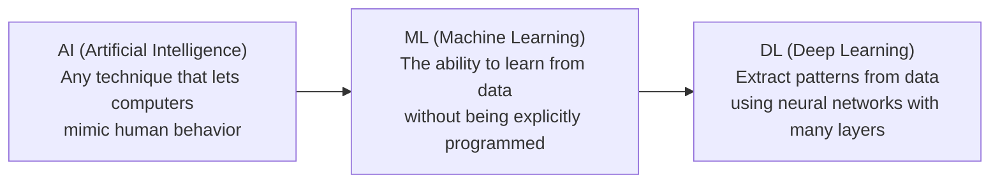

# Deep Learning — Why This Matters

---

## The Nurse, the Farmer, and the Machine That Learned to See

There is a clinic in rural Kenya where one nurse serves 4,000 people. She is brilliant, overworked, and has no access to a specialist — the nearest ophthalmologist is a 6-hour bus ride away. A patient comes in going blind from diabetic retinopathy, a condition that is treatable if caught early and irreversible if caught late. The nurse cannot diagnose it. She has never been trained to read retinal scans. There is no one to call.

In 2016, a team at Google trained a deep learning model on 128,000 retinal images. The model learned — on its own, from examples alone — to detect diabetic retinopathy with accuracy matching board-certified ophthalmologists. They deployed it on a phone. That nurse in Kenya can now photograph a patient's eye, send it through the model, and get a diagnosis in seconds. The patient gets treatment. They keep their sight.

In rural India, a farmer loses 30% of her crop every year to disease she cannot identify. She has no access to an agronomist — the nearest one serves a district of 200,000 people. She photographs a diseased leaf with her phone. A deep learning model trained on millions of plant images identifies the disease, recommends treatment, and estimates how many days she has before it spreads. She saves the crop. Her children eat this winter.

In a village school in Brazil, 40 students share one teacher. Some are ahead, some are behind, and the teacher cannot split into 40 people. A deep learning system watches how each student answers practice problems — not just right or wrong, but how long they hesitate, where they backtrack, what patterns of mistakes they make. It adapts the difficulty, the pacing, the explanations — individually, for each child. The student who was falling behind gets the equivalent of a private tutor. The student who was bored gets challenged. Both stay in school.

---

## What This Technology Delivers

These are not hypothetical scenarios. The retinal screening model is deployed in clinics across Thailand and India today. Plant disease detection runs on apps used by millions of farmers. Adaptive learning platforms serve students on every continent.

None of these systems were programmed with rules. Instead, the system was shown examples — thousands, sometimes millions, of labeled examples — and it **discovered the patterns on its own.** It wrote its own rules. And those rules turned out to be as good as — sometimes better than — what a human expert develops over 15 years of training.

That is deep learning. Not a smarter spreadsheet. Not a faster search engine. A fundamental expansion of what a system can deliver.

The ophthalmologist's diagnostic ability, compressed into a service that runs on a phone. The agronomist's pattern recognition, shipped as an API endpoint. The master teacher's adaptive intuition, deployed at scale.

Behind every one of these products, someone architected the system. Someone made it work in production — not just in a notebook, but under load, with real data, with monitoring and fallback and governance. Someone took a model that worked on a laptop and turned it into a system that serves a thousand clinics simultaneously.

The model is the core. But the system around it — the data pipeline, the serving infrastructure, the monitoring, the security, the governance — that is what makes it real. A model without a delivery system is a research paper. A model inside a well-architected system is a product that changes outcomes.

The building blocks in this material — neural network architectures, training loops, loss functions, diagnostics — are the same ones behind Google's retinal screening, Tesla's Autopilot, and every AI product in production today. The difference between a tutorial and a deployed system is never the model. It is the engineering around it.

---

## The Deeper Pattern

There is a pattern across these stories that matters more than the technology itself.

Every one of them solves the same problem: **expertise is scarce, and the people who need it most have the least access to it.** The best doctors practice in wealthy cities. The best teachers work at well-funded schools. The best agronomists consult for corporate farms. The people in the rural clinic, the village school, the smallholder farm — they get whatever is left over, or nothing.

Deep learning does not replace the expert. It extends the expert's reach. The ophthalmologist in Nairobi can now "see" patients in a thousand clinics simultaneously. The master teacher's approach to adaptive instruction can serve a million students. The agronomist's diagnostic skill can reach every farmer with a phone.

The question is not whether this technology is powerful — it clearly is. The question is whether the people building it care about who it reaches. That is what separates an interesting research paper from a system that changes someone's life.

You are about to learn the technical foundations. The factories of neurons, the loss functions, the training loops, the gradient descent — all of it matters, deeply. But hold onto this: every architecture you learn, every model you train, every debugging session you endure — it is in service of something larger than the model itself. You are learning to build tools that give people capability they did not have before.

That is worth learning well.

---

## What Deep Learning Actually Is

**DL (Deep Learning, pronounced "deep learning")** sits inside a nesting of fields. Knowing where it sits helps you reach for the right tool — and stop reaching for it when something simpler would do.

- **AI (Artificial Intelligence)** — the broadest term. Any technique that makes a computer appear to do something intelligent. Includes hand-coded rules, search algorithms, planning systems, expert systems, and more.
- **ML (Machine Learning)** — a subset of AI. Instead of writing rules, you show the system examples and it learns the rules itself. Includes linear regression, decision trees, random forests, gradient boosting, and neural networks.
- **DL (Deep Learning)** — a subset of ML. Uses **neural networks** with many layers stacked on each other. The "deep" refers to depth — many layers — not to philosophical profundity.

Instead of a human writing rules ("if the top of the digit is closed and the bottom is closed, it is an 8"), you show the system thousands of labeled examples and it discovers the rules itself. Raw pixels become edges. Edges become shapes. Shapes become objects. Objects become diagnoses, translations, decisions.

The framework you will use to build these networks is **PyTorch (pronounced "PIE-torch")** — an open-source deep learning library built by Meta, used by most researchers and companies in the field today.

---

## Why Hand-Engineered Features Failed

Before deep learning, every computer vision system worked the same way: a human expert designed **features** by hand, then a simpler model classified them.

To detect a face, an engineer would write code to find skin-colored pixels, look for two darker regions roughly where eyes should be, find a darker region between them for a nose, and a horizontal line below for a mouth. The engineer would tune dozens of thresholds, lighting compensations, and edge cases. It worked — sometimes. It broke when the lighting changed. It broke for faces with sunglasses. It broke for faces from a different angle. Every new condition required new code.

This is what hand-engineered features are: **time-consuming, brittle, and not scalable.**

Deep learning replaces hand-engineered features with **learned hierarchical features.** The network discovers, on its own, which low-level patterns matter, which mid-level patterns combine them, and which high-level patterns identify the answer.

| Feature Level | What the Network Sees | Example (Face Recognition) |
|---|---|---|
| **Low** (Layer 1-2) | Lines, edges, gradients, simple textures | Diagonal strokes, light-to-dark transitions |
| **Mid** (Layer 3-5) | Eyes, noses, ears, wheels, leaves — combinations of edges | An eye, a corner of a mouth, the curve of a nostril |
| **High** (Layer 6+) | Faces, cars, plants — combinations of parts | A specific face, recognizable in any lighting |

Nobody told the network "look for eyes first, then noses." It learned that hierarchy because that hierarchy is what minimizes the loss. The same architecture that learns faces from photos learns disease patterns from retinal scans, defects from manufacturing line images, and lesions from X-rays. **The architecture is general. The features are learned.**

That is the core insight. Everything in this material builds on it.

---

## How We Got Here — Decades in the Making

Deep learning is not new. The math behind it dates back 70+ years.

| Year | Milestone | What It Enabled |
|---|---|---|
| **1952** | **SGD (Stochastic Gradient Descent)** invented | The optimization algorithm that still powers training today |
| **1958** | **Perceptron** by Frank Rosenblatt | The first neural network with learnable weights — but only a single layer |
| **1986** | **Backpropagation** popularized by Rumelhart, Hinton, Williams | Made it possible to train networks with multiple layers — the **MLP (Multi-Layer Perceptron)** |
| **1995** | **Deep Convolutional Neural Networks** by Yann LeCun (LeNet) | Read handwritten checks for the US Postal Service. The first commercial deep learning system. |

If the math existed in the 1950s and the architecture existed in the 1980s, why did deep learning only become dominant after 2012?

---

## Why Now? — The Three Drivers

Three things changed between 1995 and 2012, and all three had to change together. Any one alone would not have been enough.

### 1. Big Data

Neural networks need millions of examples to learn well. Until the 2000s, that much labeled data simply did not exist.

- **2009 — ImageNet** released by Fei-Fei Li at Stanford: 14 million labeled images across 22,000 categories. The first dataset large enough for deep learning to outperform hand-engineered features.
- **The web** — by 2010, Wikipedia, Flickr, YouTube, and similar platforms had created accidental training corpuses larger than any dataset humans had ever deliberately assembled.

### 2. Hardware — GPUs

Training a deep network is millions of small matrix multiplications. **CPUs (Central Processing Units, "C-P-U")** are designed for sequential, varied work. **GPUs (Graphics Processing Units, "G-P-U")** are designed for thousands of identical operations in parallel — exactly what neural networks need.

- A 2012 GPU could train a deep network 50-100x faster than a 2012 CPU.
- A 2024 NVIDIA H100 GPU can train it ~1000x faster than that.
- Without this hardware, training GPT-4 would take centuries. With it, months.

### 3. Software — The Frameworks

Writing backpropagation by hand for every new architecture is impossibly tedious. Frameworks automated it.

- **2015 — TensorFlow** by Google
- **2016 — PyTorch** by Meta
- **JAX, Keras, Hugging Face Transformers** — the layers above

Today you can define a 100-layer network in 20 lines of Python. The framework handles forward pass, backward pass, gradient computation, GPU memory, and checkpointing automatically.

**All three drivers compound.** Big Data without GPUs trains too slowly. GPUs without frameworks are too painful to program. Frameworks without data have nothing to learn from. The 2012 ImageNet result by AlexNet — the moment deep learning became dominant — required all three.

---

## The Acceleration You're Living Through

The pace from 2015 onward was not gradual. It was a step-function.

| Year | Milestone | Why It Mattered |
|---|---|---|
| **2015** | First **GAN (Generative Adversarial Network)**-generated faces (Goodfellow et al.) | Recognizable as faces, but blurry and uncanny |
| **2018** | **StyleGAN** (Karras, Laine, Aila) | Photorealistic faces of people who do not exist |
| **2020** | Real-time deepfake video | A person's face mapped onto another's body, in motion |
| **2022** | **ChatGPT (GPT-3)** launches | Conversational language model crosses 100M users in 2 months — fastest consumer product adoption in history |
| **2023** | **GPT-4** — the "wow" moment | Passes the bar exam, reads images, writes working code |
| **2025** | **Liquid LFM2-2.6B beats GPT-4 on a phone** | A 2.6 billion parameter model running locally on a smartphone outperforms the original GPT-4 on instruction-following, formatting accuracy, and reasoning benchmarks |

The Liquid example matters because it inverts the prior assumption. From 2022-2024, the rule was "more parameters, more data, bigger data center." Now: smaller, smarter architectures running on consumer hardware can match or beat the giants. **Deep learning is moving from the data center to your pocket.**

This is the field you are entering. It is not stable. The specific architecture you learn today may be displaced in 18 months. The training methodology you learn this year may be obsolete next year. What stays stable: the foundations in this material — the perceptron, the loss function, the training loop, the diagnostics. Master those, and you can read any paper, ship any model, and adapt to whatever comes next.

---

## Where Deep Learning Fits in Production Systems

Deep learning is not a standalone product. It is a COMPONENT of larger systems.

In our **Production Diagnostic Intelligence System (CSI):**

| Component | What It Does | How DL Helps |
|---|---|---|
| ML Pipeline | Predicts which incidents escalate | Tabular ML (XGBoost) — usually not DL |
| **Deep Learning** | **Detects anomalies in metrics, classifies log patterns, embeds error signatures** | **This is where DL lives** |
| RAG | Searches runbooks and past incidents | DL underneath — embeddings come from a transformer |
| AI Agent | Orchestrates all components | DL underneath — the agent IS a transformer |

When an alert fires at 2 AM, the DL component flags the unusual pattern in the metrics. The RAG component finds the runbook section. The agent assembles the diagnostic. Every layer of the system has a deep learning model somewhere inside it.

See the full architecture: [CSI Architecture](../../../systems/continuous-system-intelligence/architecture.md)

---

## What You Will Learn in This Material

### Foundations (This Playbook)

| Chapter | What You Learn |
|---|---|
| [01 — Why](01_Why.md) | This page. Why DL matters, where it came from, where it is going. |
| [02 — Concepts](02_Concepts.md) | Perceptrons, layers, training loop, activations, loss functions. The math, in plain English. |
| [03 — Hello World](03_Hello_World.md) | Build a working classifier in 30 lines of PyTorch. |
| [04 — How It Works](04_How_It_Works.md) | Loss curves, overfitting, learning rate, the debugging checklist. |
| [05 — Building It](05_Building_It.md) | Architecture choices, optimizer choices, regularization. Every tradeoff. |
| [06 — Production Patterns](06_Production_Patterns.md) | How Tesla Autopilot, Google retinal screening, Stripe fraud detection use DL in production. |
| [07 — System Design](07_System_Design.md) | Serving (Triton, TorchServe, ONNX), batching, GPU economics, multi-tenant. |
| [08 — Quality, Security, Governance](08_Quality_Security_Governance.md) | Adversarial inputs, model cards, drift, regulatory compliance. |
| [09 — Observability & Troubleshooting](09_Observability_Troubleshooting.md) | Measuring model quality in production. What to alert on. |
| [10 — Decision Guide](10_Decision_Guide.md) | "Should I use DL?" decision table. Production readiness checklist. |

### Sibling Domain Playbooks

When the foundations are solid, dive into the domain that fits your data. Each is a full playbook (sibling of this one), not a single doc:

| Domain | Architectures Covered | Playbook |
|---|---|---|
| **Computer Vision** | CNN (LeNet, AlexNet, VGG, ResNet, EfficientNet), Vision Transformers, detection, segmentation | [computer-vision/](../computer-vision/) |
| **Transformers** | Attention, multi-head, encoder/decoder, GPT/BERT, KV-cache, fine-tuning, LLM serving | [transformers/](../transformers/) |
| **Generative Models** | GAN (StyleGAN, CycleGAN), Diffusion (DDPM, Stable Diffusion), VAE | [generative/](../generative/) |
| **Sequence Models** | RNN, LSTM, GRU (mostly legacy — prefer Transformers for new work) | [sequence-models/](../sequence-models/) |

**Foundations stay here.** Backpropagation, the training loop, loss curves, debugging — those are universal and live in this playbook. Architecture-specific mechanics (convolution, attention, adversarial training, latent spaces) live in the sibling playbooks above.

**Hands-on notebooks:**
- [Deep Learning From Scratch on Colab](https://colab.research.google.com/github/sunilmogadati/systems-in-production/blob/main/implementation/notebooks/Deep_Learning_From_Scratch.ipynb) — pure NumPy. Trains the network from Chapter 02 by hand, every gradient computed explicitly, then verifies against PyTorch autograd. **Start here.**
- [Deep Learning with PyTorch on Colab](https://colab.research.google.com/github/sunilmogadati/systems-in-production/blob/main/implementation/notebooks/Deep_Learning_PyTorch.ipynb) — same ideas in PyTorch with a full MLP and CNN, training loop, diagnostics, and evaluation.

---

**Next:** [02 — Concepts and Mental Models](02_Concepts.md) — The analogies and mental models that make the math intuitive before you touch any code.
