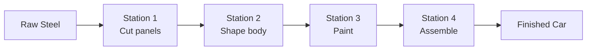
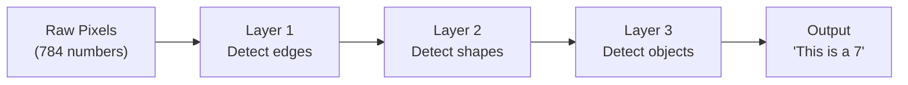
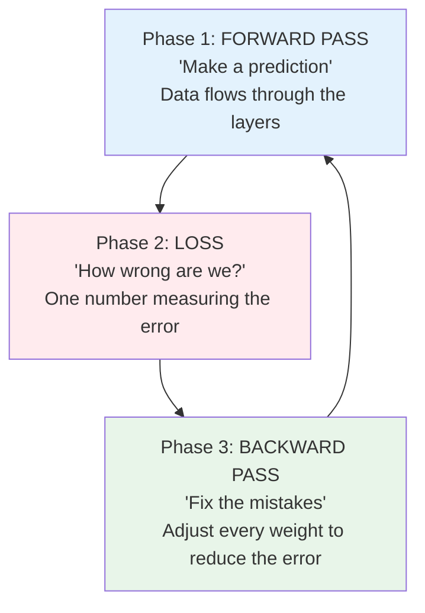
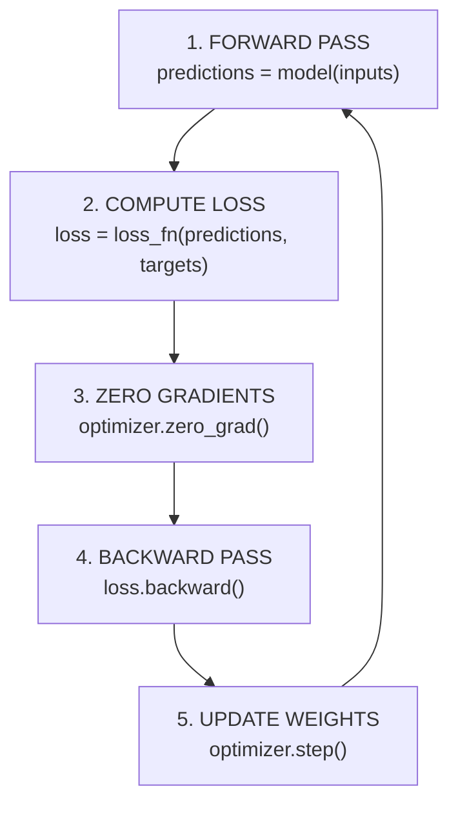
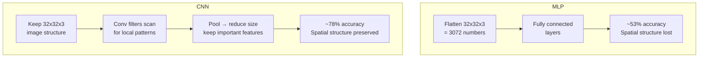

# Deep Learning — Concepts and Mental Models

**The mental models you build here will carry you through every topic that follows.**

---

> **Glossary note:** Every term, abbreviation, and math symbol used in this chapter is explained in context the first time it appears. A full reference glossary is at the end of this chapter — skip to it anytime you need a quick lookup.

---

## The Big Picture — What Is a Neural Network?

A neural network is a machine that transforms input into output through a series of **layers**, each layer making the data a little more useful than the layer before.

### The Factory Assembly Line

Imagine a factory that turns **raw steel** into a **finished car.** The steel does not become a car in one step. It passes through stations:



A neural network is the same idea. Data flows through layers, each layer transforming it:



| Factory | Neural Network |
|:---|:---|
| Raw steel | Input data (pixels, text, audio) |
| Each station | A **layer** — transforms the data using learned math |
| Workers at a station | **Neurons** — each does a small calculation (multiply inputs by weights, add bias, apply activation) |
| The recipe each worker follows | **Weights (w) and biases (b)** — numbers that control the transformation. The model learns these during training. |
| Quality control at the end | **Loss function (L)** — measures how far the output is from the correct answer |
| Feedback sent upstream: "Station 2, your cuts are off" | **Backpropagation** — sends correction signals backward through every layer |
| Running the factory for many shifts | **Epochs** — repeating the entire training dataset many times |
| The manager deciding how much correction to apply | **Learning rate (η, "AY-tuh")** — controls how much each weight adjusts |

Nobody told Layer 1 to detect edges. Nobody told Layer 3 to detect eyes or ears or wheels. The network **discovered** these features on its own by adjusting weights to minimize the loss. That is the fundamental insight of deep learning: **you define what "wrong" means (the loss function), and the network figures out everything else.**

### Why "Deep"?

A **shallow** network has 1-2 layers. It learns simple patterns — straight lines, basic thresholds.

A **deep** network has many layers (5, 10, 100, even 1000+). Each layer builds on what the previous layer learned. Layer 1 sees pixels. Layer 2 sees edges. Layer 10 sees faces. Layer 50 recognizes your grandmother from any angle, in any lighting, wearing a hat she has never worn before.

**DL (Deep Learning)** means: ML (Machine Learning) using neural networks with many layers.

---

## How the Network Learns — Three Phases, Thousands of Times

Training a neural network means repeating three phases on every batch of data, for many epochs. A batch might be 64 images. An epoch is one pass through all 60,000 training images. You might train for 10-50 epochs. That is tens of thousands of repetitions of these three phases:



### Phase 1: Forward Pass — "Make a prediction"

Data enters the first layer. Each neuron multiplies its inputs by its weights, adds its bias, and applies an activation function. The result flows to the next layer. And the next. And the next. At the end, the final layer produces a prediction — for example, 10 scores, one per digit class.

```
Image (784 pixels) → Layer 1 (128 neurons) → ReLU → Layer 2 (64 neurons) → ReLU → Output (10 scores)
```

The highest score is the model's guess. But is it right?

### Phase 2: Loss — "How wrong are we?"

The **loss function** compares the prediction to the correct answer and produces a single number.

- Model says: "I am 89% sure this is a 3" — true label is 3 — loss is **low** (small error, model was right)
- Model says: "I am 92% sure this is a 7" — true label is 3 — loss is **high** (model was confident AND wrong — the worst case)

The loss function does not just measure "right or wrong." It measures **how confidently wrong** the model is. Being wrong with high confidence produces a much larger loss than being wrong with low confidence. This matters because the loss is what drives the corrections in Phase 3 — a bigger loss means bigger corrections.

### Phase 3: Backward Pass — "Fix the mistakes"

This is where learning happens.

**Backpropagation** (pronounced "back-prop-uh-GAY-shun," short for "backward propagation of errors") traces backward through the network and computes a **gradient** for every weight: how much did THIS specific weight contribute to the error?

Think of it like a restaurant review. The customer says "the meal was terrible." The manager traces back: was it the waiter's service? The chef's cooking? The ingredients from the supplier? Backpropagation does this for every weight simultaneously — in our simple MNIST model, that is 110,000 weights getting individual feedback in one step.

Then the **optimizer** — usually **Adam (Adaptive Moment Estimation, pronounced like the name)** — adjusts each weight by a small amount in the direction that reduces the loss. How small? That is the **learning rate (η, "AY-tuh"):**

- **η too high:** Corrections are too large. The model overshoots. Loss bounces around or explodes. Like a driver who oversteers — swerving left, then right, then off the road.
- **η too low:** Corrections are tiny. Training takes forever. The model barely improves. Like walking to New York one millimeter at a time — technically correct direction, practically useless.
- **η just right:** Steady improvement. Loss decreases smoothly. Typical starting value for Adam: 0.001.

---

## The Building Blocks — What Each Piece Does

### Neurons — The Workers

A single neuron does one thing: take inputs, multiply each by a weight, add them up, add a bias, and apply an activation function.

```
output = activation(w₁·x₁ + w₂·x₂ + w₃·x₃ + ... + b)
```

In plain English: "Take the inputs, weight them by importance, shift the result, then decide whether to fire."

This is the same as logistic regression from the ML Fundamentals notebook — a single neuron IS logistic regression. A neural network is thousands of these, organized into layers, each feeding into the next.

### Layers — The Stations

| Layer Type | What It Does | Analogy | When to Use |
|:---|:---|:---|:---|
| **Linear** (also called "Dense" or "Fully Connected") | Every input connects to every output. Matrix multiplication. | A meeting where everyone talks to everyone — thorough but expensive. | The default. Start here. |
| **Convolutional** (Conv2d) | A small filter slides across the image, detecting local patterns. | Reading a page with a magnifying glass — you scan small neighborhoods at a time, looking for patterns. The same magnifying glass works everywhere on the page. | Images. The filter detects the same pattern (edge, corner, texture) regardless of where it appears. |
| **Pooling** (MaxPool, AvgPool) | Shrinks the data by taking the maximum or average in each small region. | Looking at a photo from farther away — you lose fine detail but see the overall structure more clearly. | After convolutional layers. Reduces computation and makes the model care less about exact pixel positions. |
| **Dropout** | Randomly turns off a percentage of neurons during training. | Studying by covering random parts of your notes — forces you to understand the whole picture, not memorize one path. | Between layers, to prevent overfitting (memorizing training data). |
| **BatchNorm** (Batch Normalization) | Normalizes the output of each layer to mean=0, standard deviation=1. | Recalibrating instruments between factory stations — keeps every station working in a consistent range. | After convolutional or linear layers. Speeds up training and stabilizes it. |

### Activation Functions — The Non-Linearity

Without activation functions, a 100-layer network collapses into a single linear equation. It would be no more powerful than the linear regression from the ML Fundamentals notebook — no matter how many layers you add.

Activation functions add **bends** to the line. They let the network learn curves, corners, and complex patterns.

| Function | What It Does | Analogy | When to Use |
|:---|:---|:---|:---|
| **ReLU** ("REE-loo") | If positive, keep it. If negative, zero. | A door that only opens outward — stuff flows through if you push, nothing if you pull. | Hidden layers. The default. Start here. |
| **Sigmoid** ("SIG-moyd") | Squashes any number into 0 to 1. | A dimmer switch — smoothly goes from "off" (0) to "fully on" (1). You saw this in the logistic regression notebook. | Output layer for binary yes/no problems. |
| **Tanh** ("tanch") | Squashes into -1 to +1. Centered at zero. | A dimmer that goes from "full reverse" (-1) through "off" (0) to "full forward" (+1). | Hidden layers when you need negative outputs. |
| **Softmax** ("SOFT-max") | Converts raw scores into probabilities that sum to 1. | A pie chart — divides 100% among the options. The biggest slice is the model's answer. | Output layer for multi-class (MNIST digits, CIFAR-10 objects). |
| **GELU** ("GEE-loo") | Smooth approximation of ReLU. The negative side curves gently instead of hard zero. | Like ReLU but with rounded edges instead of a sharp corner. | Transformer architectures (GPT, BERT, Claude). You will see this in the Transformer notebook. |

**Why ReLU dominates:** It is computationally cheap (just a comparison: is x > 0?). It does not suffer from the **vanishing gradient problem** — sigmoid and tanh compress extreme values into tiny gradients (∂, "partial") that shrink to near-zero in deep networks, effectively stopping learning. ReLU's gradient is either 0 or 1. Clean, fast, works.

**ReLU's weakness — dying neurons:** If a neuron's input is always negative, ReLU always outputs zero. The gradient is also zero, so the weight never updates. The neuron is permanently "dead." Fix: **Leaky ReLU** — instead of zero for negatives, output a tiny value (0.01 times the input). The neuron can recover.

### Loss Functions — The Quality Inspector

| Problem Type | Loss Function | Pronounced | When to Use | Plain English |
|:---|:---|:---|:---|:---|
| **Multi-class** (which of 10 digits?) | Cross-Entropy Loss | "cross EN-truh-pee" | MNIST, CIFAR-10, ImageNet | "How surprised am I?" High loss = confident AND wrong. |
| **Binary** (yes or no?) | Binary Cross-Entropy | "BYE-nuh-ree cross EN-truh-pee" | Spam detection, fraud, medical diagnosis | Same idea, two classes. |
| **Regression** (predict a number) | MSE (Mean Squared Error) | "M-S-E" | House price, temperature, revenue | "How far off am I?" Squared error punishes big mistakes. |

**Match loss to problem.** Using MSE for classification will technically run but train poorly — the gradients point in unhelpful directions. Using cross-entropy for regression will not work at all.

### Optimizers — The Weight Adjusters

| Optimizer | Pronounced | What It Does | Analogy |
|:---|:---|:---|:---|
| **SGD** | "S-G-D" | Steps proportional to the gradient. Simple. | Walking downhill blindfolded — feel the slope, take one step. |
| **SGD + Momentum** | "S-G-D with momentum" | Remembers the direction from previous steps. Builds speed. | A ball rolling downhill — accelerates on consistent slopes, slows on turns. |
| **Adam** | "Adam" (like the name) | Adapts the learning rate per-weight. Combines momentum with per-parameter scaling. | A smart ball that adjusts its size per dimension — rolls faster on flat terrain, slower on bumpy terrain. |
| **AdamW** | "Adam-W" | Adam with proper weight decay (regularization). | Adam, but gently asks weights to stay small. | Used in fine-tuning (the Fine-Tuning notebook). |

**Start with Adam, learning rate 0.001.** This works for the vast majority of problems. You can tune later.

---

## The Training Loop — Five Steps You Will Use for Everything

Whether you are training a 3-layer digit classifier or a billion-parameter language model, the loop is the same:



```python
for epoch in range(num_epochs):           # Repeat the full dataset multiple times
    for inputs, targets in train_loader:   # Process one batch at a time
        predictions = model(inputs)        # 1. Forward pass
        loss = loss_fn(predictions, targets)  # 2. Compute loss
        optimizer.zero_grad()              # 3. Clear old gradients
        loss.backward()                    # 4. Compute new gradients
        optimizer.step()                   # 5. Update weights
```

**Why this exact order:**

| Step | Why Here |
|:---|:---|
| 1. Forward pass | Need predictions before measuring error |
| 2. Compute loss | Need the error before computing gradients |
| 3. Zero gradients | PyTorch accumulates gradients by default. Without zeroing, old gradients from the previous batch pile up. Almost always a bug. |
| 4. Backward pass | Computes gradients for every weight. Must happen after loss, before update. |
| 5. Update weights | Uses fresh gradients to adjust every weight |

> **The most common PyTorch bug:** Forgetting `optimizer.zero_grad()`. The model will train, but poorly — gradients accumulate across batches and updates become chaotic. If your loss is noisy or stuck, check this first.

This loop is the heartbeat of deep learning. You will write it in the notebook. You will write it again for the Transformer notebook. And again for the Fine-Tuning notebook. The architecture changes. The data changes. The loop does not.

---

## The Math, Step by Step — A Worked Example

Up to now, analogies and tables. Now we work the actual math, with **real numbers**, on a network small enough to compute by hand. Two training steps. Every gradient calculated explicitly. **If you can follow the numbers in this section, you understand deep learning.** Everything else is more layers, more parameters, more clever architectures.

> **New to partial derivatives, the chain rule, or gradient descent?** Skim the relevant sections of [Math for AI](../math-for-ai.md) first (5–10 min) — that document covers the abstract framing once, so every playbook can reference it instead of re-explaining. Then come back here and watch the math turn into real numbers.

> **Hands-on companion.** This walkthrough has a runnable notebook: [Deep Learning From Scratch on Colab](https://colab.research.google.com/github/sunilmogadati/systems-in-production/blob/main/implementation/notebooks/Deep_Learning_From_Scratch.ipynb) — pure NumPy, every gradient computed by hand, every number you see here verified in code.

### The Tiny House Price Dataset

Predict house prices from square footage. Three houses:

| House | Sqft | Price | x = sqft/1000 | y = price/100000 |
|---|---:|---:|---:|---:|
| A | 1,000 | $200,000 | 1.0 | 2.0 |
| B | 2,000 | $350,000 | 2.0 | 3.5 |
| C | 3,000 | $450,000 | 3.0 | 4.5 |

### Step 1: Scale the Inputs

Real-world numbers (1,500 sqft, $350,000) live on different scales. Feed those raw into a network and the gradients explode, the loss goes to NaN (Not a Number), training fails on batch one.

```
x = sqft / 1000
y = price / 100000
```

After scaling, both `x` and `y` live near 1 — a comfortable range for the network. **Without scaling, no architecture saves you.** This is the most common reason "my training won't start" in beginner code.

> **Scaling vs Standardization.** Scaling: divide by a constant (`x / 1000`). Standardization: subtract the mean, divide by the standard deviation (`(x − μ) / σ`). Both keep gradients well-behaved. Scaling is simpler when you know the natural range of the data; standardization is the default when you do not.

### Step 2: The Network — Two Hidden Neurons

Slightly bigger than the smallest possible: **2 hidden neurons** instead of 1. Why? Two neurons can already learn non-linear interactions, which makes the example feel like a real network.

```
Input x
   ↓
Hidden Layer (2 neurons with ReLU)
   ↓
Output Layer (1 neuron, no activation — regression)
   ↓
y_pred
```

The math:

```
Hidden neuron 1:    z₁ = w₁·x + b₁          h₁ = ReLU(z₁)
Hidden neuron 2:    z₂ = w₂·x + b₂          h₂ = ReLU(z₂)
Output:             y_pred = v₁·h₁ + v₂·h₂ + c
Loss:               L = 0.5·(y_pred − y)²
```

Seven learnable parameters: `w₁, b₁, w₂, b₂, v₁, v₂, c`. Training will adjust all seven. (The 0.5 in the loss is a convenience — it cancels cleanly in the derivative.)

### Step 3: Initial Values

Pick starting values. In real training, these are random small numbers. For a clean walkthrough we pick simple ones:

```
w₁ = 0.5     b₁ = 0.1
w₂ = -0.4    b₂ = 1.0
v₁ = 0.3     v₂ = 0.2
c  = 0.5
α  = 0.1     # learning rate
```

### Step 4: Cycle 1 — Train on House A (x=1.0, y=2.0)

**Forward pass.** Compute the prediction.

```
z₁ = 0.5·1.0 + 0.1 = 0.6           h₁ = ReLU(0.6) = 0.6
z₂ = -0.4·1.0 + 1.0 = 0.6          h₂ = ReLU(0.6) = 0.6
y_pred = 0.3·0.6 + 0.2·0.6 + 0.5 = 0.18 + 0.12 + 0.5 = 0.8
```

The model says **$80,000** (0.8 × 100,000). Actual is **$200,000**. Off by $120,000.

**Loss:**

```
L = 0.5·(0.8 − 2.0)² = 0.5·1.44 = 0.72
```

**Backward pass.** The seed of every gradient is `∂L/∂y_pred`. Since `L = 0.5·(y_pred − y)²`:

```
∂L/∂y_pred = y_pred − y = 0.8 − 2.0 = -1.2
```

This is the **error signal**. It is negative because `y_pred` was too low — increasing `y_pred` would decrease loss. Every gradient downstream uses this number.

**Output layer gradients** (easy — `y_pred` is a direct linear combination):

```
∂L/∂v₁ = (∂L/∂y_pred) · h₁ = -1.2 · 0.6 = -0.72
∂L/∂v₂ = (∂L/∂y_pred) · h₂ = -1.2 · 0.6 = -0.72
∂L/∂c  = -1.2
```

**Hidden layer gradients** (chain rule walks through the layer). For `w₁`, the dependency chain is:

```
w₁  →  z₁  →  h₁  →  y_pred  →  L
```

```
∂L/∂w₁ = (∂L/∂y_pred) · (∂y_pred/∂h₁) · (∂h₁/∂z₁) · (∂z₁/∂w₁)
       =  -1.2          ·  v₁ = 0.3    ·  ReLU′ = 1   ·  x = 1.0
       = -0.36
```

The plain-English version of that chain:

> ∂L/∂w₁ = (how wrong we are) × (how much this neuron matters to the output) × (whether the neuron is firing) × (how much input affects the neuron)

Same chain for the other hidden parameters:

```
∂L/∂b₁ = -1.2 · 0.3 · 1 · 1   = -0.36
∂L/∂w₂ = -1.2 · 0.2 · 1 · 1.0 = -0.24
∂L/∂b₂ = -1.2 · 0.2 · 1 · 1   = -0.24
```

**Update every weight:** `new = old − α · gradient`

```
w₁ = 0.5  − 0.1·(-0.36) = 0.536      v₁ = 0.3  − 0.1·(-0.72) = 0.372
b₁ = 0.1  − 0.1·(-0.36) = 0.136      v₂ = 0.2  − 0.1·(-0.72) = 0.272
w₂ = -0.4 − 0.1·(-0.24) = -0.376     c  = 0.5  − 0.1·(-1.2)  = 0.62
b₂ = 1.0  − 0.1·(-0.24) = 1.024
```

That is one training step on one example. The weights have moved slightly in the direction that reduces loss for House A.

> **Partial derivatives (∂) vs derivatives (d).** When the loss depends on only one variable, use `d` (regular derivative). When the loss depends on many variables and you only nudge one, use `∂` (partial). Neural networks always have many variables, so they always use `∂`. Same operation, different notation to remind you that other variables exist and are being held fixed.

### Step 5: Cycle 2 — Train on House B (x=2.0, y=3.5)

Same pattern, with the updated weights from Cycle 1.

```
z₁ = 0.536·2.0 + 0.136 = 1.208        h₁ = 1.208
z₂ = -0.376·2.0 + 1.024 = 0.272       h₂ = 0.272
y_pred = 0.372·1.208 + 0.272·0.272 + 0.62 ≈ 1.143
```

Prediction: **$114,300**. Actual: **$350,000**. Loss ≈ 2.78. Bigger than Cycle 1 — but that is normal early in training; House B is a harder example with the current weights. The optimizer still computes gradients and steps.

After Cycle 2, the weights are:

```
w₁ ≈ 0.711   b₁ ≈ 0.224   w₂ ≈ -0.248   b₂ ≈ 1.088
v₁ ≈ 0.657   v₂ ≈ 0.336   c  ≈ 0.856
```

### Step 6: Make a Prediction with the Trained Model

After only two training steps, predict for a 2,500 sqft house (`x = 2.5`):

```
z₁ = 0.711·2.5 + 0.224 ≈ 2.002        h₁ ≈ 2.002
z₂ = -0.248·2.5 + 1.088 ≈ 0.469       h₂ ≈ 0.469
y_pred = 0.657·2.002 + 0.336·0.469 + 0.856 ≈ 2.328

price ≈ 2.328 · 100,000 = $232,800
```

The prediction is poor — only two training steps. A real model trains for **thousands of steps over many epochs**, seeing each house dozens or hundreds of times. The mechanics never change. Just more iterations of the same five things: forward, loss, backward, update, repeat.

### The Forward and Backward Pass — One Picture

```mermaid
graph TD
    X[Input x]

    X --> Z1[z₁ = w₁·x + b₁]
    X --> Z2[z₂ = w₂·x + b₂]

    Z1 --> H1[h₁ = ReLU&#40;z₁&#41;]
    Z2 --> H2[h₂ = ReLU&#40;z₂&#41;]

    H1 --> Y[y_pred = v₁·h₁ + v₂·h₂ + c]
    H2 --> Y

    Y --> L[L = 0.5·&#40;y_pred − y&#41;²]

    L -.->|∂L/∂y_pred| Y
    Y -.->|chain via v, ReLU′, x| H1
    Y -.->|chain via v, ReLU′, x| H2
    H1 -.-> U1[Update w₁, b₁]
    H2 -.-> U2[Update w₂, b₂]
    Y -.-> UO[Update v₁, v₂, c]

    style X fill:#E3F2FD
    style L fill:#FFEBEE
    style U1 fill:#E8F5E9
    style U2 fill:#E8F5E9
    style UO fill:#E8F5E9
```



Solid arrows: forward pass (compute the prediction). Dashed arrows: backward pass (compute the gradient for every weight). The forward arrows define the prediction; the backward arrows define the learning. **This is backpropagation in one picture.**

### Why This Generalizes

In a 100-layer network, the chain stretches through 100 stages. The math does not change. Each layer contributes one term to the chain. PyTorch's `autograd` engine builds this graph automatically when you write `loss.backward()` — it traces the chain backward through every operation in the forward pass and computes every `∂L/∂w` for free.

When you understand the chain rule, the line `loss.backward()` stops being magic.

---

## What Adds Up When You Add a Layer

A common confusion: what does adding a *second hidden layer* actually buy you?

**Layer 1** creates basic signals from the input — coarse "atomic" features the model discovers from the data.

> Examples it might learn for house pricing: *large house*, *above 2000 sqft*, *premium location*, *old house*.

**Layer 2** combines those signals into compound concepts.

> *large + premium location*, *large + old house*, *small + good school district*.

**Layer 3** combines compounds into concepts that map directly to outcomes.

> *family-sized in a top school district* → strong positive price signal.

A useful mental model:

| Layer | Equivalent To |
|---|---|
| Layer 1 | Letters |
| Layer 2 | Words |
| Layer 3 | Meaning |

Nobody told the network "these are letters" or "these are words." It learned that hierarchy because that hierarchy minimized the loss. **The architecture provides depth. The data and the task decide what each layer represents.**

> **Why activation matters — a corollary.** Without activation functions between layers, `linear + linear + linear = linear`. Stack 100 linear layers and you still have one linear equation. The activation (ReLU, sigmoid, GELU) is what lets each layer be more than a re-weighting of the previous one. **No activation = no depth, no matter how many layers.**

---

## Features vs Layers — A Crisp Distinction

A common confusion: **adding more features** vs **adding more layers**. They do different things.

| | Adds | Why It Helps |
|---|---|---|
| **More features (more inputs)** | More information about each example | Lets the network see something it could not see before. If the model has no income data, no architecture can compensate. |
| **More layers (deeper network)** | More interactions between features | Lets the network combine features in more nuanced ways. With one layer: "income matters." With many layers: "income matters, but only when combined with credit history, in this region, for buyers under 35." |

**Features = information. Layers = interactions.** If the model is missing information, more layers will not help. If the model has the information but cannot capture the interactions, more layers will help.

### Layers vs Epochs — Another Crisp Distinction

Easy to confuse, very different:

- **More layers** → more *expressive* model. Can represent more complex functions. Risk: overfitting.
- **More epochs** → more *training time* on the same model. Same expressiveness, more thorough learning. Risk: also overfitting (eventually the model memorizes).

Add layers when the model is too simple to capture the pattern (underfitting). Add epochs when the model has the right capacity but has not yet learned the pattern (loss is still decreasing).

---

## When Do You Need Deep Learning? (And When Do You Not?)

Not every problem needs a neural network. Reaching for deep learning when simpler tools suffice wastes time, money, and explainability.

| Your Data Looks Like | Use | Why |
|:---|:---|:---|
| A spreadsheet (rows and columns) | scikit-learn (Random Forest, XGBoost) | DL rarely beats tree-based models on tabular data. Simpler, faster, cheaper, more explainable. |
| Images (photos, X-rays, satellite) | Deep learning (CNN) | Spatial patterns (edges, textures, shapes) that tabular models cannot see. |
| Text (sentences, documents, code) | Deep learning (Transformer) | Language has context, word order, ambiguity. Transformers handle this. |
| Audio (speech, music, sounds) | Deep learning | Sound is sequential and layered — similar to text but in the frequency domain. |
| Already solved by GPT / Claude / Whisper | Use the pre-trained model via API | Do not train from scratch. Stand on shoulders. |
| Small dataset (fewer than 1,000 examples) | Try simpler ML first | DL with too little data overfits immediately. Consider transfer learning (the Fine-Tuning notebook) if you must use DL. |
| You need to explain every prediction to a regulator | Consider simpler models | DL explanations exist (Grad-CAM, SHAP) but are approximate. A decision tree is transparent. |

> **The rule:** Use the simplest model that solves the problem. Deep learning is the right tool for unstructured data at scale. It is the wrong tool for a spreadsheet with 20 columns and a clear business rule.

---

## MLP vs CNN — Why Architecture Matters

You will build both in the notebook. Here is why both exist.

An **MLP (Multi-Layer Perceptron, "M-L-P")** flattens an image into a single list of pixel values — 28x28 = 784 numbers — and feeds them through fully connected layers. Every pixel connects to every neuron. The model has no concept of "left of," "above," or "next to." It treats pixel (0,0) and pixel (27,27) as equally unrelated.

For MNIST (handwritten digits, 28x28 grayscale), this works decently — ~97% accuracy. The digits are centered, simple, and the spatial structure matters less.

For CIFAR-10 (real photos, 32x32 color), the MLP struggles — ~53% accuracy. Real images depend on spatial relationships: the wheel is below the car body, the eye is above the nose. Flattening destroys this.

A **CNN (Convolutional Neural Network, "C-N-N")** preserves spatial structure. Instead of connecting every pixel to every neuron, it slides a small filter (3x3 or 5x5) across the image, looking for local patterns. The same filter detects the same pattern everywhere — an edge detector in the top-left also detects edges in the bottom-right.



| | MLP | CNN |
|:---|:---|:---|
| Input | Flattened vector (784 or 3072 numbers) | Original image shape (28x28x1 or 32x32x3) |
| Spatial awareness | None — pixel (0,0) is unrelated to pixel (0,1) | Yes — filters scan neighborhoods |
| Parameter efficiency | High (every pixel × every neuron) | Lower — filters are shared across positions |
| Best for | Tabular data, small structured inputs | Images, spatial data, anything with local patterns |

> **The principle:** Match the architecture to the structure of your data. Images have spatial structure → CNN. Sequences have temporal structure → RNN or Transformer (the Transformer notebook). Tabular data has no inherent structure → MLP or skip DL entirely.

---

## The Architecture Family — Choose Your Tool

MLP and CNN are two members of a larger family. Each architecture is designed for a different shape of data. Master the foundations in this chapter, then go deep on the domain playbook that fits your problem.

| Architecture | Designed For | Key Idea | Real-World Example | Domain Playbook |
|---|---|---|---|---|
| **MLP (Multi-Layer Perceptron)** | Tabular, structured data | Fully connected layers — every input connects to every output | Credit scoring, churn prediction | Covered in this chapter |
| **CNN (Convolutional Neural Network)** | Images, spatial data | Filters scan local neighborhoods; the same filter works everywhere | Tesla Autopilot, Google retinal screening, medical imaging | [computer-vision/](../computer-vision/) |
| **Vision Transformer (ViT)** | Images, large-data vision | Treats image patches as tokens; self-attention across patches | Modern image classification at scale | [computer-vision/](../computer-vision/) |
| **RNN / LSTM** | Sequences (mostly legacy) | Hidden state carries information across time steps | Time-series forecasting, legacy speech recognition | [sequence-models/](../sequence-models/) |
| **Transformer** | Text, sequences, modern foundation models | Self-attention — every position can attend to every other position | ChatGPT, Claude, GitHub Copilot, every modern LLM | [transformers/](../transformers/) |
| **GAN (Generative Adversarial Network)** | Generation via adversarial training | Two networks compete: generator vs discriminator | StyleGAN faces, deepfake video, synthetic data | [generative/](../generative/) |
| **U-Net** | Image segmentation, diffusion backbone | Encoder-decoder with skip connections | Medical image segmentation, the U-Net inside every diffusion model | [computer-vision/](../computer-vision/) (segmentation) and [generative/](../generative/) (diffusion) |
| **Autoencoder / VAE** | Compression, generative latent spaces | Encoder compresses to a small latent, decoder reconstructs | Anomaly detection, image compression, VAE inside diffusion | [generative/](../generative/) |
| **Diffusion** | High-quality image and video generation | Iteratively denoise pure noise into a sample | Stable Diffusion, Midjourney, OpenAI Sora | [generative/](../generative/) |

> **The choice rule:** Match the architecture to the structure of the data. Spatial → CNN or ViT (see [computer-vision/](../computer-vision/)). Sequential, modern → Transformer (see [transformers/](../transformers/)). Generation → GAN, VAE, or Diffusion (see [generative/](../generative/)) depending on the use case. When in doubt, prototype with the simplest one first (MLP for tabular, ResNet for images, GPT-style decoder for text), then specialize.

---

## Glossary — Quick Reference

Every term below was explained in context above. This table is for quick lookup.

### Terms and Abbreviations

| Term | Full Form | Pronounced | What It Means |
|:---|:---|:---|:---|
| **DL** | Deep Learning | "deep learning" | Machine learning using neural networks with many layers |
| **NN** | Neural Network | "neural net" | A model made of layers of connected "neurons" that transform input into output |
| **MLP** | Multi-Layer Perceptron | "M-L-P" | The simplest neural network — fully connected layers stacked on top of each other |
| **CNN** | Convolutional Neural Network | "C-N-N" or "con-net" | A neural network designed for images — scans for patterns like edges, shapes, textures |
| **ReLU** | Rectified Linear Unit | "REE-loo" | Activation function: if positive, keep it; if negative, zero |
| **SGD** | Stochastic Gradient Descent | "S-G-D" | Optimizer that updates weights using one random batch at a time |
| **Adam** | Adaptive Moment Estimation | "Adam" (like the name) | The most popular optimizer — adapts the learning rate per-weight |
| **GPU** | Graphics Processing Unit | "G-P-U" | Hardware that runs thousands of calculations in parallel |
| **CPU** | Central Processing Unit | "C-P-U" | Your computer's main processor — general purpose but slower for matrix math |
| **MNIST** | Modified National Institute of Standards and Technology | "em-nist" | 70,000 handwritten digit images (0-9). The "Hello World" dataset. |
| **CIFAR-10** | Canadian Institute for Advanced Research (10 classes) | "SEE-far ten" | 60,000 color photos of 10 everyday objects. Real-world messiness. |
| **GAN** | Generative Adversarial Network | "gan" (rhymes with "pan") | Two networks competing: one generates fakes, one detects fakes |
| **VAE** | Variational Autoencoder | "V-A-E" | Compresses data, then generates new data from the compressed representation |
| **GELU** | Gaussian Error Linear Unit | "GEE-loo" | Smoother ReLU variant used in Transformers (GPT, BERT, Claude) |
| **MSE** | Mean Squared Error | "M-S-E" | Loss function: average of squared differences between prediction and reality |
| **PyTorch** | — | "PIE-torch" | Open-source deep learning framework built by Meta |
| **epoch** | — | "EP-ock" | One complete pass through the entire training dataset |
| **batch** | — | "batch" | A subset of training data processed together (e.g., 64 images at once) |
| **backpropagation** | Backward propagation of errors | "back-prop-uh-GAY-shun" | The algorithm that computes how much each weight contributed to the error |
| **gradient** | — | "GRAY-dee-unt" | The direction and magnitude of the steepest change — tells the optimizer which way to adjust |
| **logit** | — | "LOH-jit" | Raw output score from a neural network before converting to probability |
| **inference** | — | "IN-fur-ence" | Using a trained model to make predictions (as opposed to training it) |

### Math Symbols

| Symbol | Name | Pronounced | What It Means Here |
|:---|:---|:---|:---|
| **w** | weight | "weight" | How much a connection between neurons matters — the model learns these |
| **b** | bias | "bias" | A constant added after each neuron's calculation — shifts the output up or down |
| **x** | input | "ex" | The data going into a layer |
| **y** | target | "why" | The correct answer the model is trying to predict |
| **ŷ** | y-hat | "why-hat" | What the model predicted — compare to y to measure error |
| **σ** | sigma | "SIG-muh" | An activation function (the non-linear function applied after each neuron) |
| **η** | eta | "AY-tuh" | The learning rate — how big a step the optimizer takes |
| **d** | derivative | "dee" | Rate of change when L depends on only ONE variable. Plain calculus. |
| **∂** | partial derivative | "partial" or "del" | Rate of change when L depends on MANY variables and you nudge ONE — the gradient for that weight, holding the others fixed. Neural networks always use ∂. |
| **L** | loss | "loss" | One number measuring how wrong the model is — lower is better |
| **Σ** | capital sigma | "SIG-muh" | Summation — "add all of these up" |
| **→** | maps to | "maps to" or "becomes" | Input transforms into output |

---

**Next:** [03 — Hello World](03_Hello_World.md) — See a neural network work in 10 lines. Then we break down why.
